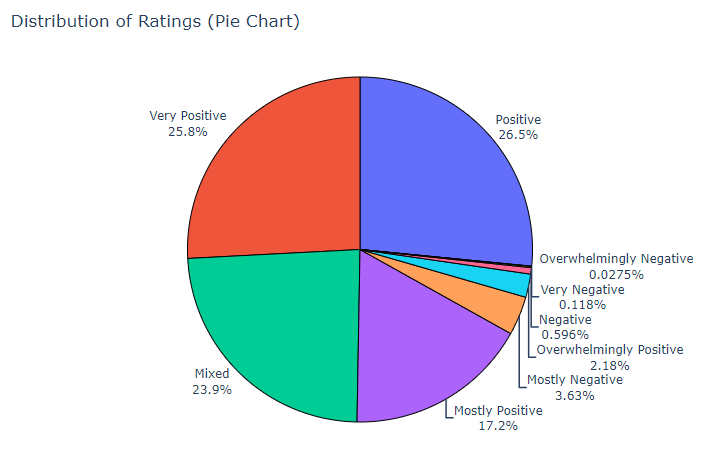
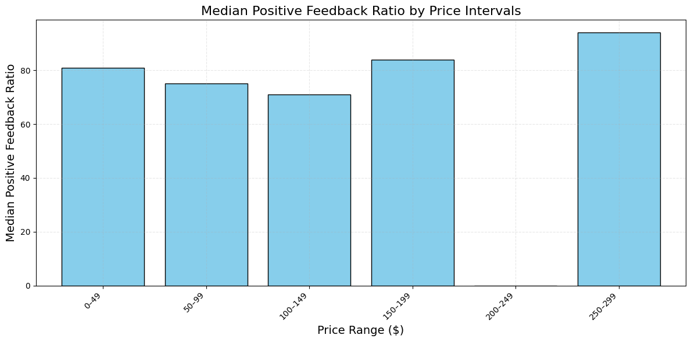
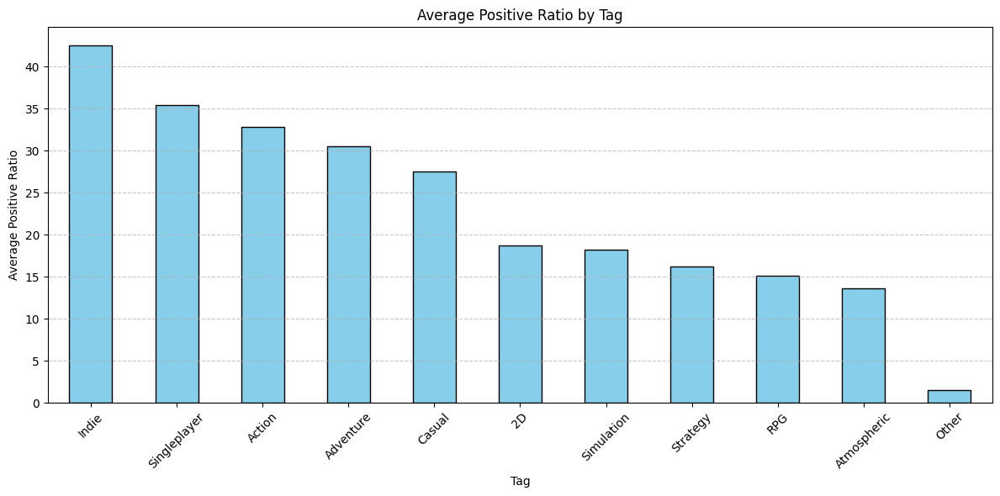
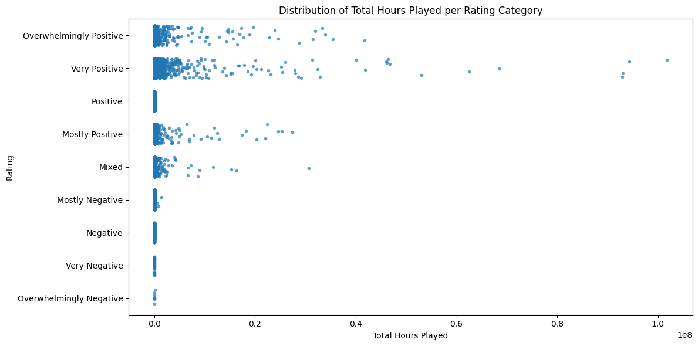
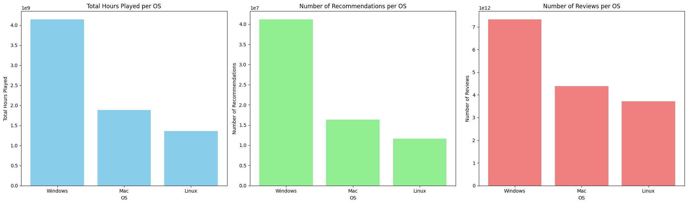
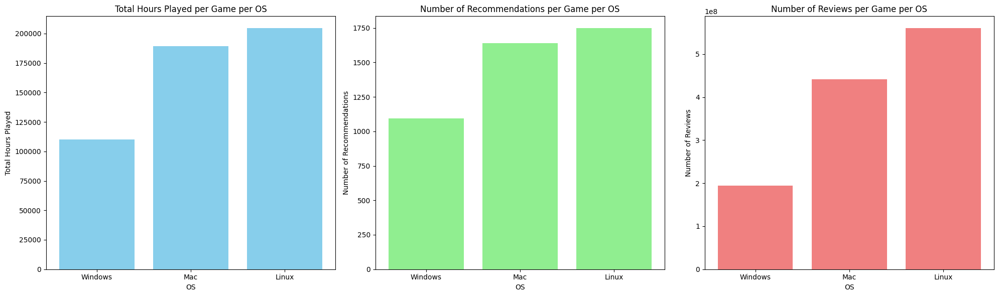

# **Laporan Proyek Machine Learning - Fikri Zulfialdi**

## **Project Overview**


Bermain game tidak hanya memberikan hiburan, tetapi juga menawarkan berbagai manfaat psikologis dan kognitif. Penelitian menunjukkan bahwa game dapat meningkatkan kemampuan pemecahan masalah, kreativitas, serta koordinasi tangan-mata (Granic, Lobel, & Engels, 2014). Selain itu, beberapa game membantu pemain mengelola stres, seperti yang ditemukan dalam tinjauan sistematis tentang manfaat game terhadap kesehatan mental (Primack et al., 2012). Game juga mendukung pembentukan komunitas online yang memperkuat koneksi sosial (Kowert & Quandt, 2016) dan memberikan peluang pembelajaran melalui mekanisme permainan yang melatih keterampilan berpikir kritis (Gee, 2003). Bahkan, beberapa jenis game dapat meningkatkan aktivitas fisik dan kesehatan, seperti yang dijelaskan dalam studi tentang exergames (Staiano & Calvert, 2011). Dengan manfaat ini, menemukan game yang sesuai dengan minat dan kebutuhan pemain menjadi semakin penting untuk memaksimalkan pengalaman bermain.

Proyek pengembangan sistem rekomendasi game untuk platform Steam bertujuan memberikan pengalaman pengguna yang lebih personal dengan menyarankan game yang relevan berdasarkan preferensi dan aktivitas mereka. Sistem ini sangat dibutuhkan karena jumlah game yang tersedia sangat banyak, yang dapat membuat pengguna kewalahan dalam menemukan game yang sesuai dengan minat mereka (Valve Corporation, 2023). Selain membantu pengguna, sistem ini juga berdampak signifikan pada platform, seperti mengurangi tingkat ketidakaktifan pengguna (churn rate) dan meningkatkan pendapatan melalui penjualan yang lebih terarah (McKinsey & Company, 2021). Rekomendasi yang tepat mampu menciptakan pengalaman bermain yang lebih memuaskan, mempermudah pengguna menemukan konten baru, dan meningkatkan keterlibatan pengguna secara keseluruhan, sebagaimana dicatat dalam penelitian tentang perilaku pengguna di platform digital (Resnick & Varian, 1997).

Efektivitas sistem rekomendasi telah terbukti melalui berbagai penelitian. Menurut McKinsey & Company (2021), sekitar 35% penjualan Amazon berasal dari sistem rekomendasi, menunjukkan potensi besar model serupa untuk diterapkan pada Steam. Yann LeCun, seorang ahli kecerdasan buatan, menjelaskan bahwa teknologi seperti deep learning mampu membuat rekomendasi lebih personal dan kontekstual, sehingga meningkatkan relevansi rekomendasi bagi pengguna (LeCun, 2018). Dalam bukunya The Long Tail, Chris Anderson (2006) menyoroti bagaimana personalisasi membantu menjangkau pasar "ekor panjang," yang memungkinkan game indie atau kurang populer menemukan audiens yang sesuai. Penelitian Resnick dan Varian (1997) juga menunjukkan bahwa sistem rekomendasi berperan penting dalam meningkatkan keterlibatan dan loyalitas pengguna di platform digital. Valve, pengembang Steam, melaporkan bahwa fitur seperti Steam Discovery Queue mampu meningkatkan konversi penjualan game indie hingga 20-30%, memperkuat dampak positif sistem rekomendasi pada kesuksesan platform game digital (Valve Corporation, 2023).

Oleh karena itu sangat penting hadirnya sistem rekomendasi yang mumpuni yang bisa merekomendasikan dengan baik sesuai preferensi *user* yang diberi rekomendasi. Menjawab kepentingan tersebut, akan dibuat model sistem rekomendasi dengan menggunakan Content-Based Filtering dan Collaborative Filtering untuk menemukan sistem rekomendasi game terbaik menggunakan data dari platform penjualan game Steam.

## **Business Understanding**


### **Problem Statement**
1. Bagaimana cara meningkatkan pengalaman pengguna dalam memilih game di
platform Steam?
2. Game apa yang paling populer berdasarkan total durasi bermain, jumlah review, jumlah rekomendasi?
3. Apakah platform atau sistem operasi yang didukung (Windows, Mac, Linux) mempengaruhi preferensi pengguna?
4. Bagaimana distribusi harga game memengaruhi tingkat ulasan positif dari pengguna?
5. Apakah ada hubungan antara rating game dan jumlah waktu yang dihabiskan pengguna untuk memainkannya?


### **Goals**  
1. Mengembangkan model rekomendasi game yang mempermudah pengguna memilih game berdasarkan karakteristik game dan karakteristik user yang serupa.  
2. Menganalisis game dengan populasi yang diwakilkan oleh agregat total durasi bermain, jumlah review, dan jumlah rekomendasi.  
3. Mengeksplorasi pengaruh sistem operasi terhadap preferensi game pengguna.  
4. Menganalisis hubungan antara distribusi harga game dan tingkat ulasan positif.  
5. Mengidentifikasi hubungan antara rating game dan waktu yang dihabiskan pengguna untuk memainkannya.  


### **Solution**  
1. Menggunakan dua pendekatan rekomendasi utama:  
   - Content-Based Filtering: Menganalisis genre, tag, harga, dan fitur game lainnya untuk merekomendasikan game yang serupa dengan preferensi pengguna menggunakan *cosine similarity*.  
   - Collaborative Filtering: Menggunakan data ulasan dan interaksi pengguna untuk merekomendasikan game yang disukai oleh pengguna dengan preferensi serupa menggunakan algoritma deep learning *RecommenderNet*.  

2. Menggunakan Exploratory Data Analysis (EDA) untuk memahami tren dan pola pengguna:  
   - Menganalisis agregat data seperti total durasi bermain, jumlah ulasan, dan jumlah rekomendasi untuk mengidentifikasi game yang paling populer.  
   - Memahami hubungan antara distribusi harga game dengan tingkat ulasan positif.  
   - Mengeksplorasi preferensi genre berdasarkan jumlah ulasan, durasi bermain, dan feedback positif.  
   - Menganalisis dampak platform (Windows, Mac, Linux) terhadap preferensi pengguna untuk meningkatkan rekomendasi lintas platform.  
   - Menyelidiki hubungan antara rating game dengan waktu bermain untuk memberikan wawasan terhadap tingkat keterlibatan pengguna.  


## **Data Understanding**


## **Data Loading**

Dataset ini berasal dari "https://www.kaggle.com/datasets/antonkozyriev/game-recommendations-on-steam" repositori Kaggle milik Anton Kozyriev, kemungkinan besar menggunakan data dari Steam API atau metode scraping untuk tujuan analisis rekomendasi game. Dengan 71K dilihat dan jumlah unduhan (10.9K entri) serta usability 10.00/10.00, dataset ini cukup populer dan dapat diandalkan.
Terdapat 4 file csv namun disini hanya digunakan 3 file yaitu `games.csv`, `games_metadata.json`, dan `recommendations.csv` ke dalam 2 DataFrame berbeda. Hal ini dilakukakan karena terdapat perbedaan struktur data.

Dataframe `games_metadata`
 
<table border="1" class="dataframe">
  <thead>
    <tr style="text-align: right;">
      <th></th>
      <th>app_id</th>
      <th>description</th>
      <th>tags</th>
    </tr>
  </thead>
  <tbody>
    <tr>
      <th>0</th>
      <td>13500</td>
      <td>Enter the dark underworld of Prince of Persia ...</td>
      <td>[Action, Adventure, Parkour, Third Person, Gre...</td>
    </tr>
    <tr>
      <th>1</th>
      <td>22364</td>
      <td></td>
      <td>[Action]</td>
    </tr>
    <tr>
      <th>2</th>
      <td>113020</td>
      <td>Monaco: What's Yours Is Mine is a single playe...</td>
      <td>[Co-op, Stealth, Indie, Heist, Local Co-Op, St...</td>
    </tr>
    <tr>
      <th>3</th>
      <td>226560</td>
      <td>Escape Dead Island is a Survival-Mystery adven...</td>
      <td>[Zombies, Adventure, Survival, Action, Third P...</td>
    </tr>
    <tr>
      <th>4</th>
      <td>249050</td>
      <td>Dungeon of the Endless is a Rogue-Like Dungeon...</td>
      <td>[Roguelike, Strategy, Tower Defense, Pixel Gra...</td>
    </tr>
  </tbody>
</table>

Dataframe `games`    

<table border="1" class="dataframe">
  <thead>
    <tr style="text-align: right;">
      <th></th>
      <th>app_id</th>
      <th>title</th>
      <th>date_release</th>
      <th>win</th>
      <th>mac</th>
      <th>linux</th>
      <th>rating</th>
      <th>positive_ratio</th>
      <th>user_reviews</th>
      <th>price_final</th>
      <th>price_original</th>
      <th>discount</th>
      <th>steam_deck</th>
    </tr>
  </thead>
  <tbody>
    <tr>
      <th>0</th>
      <td>13500</td>
      <td>Prince of Persia: Warrior Within™</td>
      <td>2008-11-21</td>
      <td>True</td>
      <td>False</td>
      <td>False</td>
      <td>Very Positive</td>
      <td>84</td>
      <td>2199</td>
      <td>9.99</td>
      <td>9.99</td>
      <td>0.0</td>
      <td>True</td>
    </tr>
    <tr>
      <th>1</th>
      <td>22364</td>
      <td>BRINK: Agents of Change</td>
      <td>2011-08-03</td>
      <td>True</td>
      <td>False</td>
      <td>False</td>
      <td>Positive</td>
      <td>85</td>
      <td>21</td>
      <td>2.99</td>
      <td>2.99</td>
      <td>0.0</td>
      <td>True</td>
    </tr>
    <tr>
      <th>2</th>
      <td>113020</td>
      <td>Monaco: What's Yours Is Mine</td>
      <td>2013-04-24</td>
      <td>True</td>
      <td>True</td>
      <td>True</td>
      <td>Very Positive</td>
      <td>92</td>
      <td>3722</td>
      <td>14.99</td>
      <td>14.99</td>
      <td>0.0</td>
      <td>True</td>
    </tr>
    <tr>
      <th>3</th>
      <td>226560</td>
      <td>Escape Dead Island</td>
      <td>2014-11-18</td>
      <td>True</td>
      <td>False</td>
      <td>False</td>
      <td>Mixed</td>
      <td>61</td>
      <td>873</td>
      <td>14.99</td>
      <td>14.99</td>
      <td>0.0</td>
      <td>True</td>
    </tr>
    <tr>
      <th>4</th>
      <td>249050</td>
      <td>Dungeon of the ENDLESS™</td>
      <td>2014-10-27</td>
      <td>True</td>
      <td>True</td>
      <td>False</td>
      <td>Very Positive</td>
      <td>88</td>
      <td>8784</td>
      <td>11.99</td>
      <td>11.99</td>
      <td>0.0</td>
      <td>True</td>
    </tr>
  </tbody>
</table>

File `games.csv` dan `games_metadata.json` digabung kedalam 1 dataframe yaitu `games_data`.

Dataframe `games_data`
<table border="1" class="dataframe">
  <thead>
    <tr style="text-align: right;">
      <th></th>
      <th>app_id</th>
      <th>description</th>
      <th>tags</th>
      <th>title</th>
      <th>date_release</th>
      <th>win</th>
      <th>mac</th>
      <th>linux</th>
      <th>rating</th>
      <th>positive_ratio</th>
      <th>user_reviews</th>
      <th>price_final</th>
      <th>price_original</th>
      <th>discount</th>
      <th>steam_deck</th>
    </tr>
  </thead>
  <tbody>
    <tr>
      <th>0</th>
      <td>13500</td>
      <td>Enter the dark underworld of Prince of Persia ...</td>
      <td>[Action, Adventure, Parkour, Third Person, Gre...</td>
      <td>Prince of Persia: Warrior Within™</td>
      <td>2008-11-21</td>
      <td>True</td>
      <td>False</td>
      <td>False</td>
      <td>Very Positive</td>
      <td>84</td>
      <td>2199</td>
      <td>9.99</td>
      <td>9.99</td>
      <td>0.0</td>
      <td>True</td>
    </tr>
    <tr>
      <th>1</th>
      <td>22364</td>
      <td></td>
      <td>[Action]</td>
      <td>BRINK: Agents of Change</td>
      <td>2011-08-03</td>
      <td>True</td>
      <td>False</td>
      <td>False</td>
      <td>Positive</td>
      <td>85</td>
      <td>21</td>
      <td>2.99</td>
      <td>2.99</td>
      <td>0.0</td>
      <td>True</td>
    </tr>
    <tr>
      <th>2</th>
      <td>113020</td>
      <td>Monaco: What's Yours Is Mine is a single playe...</td>
      <td>[Co-op, Stealth, Indie, Heist, Local Co-Op, St...</td>
      <td>Monaco: What's Yours Is Mine</td>
      <td>2013-04-24</td>
      <td>True</td>
      <td>True</td>
      <td>True</td>
      <td>Very Positive</td>
      <td>92</td>
      <td>3722</td>
      <td>14.99</td>
      <td>14.99</td>
      <td>0.0</td>
      <td>True</td>
    </tr>
    <tr>
      <th>3</th>
      <td>226560</td>
      <td>Escape Dead Island is a Survival-Mystery adven...</td>
      <td>[Zombies, Adventure, Survival, Action, Third P...</td>
      <td>Escape Dead Island</td>
      <td>2014-11-18</td>
      <td>True</td>
      <td>False</td>
      <td>False</td>
      <td>Mixed</td>
      <td>61</td>
      <td>873</td>
      <td>14.99</td>
      <td>14.99</td>
      <td>0.0</td>
      <td>True</td>
    </tr>
    <tr>
      <th>4</th>
      <td>249050</td>
      <td>Dungeon of the Endless is a Rogue-Like Dungeon...</td>
      <td>[Roguelike, Strategy, Tower Defense, Pixel Gra...</td>
      <td>Dungeon of the ENDLESS™</td>
      <td>2014-10-27</td>
      <td>True</td>
      <td>True</td>
      <td>False</td>
      <td>Very Positive</td>
      <td>88</td>
      <td>8784</td>
      <td>11.99</td>
      <td>11.99</td>
      <td>0.0</td>
      <td>True</td>
    </tr>
  </tbody>
</table>

Data `recommendations.csv` dibuat dataframe terpisah yaitu `recommendations` karena memiliki dimensi data yang berbeda.

Dataframe `recommendations`
<table border="1" class="dataframe">
  <thead>
    <tr style="text-align: right;">
      <th></th>
      <th>app_id</th>
      <th>helpful</th>
      <th>funny</th>
      <th>date</th>
      <th>is_recommended</th>
      <th>hours</th>
      <th>user_id</th>
      <th>review_id</th>
    </tr>
  </thead>
  <tbody>
    <tr>
      <th>0</th>
      <td>975370</td>
      <td>0</td>
      <td>0</td>
      <td>2022-12-12</td>
      <td>True</td>
      <td>36.3</td>
      <td>51580</td>
      <td>0</td>
    </tr>
    <tr>
      <th>1</th>
      <td>304390</td>
      <td>4</td>
      <td>0</td>
      <td>2017-02-17</td>
      <td>False</td>
      <td>11.5</td>
      <td>2586</td>
      <td>1</td>
    </tr>
    <tr>
      <th>2</th>
      <td>1085660</td>
      <td>2</td>
      <td>0</td>
      <td>2019-11-17</td>
      <td>True</td>
      <td>336.5</td>
      <td>253880</td>
      <td>2</td>
    </tr>
    <tr>
      <th>3</th>
      <td>703080</td>
      <td>0</td>
      <td>0</td>
      <td>2022-09-23</td>
      <td>True</td>
      <td>27.4</td>
      <td>259432</td>
      <td>3</td>
    </tr>
    <tr>
      <th>4</th>
      <td>526870</td>
      <td>0</td>
      <td>0</td>
      <td>2021-01-10</td>
      <td>True</td>
      <td>7.9</td>
      <td>23869</td>
      <td>4</td>
    </tr>
  </tbody>
</table>


### **Variable Description**

penjelasan variabel pada dataframe `games_data`


| **No** | **Variabel**      | **Tipe Data** | **Penjelasan**                                                                 |
|--------|-------------------|---------------|---------------------------------------------------------------------------------|
| 1      | `app_id`          | `int64`       | ID unik untuk setiap aplikasi atau game di Steam.                              |
| 2      | `description`     | `object`      | Deskripsi singkat tentang game, biasanya mencakup fitur utama atau cerita.     |
| 3      | `tags`            | `object`      | Kumpulan tag atau kategori yang menggambarkan genre dan fitur game.            |
| 4      | `title`           | `object`      | Nama atau judul game di Steam.                                                 |
| 5      | `date_release`    | `object`      | Tanggal rilis game dalam format string.                                        |
| 6      | `win`             | `bool`        | Menunjukkan apakah game tersedia untuk platform Windows (`True`/`False`).      |
| 7      | `mac`             | `bool`        | Menunjukkan apakah game tersedia untuk platform MacOS (`True`/`False`).        |
| 8      | `linux`           | `bool`        | Menunjukkan apakah game tersedia untuk platform Linux (`True`/`False`).        |
| 9      | `rating`          | `object`      | Kategori rating game berdasarkan ulasan, seperti "Mostly Positive".            |
| 10     | `positive_ratio`  | `int64`       | Rasio ulasan positif dalam bentuk persentase (%).                              |
| 11     | `user_reviews`    | `int64`       | Jumlah total ulasan pengguna untuk game tersebut.                              |
| 12     | `price_final`     | `float64`     | Harga akhir game setelah diskon (dalam satuan mata uang tertentu).             |
| 13     | `price_original`  | `float64`     | Harga asli game sebelum diskon (dalam satuan mata uang tertentu).              |
| 14     | `discount`        | `float64`     | Persentase diskon yang diberikan pada game (dalam %).                          |
| 15     | `steam_deck`      | `bool`        | Menunjukkan apakah game kompatibel dengan Steam Deck (`True`/`False`).         |


penjelasan variabel pada dataframe `recommendations`

| **No** | **Variabel**      | **Tipe Data** | **Penjelasan**                                                               |
|--------|-------------------|---------------|-------------------------------------------------------------------------------|
| 1      | `app_id`          | `int64`       | ID unik untuk setiap aplikasi atau game di Steam yang terkait ulasan ini.    |
| 2      | `helpful`         | `int64`       | Jumlah reaksi "helpful" yang diberikan pengguna lain untuk ulasan ini.        |
| 3      | `funny`           | `int64`       | Jumlah reaksi "funny" yang diberikan pengguna lain untuk ulasan ini.          |
| 4      | `date`            | `object`      | Tanggal ulasan diberikan, biasanya dalam format string.                      |
| 5      | `is_recommended`  | `bool`        | Menunjukkan apakah ulasan merekomendasikan game (`True`/`False`).            |
| 6      | `hours`           | `float64`     | Jumlah jam yang dihabiskan pengguna bermain game sebelum menulis ulasan.     |
| 7      | `user_id`         | `int64`       | ID unik pengguna yang menulis ulasan.                                        |
| 8      | `review_id`       | `int64`       | ID unik untuk setiap ulasan dalam dataset.                                   |


### **Statistic Data**

    <class 'pandas.core.frame.DataFrame'>
    RangeIndex: 50872 entries, 0 to 50871
    Data columns (total 15 columns):
     #   Column          Non-Null Count  Dtype  
    ---  ------          --------------  -----  
     0   app_id          50872 non-null  int64  
     1   description     50872 non-null  object 
     2   tags            50872 non-null  object 
     3   title           50872 non-null  object 
     4   date_release    50872 non-null  object 
     5   win             50872 non-null  bool   
     6   mac             50872 non-null  bool   
     7   linux           50872 non-null  bool   
     8   rating          50872 non-null  object 
     9   positive_ratio  50872 non-null  int64  
     10  user_reviews    50872 non-null  int64  
     11  price_final     50872 non-null  float64
     12  price_original  50872 non-null  float64
     13  discount        50872 non-null  float64
     14  steam_deck      50872 non-null  bool   
    dtypes: bool(4), float64(3), int64(3), object(5)
    memory usage: 4.5+ MB

<table border="1" class="dataframe">
  <thead>
    <tr style="text-align: right;">
      <th></th>
      <th>app_id</th>
      <th>positive_ratio</th>
      <th>user_reviews</th>
      <th>price_final</th>
      <th>price_original</th>
      <th>discount</th>
    </tr>
  </thead>
  <tbody>
    <tr>
      <th>count</th>
      <td>5.087200e+04</td>
      <td>50872.000000</td>
      <td>5.087200e+04</td>
      <td>50872.000000</td>
      <td>50872.000000</td>
      <td>50872.000000</td>
    </tr>
    <tr>
      <th>mean</th>
      <td>1.055224e+06</td>
      <td>77.052033</td>
      <td>1.824425e+03</td>
      <td>8.620325</td>
      <td>8.726788</td>
      <td>5.592212</td>
    </tr>
    <tr>
      <th>std</th>
      <td>6.103249e+05</td>
      <td>18.253592</td>
      <td>4.007352e+04</td>
      <td>11.514164</td>
      <td>11.507021</td>
      <td>18.606679</td>
    </tr>
    <tr>
      <th>min</th>
      <td>1.000000e+01</td>
      <td>0.000000</td>
      <td>1.000000e+01</td>
      <td>0.000000</td>
      <td>0.000000</td>
      <td>0.000000</td>
    </tr>
    <tr>
      <th>25%</th>
      <td>5.287375e+05</td>
      <td>67.000000</td>
      <td>1.900000e+01</td>
      <td>0.990000</td>
      <td>0.990000</td>
      <td>0.000000</td>
    </tr>
    <tr>
      <th>50%</th>
      <td>9.860850e+05</td>
      <td>81.000000</td>
      <td>4.900000e+01</td>
      <td>4.990000</td>
      <td>4.990000</td>
      <td>0.000000</td>
    </tr>
    <tr>
      <th>75%</th>
      <td>1.524895e+06</td>
      <td>91.000000</td>
      <td>2.060000e+02</td>
      <td>10.990000</td>
      <td>11.990000</td>
      <td>0.000000</td>
    </tr>
    <tr>
      <th>max</th>
      <td>2.599300e+06</td>
      <td>100.000000</td>
      <td>7.494460e+06</td>
      <td>299.990000</td>
      <td>299.990000</td>
      <td>90.000000</td>
    </tr>
  </tbody>
</table>

   

Dataframe games_data memiliki 50872 entri rekod dan 15 kolom dengan 5 kolom numerik.

    <class 'pandas.core.frame.DataFrame'>
    RangeIndex: 41154794 entries, 0 to 41154793
    Data columns (total 8 columns):
     #   Column          Dtype  
    ---  ------          -----  
     0   app_id          int64  
     1   helpful         int64  
     2   funny           int64  
     3   date            object 
     4   is_recommended  bool   
     5   hours           float64
     6   user_id         int64  
     7   review_id       int64  
    dtypes: bool(1), float64(1), int64(5), object(1)
    memory usage: 2.2+ GB

<table border="1" class="dataframe">
  <thead>
    <tr style="text-align: right;">
      <th></th>
      <th>app_id</th>
      <th>helpful</th>
      <th>funny</th>
      <th>hours</th>
      <th>user_id</th>
      <th>review_id</th>
    </tr>
  </thead>
  <tbody>
    <tr>
      <th>count</th>
      <td>4.115479e+07</td>
      <td>4.115479e+07</td>
      <td>4.115479e+07</td>
      <td>4.115479e+07</td>
      <td>4.115479e+07</td>
      <td>4.115479e+07</td>
    </tr>
    <tr>
      <th>mean</th>
      <td>6.032724e+05</td>
      <td>3.202567e+00</td>
      <td>1.058071e+00</td>
      <td>1.006022e+02</td>
      <td>7.450576e+06</td>
      <td>2.057740e+07</td>
    </tr>
    <tr>
      <th>std</th>
      <td>4.729233e+05</td>
      <td>4.693649e+01</td>
      <td>2.867060e+01</td>
      <td>1.761675e+02</td>
      <td>4.010685e+06</td>
      <td>1.188037e+07</td>
    </tr>
    <tr>
      <th>min</th>
      <td>1.000000e+01</td>
      <td>0.000000e+00</td>
      <td>0.000000e+00</td>
      <td>0.000000e+00</td>
      <td>0.000000e+00</td>
      <td>0.000000e+00</td>
    </tr>
    <tr>
      <th>25%</th>
      <td>2.539400e+05</td>
      <td>0.000000e+00</td>
      <td>0.000000e+00</td>
      <td>7.800000e+00</td>
      <td>4.287256e+06</td>
      <td>1.028870e+07</td>
    </tr>
    <tr>
      <th>50%</th>
      <td>4.351500e+05</td>
      <td>0.000000e+00</td>
      <td>0.000000e+00</td>
      <td>2.730000e+01</td>
      <td>7.546446e+06</td>
      <td>2.057740e+07</td>
    </tr>
    <tr>
      <th>75%</th>
      <td>9.331100e+05</td>
      <td>0.000000e+00</td>
      <td>0.000000e+00</td>
      <td>9.920000e+01</td>
      <td>1.096877e+07</td>
      <td>3.086609e+07</td>
    </tr>
    <tr>
      <th>max</th>
      <td>2.253290e+06</td>
      <td>3.621200e+04</td>
      <td>2.810900e+04</td>
      <td>1.000000e+03</td>
      <td>1.430606e+07</td>
      <td>4.115479e+07</td>
    </tr>
  </tbody>
</table>


Dataframe recommendations memiliki 41154794  entri data dan 8 kolom dengan 3 kolom numerik.

## **Data Cleaning**

### **Missing Value & Duplicate**
    
Jumlah missing value yang ada di dataframe `games_data` adalah sebagai berikut

<table border="1" class="dataframe">
  <thead>
    <tr style="text-align: right;">
      <th></th>
      <th>Nilai yang Kosong</th>
    </tr>
  </thead>
  <tbody>
    <tr>
      <th>app_id</th>
      <td>0</td>
    </tr>
    <tr>
      <th>description</th>
      <td>10373</td>
    </tr>
    <tr>
      <th>tags</th>
      <td>1244</td>
    </tr>
    <tr>
      <th>title</th>
      <td>0</td>
    </tr>
    <tr>
      <th>date_release</th>
      <td>0</td>
    </tr>
    <tr>
      <th>win</th>
      <td>0</td>
    </tr>
    <tr>
      <th>mac</th>
      <td>0</td>
    </tr>
    <tr>
      <th>linux</th>
      <td>0</td>
    </tr>
    <tr>
      <th>rating</th>
      <td>0</td>
    </tr>
    <tr>
      <th>positive_ratio</th>
      <td>0</td>
    </tr>
    <tr>
      <th>user_reviews</th>
      <td>0</td>
    </tr>
    <tr>
      <th>price_final</th>
      <td>0</td>
    </tr>
    <tr>
      <th>price_original</th>
      <td>0</td>
    </tr>
    <tr>
      <th>discount</th>
      <td>0</td>
    </tr>
    <tr>
      <th>steam_deck</th>
      <td>0</td>
    </tr>
  </tbody>
</table>

Dilakukan drop pada baris yang memiliki _missing value_ sehingga mengahsilkan jumlah baris sebagai berikut.
    
    Total of rows: 40484
    Total of column: 15

selanjutnya diperiksa nilai numerik yang menghasilkan nilai 0 pada dataframe `games_data`.

<table border="1" class="dataframe">
  <thead>
    <tr style="text-align: right;">
      <th></th>
      <th>Nilai yang bernilai 0</th>
    </tr>
  </thead>
  <tbody>
    <tr>
      <th>app_id</th>
      <td>0</td>
    </tr>
    <tr>
      <th>description</th>
      <td>0</td>
    </tr>
    <tr>
      <th>tags</th>
      <td>0</td>
    </tr>
    <tr>
      <th>title</th>
      <td>0</td>
    </tr>
    <tr>
      <th>date_release</th>
      <td>0</td>
    </tr>
    <tr>
      <th>win</th>
      <td>0</td>
    </tr>
    <tr>
      <th>mac</th>
      <td>0</td>
    </tr>
    <tr>
      <th>linux</th>
      <td>0</td>
    </tr>
    <tr>
      <th>rating</th>
      <td>0</td>
    </tr>
    <tr>
      <th>positive_ratio</th>
      <td>0</td>
    </tr>
    <tr>
      <th>user_reviews</th>
      <td>0</td>
    </tr>
    <tr>
      <th>price_final</th>
      <td>7799</td>
    </tr>
    <tr>
      <th>price_original</th>
      <td>7846</td>
    </tr>
    <tr>
      <th>discount</th>
      <td>36261</td>
    </tr>
    <tr>
      <th>steam_deck</th>
      <td>0</td>
    </tr>
  </tbody>
</table>

Terdapat nilai 0 di dalam kolom yang memiliki kepentingan yaitu kolom `price_final`. Maka baris yang memiliki nilai 0 tersebut dihilangkan, sedangkan nilai 0 di baris lainnya dibiarkan karena tidak relevan. 
    
    Total of rows: 32685
    Total of column: 15

Diperiksa juga _missing value_ pada dataframe `recommendations`

<table border="1" class="dataframe">
  <thead>
    <tr style="text-align: right;">
      <th></th>
      <th>Nilai yang Kosong</th>
    </tr>
  </thead>
  <tbody>
    <tr>
      <th>app_id</th>
      <td>0</td>
    </tr>
    <tr>
      <th>helpful</th>
      <td>0</td>
    </tr>
    <tr>
      <th>funny</th>
      <td>0</td>
    </tr>
    <tr>
      <th>date</th>
      <td>0</td>
    </tr>
    <tr>
      <th>is_recommended</th>
      <td>0</td>
    </tr>
    <tr>
      <th>hours</th>
      <td>0</td>
    </tr>
    <tr>
      <th>user_id</th>
      <td>0</td>
    </tr>
    <tr>
      <th>review_id</th>
      <td>0</td>
    </tr>
  </tbody>
</table>

tidak ada _missing value_ yang harus dihilangkan


Selanjutnya diperiksa data duplikat pada dataframe `games_data`    

    Number of duplicates (excluding 'tags' column): 0


Diperiksa juga data duplikat pada dataframe `recommendations`

    Number of duplicates : 0

Tidak terdeteksi data duplikat pada kedua dataframe sehingga tidak perlu dihilangkan.

### **Data Reduction**

melakukan filter game yang dianggap relevan di dataframe `recommendations` dengan menggunakan data dari dataframe `games_data` yang telah dihilangkan *missing value*-nya

    Total of rows: 16337800
    Total of column: 8
    <class 'pandas.core.frame.DataFrame'>
    Index: 16337800 entries, 66 to 41154792
    Data columns (total 8 columns):
     #   Column          Dtype  
    ---  ------          -----  
     0   app_id          int64  
     1   helpful         int64  
     2   funny           int64  
     3   date            object 
     4   is_recommended  bool   
     5   hours           float64
     6   user_id         int64  
     7   review_id       int64  
    dtypes: bool(1), float64(1), int64(5), object(1)
    memory usage: 1012.8+ MB


Karena ukuran data yang terlalu besar maka dilakukan sampling dengan kriteria seperti berikut: data tidak lebih lama dari tahun 2020, setiap interval dari total waktu dimainkan dari setiap game akan diambil 200 game relevan, setiap user relevan memiliki minimal 5 review game.

Setelah dilakukan filter melalui data game setelah tahun 2020.

    Number of rows after date filtering: 9024102

Disampling 200 game pada setiap kelas data dari total durasi dimainkan dari 10 kelas.

    Number of sampled games: 2000
    Number of rows in the filtered dataset: 675275

Dilakukan filter user dengan minimal 5 review.

    Number of user with min reviews: 4235
    Number of rows in the filtered dataset: 34586


Jumlah entri data `games_data` setelah dibersihkan adalah 32685 dan jumlah baris setelah reduksi dari data `recommendations` adalah 34586.


## **Exploratory Data Analysis**

### **Unvariate Data Analysis**

#### **Price**

    

    


    Mean Price: 10.194345112436897
    Median Price: 6.99
    Mode Price: 9.99


Distribusi harga dari sebuah game ternyata sangat terjal ke kanan. Artinya sebagian besar data berada di bawah quartil bawah.

#### **Rating**


    

    



Sebagian besar `rating` berada ada kategori positive dengan berbagai derajatnya kecuali `overwhelmingly positive`.

#### **Positive Ratio**


    

    


    Top-rated games (positive_ratio > 90%):
                                       title  positive_ratio
    2           Monaco: What's Yours Is Mine              92
    8      Hyperdimension Neptunia Re;Birth1              94
    16                                  FORM              91
    27           Take Command - 2nd Manassas              93
    40                        Dreaming Sarah              92
    ...                                  ...             ...
    50811              Islands of the Caliph              91
    50814          Dragon Princess is Hungry              96
    50829   XENOTILT: HOSTILE PINBALL ACTION              98
    50845                        Taboo Trial              94
    50870                Forgive Me Father 2              95
    
    [8599 rows x 2 columns]


Distribusi `Rasio Ulasan Positif` adalah normal dengan miring ke kiri. Sebagian besar data berada di atas rata-rata. Dengan Nilai di kisaran 90 memiliki frekuensi terbanyak.

#### **User Reviews**


    

    


    Top-rated games (positive_ratio > 90%):
                                 title  user_reviews
    48718        鬼谷八荒 Tale of Immortal        185051
    47653  Life is Strange - Episode 1        160660
    47375               Counter-Strike        136118
    47494                  Tomb Raider        136055
    12573                  Half-Life 2        122230
    ...                            ...           ...
    14185                  Watch_Dogs™         31632
    47597                         SOMA         31153
    6098   Battlefield: Bad Company™ 2         30960
    9139                       OneShot         30937
    47675                Town of Salem         30853
    
    [100 rows x 2 columns]


Jumlah review seluruh game diurutkan dari yang terbesar dan ternyata distribusi jumlah review setiap game sangat timpang dengan hanya beberapa game saja yang memiliki jumlah review yang sangat besar.

#### **Date Release**


    

    


    date_release
    1997       1
    1998       1
    1999       2
    2000       2
    2001       2
    2002       1
    2003       2
    2004       4
    2005       2
    2006      50
    2007      73
    2008     128
    2009     285
    2010     219
    2011     233
    2012     288
    2013     411
    2014    1367
    2015    1986
    2016    2876
    2017    3376
    2018    3665
    2019    3107
    2020    3734
    2021    4363
    2022    4601
    2023    1906
    Name: count, dtype: int64


Setiap tahun jumlah game yang dirilis cenderung selalu meningkat kecuali di tahun 2018 dan 2023.

#### **Top Games**


    

    


Game yang memiliki Total Waktu Dimainkan tertinggi adalah Persona 4 Golden.


    

    


Game yang paling banyak direkomendasikan adalah Far Cry 3.


    

    


Game yang paling banyak di-review adalah Tale of Immortal.

### **Multivariate Data Analysis**

#### **Average Price vs Positive Feedback Ratio**


    

    


 Rasio *feedback* positif yang rendah (10-50), terlihat fluktuasi harga yang cukup besar dengan kecenderungan meningkat. Namun, seiring dengan meningkatnya rasio, fluktuasi mulai berkurang, dan grafik menjadi lebih stabil. Yaitu pada rentang rasio *feedback* positif 50-100, harga rata-rata cenderung stabil dengan variasi yang minim. Ini menunjukkan bahwa rasio *feedback* positif akan meningkat seiring peningkatan harga, terutama pada kisaran yang lebih rendah.

#### **Median Positive Feedback Ratio by Price Intervals**

    

    


Sejauh ini tidak signifikan pengaruh `harga game` terhadap `Rasio Ulasan Positif`. Artinya tidak selalu game yang mahal memiliki kualitas ulasan yang positif, karena game mahal memunculkan ekspektasi yang lebih tinggi.

#### **Average Positive Ratio by Tag**

    

    


    Top 10 Tags by Average Positive Ratio:
    Indie           48.717302
    Singleplayer    44.879364
    Adventure       35.164754
    Action          33.295610
    Casual          32.384886
    2D              24.086768
    Simulation      17.702126
    Atmospheric     17.074346
    Strategy        16.999572
    Puzzle          16.517332
    dtype: float64
    
    Other tags aggregated average positive ratio: 1.83


Tags yang memiliki Rasio Ulasan Positif paling tinggi adalah Indie. Game indie banyak memiliki ulasan positif karena banyak dimaklumi oleh pemain juga harganya yang biasanya sangat murah.

#### **Average Price by Tag**


    

    


    Top 10 and Bottom 10 Genres:
    Musou                   49.163913
    360 Video               36.234643
    Video Production        35.998972
    Web Publishing          33.541905
    Medical Sim             32.508636
    Audio Production        31.348364
    Baseball                31.048529
    Animation & Modeling    30.400299
    Photo Editing           29.409324
    Rugby                   29.056667
    Other                   12.177486
    Electronic               5.602500
    Solitaire                5.594941
    Short                    5.352531
    Sokoban                  5.117783
    Abstract                 5.060271
    Idler                    5.022164
    Spelling                 4.712167
    Minimalist               4.710232
    Clicker                  4.498397
    Tile-Matching            1.990000
    dtype: float64


Tag game yang memiliki Harga rata-rata tertinggi adalah Musou. Game Musou banyak diminati penggemar fanatik yang rela keluar uang lebih banyak.

#### **Distribution of Total Hours Played per Rating Category**


    

    


Game yang memiliki ulasan rating yang positif dimainkan lebih banyak daripada yang negatif. Menunjukkan bahwa rating berpengaruh terhadap minat bermain.

#### **Percentage of Games per OS**


    

    


Jumlah Game yang rilis di platform windows mendominasi dengan 69.1%.

#### **Game Popularity per OS**


    

    


Terlihat ternyata game yang rilis di platform windows jauh lebih populer dari os lainnya. Namun ini bisa disebabkan juga karena lebih banyak game yang rilis di platform windows.


    

    


Jika memperhitungkan jumlah game yang dirilis di setiap platform, malah linux yang memiliki popularitas leih tinggi.

## **Data Preparation**

### **1. Content Based Filtering**

Kolom tag yang berisi list tag apa saja yang ada di sebuah game, dipecah menjadi kumpulan string yang bisa diterima sebagai corpus oleh TfidfVectorizer.
Rating di-encode agar dapat dimengerti oleh cosine similarity dengan map seperti berikut:


```python
# Convert the rating column (text to numeric)
rating_mapping = {
    'Overwhelmingly Positive': 5,
    'Very Positive': 4,
    'Positive': 3,
    'Mildly Positive': 2,
    'Mixed': 1,
    'Mildly Negative': -1,
    'Negative': -2,
    'Very Negative': -3,
    'Overwhelmingly Negative': -4
}
```


#### **Hyper-Parameter Tuning**

**GridSearch for TF-IDF**

Digunakan GridSearch untuk mngoptimalkan proses vektorisasi TF-IDF dari deskripsi game yang memiliki deretan string yang panjang. Yaitu dengan optimasi parameter sebagai berikut: max_features yaitu berapa variasi kata yang akan digunakan model, ngram yaitu jenis urutan kata yang digunakan apakah unigrams (1 kata) atau bigrams (2 kata), max_df adalah jumlah maksimal persentase sebuah kata muncul yaitu jika sebuah kata muncul terlalu banyak maka maknanya hilang, min_df yaitu sebaliknya jika sebuah kata hanya muncul dalam sedikit dokumen maka tidak relevan maka nilai ini adalah jumlah dokumen minimal sebuah kata muncul. Parameter pengujian digunakan KNN karena algoritma tersebut adalah clustering yang sesuai dengan tujuan vektorisasi TF-IDF.


    Fitting 3 folds for each of 864 candidates, totalling 2592 fit


    Best parameters found:  {'kmeans__init': 'random', 'kmeans__max_iter': 300, 'kmeans__n_clusters': 4, 'tfidf__max_df': 1.0, 'tfidf__max_features': 100, 'tfidf__min_df': 5, 'tfidf__ngram_range': (1, 2)}

Parameter paling optimal adalah 'max_df' = 1.0, 'max_features'= 100, 'min_df'= 5, 'ngram_range'= (1, 2) atau bigrams.

#### **Vectorizer**

Digunakan TF-IDF dengan nilai dari 0 hingga 1 untuk data berupa teks yaitu deskripsi dan tags. Khusus untuk data deskripsi digunakan parameter hasil parameter tuning sedangkan untuk data tags tidak menggunakan parameter tuning karena data tags masing-masing berdiri sendiri tanpa konteks yang berkaitan. Data numerikal di-vektorisasi menggunakan min-max scaler yang menghasilkan nilai dari 0 hingga 1.


#### **Feature Engineering**

Tiga vektor yang telah dibuat digabungkan seluruh kolomnya menghasilkan data vektor gabungan tf-idf dan numerikal yaitu Combined Features. Hal ini dilakukan untuk melihat keterkaitan yang lebih kompleks dari data yang ada. Metode yang digunakan adalah concatenation array 
```
Vector Combined Features = Vector Tf-idf Descriptions  + Vactor Tf-idf Tags + Vector Numerical Features
```

#### **Data Vector**

**Vector TF-IDF Descriptions**

<table border="1" class="dataframe">
  <thead>
    <tr style="text-align: right;">
      <th></th>
      <th>2d</th>
      <th>3d</th>
      <th>action</th>
      <th>adventure</th>
      <th>adventure game</th>
      <th>arcade</th>
      <th>based</th>
      <th>battle</th>
      <th>beautiful</th>
      <th>best</th>
      <th>...</th>
      <th>turn based</th>
      <th>unique</th>
      <th>use</th>
      <th>using</th>
      <th>visual</th>
      <th>vr</th>
      <th>war</th>
      <th>way</th>
      <th>weapons</th>
      <th>world</th>
    </tr>
    <tr>
      <th>title</th>
      <th></th>
      <th></th>
      <th></th>
      <th></th>
      <th></th>
      <th></th>
      <th></th>
      <th></th>
      <th></th>
      <th></th>
      <th></th>
      <th></th>
      <th></th>
      <th></th>
      <th></th>
      <th></th>
      <th></th>
      <th></th>
      <th></th>
      <th></th>
      <th></th>
    </tr>
  </thead>
  <tbody>
    <tr>
      <th>Prince of Persia: Warrior Within™</th>
      <td>0.000000</td>
      <td>0.000000</td>
      <td>0.000000</td>
      <td>0.000000</td>
      <td>0.0</td>
      <td>0.0</td>
      <td>0.0</td>
      <td>0.0</td>
      <td>0.0</td>
      <td>0.000000</td>
      <td>...</td>
      <td>0.0</td>
      <td>0.0</td>
      <td>0.00000</td>
      <td>0.0</td>
      <td>0.0</td>
      <td>0.0</td>
      <td>0.0</td>
      <td>0.000000</td>
      <td>0.000000</td>
      <td>0.000000</td>
    </tr>
    <tr>
      <th>Monaco: What's Yours Is Mine</th>
      <td>0.000000</td>
      <td>0.000000</td>
      <td>0.000000</td>
      <td>0.000000</td>
      <td>0.0</td>
      <td>0.0</td>
      <td>0.0</td>
      <td>0.0</td>
      <td>0.0</td>
      <td>0.000000</td>
      <td>...</td>
      <td>0.0</td>
      <td>0.0</td>
      <td>0.00000</td>
      <td>0.0</td>
      <td>0.0</td>
      <td>0.0</td>
      <td>0.0</td>
      <td>0.000000</td>
      <td>0.000000</td>
      <td>0.000000</td>
    </tr>
    <tr>
      <th>Escape Dead Island</th>
      <td>0.000000</td>
      <td>0.000000</td>
      <td>0.000000</td>
      <td>0.390487</td>
      <td>0.0</td>
      <td>0.0</td>
      <td>0.0</td>
      <td>0.0</td>
      <td>0.0</td>
      <td>0.000000</td>
      <td>...</td>
      <td>0.0</td>
      <td>0.0</td>
      <td>0.00000</td>
      <td>0.0</td>
      <td>0.0</td>
      <td>0.0</td>
      <td>0.0</td>
      <td>0.000000</td>
      <td>0.000000</td>
      <td>0.000000</td>
    </tr>
    <tr>
      <th>Dungeon of the ENDLESS™</th>
      <td>0.000000</td>
      <td>0.000000</td>
      <td>0.000000</td>
      <td>0.000000</td>
      <td>0.0</td>
      <td>0.0</td>
      <td>0.0</td>
      <td>0.0</td>
      <td>0.0</td>
      <td>0.000000</td>
      <td>...</td>
      <td>0.0</td>
      <td>0.0</td>
      <td>0.00000</td>
      <td>0.0</td>
      <td>0.0</td>
      <td>0.0</td>
      <td>0.0</td>
      <td>0.332654</td>
      <td>0.000000</td>
      <td>0.000000</td>
    </tr>
    <tr>
      <th>METAL SLUG 3</th>
      <td>0.531413</td>
      <td>0.000000</td>
      <td>0.413478</td>
      <td>0.000000</td>
      <td>0.0</td>
      <td>0.0</td>
      <td>0.0</td>
      <td>0.0</td>
      <td>0.0</td>
      <td>0.000000</td>
      <td>...</td>
      <td>0.0</td>
      <td>0.0</td>
      <td>0.00000</td>
      <td>0.0</td>
      <td>0.0</td>
      <td>0.0</td>
      <td>0.0</td>
      <td>0.000000</td>
      <td>0.000000</td>
      <td>0.000000</td>
    </tr>
    <tr>
      <th>...</th>
      <td>...</td>
      <td>...</td>
      <td>...</td>
      <td>...</td>
      <td>...</td>
      <td>...</td>
      <td>...</td>
      <td>...</td>
      <td>...</td>
      <td>...</td>
      <td>...</td>
      <td>...</td>
      <td>...</td>
      <td>...</td>
      <td>...</td>
      <td>...</td>
      <td>...</td>
      <td>...</td>
      <td>...</td>
      <td>...</td>
      <td>...</td>
    </tr>
    <tr>
      <th>Dragon Princess is Hungry</th>
      <td>0.000000</td>
      <td>0.000000</td>
      <td>0.000000</td>
      <td>0.000000</td>
      <td>0.0</td>
      <td>0.0</td>
      <td>0.0</td>
      <td>0.0</td>
      <td>0.0</td>
      <td>0.000000</td>
      <td>...</td>
      <td>0.0</td>
      <td>0.0</td>
      <td>0.00000</td>
      <td>0.0</td>
      <td>0.0</td>
      <td>0.0</td>
      <td>0.0</td>
      <td>0.000000</td>
      <td>0.000000</td>
      <td>0.000000</td>
    </tr>
    <tr>
      <th>XENOTILT: HOSTILE PINBALL ACTION</th>
      <td>0.000000</td>
      <td>0.000000</td>
      <td>0.000000</td>
      <td>0.000000</td>
      <td>0.0</td>
      <td>0.0</td>
      <td>0.0</td>
      <td>0.0</td>
      <td>0.0</td>
      <td>0.000000</td>
      <td>...</td>
      <td>0.0</td>
      <td>0.0</td>
      <td>0.00000</td>
      <td>0.0</td>
      <td>0.0</td>
      <td>0.0</td>
      <td>0.0</td>
      <td>0.000000</td>
      <td>0.000000</td>
      <td>0.000000</td>
    </tr>
    <tr>
      <th>Taboo Trial</th>
      <td>0.000000</td>
      <td>0.429329</td>
      <td>0.319287</td>
      <td>0.000000</td>
      <td>0.0</td>
      <td>0.0</td>
      <td>0.0</td>
      <td>0.0</td>
      <td>0.0</td>
      <td>0.000000</td>
      <td>...</td>
      <td>0.0</td>
      <td>0.0</td>
      <td>0.38721</td>
      <td>0.0</td>
      <td>0.0</td>
      <td>0.0</td>
      <td>0.0</td>
      <td>0.000000</td>
      <td>0.000000</td>
      <td>0.258898</td>
    </tr>
    <tr>
      <th>Hometopia</th>
      <td>0.000000</td>
      <td>0.000000</td>
      <td>0.000000</td>
      <td>0.000000</td>
      <td>0.0</td>
      <td>0.0</td>
      <td>0.0</td>
      <td>0.0</td>
      <td>0.0</td>
      <td>0.576368</td>
      <td>...</td>
      <td>0.0</td>
      <td>0.0</td>
      <td>0.00000</td>
      <td>0.0</td>
      <td>0.0</td>
      <td>0.0</td>
      <td>0.0</td>
      <td>0.000000</td>
      <td>0.000000</td>
      <td>0.338987</td>
    </tr>
    <tr>
      <th>Forgive Me Father 2</th>
      <td>0.000000</td>
      <td>0.000000</td>
      <td>0.379338</td>
      <td>0.000000</td>
      <td>0.0</td>
      <td>0.0</td>
      <td>0.0</td>
      <td>0.0</td>
      <td>0.0</td>
      <td>0.000000</td>
      <td>...</td>
      <td>0.0</td>
      <td>0.0</td>
      <td>0.00000</td>
      <td>0.0</td>
      <td>0.0</td>
      <td>0.0</td>
      <td>0.0</td>
      <td>0.401275</td>
      <td>0.502638</td>
      <td>0.000000</td>
    </tr>
  </tbody>
</table>
<p>25806 rows × 100 columns</p>
 
**Vector TF-IDF Tags**

<table border="1" class="dataframe">
  <thead>
    <tr style="text-align: right;">
      <th></th>
      <th>1980s</th>
      <th>1990</th>
      <th>2d</th>
      <th>2d_fighter</th>
      <th>2d_platformer</th>
      <th>360_video</th>
      <th>3d</th>
      <th>3d_fighter</th>
      <th>3d_platformer</th>
      <th>3d_vision</th>
      <th>...</th>
      <th>well</th>
      <th>werewolves</th>
      <th>western</th>
      <th>wholesome</th>
      <th>word_game</th>
      <th>world_war_i</th>
      <th>world_war_ii</th>
      <th>wrestling</th>
      <th>written</th>
      <th>zombies</th>
    </tr>
    <tr>
      <th>title</th>
      <th></th>
      <th></th>
      <th></th>
      <th></th>
      <th></th>
      <th></th>
      <th></th>
      <th></th>
      <th></th>
      <th></th>
      <th></th>
      <th></th>
      <th></th>
      <th></th>
      <th></th>
      <th></th>
      <th></th>
      <th></th>
      <th></th>
      <th></th>
      <th></th>
    </tr>
  </thead>
  <tbody>
    <tr>
      <th>Prince of Persia: Warrior Within™</th>
      <td>0.0</td>
      <td>0.0</td>
      <td>0.000000</td>
      <td>0.0</td>
      <td>0.0</td>
      <td>0.0</td>
      <td>0.000000</td>
      <td>0.0</td>
      <td>0.000000</td>
      <td>0.0</td>
      <td>...</td>
      <td>0.0</td>
      <td>0.0</td>
      <td>0.0</td>
      <td>0.0</td>
      <td>0.0</td>
      <td>0.0</td>
      <td>0.0</td>
      <td>0.0</td>
      <td>0.0</td>
      <td>0.000000</td>
    </tr>
    <tr>
      <th>Monaco: What's Yours Is Mine</th>
      <td>0.0</td>
      <td>0.0</td>
      <td>0.110829</td>
      <td>0.0</td>
      <td>0.0</td>
      <td>0.0</td>
      <td>0.000000</td>
      <td>0.0</td>
      <td>0.000000</td>
      <td>0.0</td>
      <td>...</td>
      <td>0.0</td>
      <td>0.0</td>
      <td>0.0</td>
      <td>0.0</td>
      <td>0.0</td>
      <td>0.0</td>
      <td>0.0</td>
      <td>0.0</td>
      <td>0.0</td>
      <td>0.000000</td>
    </tr>
    <tr>
      <th>Escape Dead Island</th>
      <td>0.0</td>
      <td>0.0</td>
      <td>0.000000</td>
      <td>0.0</td>
      <td>0.0</td>
      <td>0.0</td>
      <td>0.000000</td>
      <td>0.0</td>
      <td>0.000000</td>
      <td>0.0</td>
      <td>...</td>
      <td>0.0</td>
      <td>0.0</td>
      <td>0.0</td>
      <td>0.0</td>
      <td>0.0</td>
      <td>0.0</td>
      <td>0.0</td>
      <td>0.0</td>
      <td>0.0</td>
      <td>0.275537</td>
    </tr>
    <tr>
      <th>Dungeon of the ENDLESS™</th>
      <td>0.0</td>
      <td>0.0</td>
      <td>0.133778</td>
      <td>0.0</td>
      <td>0.0</td>
      <td>0.0</td>
      <td>0.000000</td>
      <td>0.0</td>
      <td>0.000000</td>
      <td>0.0</td>
      <td>...</td>
      <td>0.0</td>
      <td>0.0</td>
      <td>0.0</td>
      <td>0.0</td>
      <td>0.0</td>
      <td>0.0</td>
      <td>0.0</td>
      <td>0.0</td>
      <td>0.0</td>
      <td>0.000000</td>
    </tr>
    <tr>
      <th>METAL SLUG 3</th>
      <td>0.0</td>
      <td>0.0</td>
      <td>0.111907</td>
      <td>0.0</td>
      <td>0.0</td>
      <td>0.0</td>
      <td>0.000000</td>
      <td>0.0</td>
      <td>0.000000</td>
      <td>0.0</td>
      <td>...</td>
      <td>0.0</td>
      <td>0.0</td>
      <td>0.0</td>
      <td>0.0</td>
      <td>0.0</td>
      <td>0.0</td>
      <td>0.0</td>
      <td>0.0</td>
      <td>0.0</td>
      <td>0.000000</td>
    </tr>
    <tr>
      <th>...</th>
      <td>...</td>
      <td>...</td>
      <td>...</td>
      <td>...</td>
      <td>...</td>
      <td>...</td>
      <td>...</td>
      <td>...</td>
      <td>...</td>
      <td>...</td>
      <td>...</td>
      <td>...</td>
      <td>...</td>
      <td>...</td>
      <td>...</td>
      <td>...</td>
      <td>...</td>
      <td>...</td>
      <td>...</td>
      <td>...</td>
      <td>...</td>
    </tr>
    <tr>
      <th>Dragon Princess is Hungry</th>
      <td>0.0</td>
      <td>0.0</td>
      <td>0.000000</td>
      <td>0.0</td>
      <td>0.0</td>
      <td>0.0</td>
      <td>0.000000</td>
      <td>0.0</td>
      <td>0.000000</td>
      <td>0.0</td>
      <td>...</td>
      <td>0.0</td>
      <td>0.0</td>
      <td>0.0</td>
      <td>0.0</td>
      <td>0.0</td>
      <td>0.0</td>
      <td>0.0</td>
      <td>0.0</td>
      <td>0.0</td>
      <td>0.000000</td>
    </tr>
    <tr>
      <th>XENOTILT: HOSTILE PINBALL ACTION</th>
      <td>0.0</td>
      <td>0.0</td>
      <td>0.000000</td>
      <td>0.0</td>
      <td>0.0</td>
      <td>0.0</td>
      <td>0.000000</td>
      <td>0.0</td>
      <td>0.000000</td>
      <td>0.0</td>
      <td>...</td>
      <td>0.0</td>
      <td>0.0</td>
      <td>0.0</td>
      <td>0.0</td>
      <td>0.0</td>
      <td>0.0</td>
      <td>0.0</td>
      <td>0.0</td>
      <td>0.0</td>
      <td>0.000000</td>
    </tr>
    <tr>
      <th>Taboo Trial</th>
      <td>0.0</td>
      <td>0.0</td>
      <td>0.000000</td>
      <td>0.0</td>
      <td>0.0</td>
      <td>0.0</td>
      <td>0.185710</td>
      <td>0.0</td>
      <td>0.275645</td>
      <td>0.0</td>
      <td>...</td>
      <td>0.0</td>
      <td>0.0</td>
      <td>0.0</td>
      <td>0.0</td>
      <td>0.0</td>
      <td>0.0</td>
      <td>0.0</td>
      <td>0.0</td>
      <td>0.0</td>
      <td>0.000000</td>
    </tr>
    <tr>
      <th>Hometopia</th>
      <td>0.0</td>
      <td>0.0</td>
      <td>0.000000</td>
      <td>0.0</td>
      <td>0.0</td>
      <td>0.0</td>
      <td>0.159558</td>
      <td>0.0</td>
      <td>0.000000</td>
      <td>0.0</td>
      <td>...</td>
      <td>0.0</td>
      <td>0.0</td>
      <td>0.0</td>
      <td>0.0</td>
      <td>0.0</td>
      <td>0.0</td>
      <td>0.0</td>
      <td>0.0</td>
      <td>0.0</td>
      <td>0.000000</td>
    </tr>
    <tr>
      <th>Forgive Me Father 2</th>
      <td>0.0</td>
      <td>0.0</td>
      <td>0.000000</td>
      <td>0.0</td>
      <td>0.0</td>
      <td>0.0</td>
      <td>0.186127</td>
      <td>0.0</td>
      <td>0.000000</td>
      <td>0.0</td>
      <td>...</td>
      <td>0.0</td>
      <td>0.0</td>
      <td>0.0</td>
      <td>0.0</td>
      <td>0.0</td>
      <td>0.0</td>
      <td>0.0</td>
      <td>0.0</td>
      <td>0.0</td>
      <td>0.000000</td>
    </tr>
  </tbody>
</table>
<p>25806 rows × 464 columns</p>


**Vector Numerical Features**

<table border="1" class="dataframe">
  <thead>
    <tr style="text-align: right;">
      <th></th>
      <th>rating</th>
      <th>positive_ratio</th>
      <th>user_reviews</th>
      <th>price_final</th>
    </tr>
    <tr>
      <th>title</th>
      <th></th>
      <th></th>
      <th></th>
      <th></th>
    </tr>
  </thead>
  <tbody>
    <tr>
      <th>Prince of Persia: Warrior Within™</th>
      <td>4.0</td>
      <td>84.0</td>
      <td>2199.0</td>
      <td>9.99</td>
    </tr>
    <tr>
      <th>Monaco: What's Yours Is Mine</th>
      <td>4.0</td>
      <td>92.0</td>
      <td>3722.0</td>
      <td>14.99</td>
    </tr>
    <tr>
      <th>Escape Dead Island</th>
      <td>1.0</td>
      <td>61.0</td>
      <td>873.0</td>
      <td>14.99</td>
    </tr>
    <tr>
      <th>Dungeon of the ENDLESS™</th>
      <td>4.0</td>
      <td>88.0</td>
      <td>8784.0</td>
      <td>11.99</td>
    </tr>
    <tr>
      <th>METAL SLUG 3</th>
      <td>4.0</td>
      <td>90.0</td>
      <td>5579.0</td>
      <td>7.99</td>
    </tr>
    <tr>
      <th>...</th>
      <td>...</td>
      <td>...</td>
      <td>...</td>
      <td>...</td>
    </tr>
    <tr>
      <th>Dragon Princess is Hungry</th>
      <td>4.0</td>
      <td>96.0</td>
      <td>85.0</td>
      <td>16.00</td>
    </tr>
    <tr>
      <th>XENOTILT: HOSTILE PINBALL ACTION</th>
      <td>4.0</td>
      <td>98.0</td>
      <td>180.0</td>
      <td>15.00</td>
    </tr>
    <tr>
      <th>Taboo Trial</th>
      <td>4.0</td>
      <td>94.0</td>
      <td>494.0</td>
      <td>12.00</td>
    </tr>
    <tr>
      <th>Hometopia</th>
      <td>1.0</td>
      <td>61.0</td>
      <td>248.0</td>
      <td>17.00</td>
    </tr>
    <tr>
      <th>Forgive Me Father 2</th>
      <td>4.0</td>
      <td>95.0</td>
      <td>82.0</td>
      <td>17.00</td>
    </tr>
  </tbody>
</table>
<p>25806 rows × 4 columns</p>

**Vector Combined Features**


  
    

<table border="1" class="dataframe">
  <thead>
    <tr style="text-align: right;">
      <th></th>
      <th>2d</th>
      <th>3d</th>
      <th>action</th>
      <th>adventure</th>
      <th>adventure game</th>
      <th>arcade</th>
      <th>based</th>
      <th>battle</th>
      <th>beautiful</th>
      <th>best</th>
      <th>...</th>
      <th>word_game</th>
      <th>world_war_i</th>
      <th>world_war_ii</th>
      <th>wrestling</th>
      <th>written</th>
      <th>zombies</th>
      <th>rating</th>
      <th>positive_ratio</th>
      <th>user_reviews</th>
      <th>price_final</th>
    </tr>
    <tr>
      <th>title</th>
      <th></th>
      <th></th>
      <th></th>
      <th></th>
      <th></th>
      <th></th>
      <th></th>
      <th></th>
      <th></th>
      <th></th>
      <th></th>
      <th></th>
      <th></th>
      <th></th>
      <th></th>
      <th></th>
      <th></th>
      <th></th>
      <th></th>
      <th></th>
      <th></th>
    </tr>
  </thead>
  <tbody>
    <tr>
      <th>Prince of Persia: Warrior Within™</th>
      <td>0.000000</td>
      <td>0.000000</td>
      <td>0.000000</td>
      <td>0.000000</td>
      <td>0.0</td>
      <td>0.0</td>
      <td>0.0</td>
      <td>0.0</td>
      <td>0.0</td>
      <td>0.000000</td>
      <td>...</td>
      <td>0.0</td>
      <td>0.0</td>
      <td>0.0</td>
      <td>0.0</td>
      <td>0.0</td>
      <td>0.000000</td>
      <td>4.0</td>
      <td>84.0</td>
      <td>2199.0</td>
      <td>9.99</td>
    </tr>
    <tr>
      <th>Monaco: What's Yours Is Mine</th>
      <td>0.000000</td>
      <td>0.000000</td>
      <td>0.000000</td>
      <td>0.000000</td>
      <td>0.0</td>
      <td>0.0</td>
      <td>0.0</td>
      <td>0.0</td>
      <td>0.0</td>
      <td>0.000000</td>
      <td>...</td>
      <td>0.0</td>
      <td>0.0</td>
      <td>0.0</td>
      <td>0.0</td>
      <td>0.0</td>
      <td>0.000000</td>
      <td>4.0</td>
      <td>92.0</td>
      <td>3722.0</td>
      <td>14.99</td>
    </tr>
    <tr>
      <th>Escape Dead Island</th>
      <td>0.000000</td>
      <td>0.000000</td>
      <td>0.000000</td>
      <td>0.390487</td>
      <td>0.0</td>
      <td>0.0</td>
      <td>0.0</td>
      <td>0.0</td>
      <td>0.0</td>
      <td>0.000000</td>
      <td>...</td>
      <td>0.0</td>
      <td>0.0</td>
      <td>0.0</td>
      <td>0.0</td>
      <td>0.0</td>
      <td>0.275537</td>
      <td>1.0</td>
      <td>61.0</td>
      <td>873.0</td>
      <td>14.99</td>
    </tr>
    <tr>
      <th>Dungeon of the ENDLESS™</th>
      <td>0.000000</td>
      <td>0.000000</td>
      <td>0.000000</td>
      <td>0.000000</td>
      <td>0.0</td>
      <td>0.0</td>
      <td>0.0</td>
      <td>0.0</td>
      <td>0.0</td>
      <td>0.000000</td>
      <td>...</td>
      <td>0.0</td>
      <td>0.0</td>
      <td>0.0</td>
      <td>0.0</td>
      <td>0.0</td>
      <td>0.000000</td>
      <td>4.0</td>
      <td>88.0</td>
      <td>8784.0</td>
      <td>11.99</td>
    </tr>
    <tr>
      <th>METAL SLUG 3</th>
      <td>0.531413</td>
      <td>0.000000</td>
      <td>0.413478</td>
      <td>0.000000</td>
      <td>0.0</td>
      <td>0.0</td>
      <td>0.0</td>
      <td>0.0</td>
      <td>0.0</td>
      <td>0.000000</td>
      <td>...</td>
      <td>0.0</td>
      <td>0.0</td>
      <td>0.0</td>
      <td>0.0</td>
      <td>0.0</td>
      <td>0.000000</td>
      <td>4.0</td>
      <td>90.0</td>
      <td>5579.0</td>
      <td>7.99</td>
    </tr>
    <tr>
      <th>...</th>
      <td>...</td>
      <td>...</td>
      <td>...</td>
      <td>...</td>
      <td>...</td>
      <td>...</td>
      <td>...</td>
      <td>...</td>
      <td>...</td>
      <td>...</td>
      <td>...</td>
      <td>...</td>
      <td>...</td>
      <td>...</td>
      <td>...</td>
      <td>...</td>
      <td>...</td>
      <td>...</td>
      <td>...</td>
      <td>...</td>
      <td>...</td>
    </tr>
    <tr>
      <th>Dragon Princess is Hungry</th>
      <td>0.000000</td>
      <td>0.000000</td>
      <td>0.000000</td>
      <td>0.000000</td>
      <td>0.0</td>
      <td>0.0</td>
      <td>0.0</td>
      <td>0.0</td>
      <td>0.0</td>
      <td>0.000000</td>
      <td>...</td>
      <td>0.0</td>
      <td>0.0</td>
      <td>0.0</td>
      <td>0.0</td>
      <td>0.0</td>
      <td>0.000000</td>
      <td>4.0</td>
      <td>96.0</td>
      <td>85.0</td>
      <td>16.00</td>
    </tr>
    <tr>
      <th>XENOTILT: HOSTILE PINBALL ACTION</th>
      <td>0.000000</td>
      <td>0.000000</td>
      <td>0.000000</td>
      <td>0.000000</td>
      <td>0.0</td>
      <td>0.0</td>
      <td>0.0</td>
      <td>0.0</td>
      <td>0.0</td>
      <td>0.000000</td>
      <td>...</td>
      <td>0.0</td>
      <td>0.0</td>
      <td>0.0</td>
      <td>0.0</td>
      <td>0.0</td>
      <td>0.000000</td>
      <td>4.0</td>
      <td>98.0</td>
      <td>180.0</td>
      <td>15.00</td>
    </tr>
    <tr>
      <th>Taboo Trial</th>
      <td>0.000000</td>
      <td>0.429329</td>
      <td>0.319287</td>
      <td>0.000000</td>
      <td>0.0</td>
      <td>0.0</td>
      <td>0.0</td>
      <td>0.0</td>
      <td>0.0</td>
      <td>0.000000</td>
      <td>...</td>
      <td>0.0</td>
      <td>0.0</td>
      <td>0.0</td>
      <td>0.0</td>
      <td>0.0</td>
      <td>0.000000</td>
      <td>4.0</td>
      <td>94.0</td>
      <td>494.0</td>
      <td>12.00</td>
    </tr>
    <tr>
      <th>Hometopia</th>
      <td>0.000000</td>
      <td>0.000000</td>
      <td>0.000000</td>
      <td>0.000000</td>
      <td>0.0</td>
      <td>0.0</td>
      <td>0.0</td>
      <td>0.0</td>
      <td>0.0</td>
      <td>0.576368</td>
      <td>...</td>
      <td>0.0</td>
      <td>0.0</td>
      <td>0.0</td>
      <td>0.0</td>
      <td>0.0</td>
      <td>0.000000</td>
      <td>1.0</td>
      <td>61.0</td>
      <td>248.0</td>
      <td>17.00</td>
    </tr>
    <tr>
      <th>Forgive Me Father 2</th>
      <td>0.000000</td>
      <td>0.000000</td>
      <td>0.379338</td>
      <td>0.000000</td>
      <td>0.0</td>
      <td>0.0</td>
      <td>0.0</td>
      <td>0.0</td>
      <td>0.0</td>
      <td>0.000000</td>
      <td>...</td>
      <td>0.0</td>
      <td>0.0</td>
      <td>0.0</td>
      <td>0.0</td>
      <td>0.0</td>
      <td>0.000000</td>
      <td>4.0</td>
      <td>95.0</td>
      <td>82.0</td>
      <td>17.00</td>
    </tr>
  </tbody>
</table>
<p>25806 rows × 568 columns</p>


### **2. Collaborative Filtering**

Berikut ini dataframe dari `recommendations` yang dianalisis kolomnya untuk ditemukan data mana yang dapat digunakan untuk melatih model deep learning `RecommenderNet`.

<table border="1" class="dataframe">
  <thead>
    <tr style="text-align: right;">
      <th></th>
      <th>app_id</th>
      <th>helpful</th>
      <th>funny</th>
      <th>date</th>
      <th>is_recommended</th>
      <th>hours</th>
      <th>user_id</th>
      <th>review_id</th>
    </tr>
  </thead>
  <tbody>
    <tr>
      <th>0</th>
      <td>601840</td>
      <td>0</td>
      <td>0</td>
      <td>2020-06-18</td>
      <td>True</td>
      <td>51.3</td>
      <td>4591253</td>
      <td>6126607</td>
    </tr>
    <tr>
      <th>1</th>
      <td>999220</td>
      <td>2</td>
      <td>0</td>
      <td>2022-04-05</td>
      <td>True</td>
      <td>8.8</td>
      <td>9089111</td>
      <td>6128126</td>
    </tr>
    <tr>
      <th>2</th>
      <td>1090630</td>
      <td>0</td>
      <td>0</td>
      <td>2022-06-06</td>
      <td>False</td>
      <td>10.1</td>
      <td>6138998</td>
      <td>6129816</td>
    </tr>
    <tr>
      <th>3</th>
      <td>1812090</td>
      <td>2</td>
      <td>0</td>
      <td>2022-07-14</td>
      <td>True</td>
      <td>0.7</td>
      <td>13271495</td>
      <td>6136413</td>
    </tr>
    <tr>
      <th>4</th>
      <td>1090630</td>
      <td>52</td>
      <td>0</td>
      <td>2021-12-14</td>
      <td>True</td>
      <td>241.4</td>
      <td>12053923</td>
      <td>6140311</td>
    </tr>
  </tbody>
</table>
  
Digunakan data `is_recommended` dan `hours` sebagai parameter untuk model deep learning. Data `user_id` dan `app_id` dilakukan ordinal encoding untuk penyederhanaan agar dapat diterima oleh model dengan baik.

#### **Feature Engineering**

Data "hours" disesuaikan berdasarkan data game direkomendasikan atau tidak. Jika game direkomendasikan (is_recommended bernilai True), maka nilai  "hours" dengan dikalikan 1.25, dan jika tidak direkomendasikan, maka dikalikan dengan 0.75. Kemudian, data dinormalisasi sebagai "adjusted_hours" menggunakan MinMaxScaler untuk mengubah nilai-nya ke dalam rentang 0 hingga 1. Terakhir, kolom "adjusted_hours" yang telah dinormalisasi ditambahkan ke dalam dataset.

```math
\text{adjusted\_hours} =
\begin{cases} 
\text{hours} \times 1.25 & \text{jika } \text{is\_recommended} = \text{True} \\
\text{hours} \times 0.75 & \text{jika } \text{is\_recommended} = \text{False}
\end{cases}
```

#### **Train Test Split**

Dibuat 3 set data train-test dengan komposisi 8:2 untuk 3 model berbeda. Model pertama menggunakan data `hours` yang telah dinormalisasi minmaxscaler, lalu data kedua menggunakan data `is_recommended` yang bernilai boolean, data kedua menggunakan data adjusted_hours yang menggabungkan parameter `hours` dan `is_recommended`.

## **Modeling**

### **1. Content Based Filtering**

Model Content-Based Filtering dengan Cosine Similarity menggunakan informasi yang ada pada item itu sendiri, seperti deskripsi, tag, dan fitur numerik, untuk memberikan rekomendasi berdasarkan kemiripan dengan item lain. Pada model berbasis deskripsi, kemiripan dihitung berdasarkan teks deskripsi game, yang memberikan rekomendasi berdasarkan konten game itu sendiri. Model berbasis tag menggunakan kategori atau genre game, sedangkan model berbasis fitur numerik memanfaatkan data seperti rating, harga, dan waktu dimainkan untuk menentukan kemiripan. Gabungan ketiga model ini memberikan pendekatan yang lebih komprehensif dan akurat, karena menggabungkan berbagai jenis informasi. Kelebihan utama dari model content-based adalah kemampuannya memberikan rekomendasi untuk item baru tanpa membutuhkan data interaksi pengguna, namun kelemahannya adalah tidak mempertimbangkan preferensi pengguna secara langsung. Dibandingkan dengan Collaborative Filtering, yang lebih bergantung pada interaksi pengguna dan lebih personal, model content-based tidak mengalami masalah pada item baru namun bisa kesulitan memahami preferensi yang lebih kompleks dan subjektif.

#### **Cosine Similarity**

Content-based filtering menggunakan cosine similarity sebagai algoritma untuk membangun sistem rekomendasi berbasis konten. Cosine similarity mengukur kesamaan antara dua vektor dan menentukan sejauh mana kedua vektor tersebut mengarah ke arah yang sama. Ini dihitung dengan melihat sudut cosinus antara dua vektor, di mana semakin kecil sudutnya, semakin besar nilai cosine similarity. Rumusnya adalah sebagai berikut:

```math
\begin{aligned}
\text{Cos}(\theta) &= \frac{\sum_{i=1}^n a_i b_i}{\sqrt{\sum_{i=1}^n a_i^2} \sqrt{\sum_{i=1}^n b_i^2}} \\
a_i &\text{ adalah elemen ke-} i \text{ dari vektor } a \\
b_i &\text{ adalah elemen ke-} i \text{ dari vektor } b \\
n   &\text{ adalah jumlah elemen dalam vektor } a \text{ dan } b
\end{aligned}
```


 Cosine similarity memiliki beberapa kelebihan, seperti output yang ternormalisasi dalam rentang -1 hingga 1, sehingga memudahkan interpretasi. Selain itu, metode ini sederhana dan efisien untuk menangani data sparse berdimensi tinggi, seperti yang dihasilkan oleh TF-IDF. Namun, terdapat juga kelemahan, seperti asumsi bahwa semua faktor atau parameter dianggap sama penting, sensitivitas terhadap perubahan kecil pada 'sudut vektor', serta kurang cocok untuk data yang mengandung nilai negatif. Setelah sistem rekomendasi ini dibangun menggunakan deskripsi, tag, dan fitur numerik dari game, serta diujicobakan untuk menampilkan 10 rekomendasi teratas berdasarkan interaksi pengguna dengan game, hasil yang diperoleh akan memberikan gambaran tentang efektivitas model ini dalam memberikan rekomendasi.


    Cosine Similarity (Description):
     [[1.         0.         0.         ... 0.         0.         0.        ]
     [0.         1.         0.         ... 0.05592466 0.0732246  0.        ]
     [0.         0.         1.         ... 0.         0.24206936 0.        ]
     ...
     [0.         0.05592466 0.         ... 1.         0.13331241 0.12111781]
     [0.         0.0732246  0.24206936 ... 0.13331241 1.         0.        ]
     [0.         0.         0.         ... 0.12111781 0.         1.        ]]
    
    Cosine Similarity (Tags):
     [[1.         0.0969941  0.27189149 ... 0.20927786 0.08182288 0.10948213]
     [0.0969941  1.         0.27368616 ... 0.05425411 0.00939756 0.027657  ]
     [0.27189149 0.27368616 1.         ... 0.18099251 0.08476883 0.20874065]
     ...
     [0.20927786 0.05425411 0.18099251 ... 1.         0.10707272 0.15243276]
     [0.08182288 0.00939756 0.08476883 ... 0.10707272 1.         0.12431625]
     [0.10948213 0.027657   0.20874065 ... 0.15243276 0.12431625 1.        ]]
    
    Cosine Similarity (Numerical Features):
     [[1.         0.9999089  0.99942202 ... 0.98859102 0.97759301 0.67598245]
     [0.9999089  1.         0.99889986 ... 0.9864765  0.97476149 0.66607369]
     [0.99942202 0.99889986 1.         ... 0.99297108 0.98415753 0.7000952 ]
     ...
     [0.98859102 0.9864765  0.99297108 ... 1.         0.99767602 0.7791299 ]
     [0.97759301 0.97476149 0.98415753 ... 0.99767602 1.         0.81477287]
     [0.67598245 0.66607369 0.7000952  ... 0.7791299  0.81477287 1.        ]]
    
    Cosine Similarity (Combined):
     [[1.         0.27660266 0.99990864 ... 0.99893503 0.67594059 0.87221461]
     [0.27660266 1.         0.26360998 ... 0.31598785 0.88763675 0.71123012]
     [0.99990864 0.26360998 1.         ... 0.99828577 0.66603222 0.86553369]
     ...
     [0.99893503 0.31598785 0.99828577 ... 1.         0.70751706 0.89154594]
     [0.67594059 0.88763675 0.66603222 ... 0.70751706 1.         0.94653221]
     [0.87221461 0.71123012 0.86553369 ... 0.89154594 0.94653221 1.        ]]


#### **Result**

Digunakan threshold similarity score >= 0.5 sebagai nilai True Prediction. Dan untuk melihat hasil dari model digunakan pemilihan judul game secara acak untuk diprediksi rekomendasinya.

    Randomly selected Game Title: Striving for Light: Survival
    App ID for the selected game: 2286450

**Model 1:** Cosine Similarity (Description)

    Randomly selected Game Title: Striving for Light: Survival
    App ID for the selected game: 2286450
    
    Recommendations based on Description:

<table border="1" class="dataframe">
  <thead>
    <tr style="text-align: right;">
      <th></th>
      <th>app_id</th>
      <th>title</th>
      <th>description</th>
      <th>similarity_score</th>
    </tr>
  </thead>
  <tbody>
    <tr>
      <th>9950</th>
      <td>1082680</td>
      <td>The Walking Dead Onslaught</td>
      <td>There’s no rest when survival is on the line. ...</td>
      <td>0.702973</td>
    </tr>
    <tr>
      <th>10623</th>
      <td>361670</td>
      <td>STAR WARS™ - X-Wing Alliance™</td>
      <td>A neutral family fights for its business - and...</td>
      <td>0.673307</td>
    </tr>
    <tr>
      <th>10723</th>
      <td>1900</td>
      <td>Earth 2160</td>
      <td>After the destruction of the EARTH in 2150, th...</td>
      <td>0.673307</td>
    </tr>
    <tr>
      <th>14748</th>
      <td>322980</td>
      <td>Gods vs Humans</td>
      <td>Humans are building a tower to reach the Kingd...</td>
      <td>0.673307</td>
    </tr>
    <tr>
      <th>20901</th>
      <td>453730</td>
      <td>Borstal</td>
      <td>Survival roguelike novellas with meaningful ch...</td>
      <td>0.673307</td>
    </tr>
    <tr>
      <th>23911</th>
      <td>2020460</td>
      <td>Bring It On!</td>
      <td>Bring It On! is a single-player auto-attacking...</td>
      <td>0.664675</td>
    </tr>
    <tr>
      <th>21674</th>
      <td>1665490</td>
      <td>Dead Survival</td>
      <td>Dead Survival is a tactical survival FPS, in a...</td>
      <td>0.642872</td>
    </tr>
    <tr>
      <th>13037</th>
      <td>2023800</td>
      <td>The Blight</td>
      <td>The Blight aims to evolve the open world survi...</td>
      <td>0.639571</td>
    </tr>
    <tr>
      <th>6491</th>
      <td>935490</td>
      <td>AREAZ</td>
      <td>Survival cast away style game based on real su...</td>
      <td>0.628692</td>
    </tr>
    <tr>
      <th>20010</th>
      <td>2072080</td>
      <td>Super Demon Survivors</td>
      <td>Super Demon Survivors is a homage to time surv...</td>
      <td>0.624294</td>
    </tr>
  </tbody>
</table>


**Model 2:** Cosine Similarity (Tags)

    Randomly selected Game Title: Striving for Light: Survival
    App ID for the selected game: 2286450
    
    Recommendations based on Tags:

<table border="1" class="dataframe">
  <thead>
    <tr style="text-align: right;">
      <th></th>
      <th>app_id</th>
      <th>title</th>
      <th>description</th>
      <th>similarity_score</th>
    </tr>
  </thead>
  <tbody>
    <tr>
      <th>5495</th>
      <td>2068280</td>
      <td>Nordic Ashes: Survivors of Ragnarok</td>
      <td>Nordic Ashes is a Norse inspired action-roguel...</td>
      <td>0.729551</td>
    </tr>
    <tr>
      <th>12409</th>
      <td>2172190</td>
      <td>Stickman's Arena</td>
      <td>Stickman's Arena is a top-down arena shooter r...</td>
      <td>0.726450</td>
    </tr>
    <tr>
      <th>25748</th>
      <td>2250250</td>
      <td>Mighty Mage</td>
      <td>Mighty Mage is a top-down arena shooter rogue-...</td>
      <td>0.687197</td>
    </tr>
    <tr>
      <th>24109</th>
      <td>2331710</td>
      <td>Sky Survivors</td>
      <td>Sky Survivors is an arena shooter roguelite. C...</td>
      <td>0.676234</td>
    </tr>
    <tr>
      <th>23898</th>
      <td>1290330</td>
      <td>Time Wasters</td>
      <td>Time Wasters is a space shooter bullet heaven ...</td>
      <td>0.592407</td>
    </tr>
    <tr>
      <th>21198</th>
      <td>1355620</td>
      <td>Mage Rage</td>
      <td>Join the battle, use the fury of fire, unleash...</td>
      <td>0.588922</td>
    </tr>
    <tr>
      <th>6851</th>
      <td>2218140</td>
      <td>Alien Slayers</td>
      <td>Alien Slayers is a roguelite time survival gam...</td>
      <td>0.577523</td>
    </tr>
    <tr>
      <th>14002</th>
      <td>413830</td>
      <td>Overdosed - A Trip To Hell</td>
      <td>Take an experimental form of LSD and battle ag...</td>
      <td>0.571962</td>
    </tr>
    <tr>
      <th>25452</th>
      <td>2126400</td>
      <td>Super Kill-BOI 9000</td>
      <td>A bullet heaven where you cooperate with Kill-...</td>
      <td>0.570812</td>
    </tr>
    <tr>
      <th>12980</th>
      <td>2055500</td>
      <td>Repetendium</td>
      <td>Fight against an army of elemental creatures h...</td>
      <td>0.569392</td>
    </tr>
  </tbody>
</table>


**Model 3:** Cosine Similarity (Numerical Features)

    Randomly selected Game Title: Striving for Light: Survival
    App ID for the selected game: 2286450
    
    Recommendations based on Numerical Features:


<table border="1" class="dataframe">
  <thead>
    <tr style="text-align: right;">
      <th></th>
      <th>app_id</th>
      <th>title</th>
      <th>description</th>
      <th>similarity_score</th>
    </tr>
  </thead>
  <tbody>
    <tr>
      <th>12594</th>
      <td>1860370</td>
      <td>Weapons Simulator</td>
      <td>A Realistic Simulation with Manual Bolt Operat...</td>
      <td>1.000000</td>
    </tr>
    <tr>
      <th>23087</th>
      <td>1567400</td>
      <td>Yakyosho - Terror and escape at school</td>
      <td>A simple Japanese horror game, with horrible c...</td>
      <td>0.999999</td>
    </tr>
    <tr>
      <th>20221</th>
      <td>1894760</td>
      <td>SnakeGame</td>
      <td>Snake Game is an arena shooter about a huge sn...</td>
      <td>0.999998</td>
    </tr>
    <tr>
      <th>15724</th>
      <td>695570</td>
      <td>PyroMind</td>
      <td>Arguably the most explosive and unforgiving li...</td>
      <td>0.999997</td>
    </tr>
    <tr>
      <th>17881</th>
      <td>1367230</td>
      <td>Neon Cyborg Cat Club</td>
      <td>A relaxing and peaceful experience set in a po...</td>
      <td>0.999997</td>
    </tr>
    <tr>
      <th>19075</th>
      <td>1392130</td>
      <td>Game Of Puzzles: Slavic Mythology</td>
      <td>A puzzle game where you need to assemble a com...</td>
      <td>0.999997</td>
    </tr>
    <tr>
      <th>19908</th>
      <td>1200780</td>
      <td>Mini Island: Night</td>
      <td>Mini Island: Night is a one small hold &amp; Gun, ...</td>
      <td>0.999997</td>
    </tr>
    <tr>
      <th>21294</th>
      <td>593680</td>
      <td>Rocking Pilot</td>
      <td>Shoot, blast and slash through hordes of enemi...</td>
      <td>0.999997</td>
    </tr>
    <tr>
      <th>23462</th>
      <td>1631280</td>
      <td>The Jean-Paul Software Screen Explosion</td>
      <td>Modern, multi-monitor, customisable screensave...</td>
      <td>0.999997</td>
    </tr>
    <tr>
      <th>5487</th>
      <td>1498940</td>
      <td>Binky's Trash Service</td>
      <td>Storm evil lairs... and take out the trash! Pl...</td>
      <td>0.999995</td>
    </tr>
  </tbody>
</table>
  
**Model 4:** Cosine Similarity (Combined)

    Randomly selected Game Title: Striving for Light: Survival
    App ID for the selected game: 2286450
    
    Recommendations based on Combined Features:


<table border="1" class="dataframe">
  <thead>
    <tr style="text-align: right;">
      <th></th>
      <th>app_id</th>
      <th>title</th>
      <th>description</th>
      <th>similarity_score</th>
    </tr>
  </thead>
  <tbody>
    <tr>
      <th>16791</th>
      <td>1013820</td>
      <td>Stars and Snowdrops</td>
      <td>Spend a day in a rainy castle and befriend, or...</td>
      <td>0.999814</td>
    </tr>
    <tr>
      <th>19075</th>
      <td>1392130</td>
      <td>Game Of Puzzles: Slavic Mythology</td>
      <td>A puzzle game where you need to assemble a com...</td>
      <td>0.999812</td>
    </tr>
    <tr>
      <th>19447</th>
      <td>1556160</td>
      <td>Techno Tanks</td>
      <td>Techno Tanks is an intense, fast-paced arcade-...</td>
      <td>0.999811</td>
    </tr>
    <tr>
      <th>21294</th>
      <td>593680</td>
      <td>Rocking Pilot</td>
      <td>Shoot, blast and slash through hordes of enemi...</td>
      <td>0.999811</td>
    </tr>
    <tr>
      <th>14095</th>
      <td>42950</td>
      <td>Elven Legacy: Ranger</td>
      <td>First addon for Elven Legacy wargame.</td>
      <td>0.999809</td>
    </tr>
    <tr>
      <th>19908</th>
      <td>1200780</td>
      <td>Mini Island: Night</td>
      <td>Mini Island: Night is a one small hold &amp; Gun, ...</td>
      <td>0.999808</td>
    </tr>
    <tr>
      <th>19045</th>
      <td>600330</td>
      <td>CONTRACTED</td>
      <td>The infection is spreading. Cases of outbreak ...</td>
      <td>0.999807</td>
    </tr>
    <tr>
      <th>15724</th>
      <td>695570</td>
      <td>PyroMind</td>
      <td>Arguably the most explosive and unforgiving li...</td>
      <td>0.999806</td>
    </tr>
    <tr>
      <th>23868</th>
      <td>2251540</td>
      <td>IBIS AM</td>
      <td>All I want you to do is catch fish and search ...</td>
      <td>0.999804</td>
    </tr>
    <tr>
      <th>22587</th>
      <td>464120</td>
      <td>Xcinerator</td>
      <td>Introducing Xcinerator, the specialized privac...</td>
      <td>0.999803</td>
    </tr>
  </tbody>
</table>

 
Semua model dapat memprediksi rekomendasi game dengan baik dengan nilai similarity score diatas 0.5 mencapai 100% prediksi. Namun Model terbaik dipilih Model 3: Cosine Similarity (Numerical Features) karena similarity score mencapai 1 pada prediksi teratasnya.

### **2. Collaborative Filtering**

Collaborative Filtering dapat diterapkan menggunakan deep learning dengan memanfaatkan `embedding layer` untuk membangun model rekomendasi. `Embedding layer` adalah tipe layer dalam deep learning yang berfungsi untuk mengubah data kategorikal menjadi vektor bernilai kontinu, yang kemudian digunakan untuk merepresentasikan data secara lebih padat dan bermakna. Di Python, kita dapat menggunakan `tensorflow.keras.layers.Embedding` untuk membangun embedding layer ini.

Dalam implementasi ini, tiga model rekomendasi dibangun menggunakan berbagai fitur, yaitu `hours`, `is_recommended`, dan `adjusted hours`. Fitur `adjusted hours` diperoleh dengan menyesuaikan nilai `hours` berdasarkan apakah game direkomendasikan atau tidak, menggunakan bobot tertentu.

`Embedding layer` memiliki beberapa kelebihan, seperti mampu mengurangi kompleksitas model, fleksibel untuk digunakan dalam berbagai algoritma deep learning, dan efektif dalam menangkap hubungan semantik antara data. Namun, `embedding layer` juga memiliki kelemahan, seperti membutuhkan data dalam jumlah besar untuk menghasilkan representasi yang baik, sensitivitas terhadap hyperparameter, serta rentan terhadap masalah *cold start*.

Hasil evaluasi model menunjukkan `RMSE` berikut untuk setiap fitur:
- `hours`: 0.0296 (pelatihan) dan 0.0457 (validasi),
- `is_recommended`: 0.3745 (pelatihan) dan 0.3905 (validasi),
- `adjusted hours`: 0.0288 (pelatihan) dan 0.0446 (validasi).

Dari hasil ini, model yang menggunakan `adjusted hours` menunjukkan performa terbaik dengan nilai `RMSE` terendah. Sistem rekomendasi ini kemudian diuji untuk menghasilkan 10 rekomendasi teratas berdasarkan game yang dipilih atau dimainkan oleh pengguna, dan hasilnya menunjukkan bahwa model mampu memberikan rekomendasi yang relevan.

#### **Training**

##### **Model 1:** Hours-Based

    Epoch 198/200
    865/865 ━━━━━━━━━━━━━━━━━━━━ 10s 6ms/step - loss: 0.0678 - root_mean_squared_error: 0.0289 - val_loss: 0.0764 - val_root_mean_squared_error: 0.0458
    Epoch 199/200
    865/865 ━━━━━━━━━━━━━━━━━━━━ 12s 8ms/step - loss: 0.0664 - root_mean_squared_error: 0.0262 - val_loss: 0.0764 - val_root_mean_squared_error: 0.0457
    Epoch 200/200
    865/865 ━━━━━━━━━━━━━━━━━━━━ 6s 7ms/step - loss: 0.0679 - root_mean_squared_error: 0.0296 - val_loss: 0.0764 - val_root_mean_squared_error: 0.0457

##### **Model 2:** User's Recommendation-Based

    Epoch 198/200
    865/865 ━━━━━━━━━━━━━━━━━━━━ 8s 6ms/step - loss: 0.3197 - root_mean_squared_error: 0.3109 - val_loss: 0.4018 - val_root_mean_squared_error: 0.3558
    Epoch 199/200
    865/865 ━━━━━━━━━━━━━━━━━━━━ 10s 6ms/step - loss: 0.3153 - root_mean_squared_error: 0.3078 - val_loss: 0.4017 - val_root_mean_squared_error: 0.3558
    Epoch 200/200
    865/865 ━━━━━━━━━━━━━━━━━━━━ 5s 6ms/step - loss: 0.3162 - root_mean_squared_error: 0.3088 - val_loss: 0.4016 - val_root_mean_squared_error: 0.3558

##### **Model 3:** Adjusted Hours-Based

    Epoch 198/200
    865/865 ━━━━━━━━━━━━━━━━━━━━ 3s 2ms/step - loss: 0.0656 - root_mean_squared_error: 0.0287 - val_loss: 0.0733 - val_root_mean_squared_error: 0.0446
    Epoch 199/200
    865/865 ━━━━━━━━━━━━━━━━━━━━ 2s 2ms/step - loss: 0.0658 - root_mean_squared_error: 0.0288 - val_loss: 0.0733 - val_root_mean_squared_error: 0.0446
    Epoch 200/200
    865/865 ━━━━━━━━━━━━━━━━━━━━ 2s 2ms/step - loss: 0.0644 - root_mean_squared_error: 0.0262 - val_loss: 0.0733 - val_root_mean_squared_error: 0.0446

#### **Result**

**Model 1:** Hours-Based

    Selected User ID: 7193034
    55/55 ━━━━━━━━━━━━━━━━━━━━ 0s 4ms/step
    Showing recommendations for user: 7193034
    ========================================
    Games with high hours played by the user
    ╒═════════════════════════════════════════════════════╤═════════╤════════════════════════════════════════════════════════════════════════════════════════════════════════════════════════════════════════════════════════════════════════════════════════════════════════════════════════════════════════════════════════════════════════════╕
    │ title                                               │   hours │ tags                                                                                                                                                                                                                                                                       │
    ╞═════════════════════════════════════════════════════╪═════════╪════════════════════════════════════════════════════════════════════════════════════════════════════════════════════════════════════════════════════════════════════════════════════════════════════════════════════════════════════════════════════════════════════════════╡
    │ Paint the Town Red                                  │     5.1 │ ['Gore', 'Action', 'Blood', 'Fighting', 'Violent', 'Multiplayer', 'First-Person', 'Roguelike', 'Physics', 'Funny', 'Roguelite', 'Voxel', "Beat 'em up", 'Singleplayer', 'Indie', 'FPS', 'Mature', 'Adventure', 'Difficult', 'Arcade']                                      │
    ├─────────────────────────────────────────────────────┼─────────┼────────────────────────────────────────────────────────────────────────────────────────────────────────────────────────────────────────────────────────────────────────────────────────────────────────────────────────────────────────────────────────────────────────────┤
    │ Kane & Lynch 2: Dog Days                            │     0.6 │ ['Action', 'Co-op', 'Crime', 'Third-Person Shooter', 'Shooter', 'Violent', 'Third Person', 'Atmospheric', 'Mature', 'Multiplayer', 'Singleplayer', 'Short', 'Heist', 'Nudity', 'Story Rich', 'Open World', 'Adventure', 'Local Co-Op', 'Great Soundtrack', 'Controller']   │
    ├─────────────────────────────────────────────────────┼─────────┼────────────────────────────────────────────────────────────────────────────────────────────────────────────────────────────────────────────────────────────────────────────────────────────────────────────────────────────────────────────────────────────────────────────┤
    │ The Settlers® : Heritage of Kings - History Edition │     0.3 │ ['Strategy', 'Colony Sim', 'City Builder', 'RTS', 'Medieval']                                                                                                                                                                                                              │
    ├─────────────────────────────────────────────────────┼─────────┼────────────────────────────────────────────────────────────────────────────────────────────────────────────────────────────────────────────────────────────────────────────────────────────────────────────────────────────────────────────────────────────────────────────┤
    │ Gothic® 3                                           │     0.2 │ ['RPG', 'Open World', 'Fantasy', 'Action', 'Singleplayer', 'Atmospheric', 'Third Person', 'Medieval', 'Gothic', 'Adventure', 'Great Soundtrack', 'Story Rich', 'Magic', 'Action RPG', 'Sandbox', 'Classic', 'First-Person', 'Dark Fantasy', 'Replay Value', 'Exploration'] │
    ├─────────────────────────────────────────────────────┼─────────┼────────────────────────────────────────────────────────────────────────────────────────────────────────────────────────────────────────────────────────────────────────────────────────────────────────────────────────────────────────────────────────────────────────────┤
    │ Company of Heroes                                   │     0.1 │ ['Strategy', 'World War II', 'RTS', 'War', 'Action', 'Multiplayer', 'Singleplayer', 'Tactical', 'Military', 'Violent', 'Historical', 'Base Building', 'Co-op', 'Classic', 'Real Time Tactics', 'Mod', 'Moddable', 'Story Rich', 'Mature', 'Great Soundtrack']              │
    ╘═════════════════════════════════════════════════════╧═════════╧════════════════════════════════════════════════════════════════════════════════════════════════════════════════════════════════════════════════════════════════════════════════════════════════════════════════════════════════════════════════════════════════════════════╛
    
    Top 10 game recommendations
    ╒═══════════════════════════════════════════════════════╤═════════════════════════════════════════════════════════════════════════════════════════════════════════════════════════════════════════════════════════════════════════════════════════════════════════════════════════════════════════════════════════════════════════════════════════════╕
    │ title                                                 │ tags                                                                                                                                                                                                                                                                                        │
    ╞═══════════════════════════════════════════════════════╪═════════════════════════════════════════════════════════════════════════════════════════════════════════════════════════════════════════════════════════════════════════════════════════════════════════════════════════════════════════════════════════════════════════════════════════════╡
    │ Cricket 22                                            │ ['Simulation', 'Sports', '3D', 'Realistic', 'Family Friendly', 'Singleplayer', 'Controller', 'Co-op', 'Multiplayer', 'Baseball', 'Cricket', 'Online Co-Op', 'Management', 'Artificial Intelligence', 'Early Access', 'Immersive', 'Open World', 'Gambling', 'NSFW', 'Violent']              │
    ├───────────────────────────────────────────────────────┼─────────────────────────────────────────────────────────────────────────────────────────────────────────────────────────────────────────────────────────────────────────────────────────────────────────────────────────────────────────────────────────────────────────────────────────────┤
    │ Deadlock II: Shrine Wars                              │ ['Strategy', 'Classic', 'Turn-Based', 'Retro']                                                                                                                                                                                                                                              │
    ├───────────────────────────────────────────────────────┼─────────────────────────────────────────────────────────────────────────────────────────────────────────────────────────────────────────────────────────────────────────────────────────────────────────────────────────────────────────────────────────────────────────────────────────────┤
    │ SAO Utils: Beta                                       │ ['Utilities', 'Anime', 'Early Access', 'Indie', 'Software']                                                                                                                                                                                                                                 │
    ├───────────────────────────────────────────────────────┼─────────────────────────────────────────────────────────────────────────────────────────────────────────────────────────────────────────────────────────────────────────────────────────────────────────────────────────────────────────────────────────────────────────────────────────────┤
    │ I don't think I've walked this stretch of road before │ ['Adventure', 'Walking Simulator', 'Minimalist', 'Story Rich', '3D', 'Exploration', 'Point & Click', 'Atmospheric', 'Emotional', 'Psychological', 'Supernatural', 'Mystery', 'Third Person', 'Pixel Graphics', "1990's", 'Linear', 'Singleplayer', 'Indie']                                 │
    ├───────────────────────────────────────────────────────┼─────────────────────────────────────────────────────────────────────────────────────────────────────────────────────────────────────────────────────────────────────────────────────────────────────────────────────────────────────────────────────────────────────────────────────────────┤
    │ Cherry Tree High Girls' Fight                         │ ['Card Battler', 'Anime', 'Indie', 'Simulation', 'Sports', 'Life Sim', 'Card Game', 'Multiple Endings', 'Female Protagonist', 'Nudity']                                                                                                                                                     │
    ├───────────────────────────────────────────────────────┼─────────────────────────────────────────────────────────────────────────────────────────────────────────────────────────────────────────────────────────────────────────────────────────────────────────────────────────────────────────────────────────────────────────────────────────────┤
    │ VERSUS: The Deathscapes                               │ ['Action', 'Adventure', 'Casual', 'RPG', 'Interactive Fiction', 'Choose Your Own Adventure', 'Text-Based', 'Sci-fi', 'Indie', 'Superhero', 'Singleplayer']                                                                                                                                  │
    ├───────────────────────────────────────────────────────┼─────────────────────────────────────────────────────────────────────────────────────────────────────────────────────────────────────────────────────────────────────────────────────────────────────────────────────────────────────────────────────────────────────────────────────────────┤
    │ Of Ships & Scoundrels                                 │ ['Action RTS', 'Real Time Tactics', 'Action', 'Pirates', 'Naval', 'Multiplayer', 'RTS', 'Crafting', 'Strategy', 'Procedural Generation', 'Indie', 'Early Access', 'Real-Time with Pause', 'Exploration', '3D', '3D Vision', 'Realistic', 'Top-Down', 'Sailing', 'Tactical']                 │
    ├───────────────────────────────────────────────────────┼─────────────────────────────────────────────────────────────────────────────────────────────────────────────────────────────────────────────────────────────────────────────────────────────────────────────────────────────────────────────────────────────────────────────────────────────┤
    │ BIOS                                                  │ ['Action', 'Shooter', 'FPS', 'Zombies', 'Competitive', 'First-Person', 'Multiplayer', 'Co-op', 'Indie', 'Early Access']                                                                                                                                                                     │
    ├───────────────────────────────────────────────────────┼─────────────────────────────────────────────────────────────────────────────────────────────────────────────────────────────────────────────────────────────────────────────────────────────────────────────────────────────────────────────────────────────────────────────────────────────┤
    │ Slashers                                              │ ['Psychological Horror', 'Horror', 'Action', 'Adventure', 'Casual', 'Gore', 'Early Access', 'Realistic', 'Indie', 'Strategy', 'Violent', 'Thriller', 'Dark', 'Online Co-Op', 'Multiplayer', 'Co-op', 'Action-Adventure', 'Hidden Object', 'First-Person', 'Stealth']                        │
    ├───────────────────────────────────────────────────────┼─────────────────────────────────────────────────────────────────────────────────────────────────────────────────────────────────────────────────────────────────────────────────────────────────────────────────────────────────────────────────────────────────────────────────────────────┤
    │ Eco                                                   │ ['Open World Survival Craft', 'Survival', 'Multiplayer', 'Building', 'Open World', 'Crafting', 'Sandbox', 'Simulation', 'Co-op', 'Economy', 'Adventure', 'Base Building', 'Indie', 'Exploration', 'Online Co-Op', 'Early Access', 'Realistic', 'Education', 'Singleplayer', 'First-Person'] │
    ╘═══════════════════════════════════════════════════════╧═════════════════════════════════════════════════════════════════════════════════════════════════════════════════════════════════════════════════════════════════════════════════════════════════════════════════════════════════════════════════════════════════════════════════════════════╛


**Model 2:** User's Recommendation-Based

    Selected User ID: 7193034
    55/55 ━━━━━━━━━━━━━━━━━━━━ 1s 3ms/step
    Showing recommendations for user: 7193034
    ========================================
    Games with high recommendations played by the user
    ╒═════════════════════════════════════════════════════╤══════════════════╤══════════════════════════════════════════════════════════════════════════════════════════════════════════════════════════════════════════════════════════════════════════════════════════════════════════════════════════════════════════════════════════════════════════════════════════════════════════╕
    │ title                                               │ is_recommended   │ tags                                                                                                                                                                                                                                                                                                     │
    ╞═════════════════════════════════════════════════════╪══════════════════╪══════════════════════════════════════════════════════════════════════════════════════════════════════════════════════════════════════════════════════════════════════════════════════════════════════════════════════════════════════════════════════════════════════════════════════════════════════════╡
    │ Paint the Town Red                                  │ True             │ ['Gore', 'Action', 'Blood', 'Fighting', 'Violent', 'Multiplayer', 'First-Person', 'Roguelike', 'Physics', 'Funny', 'Roguelite', 'Voxel', "Beat 'em up", 'Singleplayer', 'Indie', 'FPS', 'Mature', 'Adventure', 'Difficult', 'Arcade']                                                                    │
    ├─────────────────────────────────────────────────────┼──────────────────┼──────────────────────────────────────────────────────────────────────────────────────────────────────────────────────────────────────────────────────────────────────────────────────────────────────────────────────────────────────────────────────────────────────────────────────────────────────────┤
    │ Company of Heroes                                   │ True             │ ['Strategy', 'World War II', 'RTS', 'War', 'Action', 'Multiplayer', 'Singleplayer', 'Tactical', 'Military', 'Violent', 'Historical', 'Base Building', 'Co-op', 'Classic', 'Real Time Tactics', 'Mod', 'Moddable', 'Story Rich', 'Mature', 'Great Soundtrack']                                            │
    ├─────────────────────────────────────────────────────┼──────────────────┼──────────────────────────────────────────────────────────────────────────────────────────────────────────────────────────────────────────────────────────────────────────────────────────────────────────────────────────────────────────────────────────────────────────────────────────────────────────┤
    │ BloodRayne 2: Terminal Cut                          │ True             │ ['Action', 'Character Action Game', 'Female Protagonist', 'Vampire', 'Third-Person Shooter', 'Hack and Slash', 'Gore', 'Horror', 'Spectacle fighter', 'Blood', 'Sexual Content', 'Mature', 'Action-Adventure', 'Nudity', 'Platformer', 'Sequel', 'Third Person', 'Singleplayer', 'Adventure', 'Violent'] │
    ├─────────────────────────────────────────────────────┼──────────────────┼──────────────────────────────────────────────────────────────────────────────────────────────────────────────────────────────────────────────────────────────────────────────────────────────────────────────────────────────────────────────────────────────────────────────────────────────────────────┤
    │ The Settlers® : Heritage of Kings - History Edition │ True             │ ['Strategy', 'Colony Sim', 'City Builder', 'RTS', 'Medieval']                                                                                                                                                                                                                                            │
    ├─────────────────────────────────────────────────────┼──────────────────┼──────────────────────────────────────────────────────────────────────────────────────────────────────────────────────────────────────────────────────────────────────────────────────────────────────────────────────────────────────────────────────────────────────────────────────────────────────────┤
    │ Kane & Lynch 2: Dog Days                            │ True             │ ['Action', 'Co-op', 'Crime', 'Third-Person Shooter', 'Shooter', 'Violent', 'Third Person', 'Atmospheric', 'Mature', 'Multiplayer', 'Singleplayer', 'Short', 'Heist', 'Nudity', 'Story Rich', 'Open World', 'Adventure', 'Local Co-Op', 'Great Soundtrack', 'Controller']                                 │
    ╘═════════════════════════════════════════════════════╧══════════════════╧══════════════════════════════════════════════════════════════════════════════════════════════════════════════════════════════════════════════════════════════════════════════════════════════════════════════════════════════════════════════════════════════════════════════════════════════════════════╛

    Top 10 game recommendations
    ╒═════════════════════════════════════════╤═════════════════════════════════════════════════════════════════════════════════════════════════════════════════════════════════════════════════════════════════════════════════════════════════════════════════════════════════════════════════════════════════════════════════════════════╕
    │ title                                   │ tags                                                                                                                                                                                                                                                                                        │
    ╞═════════════════════════════════════════╪═════════════════════════════════════════════════════════════════════════════════════════════════════════════════════════════════════════════════════════════════════════════════════════════════════════════════════════════════════════════════════════════════════════════════════════════╡
    │ The Infectious Madness of Doctor Dekker │ ['FMV', 'Lovecraftian', 'Atmospheric', 'Dark', 'Indie', 'Story Rich', 'Detective', 'Mystery', 'Psychological Horror', 'Psychological', 'Singleplayer', 'Adventure', 'Simulation', 'Horror', 'Multiple Endings', 'Drama', 'Interactive Fiction', 'Choices Matter', 'Casual', 'Visual Novel'] │
    ├─────────────────────────────────────────┼─────────────────────────────────────────────────────────────────────────────────────────────────────────────────────────────────────────────────────────────────────────────────────────────────────────────────────────────────────────────────────────────────────────────────────────────┤
    │ The Black Heart                         │ ['Combat', 'Fighting', 'Arcade', '2D Fighter', 'Narration', '2D', 'Dark Fantasy', 'Horror', 'Old School', 'Dark', 'Pixel Graphics', 'Story Rich', 'Atmospheric', 'Action', 'Gothic', 'Retro', 'Singleplayer', 'Local Multiplayer', 'Adventure', 'Cartoon']                                  │
    ├─────────────────────────────────────────┼─────────────────────────────────────────────────────────────────────────────────────────────────────────────────────────────────────────────────────────────────────────────────────────────────────────────────────────────────────────────────────────────────────────────────────────────┤
    │ The Tarnishing of Juxtia                │ ['Action', 'RPG', 'Dark Fantasy', 'Souls-like', 'Combat', 'Pixel Graphics', '2D', 'Singleplayer', 'Platformer', '2D Platformer', 'Story Rich', 'Lore-Rich', 'Dark', 'Metroidvania', 'Atmospheric', 'Character Customization', 'Multiple Endings', 'Indie', 'Violent', 'Gore']               │
    ├─────────────────────────────────────────┼─────────────────────────────────────────────────────────────────────────────────────────────────────────────────────────────────────────────────────────────────────────────────────────────────────────────────────────────────────────────────────────────────────────────────────────────┤
    │ A Wolf in Autumn                        │ ['Adventure', 'Indie', 'Horror', 'Psychological Horror', 'Exploration', 'Story Rich', 'Atmospheric', 'First-Person', 'Female Protagonist', 'Singleplayer', 'Dark', 'Blood', 'Surreal', 'Great Soundtrack', 'Short', 'Puzzle', 'Walking Simulator', 'Point & Click', 'Investigation', '3D']  │
    ├─────────────────────────────────────────┼─────────────────────────────────────────────────────────────────────────────────────────────────────────────────────────────────────────────────────────────────────────────────────────────────────────────────────────────────────────────────────────────────────────────────────────────┤
    │ Siege of Treboulain                     │ ['RPG', 'Interactive Fiction', 'Choose Your Own Adventure', 'Action RPG', 'Text-Based', 'First-Person', 'Fantasy', 'Medieval', 'War', 'Casual', 'Indie', 'Character Customization', 'Choices Matter', 'Adventure', 'Multiple Endings', 'Action', 'Story Rich', 'Singleplayer']              │
    ├─────────────────────────────────────────┼─────────────────────────────────────────────────────────────────────────────────────────────────────────────────────────────────────────────────────────────────────────────────────────────────────────────────────────────────────────────────────────────────────────────────────────────┤
    │ Colorado Cocoa Club                     │ ['Sexual Content', 'Visual Novel', 'LGBTQ+', 'Nudity', 'Anime', 'Dating Sim', 'NSFW', 'Mature', 'Memes', 'Cartoon', 'Simulation', 'Casual', 'Romance', 'Choose Your Own Adventure', 'Choices Matter', '2D', 'Cartoony', 'Cute', 'America', 'Comedy']                                        │
    ├─────────────────────────────────────────┼─────────────────────────────────────────────────────────────────────────────────────────────────────────────────────────────────────────────────────────────────────────────────────────────────────────────────────────────────────────────────────────────────────────────────────────────┤
    │ 10mg: Always Down                       │ ['Adventure', 'Experimental', 'Exploration', 'Interactive Fiction', 'Platformer', '2D Platformer', 'Puzzle Platformer', 'Metroidvania', 'Side Scroller', '2D', 'Abstract', 'Minimalist', 'Indie', 'Pixel Graphics', 'Stylized', 'Character Customization', 'Singleplayer']                  │
    ├─────────────────────────────────────────┼─────────────────────────────────────────────────────────────────────────────────────────────────────────────────────────────────────────────────────────────────────────────────────────────────────────────────────────────────────────────────────────────────────────────────────────────┤
    │ Autocraft                               │ ['Sandbox', 'Simulation', 'Building', 'Indie', 'Physics', 'Casual', 'Space', 'Crafting', 'Singleplayer', 'Early Access', 'Multiplayer', 'Space Sim', 'Open World']                                                                                                                          │
    ├─────────────────────────────────────────┼─────────────────────────────────────────────────────────────────────────────────────────────────────────────────────────────────────────────────────────────────────────────────────────────────────────────────────────────────────────────────────────────────────────────────────────────┤
    │ Robo Do It                              │ ['Casual', 'Strategy', 'Indie', 'Simulation', 'Adventure', 'Puzzle', 'Level Editor', 'Puzzle Platformer', 'Arcade', 'Programming']                                                                                                                                                          │
    ├─────────────────────────────────────────┼─────────────────────────────────────────────────────────────────────────────────────────────────────────────────────────────────────────────────────────────────────────────────────────────────────────────────────────────────────────────────────────────────────────────────────────────┤
    │ There Is No Game: Wrong Dimension       │ ['Indie', 'Adventure', 'Casual', 'Point & Click', 'Pixel Graphics', 'Comedy', 'Funny', 'Puzzle', 'Story Rich', 'Singleplayer', '2D', 'Narration', 'Parody', 'Romance', 'Interactive Fiction', 'Great Soundtrack', 'Simulation', 'Remake', 'RPG', 'Action']                                  │
    ╘═════════════════════════════════════════╧═════════════════════════════════════════════════════════════════════════════════════════════════════════════════════════════════════════════════════════════════════════════════════════════════════════════════════════════════════════════════════════════════════════════════════════════╛


**Model 3:** Adjusted Hours-Based

    Selected User ID: 7193034
    55/55 ━━━━━━━━━━━━━━━━━━━━ 0s 1ms/step
    Showing recommendations for user: 7193034
    ========================================
    Games with high adjusted hours played by the user
    ╒═════════════════════════════════════════════════════╤══════════════════╤════════════════════════════════════════════════════════════════════════════════════════════════════════════════════════════════════════════════════════════════════════════════════════════════════════════════════════════════════════════════════════════════════════════╕
    │ title                                               │   adjusted_hours │ tags                                                                                                                                                                                                                                                                       │
    ╞═════════════════════════════════════════════════════╪══════════════════╪════════════════════════════════════════════════════════════════════════════════════════════════════════════════════════════════════════════════════════════════════════════════════════════════════════════════════════════════════════════════════════════════════════════╡
    │ Paint the Town Red                                  │      0.00510562  │ ['Gore', 'Action', 'Blood', 'Fighting', 'Violent', 'Multiplayer', 'First-Person', 'Roguelike', 'Physics', 'Funny', 'Roguelite', 'Voxel', "Beat 'em up", 'Singleplayer', 'Indie', 'FPS', 'Mature', 'Adventure', 'Difficult', 'Arcade']                                      │
    ├─────────────────────────────────────────────────────┼──────────────────┼────────────────────────────────────────────────────────────────────────────────────────────────────────────────────────────────────────────────────────────────────────────────────────────────────────────────────────────────────────────────────────────────────────────┤
    │ Kane & Lynch 2: Dog Days                            │      0.000600661 │ ['Action', 'Co-op', 'Crime', 'Third-Person Shooter', 'Shooter', 'Violent', 'Third Person', 'Atmospheric', 'Mature', 'Multiplayer', 'Singleplayer', 'Short', 'Heist', 'Nudity', 'Story Rich', 'Open World', 'Adventure', 'Local Co-Op', 'Great Soundtrack', 'Controller']   │
    ├─────────────────────────────────────────────────────┼──────────────────┼────────────────────────────────────────────────────────────────────────────────────────────────────────────────────────────────────────────────────────────────────────────────────────────────────────────────────────────────────────────────────────────────────────────┤
    │ The Settlers® : Heritage of Kings - History Edition │      0.00030033  │ ['Strategy', 'Colony Sim', 'City Builder', 'RTS', 'Medieval']                                                                                                                                                                                                              │
    ├─────────────────────────────────────────────────────┼──────────────────┼────────────────────────────────────────────────────────────────────────────────────────────────────────────────────────────────────────────────────────────────────────────────────────────────────────────────────────────────────────────────────────────────────────────┤
    │ Gothic® 3                                           │      0.000120132 │ ['RPG', 'Open World', 'Fantasy', 'Action', 'Singleplayer', 'Atmospheric', 'Third Person', 'Medieval', 'Gothic', 'Adventure', 'Great Soundtrack', 'Story Rich', 'Magic', 'Action RPG', 'Sandbox', 'Classic', 'First-Person', 'Dark Fantasy', 'Replay Value', 'Exploration'] │
    ├─────────────────────────────────────────────────────┼──────────────────┼────────────────────────────────────────────────────────────────────────────────────────────────────────────────────────────────────────────────────────────────────────────────────────────────────────────────────────────────────────────────────────────────────────────┤
    │ Company of Heroes                                   │      0.00010011  │ ['Strategy', 'World War II', 'RTS', 'War', 'Action', 'Multiplayer', 'Singleplayer', 'Tactical', 'Military', 'Violent', 'Historical', 'Base Building', 'Co-op', 'Classic', 'Real Time Tactics', 'Mod', 'Moddable', 'Story Rich', 'Mature', 'Great Soundtrack']              │
    ╘═════════════════════════════════════════════════════╧══════════════════╧════════════════════════════════════════════════════════════════════════════════════════════════════════════════════════════════════════════════════════════════════════════════════════════════════════════════════════════════════════════════════════════════════════════╛

    Top 10 game recommendations
    ╒════════════════════════════════════╤════════════════════════════════════════════════════════════════════════════════════════════════════════════════════════════════════════════════════════════════════════════════════════════════════════════════════════════════════════════════════════════════════════════════════════════════╕
    │ title                              │ tags                                                                                                                                                                                                                                                                                           │
    ╞════════════════════════════════════╪════════════════════════════════════════════════════════════════════════════════════════════════════════════════════════════════════════════════════════════════════════════════════════════════════════════════════════════════════════════════════════════════════════════════════════════════╡
    │ Demon Sword: Incubus               │ ['Action', 'RPG', '2D Fighter', 'JRPG', '3D Fighter', "Beat 'em up", '3D Platformer', 'Side Scroller', 'Spectacle fighter', '2.5D', '3D', 'Cute', 'Anime', 'Cartoon', 'Fantasy', 'Medieval', 'Swordplay', 'Magic', 'Controller', 'Tutorial']                                                   │
    ├────────────────────────────────────┼────────────────────────────────────────────────────────────────────────────────────────────────────────────────────────────────────────────────────────────────────────────────────────────────────────────────────────────────────────────────────────────────────────────────────────────────┤
    │ Roah                               │ ['Action', 'Indie', 'Adventure', 'RPG', 'Female Protagonist', 'Platformer', 'Metroidvania', 'Difficult', 'Anime', 'Singleplayer', 'Retro', 'Cute', '2D', 'Great Soundtrack']                                                                                                                   │
    ├────────────────────────────────────┼────────────────────────────────────────────────────────────────────────────────────────────────────────────────────────────────────────────────────────────────────────────────────────────────────────────────────────────────────────────────────────────────────────────────────────────────┤
    │ PixelOver                          │ ['Design & Illustration', 'Utilities', 'Animation & Modeling', 'Game Development', 'Early Access', 'Pixel Graphics', 'Software']                                                                                                                                                               │
    ├────────────────────────────────────┼────────────────────────────────────────────────────────────────────────────────────────────────────────────────────────────────────────────────────────────────────────────────────────────────────────────────────────────────────────────────────────────────────────────────────────────────┤
    │ Alien Shooter - Last Hope          │ ['Arena Shooter', 'Action', 'RPG', "Shoot 'Em Up", 'Shooter', 'PvE', 'Gore', 'Action RPG', 'Arcade', 'Isometric', 'Third Person', 'Aliens', 'Indie', 'Sci-fi', 'Singleplayer']                                                                                                                 │
    ├────────────────────────────────────┼────────────────────────────────────────────────────────────────────────────────────────────────────────────────────────────────────────────────────────────────────────────────────────────────────────────────────────────────────────────────────────────────────────────────────────────────┤
    │ Steven Universe: Unleash the Light │ ['RPG', 'Tactical RPG', 'Turn-Based Tactics', 'Party-Based RPG', 'Action-Adventure', '2.5D', '2D', '3D', 'Tutorial', 'Cute', 'Story Rich', 'Procedural Generation', 'Team-Based', 'Action', 'Turn-Based Combat', 'Cartoony', 'Colorful', 'Stylized', 'Family Friendly', 'Fantasy']             │
    ├────────────────────────────────────┼────────────────────────────────────────────────────────────────────────────────────────────────────────────────────────────────────────────────────────────────────────────────────────────────────────────────────────────────────────────────────────────────────────────────────────────────┤
    │ The Ditty of Carmeana              │ ['Action-Adventure', '3D', 'Third Person', 'Funny', 'Parody', 'Comedy', 'Satire', 'Action', 'Adventure', 'Old School', 'Open World', 'Fantasy', 'Medieval', 'Story Rich', 'Lore-Rich', 'Singleplayer', 'Indie']                                                                                │
    ├────────────────────────────────────┼────────────────────────────────────────────────────────────────────────────────────────────────────────────────────────────────────────────────────────────────────────────────────────────────────────────────────────────────────────────────────────────────────────────────────────────────┤
    │ Yummy Girl 2                       │ ['Sexual Content', 'Nudity', 'Mature', 'NSFW', 'Hentai', 'Anime', 'Cute', 'Cooking', 'Casual', 'Puzzle', 'Idler', '2D', 'FMV', 'Indie', 'Hand-drawn', 'Colorful', 'Atmospheric', 'Cats', 'Emotional', 'Singleplayer']                                                                          │
    ├────────────────────────────────────┼────────────────────────────────────────────────────────────────────────────────────────────────────────────────────────────────────────────────────────────────────────────────────────────────────────────────────────────────────────────────────────────────────────────────────────────────┤
    │ Mystery of Neuschwanstein          │ ['Adventure', 'Casual', 'Hidden Object', 'Mystery', 'Puzzle']                                                                                                                                                                                                                                  │
    ├────────────────────────────────────┼────────────────────────────────────────────────────────────────────────────────────────────────────────────────────────────────────────────────────────────────────────────────────────────────────────────────────────────────────────────────────────────────────────────────────────────────┤
    │ Seek Etyliv                        │ ['Casual', 'Indie', 'RPG', 'Puzzle', 'Minimalist', 'Roguelite', 'Pixel Graphics', 'Dungeon Crawler', 'Turn-Based', 'Tactical', 'Grid-Based Movement', 'Abstract', 'Fantasy', 'Atmospheric', 'Roguelike']                                                                                       │
    ├────────────────────────────────────┼────────────────────────────────────────────────────────────────────────────────────────────────────────────────────────────────────────────────────────────────────────────────────────────────────────────────────────────────────────────────────────────────────────────────────────────────┤
    │ GOAL! The Club Manager             │ ['Early Access', 'Football (Soccer)', 'Sports', 'Strategy', 'Simulation', 'Management', 'Economy', 'Singleplayer', 'Multiplayer', 'Grand Strategy', 'Trading', 'Turn-Based Strategy', 'Turn-Based Tactics', '2.5D', 'Stylized', 'Old School', 'Choices Matter', 'Comedy', 'PvP', 'Minimalist'] │
    ╘════════════════════════════════════╧════════════════════════════════════════════════════════════════════════════════════════════════════════════════════════════════════════════════════════════════════════════════════════════════════════════════════════════════════════════════════════════════════════════════════════════════╛


## **Evaluation**

### **1. Content Based Filtering**

Metrik yang digunakan dalam evaluasi model content-based filtering meliputi Precision@k, Recall@k, F1@k, dan MRR@k. Sebelum membahas hasil evaluasi, berikut adalah penjelasan tentang cara menghitung masing-masing metrik serta penggunaan confusion matrix untuk mengukur performa model.

Sekilas tentang `Confusion Matrix` dan Metrik Evaluasi

`Confusion Matrix` adalah tabel yang digunakan untuk mengevaluasi performa model klasifikasi dengan mengukur jumlah prediksi yang benar dan salah berdasarkan label aktual dan prediksi. Setiap baris dalam `confusion matrix` mewakili nilai sebenarnya (`actual`), sedangkan setiap kolom mewakili nilai prediksi (`predicted`). Komponen utama dari `confusion matrix` adalah sebagai berikut:
- **True Positive (TP)**: Jumlah data positif yang diprediksi benar.
- **True Negative (TN)**: Jumlah data negatif yang diprediksi benar.
- **False Positive (FP)**: Jumlah data negatif yang salah diprediksi sebagai positif (*Error Tipe 1*).
- **False Negative (FN)**: Jumlah data positif yang salah diprediksi sebagai negatif (*Error Tipe 2*).


### Metrik Evaluasi @k

1. **Precision@k**  
   Precision@k mengukur seberapa banyak rekomendasi yang relevan dalam top-k rekomendasi. Ini dihitung dengan rumus:
   ```math
   \text{Precision@k} = \frac{\text{Jumlah item relevan dalam top-k}}{k}
   ```
   Di mana:
   - `k` adalah jumlah rekomendasi teratas yang diberikan oleh model.

2. **Recall@k**  
   Recall@k mengukur seberapa baik model dalam menemukan semua item relevan dalam top-k rekomendasi dibandingkan dengan total item relevan yang ada. Rumusnya adalah:
   ```math
   \text{Recall@k} = \frac{\text{Jumlah item relevan dalam top-k}}{\text{Total item relevan yang tersedia}}
   ```

3. **F1@k**  
   F1@k adalah rata-rata harmonik antara Precision@k dan Recall@k, yang memberikan keseimbangan antara keduanya. Rumusnya adalah:
   ```math
   F1@k = 2 \cdot \frac{\text{Precision@k} \cdot \text{Recall@k}}{\text{Precision@k} + \text{Recall@k}}
   ```

4. **Accuracy@k**  
   Accuracy@k adalah metrik yang digunakan untuk mengukur seberapa akurat model dalam memberikan rekomendasi terbaik. Metrik ini mengukur proporsi item relevan yang muncul dalam top-k rekomendasi dibandingkan dengan seluruh rekomendasi yang diprediksi oleh model. Accuracy@k memberi gambaran tentang seberapa sering item relevan muncul dalam daftar teratas rekomendasi.  
   Rumus untuk menghitung Accuracy@k adalah:
   ```math
   \text{Accuracy@k} = \frac{\text{Jumlah item relevan dalam top-k}}{k}
   ```
   Di mana:
   - `k` adalah jumlah rekomendasi teratas yang diberikan oleh model.
   - Jumlah item relevan dalam **top-k** adalah jumlah item yang benar-benar relevan dan ada di dalam urutan rekomendasi teratas.

5. **MRR@k (Mean Reciprocal Rank)**  
   MRR@k mengukur kualitas urutan rekomendasi berdasarkan posisi item relevan pertama yang ditemukan dalam top-k rekomendasi. Metrik ini sangat berguna ketika urutan rekomendasi memiliki peran penting, dan kita hanya tertarik pada posisi pertama dari item relevan yang ditemukan oleh model. Rumus MRR@k adalah:
   ```math
   \text{MRR@k} = \frac{1}{Q} \sum_{i=1}^Q \frac{1}{\text{Rank}_i}
   ```
   Di mana:
   - `Q` adalah jumlah total query atau pengguna.
   - `Rank_i` adalah posisi relevan pertama untuk pengguna ke-i.

   Reciprocal Rank (RR) dihitung dengan rumus:
   ```math
   \text{RR} = \frac{1}{\text{Rank of first relevant item}}
   ```


Di dunia nyata, pengguna jarang melihat semua rekomendasi, biasanya hanya top-k (misalnya, 5 atau 10 teratas). Dengan menggunakan @k, fokus evaluasi dapat diarahkan pada rekomendasi terbaik yang diberikan model. Nilai k juga dapat disesuaikan dengan jumlah rekomendasi yang relevan untuk aplikasi tertentu. Selain itu, MRR@k memberikan perhatian khusus pada posisi item relevan pertama dalam urutan rekomendasi, yang penting dalam sistem yang mengutamakan urutan penyajian rekomendasi kepada pengguna.

**Model 1:** Cosine Similarity (descriptions)
    


    Evaluation for Striving for Light: Survival:
    Precision@5: 1.00
    Recall@5: 1.00
    Mean Reciprocal Rank (MRR): 1.00
    Accuracy: 1.00
    
    Confusion Matrix:
    [[ 0  0]
     [ 0 10]]
    
    Classification Report:
                  precision    recall  f1-score   support
    
      Irrelevant       0.00      0.00      0.00         0
        Relevant       1.00      1.00      1.00        10
    
        accuracy                           1.00        10
       macro avg       0.50      0.50      0.50        10
    weighted avg       1.00      1.00      1.00        10
    


**Model 2:** Cosine Similarity (tags)

    

    


    Evaluation for Striving for Light: Survival:
    Precision@5: 1.00
    Recall@5: 1.00
    Mean Reciprocal Rank (MRR): 1.00
    Accuracy: 1.00
    
    Confusion Matrix:
    [[ 0  0]
     [ 0 10]]
    
    Classification Report:
                  precision    recall  f1-score   support
    
      Irrelevant       0.00      0.00      0.00         0
        Relevant       1.00      1.00      1.00        10
    
        accuracy                           1.00        10
       macro avg       0.50      0.50      0.50        10
    weighted avg       1.00      1.00      1.00        10
    


**Model 3:** Cosine Similarity (numerical features)

    

    


    Evaluation for Striving for Light: Survival:
    Precision@5: 1.00
    Recall@5: 1.00
    Mean Reciprocal Rank (MRR): 1.00
    Accuracy: 1.00
    
    Confusion Matrix:
    [[ 0  0]
     [ 0 10]]
    
    Classification Report:
                  precision    recall  f1-score   support
    
      Irrelevant       0.00      0.00      0.00         0
        Relevant       1.00      1.00      1.00        10
    
        accuracy                           1.00        10
       macro avg       0.50      0.50      0.50        10
    weighted avg       1.00      1.00      1.00        10
    


**Model 4:** Cosine Similarity (combined features)

    

    


    Evaluation for Striving for Light: Survival:
    Precision@5: 1.00
    Recall@5: 1.00
    Mean Reciprocal Rank (MRR): 1.00
    Accuracy: 1.00
    
    Confusion Matrix:
    [[ 0  0]
     [ 0 10]]
    
    Classification Report:
                  precision    recall  f1-score   support
    
      Irrelevant       0.00      0.00      0.00         0
        Relevant       1.00      1.00      1.00        10
    
        accuracy                           1.00        10
       macro avg       0.50      0.50      0.50        10
    weighted avg       1.00      1.00      1.00        10
    


Empat model content-based filtering diuji dengan menggunakan berbagai fitur untuk membuat rekomendasi. Model pertama, yang menggunakan *Cosine Similarity* berbasis deskripsi, mengevaluasi kesamaan antara item berdasarkan teks deskripsi mereka. Model kedua, yang mengandalkan fitur tag, mengukur kesamaan antar item berdasarkan tag yang relevan yang dimiliki setiap item. Model ketiga menggunakan fitur numerik, yang memanfaatkan data seperti harga atau rating untuk menghitung kesamaan antar item. Model keempat, yang merupakan gabungan dari ketiga model sebelumnya, mengintegrasikan deskripsi, tag, dan fitur numerik untuk memberikan rekomendasi yang lebih komprehensif dan akurat.

Model diuji menggunakan berbagai metrik evaluasi, seperti Precision@k, Recall@k, F1@k, MRR@k, dan confusion matrix. Hasil simulasi menunjukkan bahwa semua model berhasil mencapai 100% akurasi dalam prediksi.

Dengan nilai Precision@k yang mencapai 100%, model berhasil memberikan rekomendasi yang relevan secara konsisten dalam top-k yang diprediksi. Artinya, setiap rekomendasi yang diberikan kepada pengguna adalah item yang relevan, menunjukkan bahwa model sangat akurat dalam menyeleksi item yang sesuai dengan preferensi pengguna. Nilai Recall@k yang juga mencapai 100% menunjukkan bahwa model dapat menemukan semua item relevan yang tersedia dalam daftar rekomendasi top-k. Ini menunjukkan bahwa tidak ada item relevan yang terlewat dalam rekomendasi.

F1@k, yang menggabungkan Precision@k dan Recall@k, juga memperoleh nilai 100%. Ini menunjukkan bahwa model tidak hanya memberikan rekomendasi yang relevan, tetapi juga berhasil menangkap seluruh item relevan yang ada, tanpa mengorbankan keseimbangan antara akurasi dan kelengkapan. Sementara itu, MRR@k menunjukkan bahwa model selalu menempatkan item relevan pertama pada urutan yang tepat atau sangat dekat dengan urutan pertama dalam rekomendasi. Hal ini menunjukkan bahwa posisi item relevan dalam daftar rekomendasi sangat baik, yang penting untuk meningkatkan pengalaman pengguna.

Confusion matrix menunjukkan bahwa semua prediksi yang dihasilkan oleh model adalah True Positive (TP), yaitu semua item relevan diprediksi dengan benar sebagai relevan, dan tidak ada kesalahan prediksi (False Positive atau False Negative). Ini mengindikasikan bahwa model bekerja dengan sangat tepat dalam mengklasifikasikan item relevan.

Secara keseluruhan, hasil evaluasi yang menunjukkan nilai 100% untuk semua metrik utama ini menunjukkan bahwa model content-based filtering yang digunakan sangat efektif dalam memberikan rekomendasi yang relevan dan akurat. Metrik evaluasi yang baik, termasuk MRR@k, menunjukkan bahwa model ini tidak hanya memberikan rekomendasi yang tepat, tetapi juga memperhatikan kualitas urutan rekomendasi, yang penting dalam konteks sistem rekomendasi berbasis urutan.


### **2. Collaborative Filtering**

Model *collaborative filtering* ini, metrik evaluasi yang digunakan adalah **Root Mean Squared Error (RMSE)**.

  **Sekilas tentang RMSE**

**Root Mean Squared Error (RMSE)** adalah salah satu metode untuk mengukur kesalahan pada pelatihan model dengan menghitung jarak rata-rata antara nilai prediksi dan nilai aktual. RMSE dapat dihitung dengan rumus berikut:

$$
\text{RMSE} = \sqrt{\frac{1}{N} \sum_{i=1}^{n} (y_i - \hat{y}_i)^2}
$$

Keterangan:
- $y_i$: Nilai aktual pada observasi ke-`i`
- $\hat{y}_i$: Nilai prediksi pada observasi ke-`i`
- $N$: Jumlah observasi

Jika nilai prediksi mendekati nilai sesungguhnya, maka selisih antara $(y_i - \hat{y}_i)$ akan semakin kecil. Artinya, semakin kecil nilai RMSE atau semakin mendekati nol, maka model yang digunakan semakin akurat dan baik.

  **Penerapan Evaluasi Model dengan RMSE**

Pada *collaborative filtering*, setelah melatih model selama 50 epoch, diperoleh nilai RMSE sebesar 0.0315 untuk data pelatihan dan 0.1886 untuk data pengujian. Berikut adalah nilai RMSE untuk tiga model yang diuji:

- **RMSE Model hours based**: 0.0296 (data pelatihan) dan 0.0457 (data pengujian)
- **RMSE Model user's recommendation**: 0.3088 (data pelatihan) dan 0.3558(data pengujian)
- **RMSE Model adjusted hours based**: 0.0262 (data pelatihan) dan 0.0446 (data pengujian)

Jika dilihat melalui grafik, hasilnya dapat dilihat pada plot berikut.


**RMSE historical graph: Model hours based**

    

    


**RMSE historical graph: Model user's recommendation**


    

    


**RMSE historical graph: Model adjusted hours based**


    

    


Plot tersebut menunjukkan, bahwa nilai RMSE pada data pelatihan dan pengujian terus menurun tajam, tetapi setelah 10 epoch, nilai RMSE mulai stagnan untuk model hours-based dan adjusted-hours-based. Meskipun RMSE pada data pengujian lebih besar dibandingkan dengan data pelatihan, keduanya memiliki nilai yang sangat mendekati 0. Oleh karena itu, model ini dapat dianggap baik dan akurat untuk digunakan dalam sistem rekomendasi. Sedangkan model user's recommendation nilai RMSE pelatihan dan pengujian sama-sama menurun dengan gradient yang stabil. Hanya saja metrik pengujian memiliki slope yang lebih landai dan menuju nilai 0.35 pada RMSE. Menunjukkan bahwa model tidak dapat meningkat lagi akurasinya dan diperlukan perlakuan tambahan untuk mengoptimalkan modelnya.


Nilai **Root Mean Squared Error (RMSE)** yang diperoleh pada setiap model dapat diinterpretasikan dalam konteks data yang memiliki rentang antara 0 hingga 1, memberikan gambaran yang lebih jelas tentang kualitas prediksi model. Model dengan fitur `hours`, memiliki nilai RMSE sebesar **0.0457** pada data pengujian berarti bahwa rata-rata kesalahan prediksi model adalah sekitar **4.57%** dari nilai maksimum yaitu 1. Ini menunjukkan bahwa meskipun terdapat sedikit kesalahan dalam prediksi, tingkat kesalahan tersebut sangat kecil jika dibandingkan dengan rentang data yang ada. Dengan demikian, model ini memiliki tingkat akurasi yang sangat baik.

Untuk model dengan fitur `is_recommended`, nilai RMSE yang lebih tinggi yaitu **0.3088** pada data pelatihan dan **0.3558** pada data pengujian menunjukkan bahwa model ini kurang akurat dalam memprediksi rekomendasi yang relevan. Nilai RMSE ini setara dengan **30.88%** dan **35.58%** dari nilai maksimum, yang berarti model ini memiliki kesalahan prediksi yang cukup besar jika dibandingkan dengan model lainnya. Namun, meskipun nilai RMSE lebih tinggi, model ini masih dapat diterima tergantung pada konteks dan aplikasi penggunaan, terutama jika rekomendasi berbasis `is_recommended` memiliki variasi yang lebih kompleks.

Sementara itu, untuk model dengan `adjusted_hours`, nilai RMSE yang diperoleh adalah **0.0262** pada data pelatihan dan **0.0446** pada data pengujian. Nilai RMSE ini setara dengan **2.62%** pada data pelatihan dan **4.46%** pada data pengujian, yang menunjukkan bahwa model ini juga mampu memberikan prediksi yang akurat, dengan kesalahan yang sangat kecil. Seperti model `hours`, model ini memiliki performa yang sangat baik dalam memprediksi data dengan rentang 0 hingga 1, dengan tingkat kesalahan yang relatif rendah.

Secara keseluruhan, meskipun ada perbedaan dalam nilai RMSE antar model, semua nilai RMSE yang diperoleh berada dalam kisaran yang sangat kecil jika dibandingkan dengan skala data 0 hingga 1. Hal ini menunjukkan bahwa model-model ini, meskipun memiliki karakteristik yang berbeda, mampu menghasilkan prediksi yang sangat mendekati nilai aktual, dengan kesalahan yang minimal, yang menjadikannya sangat baik untuk digunakan dalam sistem rekomendasi berbasis data dengan rentang terbatas seperti ini.

## **Kesimpulan**

Berikut adalah kesimpulan dari _goals_ yang telah dicapai secara singkat:

1. Model rekomendasi game yang dikembangkan berhasil dibuat untuk pengguna dalam memilih game berdasarkan kesamaan karakteristik game dan pengguna. Model terbaik content based filtering adalah Model 3: Cosine Similarity (Numerical Features) dengan Precision@k=10 bernilai 1. Model terbaik collaborative filtering adalah Model adjusted hours based dengan nilai RMSE pengujian 0.0446.
2. Analisis game berdasarkan kepopuleran yang diwakili oleh total durasi bermain, jumlah review, dan jumlah rekomendasi memberikan wawasan tentang kepopuleran dan interaksi pengguna. Game teratas dalam kategori total durasi dimainkan adalah Persona 4 Golden, kategori jumlah rekomendasi adalah Far Cry 3, dan kategori jumlah ulasan adalah Tale of Immortal.
3. Pengaruh sistem operasi terhadap preferensi game pengguna menunjukkan perbedaan kecenderungan berdasarkan platform yang digunakan. Yaitu windows adalah os yang paling populer untuk bermain game karena banyaknya game yang rilis di platform ini. Sedangkan linux memiliki kepopuleran tertinggi jika memeperhitungkan jumlah game yang dirilis disana.
4. Hubungan antara distribusi harga game dan tingkat ulasan positif mengungkapkan dampak harga terhadap persepsi kualitas game oleh pengguna. Secara umum tidak terlalu signifikan hubungan keduanya namun secara umum terdapat sedikit pola hubungan yang menunjukkan game yang lebih tinggi harganya memiliki lebih banyak ulasan positif.
5. Analisis hubungan antara rating game dan waktu yang dihabiskan pengguna untuk memainkannya memperlihatkan keterkaitan antara kualitas game dan tingkat keterlibatan pengguna. Pengguna lebih banyak menghabiskan waktunya untuk game dengan rating yang bernada positif.

Model rekomendasi game berhasil dikembangkan secara optimal menggunakan content-based filtering dan collaborative filtering. Exploratory Data Analysis juga memberikan wawasan tentang kepopuleran game, pengaruh sistem operasi terhadap preferensi pengguna, dampak harga terhadap ulasan positif, serta keterkaitan rating dengan waktu bermain, yang secara keseluruhan mendukung pemahaman dan pengalaman pengguna dalam pembelian game.

## **Reference**

1. Granic, I., Lobel, A., & Engels, R. C. M. E. (2014). *The Benefits of Playing Video Games*. *American Psychologist*, 69(1), 66-78. Diakses dari [https://doi.org/10.1037/a0034857](https://doi.org/10.1037/a0034857).

2. Primack, B. A., Carroll, M. V., McNamara, M., et al. (2012). *Role of Video Games in Improving Health-Related Outcomes: A Systematic Review*. *American Journal of Preventive Medicine*, 42(6), 630-638. Diakses dari [https://doi.org/10.1016/j.amepre.2012.02.023](https://doi.org/10.1016/j.amepre.2012.02.023).

3. McKinsey & Company. (2021). *Personalization: How to Capture Value*. Diakses dari [https://www.mckinsey.com/business-functions/marketing-and-sales/our-insights/the-future-of-personalization-and-how-to-get-ready-for-it](https://www.mckinsey.com/business-functions/marketing-and-sales/our-insights/the-future-of-personalization-and-how-to-get-ready-for-it).

4. LeCun, Y. (2018). *Deep Learning: A Revolution in AI*. *Nature AI*. Diakses dari [https://www.nature.com/articles/d41586-018-05084-7](https://www.nature.com/articles/d41586-018-05084-7).

5. Anderson, C. (2006). *The Long Tail: Why the Future of Business is Selling Less of More*. Hyperion. Cuplikan dapat diakses dari [https://books.google.com](https://books.google.com).

6. Resnick, P., & Varian, H. R. (1997). *Recommender Systems*. *Communications of the ACM*, 40(3), 56-58. Diakses dari [https://dl.acm.org/doi/10.1145/963770.963772](https://dl.acm.org/doi/10.1145/963770.963772).

7. Valve Corporation. *Steam Discovery Queue Impact Report*. Valve's Developer Blog. Diakses dari [https://store.steampowered.com/news/](https://store.steampowered.com/news/).

8. Gee, J. P. (2003). *What Video Games Have to Teach Us About Learning and Literacy*. Palgrave Macmillan.

9. Kowert, R., & Quandt, T. (2016). *The Video Game Debate: Unravelling the Physical, Social, and Psychological Effects of Video Games*. Routledge.

10. Staiano, A. E., & Calvert, S. L. (2011). *Exergames for Physical Education: Developing and Leading Active Video Game Exercises*. *Games for Health Journal*, 1(1), 35-39.
