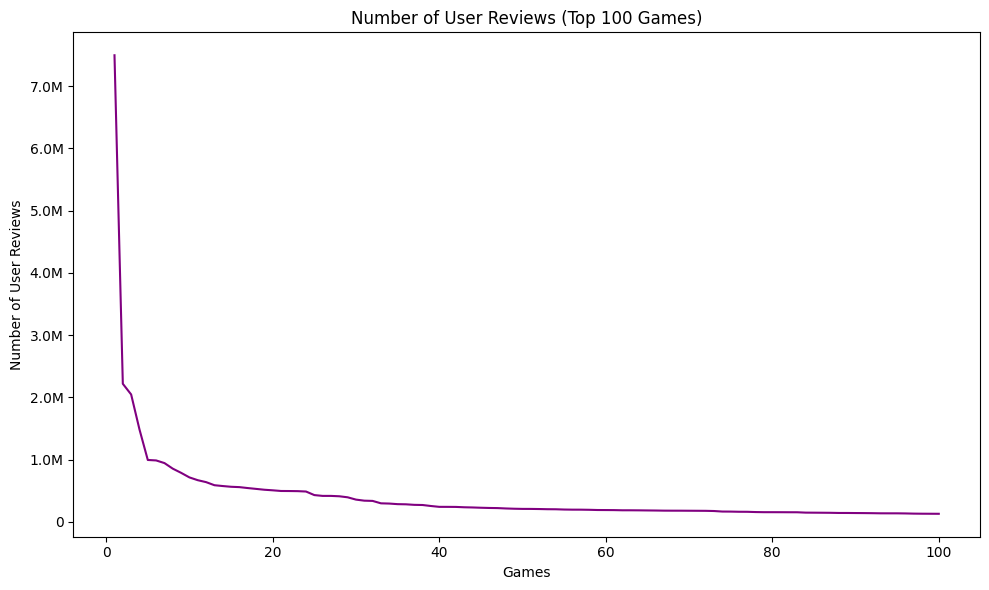
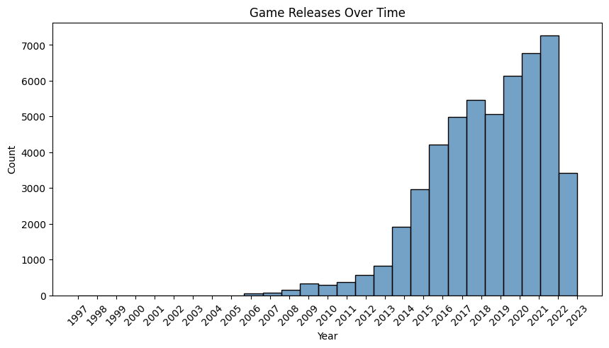
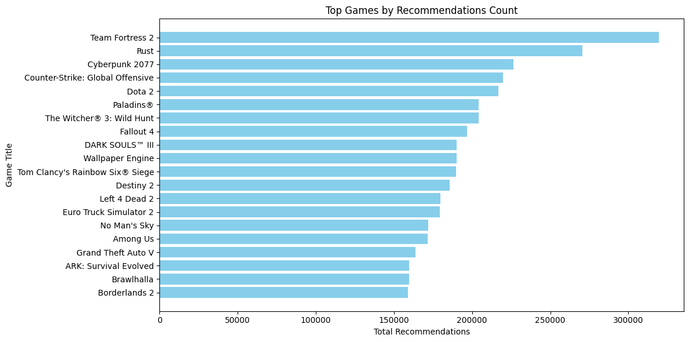
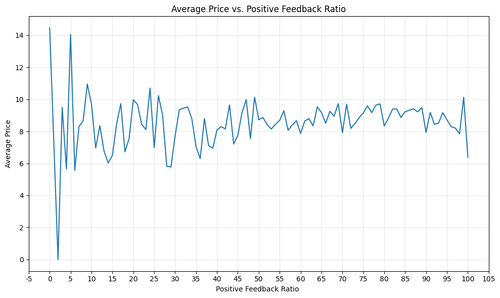
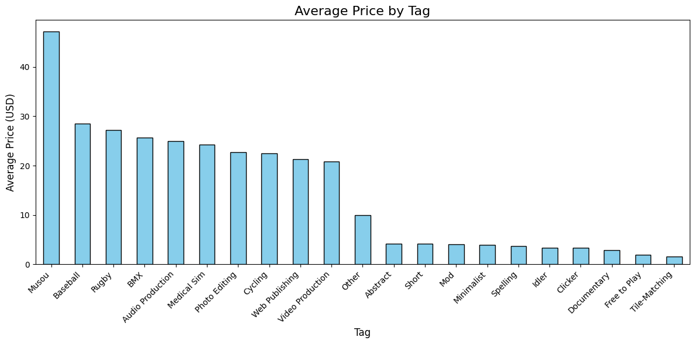
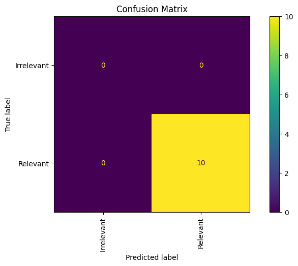

# **Laporan Proyek Machine Learning - Fikri Zulfialdi**

## **Project Overview**


Bermain game tidak hanya memberikan hiburan, tetapi juga menawarkan berbagai manfaat psikologis dan kognitif. Penelitian menunjukkan bahwa game dapat meningkatkan kemampuan pemecahan masalah, kreativitas, serta koordinasi tangan-mata (Granic, Lobel, & Engels, 2014). Selain itu, beberapa game membantu pemain mengelola stres, seperti yang ditemukan dalam tinjauan sistematis tentang manfaat game terhadap kesehatan mental (Primack et al., 2012). Game juga mendukung pembentukan komunitas online yang memperkuat koneksi sosial (Kowert & Quandt, 2016) dan memberikan peluang pembelajaran melalui mekanisme permainan yang melatih keterampilan berpikir kritis (Gee, 2003). Bahkan, beberapa jenis game dapat meningkatkan aktivitas fisik dan kesehatan, seperti yang dijelaskan dalam studi tentang exergames (Staiano & Calvert, 2011). Dengan manfaat ini, menemukan game yang sesuai dengan minat dan kebutuhan pemain menjadi semakin penting untuk memaksimalkan pengalaman bermain.

Proyek pengembangan sistem rekomendasi game untuk platform Steam bertujuan memberikan pengalaman pengguna yang lebih personal dengan menyarankan game yang relevan berdasarkan preferensi dan aktivitas mereka. Sistem ini sangat dibutuhkan karena jumlah game yang tersedia sangat banyak, yang dapat membuat pengguna kewalahan dalam menemukan game yang sesuai dengan minat mereka (Valve Corporation, 2023). Selain membantu pengguna, sistem ini juga berdampak signifikan pada platform, seperti mengurangi tingkat ketidakaktifan pengguna (churn rate) dan meningkatkan pendapatan melalui penjualan yang lebih terarah (McKinsey & Company, 2021). Rekomendasi yang tepat mampu menciptakan pengalaman bermain yang lebih memuaskan, mempermudah pengguna menemukan konten baru, dan meningkatkan keterlibatan pengguna secara keseluruhan, sebagaimana dicatat dalam penelitian tentang perilaku pengguna di platform digital (Resnick & Varian, 1997).

Efektivitas sistem rekomendasi telah terbukti melalui berbagai penelitian. Menurut McKinsey & Company (2021), sekitar 35% penjualan Amazon berasal dari sistem rekomendasi, menunjukkan potensi besar model serupa untuk diterapkan pada Steam. Yann LeCun, seorang ahli kecerdasan buatan, menjelaskan bahwa teknologi seperti deep learning mampu membuat rekomendasi lebih personal dan kontekstual, sehingga meningkatkan relevansi rekomendasi bagi pengguna (LeCun, 2018). Dalam bukunya The Long Tail, Chris Anderson (2006) menyoroti bagaimana personalisasi membantu menjangkau pasar "ekor panjang," yang memungkinkan game indie atau kurang populer menemukan audiens yang sesuai. Penelitian Resnick dan Varian (1997) juga menunjukkan bahwa sistem rekomendasi berperan penting dalam meningkatkan keterlibatan dan loyalitas pengguna di platform digital. Valve, pengembang Steam, melaporkan bahwa fitur seperti Steam Discovery Queue mampu meningkatkan konversi penjualan game indie hingga 20-30%, memperkuat dampak positif sistem rekomendasi pada kesuksesan platform game digital (Valve Corporation, 2023).

Oleh karena itu sangat penting hadirnya sistem rekomendasi yang mumpuni yang bisa merekomendasikan dengan baik sesuai preferensi *user* yang diberi rekomendasi. Menjawab kepentingan tersebut, akan dibuat model sistem rekomendasi dengan menggunakan Content-Based Filtering dan Collaborative Filtering untuk menemukan sistem rekomendasi game terbaik menggunakan data dari platform penjualan game Steam.

## **Business Understanding**


### **Problem Statement**
1. Bagaimana cara meningkatkan pengalaman pengguna dalam memilih game di
platform Steam?
2. Game apa yang paling populer berdasarkan total durasi bermain, jumlah review, jumlah rekomendasi?
3. Apakah platform atau sistem operasi yang didukung (Windows, Mac, Linux) mempengaruhi preferensi pengguna?
4. Bagaimana distribusi harga game memengaruhi tingkat ulasan positif dari pengguna?
5. Apakah ada hubungan antara rating game dan jumlah waktu yang dihabiskan pengguna untuk memainkannya?


### **Goals**  
1. Mengembangkan model rekomendasi game yang mempermudah pengguna memilih game berdasarkan karakteristik game dan karakteristik user yang serupa.  
2. Menganalisis game dengan populasi yang diwakilkan oleh agregat total durasi bermain, jumlah review, dan jumlah rekomendasi.  
3. Mengeksplorasi pengaruh sistem operasi terhadap preferensi game pengguna.  
4. Menganalisis hubungan antara distribusi harga game dan tingkat ulasan positif.  
5. Mengidentifikasi hubungan antara rating game dan waktu yang dihabiskan pengguna untuk memainkannya.  


### **Solution**  
1. Menggunakan dua pendekatan rekomendasi utama:  
   - Content-Based Filtering: Menganalisis genre, tag, harga, dan fitur game lainnya untuk merekomendasikan game yang serupa dengan preferensi pengguna menggunakan *cosine similarity*.  
   - Collaborative Filtering: Menggunakan data ulasan dan interaksi pengguna untuk merekomendasikan game yang disukai oleh pengguna dengan preferensi serupa menggunakan algoritma deep learning *RecommenderNet*.  

2. Menggunakan Exploratory Data Analysis (EDA) untuk memahami tren dan pola pengguna:  
   - Menganalisis agregat data seperti total durasi bermain, jumlah ulasan, dan jumlah rekomendasi untuk mengidentifikasi game yang paling populer.  
   - Memahami hubungan antara distribusi harga game dengan tingkat ulasan positif.  
   - Mengeksplorasi preferensi genre berdasarkan jumlah ulasan, durasi bermain, dan feedback positif.  
   - Menganalisis dampak platform (Windows, Mac, Linux) terhadap preferensi pengguna untuk meningkatkan rekomendasi lintas platform.  
   - Menyelidiki hubungan antara rating game dengan waktu bermain untuk memberikan wawasan terhadap tingkat keterlibatan pengguna.  


## **Import Library**


```python
import kagglehub
import textwrap
import numpy as np
import pandas as pd
import seaborn as sns
import matplotlib.pyplot as plt
import tensorflow as tf
from tensorflow import keras
from tensorflow.keras import layers
from keras.models import Model
from keras.layers import Input, Embedding, Flatten, Dot, Dense
from keras.optimizers import Adam
from sklearn.feature_extraction.text import TfidfVectorizer
from sklearn.metrics.pairwise import cosine_similarity
from sklearn.preprocessing import MinMaxScaler, MultiLabelBinarizer
from sklearn.model_selection import GridSearchCV, train_test_split
from sklearn.cluster import KMeans
from sklearn.pipeline import Pipeline
from sklearn.metrics import ConfusionMatrixDisplay, accuracy_score, classification_report, confusion_matrix
from scipy.sparse import csr_matrix, hstack
from matplotlib.ticker import FuncFormatter
import matplotlib.ticker as ticker
!pip install tabulate
from tabulate import tabulate
import plotly.express as px
from google.colab import drive
import shutil

```

    Collecting tabulate
      Downloading tabulate-0.9.0-py3-none-any.whl.metadata (34 kB)
    Downloading tabulate-0.9.0-py3-none-any.whl (35 kB)
    Installing collected packages: tabulate
    Successfully installed tabulate-0.9.0


## **Data Understanding**


## **Data Loading**

Dataset ini berasal dari "https://www.kaggle.com/datasets/antonkozyriev/game-recommendations-on-steam" repositori Kaggle milik Anton Kozyriev, kemungkinan besar menggunakan data dari Steam API atau metode scraping untuk tujuan analisis rekomendasi game. Dengan 71K dilihat dan jumlah unduhan (10.9K entri) serta usability 10.00/10.00, dataset ini cukup populer dan dapat diandalkan.


```python
path = kagglehub.dataset_download("antonkozyriev/game-recommendations-on-steam")
print("Path to dataset files:" , path)
```

    Downloading from https://www.kaggle.com/api/v1/datasets/download/antonkozyriev/game-recommendations-on-steam?dataset_version_number=28...


    100%|██████████| 660M/660M [00:15<00:00, 43.8MB/s]

    Extracting files...


    


    Path to dataset files: /root/.cache/kagglehub/datasets/antonkozyriev/game-recommendations-on-steam/versions/28


```python
drive.mount('/content/drive')
```

    Mounted at /content/drive


```python
source_paths = ['/root/.cache/kagglehub/datasets/antonkozyriev/game-recommendations-on-steam/versions/28/games.csv',
               '/root/.cache/kagglehub/datasets/antonkozyriev/game-recommendations-on-steam/versions/28/games_metadata.json',
               '/root/.cache/kagglehub/datasets/antonkozyriev/game-recommendations-on-steam/versions/28/recommendations.csv',
               '/root/.cache/kagglehub/datasets/antonkozyriev/game-recommendations-on-steam/versions/28/users.csv']
destination_path = '/content/drive/MyDrive/Recommendation/'
for path in source_paths:
    shutil.copy(path, destination_path)
```

Terdapat 4 file csv namun disini hanya digunakan 3 file yaitu `games.csv`, `games_metadata.json`, dan `recommendations.csv` ke dalam 2 DataFrame berbeda. Hal ini dilakukakan karena terdapat perbedaan struktur data.


```python
# Load JSON from a file
games_metadata = pd.read_json('/content/drive/MyDrive/Recommendation/games_metadata.json', lines=True)

# Display the DataFrame
games_metadata.head()
```


  <div id="df-c1744788-8b24-43a6-b486-bf8d7fbe8da0" class="colab-df-container">
    <div>
<style scoped>
    .dataframe tbody tr th:only-of-type {
        vertical-align: middle;
    }

    .dataframe tbody tr th {
        vertical-align: top;
    }

    .dataframe thead th {
        text-align: right;
    }
</style>
<table border="1" class="dataframe">
  <thead>
    <tr style="text-align: right;">
      <th></th>
      <th>app_id</th>
      <th>description</th>
      <th>tags</th>
    </tr>
  </thead>
  <tbody>
    <tr>
      <th>0</th>
      <td>13500</td>
      <td>Enter the dark underworld of Prince of Persia ...</td>
      <td>[Action, Adventure, Parkour, Third Person, Gre...</td>
    </tr>
    <tr>
      <th>1</th>
      <td>22364</td>
      <td></td>
      <td>[Action]</td>
    </tr>
    <tr>
      <th>2</th>
      <td>113020</td>
      <td>Monaco: What's Yours Is Mine is a single playe...</td>
      <td>[Co-op, Stealth, Indie, Heist, Local Co-Op, St...</td>
    </tr>
    <tr>
      <th>3</th>
      <td>226560</td>
      <td>Escape Dead Island is a Survival-Mystery adven...</td>
      <td>[Zombies, Adventure, Survival, Action, Third P...</td>
    </tr>
    <tr>
      <th>4</th>
      <td>249050</td>
      <td>Dungeon of the Endless is a Rogue-Like Dungeon...</td>
      <td>[Roguelike, Strategy, Tower Defense, Pixel Gra...</td>
    </tr>
  </tbody>
</table>
</div>
    <div class="colab-df-buttons">

  <div class="colab-df-container">
    <button class="colab-df-convert" onclick="convertToInteractive('df-c1744788-8b24-43a6-b486-bf8d7fbe8da0')"
            title="Convert this dataframe to an interactive table."
            style="display:none;">

  <svg xmlns="http://www.w3.org/2000/svg" height="24px" viewBox="0 -960 960 960">
    <path d="M120-120v-720h720v720H120Zm60-500h600v-160H180v160Zm220 220h160v-160H400v160Zm0 220h160v-160H400v160ZM180-400h160v-160H180v160Zm440 0h160v-160H620v160ZM180-180h160v-160H180v160Zm440 0h160v-160H620v160Z"/>
  </svg>
    </button>

  <style>
    .colab-df-container {
      display:flex;
      gap: 12px;
    }

    .colab-df-convert {
      background-color: #E8F0FE;
      border: none;
      border-radius: 50%;
      cursor: pointer;
      display: none;
      fill: #1967D2;
      height: 32px;
      padding: 0 0 0 0;
      width: 32px;
    }

    .colab-df-convert:hover {
      background-color: #E2EBFA;
      box-shadow: 0px 1px 2px rgba(60, 64, 67, 0.3), 0px 1px 3px 1px rgba(60, 64, 67, 0.15);
      fill: #174EA6;
    }

    .colab-df-buttons div {
      margin-bottom: 4px;
    }

    [theme=dark] .colab-df-convert {
      background-color: #3B4455;
      fill: #D2E3FC;
    }

    [theme=dark] .colab-df-convert:hover {
      background-color: #434B5C;
      box-shadow: 0px 1px 3px 1px rgba(0, 0, 0, 0.15);
      filter: drop-shadow(0px 1px 2px rgba(0, 0, 0, 0.3));
      fill: #FFFFFF;
    }
  </style>

    <script>
      const buttonEl =
        document.querySelector('#df-c1744788-8b24-43a6-b486-bf8d7fbe8da0 button.colab-df-convert');
      buttonEl.style.display =
        google.colab.kernel.accessAllowed ? 'block' : 'none';

      async function convertToInteractive(key) {
        const element = document.querySelector('#df-c1744788-8b24-43a6-b486-bf8d7fbe8da0');
        const dataTable =
          await google.colab.kernel.invokeFunction('convertToInteractive',
                                                    [key], {});
        if (!dataTable) return;

        const docLinkHtml = 'Like what you see? Visit the ' +
          '<a target="_blank" href=https://colab.research.google.com/notebooks/data_table.ipynb>data table notebook</a>'
          + ' to learn more about interactive tables.';
        element.innerHTML = '';
        dataTable['output_type'] = 'display_data';
        await google.colab.output.renderOutput(dataTable, element);
        const docLink = document.createElement('div');
        docLink.innerHTML = docLinkHtml;
        element.appendChild(docLink);
      }
    </script>
  </div>


<div id="df-06e25bc8-9855-4aa9-9679-87bca98b1220">
  <button class="colab-df-quickchart" onclick="quickchart('df-06e25bc8-9855-4aa9-9679-87bca98b1220')"
            title="Suggest charts"
            style="display:none;">

<svg xmlns="http://www.w3.org/2000/svg" height="24px"viewBox="0 0 24 24"
     width="24px">
    <g>
        <path d="M19 3H5c-1.1 0-2 .9-2 2v14c0 1.1.9 2 2 2h14c1.1 0 2-.9 2-2V5c0-1.1-.9-2-2-2zM9 17H7v-7h2v7zm4 0h-2V7h2v10zm4 0h-2v-4h2v4z"/>
    </g>
</svg>
  </button>

<style>
  .colab-df-quickchart {
      --bg-color: #E8F0FE;
      --fill-color: #1967D2;
      --hover-bg-color: #E2EBFA;
      --hover-fill-color: #174EA6;
      --disabled-fill-color: #AAA;
      --disabled-bg-color: #DDD;
  }

  [theme=dark] .colab-df-quickchart {
      --bg-color: #3B4455;
      --fill-color: #D2E3FC;
      --hover-bg-color: #434B5C;
      --hover-fill-color: #FFFFFF;
      --disabled-bg-color: #3B4455;
      --disabled-fill-color: #666;
  }

  .colab-df-quickchart {
    background-color: var(--bg-color);
    border: none;
    border-radius: 50%;
    cursor: pointer;
    display: none;
    fill: var(--fill-color);
    height: 32px;
    padding: 0;
    width: 32px;
  }

  .colab-df-quickchart:hover {
    background-color: var(--hover-bg-color);
    box-shadow: 0 1px 2px rgba(60, 64, 67, 0.3), 0 1px 3px 1px rgba(60, 64, 67, 0.15);
    fill: var(--button-hover-fill-color);
  }

  .colab-df-quickchart-complete:disabled,
  .colab-df-quickchart-complete:disabled:hover {
    background-color: var(--disabled-bg-color);
    fill: var(--disabled-fill-color);
    box-shadow: none;
  }

  .colab-df-spinner {
    border: 2px solid var(--fill-color);
    border-color: transparent;
    border-bottom-color: var(--fill-color);
    animation:
      spin 1s steps(1) infinite;
  }

  @keyframes spin {
    0% {
      border-color: transparent;
      border-bottom-color: var(--fill-color);
      border-left-color: var(--fill-color);
    }
    20% {
      border-color: transparent;
      border-left-color: var(--fill-color);
      border-top-color: var(--fill-color);
    }
    30% {
      border-color: transparent;
      border-left-color: var(--fill-color);
      border-top-color: var(--fill-color);
      border-right-color: var(--fill-color);
    }
    40% {
      border-color: transparent;
      border-right-color: var(--fill-color);
      border-top-color: var(--fill-color);
    }
    60% {
      border-color: transparent;
      border-right-color: var(--fill-color);
    }
    80% {
      border-color: transparent;
      border-right-color: var(--fill-color);
      border-bottom-color: var(--fill-color);
    }
    90% {
      border-color: transparent;
      border-bottom-color: var(--fill-color);
    }
  }
</style>

  <script>
    async function quickchart(key) {
      const quickchartButtonEl =
        document.querySelector('#' + key + ' button');
      quickchartButtonEl.disabled = true;  // To prevent multiple clicks.
      quickchartButtonEl.classList.add('colab-df-spinner');
      try {
        const charts = await google.colab.kernel.invokeFunction(
            'suggestCharts', [key], {});
      } catch (error) {
        console.error('Error during call to suggestCharts:', error);
      }
      quickchartButtonEl.classList.remove('colab-df-spinner');
      quickchartButtonEl.classList.add('colab-df-quickchart-complete');
    }
    (() => {
      let quickchartButtonEl =
        document.querySelector('#df-06e25bc8-9855-4aa9-9679-87bca98b1220 button');
      quickchartButtonEl.style.display =
        google.colab.kernel.accessAllowed ? 'block' : 'none';
    })();
  </script>
</div>

    </div>
  </div>


```python
# Load CSV data (replace 'file_path' with the actual CSV file path)
games = pd.read_csv('/content/drive/MyDrive/Recommendation/games.csv')

# Display the first few rows of the CSV data
games.head()

```


  <div id="df-c152e370-81b1-4882-ac3f-3152cd4cd7f6" class="colab-df-container">
    <div>
<style scoped>
    .dataframe tbody tr th:only-of-type {
        vertical-align: middle;
    }

    .dataframe tbody tr th {
        vertical-align: top;
    }

    .dataframe thead th {
        text-align: right;
    }
</style>
<table border="1" class="dataframe">
  <thead>
    <tr style="text-align: right;">
      <th></th>
      <th>app_id</th>
      <th>title</th>
      <th>date_release</th>
      <th>win</th>
      <th>mac</th>
      <th>linux</th>
      <th>rating</th>
      <th>positive_ratio</th>
      <th>user_reviews</th>
      <th>price_final</th>
      <th>price_original</th>
      <th>discount</th>
      <th>steam_deck</th>
    </tr>
  </thead>
  <tbody>
    <tr>
      <th>0</th>
      <td>13500</td>
      <td>Prince of Persia: Warrior Within™</td>
      <td>2008-11-21</td>
      <td>True</td>
      <td>False</td>
      <td>False</td>
      <td>Very Positive</td>
      <td>84</td>
      <td>2199</td>
      <td>9.99</td>
      <td>9.99</td>
      <td>0.0</td>
      <td>True</td>
    </tr>
    <tr>
      <th>1</th>
      <td>22364</td>
      <td>BRINK: Agents of Change</td>
      <td>2011-08-03</td>
      <td>True</td>
      <td>False</td>
      <td>False</td>
      <td>Positive</td>
      <td>85</td>
      <td>21</td>
      <td>2.99</td>
      <td>2.99</td>
      <td>0.0</td>
      <td>True</td>
    </tr>
    <tr>
      <th>2</th>
      <td>113020</td>
      <td>Monaco: What's Yours Is Mine</td>
      <td>2013-04-24</td>
      <td>True</td>
      <td>True</td>
      <td>True</td>
      <td>Very Positive</td>
      <td>92</td>
      <td>3722</td>
      <td>14.99</td>
      <td>14.99</td>
      <td>0.0</td>
      <td>True</td>
    </tr>
    <tr>
      <th>3</th>
      <td>226560</td>
      <td>Escape Dead Island</td>
      <td>2014-11-18</td>
      <td>True</td>
      <td>False</td>
      <td>False</td>
      <td>Mixed</td>
      <td>61</td>
      <td>873</td>
      <td>14.99</td>
      <td>14.99</td>
      <td>0.0</td>
      <td>True</td>
    </tr>
    <tr>
      <th>4</th>
      <td>249050</td>
      <td>Dungeon of the ENDLESS™</td>
      <td>2014-10-27</td>
      <td>True</td>
      <td>True</td>
      <td>False</td>
      <td>Very Positive</td>
      <td>88</td>
      <td>8784</td>
      <td>11.99</td>
      <td>11.99</td>
      <td>0.0</td>
      <td>True</td>
    </tr>
  </tbody>
</table>
</div>
    <div class="colab-df-buttons">

  <div class="colab-df-container">
    <button class="colab-df-convert" onclick="convertToInteractive('df-c152e370-81b1-4882-ac3f-3152cd4cd7f6')"
            title="Convert this dataframe to an interactive table."
            style="display:none;">

  <svg xmlns="http://www.w3.org/2000/svg" height="24px" viewBox="0 -960 960 960">
    <path d="M120-120v-720h720v720H120Zm60-500h600v-160H180v160Zm220 220h160v-160H400v160Zm0 220h160v-160H400v160ZM180-400h160v-160H180v160Zm440 0h160v-160H620v160ZM180-180h160v-160H180v160Zm440 0h160v-160H620v160Z"/>
  </svg>
    </button>

  <style>
    .colab-df-container {
      display:flex;
      gap: 12px;
    }

    .colab-df-convert {
      background-color: #E8F0FE;
      border: none;
      border-radius: 50%;
      cursor: pointer;
      display: none;
      fill: #1967D2;
      height: 32px;
      padding: 0 0 0 0;
      width: 32px;
    }

    .colab-df-convert:hover {
      background-color: #E2EBFA;
      box-shadow: 0px 1px 2px rgba(60, 64, 67, 0.3), 0px 1px 3px 1px rgba(60, 64, 67, 0.15);
      fill: #174EA6;
    }

    .colab-df-buttons div {
      margin-bottom: 4px;
    }

    [theme=dark] .colab-df-convert {
      background-color: #3B4455;
      fill: #D2E3FC;
    }

    [theme=dark] .colab-df-convert:hover {
      background-color: #434B5C;
      box-shadow: 0px 1px 3px 1px rgba(0, 0, 0, 0.15);
      filter: drop-shadow(0px 1px 2px rgba(0, 0, 0, 0.3));
      fill: #FFFFFF;
    }
  </style>

    <script>
      const buttonEl =
        document.querySelector('#df-c152e370-81b1-4882-ac3f-3152cd4cd7f6 button.colab-df-convert');
      buttonEl.style.display =
        google.colab.kernel.accessAllowed ? 'block' : 'none';

      async function convertToInteractive(key) {
        const element = document.querySelector('#df-c152e370-81b1-4882-ac3f-3152cd4cd7f6');
        const dataTable =
          await google.colab.kernel.invokeFunction('convertToInteractive',
                                                    [key], {});
        if (!dataTable) return;

        const docLinkHtml = 'Like what you see? Visit the ' +
          '<a target="_blank" href=https://colab.research.google.com/notebooks/data_table.ipynb>data table notebook</a>'
          + ' to learn more about interactive tables.';
        element.innerHTML = '';
        dataTable['output_type'] = 'display_data';
        await google.colab.output.renderOutput(dataTable, element);
        const docLink = document.createElement('div');
        docLink.innerHTML = docLinkHtml;
        element.appendChild(docLink);
      }
    </script>
  </div>


<div id="df-09fc5824-cb06-4eed-aed2-b44c74f00b42">
  <button class="colab-df-quickchart" onclick="quickchart('df-09fc5824-cb06-4eed-aed2-b44c74f00b42')"
            title="Suggest charts"
            style="display:none;">

<svg xmlns="http://www.w3.org/2000/svg" height="24px"viewBox="0 0 24 24"
     width="24px">
    <g>
        <path d="M19 3H5c-1.1 0-2 .9-2 2v14c0 1.1.9 2 2 2h14c1.1 0 2-.9 2-2V5c0-1.1-.9-2-2-2zM9 17H7v-7h2v7zm4 0h-2V7h2v10zm4 0h-2v-4h2v4z"/>
    </g>
</svg>
  </button>

<style>
  .colab-df-quickchart {
      --bg-color: #E8F0FE;
      --fill-color: #1967D2;
      --hover-bg-color: #E2EBFA;
      --hover-fill-color: #174EA6;
      --disabled-fill-color: #AAA;
      --disabled-bg-color: #DDD;
  }

  [theme=dark] .colab-df-quickchart {
      --bg-color: #3B4455;
      --fill-color: #D2E3FC;
      --hover-bg-color: #434B5C;
      --hover-fill-color: #FFFFFF;
      --disabled-bg-color: #3B4455;
      --disabled-fill-color: #666;
  }

  .colab-df-quickchart {
    background-color: var(--bg-color);
    border: none;
    border-radius: 50%;
    cursor: pointer;
    display: none;
    fill: var(--fill-color);
    height: 32px;
    padding: 0;
    width: 32px;
  }

  .colab-df-quickchart:hover {
    background-color: var(--hover-bg-color);
    box-shadow: 0 1px 2px rgba(60, 64, 67, 0.3), 0 1px 3px 1px rgba(60, 64, 67, 0.15);
    fill: var(--button-hover-fill-color);
  }

  .colab-df-quickchart-complete:disabled,
  .colab-df-quickchart-complete:disabled:hover {
    background-color: var(--disabled-bg-color);
    fill: var(--disabled-fill-color);
    box-shadow: none;
  }

  .colab-df-spinner {
    border: 2px solid var(--fill-color);
    border-color: transparent;
    border-bottom-color: var(--fill-color);
    animation:
      spin 1s steps(1) infinite;
  }

  @keyframes spin {
    0% {
      border-color: transparent;
      border-bottom-color: var(--fill-color);
      border-left-color: var(--fill-color);
    }
    20% {
      border-color: transparent;
      border-left-color: var(--fill-color);
      border-top-color: var(--fill-color);
    }
    30% {
      border-color: transparent;
      border-left-color: var(--fill-color);
      border-top-color: var(--fill-color);
      border-right-color: var(--fill-color);
    }
    40% {
      border-color: transparent;
      border-right-color: var(--fill-color);
      border-top-color: var(--fill-color);
    }
    60% {
      border-color: transparent;
      border-right-color: var(--fill-color);
    }
    80% {
      border-color: transparent;
      border-right-color: var(--fill-color);
      border-bottom-color: var(--fill-color);
    }
    90% {
      border-color: transparent;
      border-bottom-color: var(--fill-color);
    }
  }
</style>

  <script>
    async function quickchart(key) {
      const quickchartButtonEl =
        document.querySelector('#' + key + ' button');
      quickchartButtonEl.disabled = true;  // To prevent multiple clicks.
      quickchartButtonEl.classList.add('colab-df-spinner');
      try {
        const charts = await google.colab.kernel.invokeFunction(
            'suggestCharts', [key], {});
      } catch (error) {
        console.error('Error during call to suggestCharts:', error);
      }
      quickchartButtonEl.classList.remove('colab-df-spinner');
      quickchartButtonEl.classList.add('colab-df-quickchart-complete');
    }
    (() => {
      let quickchartButtonEl =
        document.querySelector('#df-09fc5824-cb06-4eed-aed2-b44c74f00b42 button');
      quickchartButtonEl.style.display =
        google.colab.kernel.accessAllowed ? 'block' : 'none';
    })();
  </script>
</div>

    </div>
  </div>


File `games.csv` dan `games_metadata.json` digabung kedalam 1 dataframe yaitu `games_data`.


```python
# Merge the two DataFrames on 'app_id'
games_data = pd.merge(games_metadata, games, on='app_id', how='inner')

# Display the merged DataFrame
games_data.head()

```


  <div id="df-d7110459-8e61-452e-b5f3-ccaa2f777067" class="colab-df-container">
    <div>
<style scoped>
    .dataframe tbody tr th:only-of-type {
        vertical-align: middle;
    }

    .dataframe tbody tr th {
        vertical-align: top;
    }

    .dataframe thead th {
        text-align: right;
    }
</style>
<table border="1" class="dataframe">
  <thead>
    <tr style="text-align: right;">
      <th></th>
      <th>app_id</th>
      <th>description</th>
      <th>tags</th>
      <th>title</th>
      <th>date_release</th>
      <th>win</th>
      <th>mac</th>
      <th>linux</th>
      <th>rating</th>
      <th>positive_ratio</th>
      <th>user_reviews</th>
      <th>price_final</th>
      <th>price_original</th>
      <th>discount</th>
      <th>steam_deck</th>
    </tr>
  </thead>
  <tbody>
    <tr>
      <th>0</th>
      <td>13500</td>
      <td>Enter the dark underworld of Prince of Persia ...</td>
      <td>[Action, Adventure, Parkour, Third Person, Gre...</td>
      <td>Prince of Persia: Warrior Within™</td>
      <td>2008-11-21</td>
      <td>True</td>
      <td>False</td>
      <td>False</td>
      <td>Very Positive</td>
      <td>84</td>
      <td>2199</td>
      <td>9.99</td>
      <td>9.99</td>
      <td>0.0</td>
      <td>True</td>
    </tr>
    <tr>
      <th>1</th>
      <td>22364</td>
      <td></td>
      <td>[Action]</td>
      <td>BRINK: Agents of Change</td>
      <td>2011-08-03</td>
      <td>True</td>
      <td>False</td>
      <td>False</td>
      <td>Positive</td>
      <td>85</td>
      <td>21</td>
      <td>2.99</td>
      <td>2.99</td>
      <td>0.0</td>
      <td>True</td>
    </tr>
    <tr>
      <th>2</th>
      <td>113020</td>
      <td>Monaco: What's Yours Is Mine is a single playe...</td>
      <td>[Co-op, Stealth, Indie, Heist, Local Co-Op, St...</td>
      <td>Monaco: What's Yours Is Mine</td>
      <td>2013-04-24</td>
      <td>True</td>
      <td>True</td>
      <td>True</td>
      <td>Very Positive</td>
      <td>92</td>
      <td>3722</td>
      <td>14.99</td>
      <td>14.99</td>
      <td>0.0</td>
      <td>True</td>
    </tr>
    <tr>
      <th>3</th>
      <td>226560</td>
      <td>Escape Dead Island is a Survival-Mystery adven...</td>
      <td>[Zombies, Adventure, Survival, Action, Third P...</td>
      <td>Escape Dead Island</td>
      <td>2014-11-18</td>
      <td>True</td>
      <td>False</td>
      <td>False</td>
      <td>Mixed</td>
      <td>61</td>
      <td>873</td>
      <td>14.99</td>
      <td>14.99</td>
      <td>0.0</td>
      <td>True</td>
    </tr>
    <tr>
      <th>4</th>
      <td>249050</td>
      <td>Dungeon of the Endless is a Rogue-Like Dungeon...</td>
      <td>[Roguelike, Strategy, Tower Defense, Pixel Gra...</td>
      <td>Dungeon of the ENDLESS™</td>
      <td>2014-10-27</td>
      <td>True</td>
      <td>True</td>
      <td>False</td>
      <td>Very Positive</td>
      <td>88</td>
      <td>8784</td>
      <td>11.99</td>
      <td>11.99</td>
      <td>0.0</td>
      <td>True</td>
    </tr>
  </tbody>
</table>
</div>
    <div class="colab-df-buttons">

  <div class="colab-df-container">
    <button class="colab-df-convert" onclick="convertToInteractive('df-d7110459-8e61-452e-b5f3-ccaa2f777067')"
            title="Convert this dataframe to an interactive table."
            style="display:none;">

  <svg xmlns="http://www.w3.org/2000/svg" height="24px" viewBox="0 -960 960 960">
    <path d="M120-120v-720h720v720H120Zm60-500h600v-160H180v160Zm220 220h160v-160H400v160Zm0 220h160v-160H400v160ZM180-400h160v-160H180v160Zm440 0h160v-160H620v160ZM180-180h160v-160H180v160Zm440 0h160v-160H620v160Z"/>
  </svg>
    </button>

  <style>
    .colab-df-container {
      display:flex;
      gap: 12px;
    }

    .colab-df-convert {
      background-color: #E8F0FE;
      border: none;
      border-radius: 50%;
      cursor: pointer;
      display: none;
      fill: #1967D2;
      height: 32px;
      padding: 0 0 0 0;
      width: 32px;
    }

    .colab-df-convert:hover {
      background-color: #E2EBFA;
      box-shadow: 0px 1px 2px rgba(60, 64, 67, 0.3), 0px 1px 3px 1px rgba(60, 64, 67, 0.15);
      fill: #174EA6;
    }

    .colab-df-buttons div {
      margin-bottom: 4px;
    }

    [theme=dark] .colab-df-convert {
      background-color: #3B4455;
      fill: #D2E3FC;
    }

    [theme=dark] .colab-df-convert:hover {
      background-color: #434B5C;
      box-shadow: 0px 1px 3px 1px rgba(0, 0, 0, 0.15);
      filter: drop-shadow(0px 1px 2px rgba(0, 0, 0, 0.3));
      fill: #FFFFFF;
    }
  </style>

    <script>
      const buttonEl =
        document.querySelector('#df-d7110459-8e61-452e-b5f3-ccaa2f777067 button.colab-df-convert');
      buttonEl.style.display =
        google.colab.kernel.accessAllowed ? 'block' : 'none';

      async function convertToInteractive(key) {
        const element = document.querySelector('#df-d7110459-8e61-452e-b5f3-ccaa2f777067');
        const dataTable =
          await google.colab.kernel.invokeFunction('convertToInteractive',
                                                    [key], {});
        if (!dataTable) return;

        const docLinkHtml = 'Like what you see? Visit the ' +
          '<a target="_blank" href=https://colab.research.google.com/notebooks/data_table.ipynb>data table notebook</a>'
          + ' to learn more about interactive tables.';
        element.innerHTML = '';
        dataTable['output_type'] = 'display_data';
        await google.colab.output.renderOutput(dataTable, element);
        const docLink = document.createElement('div');
        docLink.innerHTML = docLinkHtml;
        element.appendChild(docLink);
      }
    </script>
  </div>


<div id="df-4e3f3bfd-0c71-4ee8-bea4-1de9118fe1d0">
  <button class="colab-df-quickchart" onclick="quickchart('df-4e3f3bfd-0c71-4ee8-bea4-1de9118fe1d0')"
            title="Suggest charts"
            style="display:none;">

<svg xmlns="http://www.w3.org/2000/svg" height="24px"viewBox="0 0 24 24"
     width="24px">
    <g>
        <path d="M19 3H5c-1.1 0-2 .9-2 2v14c0 1.1.9 2 2 2h14c1.1 0 2-.9 2-2V5c0-1.1-.9-2-2-2zM9 17H7v-7h2v7zm4 0h-2V7h2v10zm4 0h-2v-4h2v4z"/>
    </g>
</svg>
  </button>

<style>
  .colab-df-quickchart {
      --bg-color: #E8F0FE;
      --fill-color: #1967D2;
      --hover-bg-color: #E2EBFA;
      --hover-fill-color: #174EA6;
      --disabled-fill-color: #AAA;
      --disabled-bg-color: #DDD;
  }

  [theme=dark] .colab-df-quickchart {
      --bg-color: #3B4455;
      --fill-color: #D2E3FC;
      --hover-bg-color: #434B5C;
      --hover-fill-color: #FFFFFF;
      --disabled-bg-color: #3B4455;
      --disabled-fill-color: #666;
  }

  .colab-df-quickchart {
    background-color: var(--bg-color);
    border: none;
    border-radius: 50%;
    cursor: pointer;
    display: none;
    fill: var(--fill-color);
    height: 32px;
    padding: 0;
    width: 32px;
  }

  .colab-df-quickchart:hover {
    background-color: var(--hover-bg-color);
    box-shadow: 0 1px 2px rgba(60, 64, 67, 0.3), 0 1px 3px 1px rgba(60, 64, 67, 0.15);
    fill: var(--button-hover-fill-color);
  }

  .colab-df-quickchart-complete:disabled,
  .colab-df-quickchart-complete:disabled:hover {
    background-color: var(--disabled-bg-color);
    fill: var(--disabled-fill-color);
    box-shadow: none;
  }

  .colab-df-spinner {
    border: 2px solid var(--fill-color);
    border-color: transparent;
    border-bottom-color: var(--fill-color);
    animation:
      spin 1s steps(1) infinite;
  }

  @keyframes spin {
    0% {
      border-color: transparent;
      border-bottom-color: var(--fill-color);
      border-left-color: var(--fill-color);
    }
    20% {
      border-color: transparent;
      border-left-color: var(--fill-color);
      border-top-color: var(--fill-color);
    }
    30% {
      border-color: transparent;
      border-left-color: var(--fill-color);
      border-top-color: var(--fill-color);
      border-right-color: var(--fill-color);
    }
    40% {
      border-color: transparent;
      border-right-color: var(--fill-color);
      border-top-color: var(--fill-color);
    }
    60% {
      border-color: transparent;
      border-right-color: var(--fill-color);
    }
    80% {
      border-color: transparent;
      border-right-color: var(--fill-color);
      border-bottom-color: var(--fill-color);
    }
    90% {
      border-color: transparent;
      border-bottom-color: var(--fill-color);
    }
  }
</style>

  <script>
    async function quickchart(key) {
      const quickchartButtonEl =
        document.querySelector('#' + key + ' button');
      quickchartButtonEl.disabled = true;  // To prevent multiple clicks.
      quickchartButtonEl.classList.add('colab-df-spinner');
      try {
        const charts = await google.colab.kernel.invokeFunction(
            'suggestCharts', [key], {});
      } catch (error) {
        console.error('Error during call to suggestCharts:', error);
      }
      quickchartButtonEl.classList.remove('colab-df-spinner');
      quickchartButtonEl.classList.add('colab-df-quickchart-complete');
    }
    (() => {
      let quickchartButtonEl =
        document.querySelector('#df-4e3f3bfd-0c71-4ee8-bea4-1de9118fe1d0 button');
      quickchartButtonEl.style.display =
        google.colab.kernel.accessAllowed ? 'block' : 'none';
    })();
  </script>
</div>

    </div>
  </div>


Data `recommendations.csv` dibuat dataframe terpisah yaitu `recommendations` karena memiliki dimensi data yang berbeda.


```python
# Load CSV data (replace 'file_path' with the actual CSV file path)
recommendations = pd.read_csv('/content/drive/MyDrive/Recommendation/recommendations.csv')

# Display the first few rows of the CSV data
recommendations.head()

```


  <div id="df-35686626-b327-4a23-86c2-2df7682eb6cd" class="colab-df-container">
    <div>
<style scoped>
    .dataframe tbody tr th:only-of-type {
        vertical-align: middle;
    }

    .dataframe tbody tr th {
        vertical-align: top;
    }

    .dataframe thead th {
        text-align: right;
    }
</style>
<table border="1" class="dataframe">
  <thead>
    <tr style="text-align: right;">
      <th></th>
      <th>app_id</th>
      <th>helpful</th>
      <th>funny</th>
      <th>date</th>
      <th>is_recommended</th>
      <th>hours</th>
      <th>user_id</th>
      <th>review_id</th>
    </tr>
  </thead>
  <tbody>
    <tr>
      <th>0</th>
      <td>975370</td>
      <td>0</td>
      <td>0</td>
      <td>2022-12-12</td>
      <td>True</td>
      <td>36.3</td>
      <td>51580</td>
      <td>0</td>
    </tr>
    <tr>
      <th>1</th>
      <td>304390</td>
      <td>4</td>
      <td>0</td>
      <td>2017-02-17</td>
      <td>False</td>
      <td>11.5</td>
      <td>2586</td>
      <td>1</td>
    </tr>
    <tr>
      <th>2</th>
      <td>1085660</td>
      <td>2</td>
      <td>0</td>
      <td>2019-11-17</td>
      <td>True</td>
      <td>336.5</td>
      <td>253880</td>
      <td>2</td>
    </tr>
    <tr>
      <th>3</th>
      <td>703080</td>
      <td>0</td>
      <td>0</td>
      <td>2022-09-23</td>
      <td>True</td>
      <td>27.4</td>
      <td>259432</td>
      <td>3</td>
    </tr>
    <tr>
      <th>4</th>
      <td>526870</td>
      <td>0</td>
      <td>0</td>
      <td>2021-01-10</td>
      <td>True</td>
      <td>7.9</td>
      <td>23869</td>
      <td>4</td>
    </tr>
  </tbody>
</table>
</div>
    <div class="colab-df-buttons">

  <div class="colab-df-container">
    <button class="colab-df-convert" onclick="convertToInteractive('df-35686626-b327-4a23-86c2-2df7682eb6cd')"
            title="Convert this dataframe to an interactive table."
            style="display:none;">

  <svg xmlns="http://www.w3.org/2000/svg" height="24px" viewBox="0 -960 960 960">
    <path d="M120-120v-720h720v720H120Zm60-500h600v-160H180v160Zm220 220h160v-160H400v160Zm0 220h160v-160H400v160ZM180-400h160v-160H180v160Zm440 0h160v-160H620v160ZM180-180h160v-160H180v160Zm440 0h160v-160H620v160Z"/>
  </svg>
    </button>

  <style>
    .colab-df-container {
      display:flex;
      gap: 12px;
    }

    .colab-df-convert {
      background-color: #E8F0FE;
      border: none;
      border-radius: 50%;
      cursor: pointer;
      display: none;
      fill: #1967D2;
      height: 32px;
      padding: 0 0 0 0;
      width: 32px;
    }

    .colab-df-convert:hover {
      background-color: #E2EBFA;
      box-shadow: 0px 1px 2px rgba(60, 64, 67, 0.3), 0px 1px 3px 1px rgba(60, 64, 67, 0.15);
      fill: #174EA6;
    }

    .colab-df-buttons div {
      margin-bottom: 4px;
    }

    [theme=dark] .colab-df-convert {
      background-color: #3B4455;
      fill: #D2E3FC;
    }

    [theme=dark] .colab-df-convert:hover {
      background-color: #434B5C;
      box-shadow: 0px 1px 3px 1px rgba(0, 0, 0, 0.15);
      filter: drop-shadow(0px 1px 2px rgba(0, 0, 0, 0.3));
      fill: #FFFFFF;
    }
  </style>

    <script>
      const buttonEl =
        document.querySelector('#df-35686626-b327-4a23-86c2-2df7682eb6cd button.colab-df-convert');
      buttonEl.style.display =
        google.colab.kernel.accessAllowed ? 'block' : 'none';

      async function convertToInteractive(key) {
        const element = document.querySelector('#df-35686626-b327-4a23-86c2-2df7682eb6cd');
        const dataTable =
          await google.colab.kernel.invokeFunction('convertToInteractive',
                                                    [key], {});
        if (!dataTable) return;

        const docLinkHtml = 'Like what you see? Visit the ' +
          '<a target="_blank" href=https://colab.research.google.com/notebooks/data_table.ipynb>data table notebook</a>'
          + ' to learn more about interactive tables.';
        element.innerHTML = '';
        dataTable['output_type'] = 'display_data';
        await google.colab.output.renderOutput(dataTable, element);
        const docLink = document.createElement('div');
        docLink.innerHTML = docLinkHtml;
        element.appendChild(docLink);
      }
    </script>
  </div>


<div id="df-9a540bb1-40b0-4b7d-9dfa-a8f8c3056850">
  <button class="colab-df-quickchart" onclick="quickchart('df-9a540bb1-40b0-4b7d-9dfa-a8f8c3056850')"
            title="Suggest charts"
            style="display:none;">

<svg xmlns="http://www.w3.org/2000/svg" height="24px"viewBox="0 0 24 24"
     width="24px">
    <g>
        <path d="M19 3H5c-1.1 0-2 .9-2 2v14c0 1.1.9 2 2 2h14c1.1 0 2-.9 2-2V5c0-1.1-.9-2-2-2zM9 17H7v-7h2v7zm4 0h-2V7h2v10zm4 0h-2v-4h2v4z"/>
    </g>
</svg>
  </button>

<style>
  .colab-df-quickchart {
      --bg-color: #E8F0FE;
      --fill-color: #1967D2;
      --hover-bg-color: #E2EBFA;
      --hover-fill-color: #174EA6;
      --disabled-fill-color: #AAA;
      --disabled-bg-color: #DDD;
  }

  [theme=dark] .colab-df-quickchart {
      --bg-color: #3B4455;
      --fill-color: #D2E3FC;
      --hover-bg-color: #434B5C;
      --hover-fill-color: #FFFFFF;
      --disabled-bg-color: #3B4455;
      --disabled-fill-color: #666;
  }

  .colab-df-quickchart {
    background-color: var(--bg-color);
    border: none;
    border-radius: 50%;
    cursor: pointer;
    display: none;
    fill: var(--fill-color);
    height: 32px;
    padding: 0;
    width: 32px;
  }

  .colab-df-quickchart:hover {
    background-color: var(--hover-bg-color);
    box-shadow: 0 1px 2px rgba(60, 64, 67, 0.3), 0 1px 3px 1px rgba(60, 64, 67, 0.15);
    fill: var(--button-hover-fill-color);
  }

  .colab-df-quickchart-complete:disabled,
  .colab-df-quickchart-complete:disabled:hover {
    background-color: var(--disabled-bg-color);
    fill: var(--disabled-fill-color);
    box-shadow: none;
  }

  .colab-df-spinner {
    border: 2px solid var(--fill-color);
    border-color: transparent;
    border-bottom-color: var(--fill-color);
    animation:
      spin 1s steps(1) infinite;
  }

  @keyframes spin {
    0% {
      border-color: transparent;
      border-bottom-color: var(--fill-color);
      border-left-color: var(--fill-color);
    }
    20% {
      border-color: transparent;
      border-left-color: var(--fill-color);
      border-top-color: var(--fill-color);
    }
    30% {
      border-color: transparent;
      border-left-color: var(--fill-color);
      border-top-color: var(--fill-color);
      border-right-color: var(--fill-color);
    }
    40% {
      border-color: transparent;
      border-right-color: var(--fill-color);
      border-top-color: var(--fill-color);
    }
    60% {
      border-color: transparent;
      border-right-color: var(--fill-color);
    }
    80% {
      border-color: transparent;
      border-right-color: var(--fill-color);
      border-bottom-color: var(--fill-color);
    }
    90% {
      border-color: transparent;
      border-bottom-color: var(--fill-color);
    }
  }
</style>

  <script>
    async function quickchart(key) {
      const quickchartButtonEl =
        document.querySelector('#' + key + ' button');
      quickchartButtonEl.disabled = true;  // To prevent multiple clicks.
      quickchartButtonEl.classList.add('colab-df-spinner');
      try {
        const charts = await google.colab.kernel.invokeFunction(
            'suggestCharts', [key], {});
      } catch (error) {
        console.error('Error during call to suggestCharts:', error);
      }
      quickchartButtonEl.classList.remove('colab-df-spinner');
      quickchartButtonEl.classList.add('colab-df-quickchart-complete');
    }
    (() => {
      let quickchartButtonEl =
        document.querySelector('#df-9a540bb1-40b0-4b7d-9dfa-a8f8c3056850 button');
      quickchartButtonEl.style.display =
        google.colab.kernel.accessAllowed ? 'block' : 'none';
    })();
  </script>
</div>

    </div>
  </div>


### **Variable Description**

penjelasan variabel pada dataframe `games_data`


| **No** | **Variabel**      | **Tipe Data** | **Penjelasan**                                                                 |
|--------|-------------------|---------------|---------------------------------------------------------------------------------|
| 1      | `app_id`          | `int64`       | ID unik untuk setiap aplikasi atau game di Steam.                              |
| 2      | `description`     | `object`      | Deskripsi singkat tentang game, biasanya mencakup fitur utama atau cerita.     |
| 3      | `tags`            | `object`      | Kumpulan tag atau kategori yang menggambarkan genre dan fitur game.            |
| 4      | `title`           | `object`      | Nama atau judul game di Steam.                                                 |
| 5      | `date_release`    | `object`      | Tanggal rilis game dalam format string.                                        |
| 6      | `win`             | `bool`        | Menunjukkan apakah game tersedia untuk platform Windows (`True`/`False`).      |
| 7      | `mac`             | `bool`        | Menunjukkan apakah game tersedia untuk platform MacOS (`True`/`False`).        |
| 8      | `linux`           | `bool`        | Menunjukkan apakah game tersedia untuk platform Linux (`True`/`False`).        |
| 9      | `rating`          | `object`      | Kategori rating game berdasarkan ulasan, seperti "Mostly Positive".            |
| 10     | `positive_ratio`  | `int64`       | Rasio ulasan positif dalam bentuk persentase (%).                              |
| 11     | `user_reviews`    | `int64`       | Jumlah total ulasan pengguna untuk game tersebut.                              |
| 12     | `price_final`     | `float64`     | Harga akhir game setelah diskon (dalam satuan mata uang tertentu).             |
| 13     | `price_original`  | `float64`     | Harga asli game sebelum diskon (dalam satuan mata uang tertentu).              |
| 14     | `discount`        | `float64`     | Persentase diskon yang diberikan pada game (dalam %).                          |
| 15     | `steam_deck`      | `bool`        | Menunjukkan apakah game kompatibel dengan Steam Deck (`True`/`False`).         |


penjelasan variabel pada dataframe `recommendations`

| **No** | **Variabel**      | **Tipe Data** | **Penjelasan**                                                               |
|--------|-------------------|---------------|-------------------------------------------------------------------------------|
| 1      | `app_id`          | `int64`       | ID unik untuk setiap aplikasi atau game di Steam yang terkait ulasan ini.    |
| 2      | `helpful`         | `int64`       | Jumlah reaksi "helpful" yang diberikan pengguna lain untuk ulasan ini.        |
| 3      | `funny`           | `int64`       | Jumlah reaksi "funny" yang diberikan pengguna lain untuk ulasan ini.          |
| 4      | `date`            | `object`      | Tanggal ulasan diberikan, biasanya dalam format string.                      |
| 5      | `is_recommended`  | `bool`        | Menunjukkan apakah ulasan merekomendasikan game (`True`/`False`).            |
| 6      | `hours`           | `float64`     | Jumlah jam yang dihabiskan pengguna bermain game sebelum menulis ulasan.     |
| 7      | `user_id`         | `int64`       | ID unik pengguna yang menulis ulasan.                                        |
| 8      | `review_id`       | `int64`       | ID unik untuk setiap ulasan dalam dataset.                                   |


### **Statistic Data**


```python
games_data.info()
games_data.describe()
```

    <class 'pandas.core.frame.DataFrame'>
    RangeIndex: 50872 entries, 0 to 50871
    Data columns (total 15 columns):
     #   Column          Non-Null Count  Dtype  
    ---  ------          --------------  -----  
     0   app_id          50872 non-null  int64  
     1   description     50872 non-null  object 
     2   tags            50872 non-null  object 
     3   title           50872 non-null  object 
     4   date_release    50872 non-null  object 
     5   win             50872 non-null  bool   
     6   mac             50872 non-null  bool   
     7   linux           50872 non-null  bool   
     8   rating          50872 non-null  object 
     9   positive_ratio  50872 non-null  int64  
     10  user_reviews    50872 non-null  int64  
     11  price_final     50872 non-null  float64
     12  price_original  50872 non-null  float64
     13  discount        50872 non-null  float64
     14  steam_deck      50872 non-null  bool   
    dtypes: bool(4), float64(3), int64(3), object(5)
    memory usage: 4.5+ MB


  <div id="df-d2511b58-1f50-4439-9209-1116ef08024b" class="colab-df-container">
    <div>
<style scoped>
    .dataframe tbody tr th:only-of-type {
        vertical-align: middle;
    }

    .dataframe tbody tr th {
        vertical-align: top;
    }

    .dataframe thead th {
        text-align: right;
    }
</style>
<table border="1" class="dataframe">
  <thead>
    <tr style="text-align: right;">
      <th></th>
      <th>app_id</th>
      <th>positive_ratio</th>
      <th>user_reviews</th>
      <th>price_final</th>
      <th>price_original</th>
      <th>discount</th>
    </tr>
  </thead>
  <tbody>
    <tr>
      <th>count</th>
      <td>5.087200e+04</td>
      <td>50872.000000</td>
      <td>5.087200e+04</td>
      <td>50872.000000</td>
      <td>50872.000000</td>
      <td>50872.000000</td>
    </tr>
    <tr>
      <th>mean</th>
      <td>1.055224e+06</td>
      <td>77.052033</td>
      <td>1.824425e+03</td>
      <td>8.620325</td>
      <td>8.726788</td>
      <td>5.592212</td>
    </tr>
    <tr>
      <th>std</th>
      <td>6.103249e+05</td>
      <td>18.253592</td>
      <td>4.007352e+04</td>
      <td>11.514164</td>
      <td>11.507021</td>
      <td>18.606679</td>
    </tr>
    <tr>
      <th>min</th>
      <td>1.000000e+01</td>
      <td>0.000000</td>
      <td>1.000000e+01</td>
      <td>0.000000</td>
      <td>0.000000</td>
      <td>0.000000</td>
    </tr>
    <tr>
      <th>25%</th>
      <td>5.287375e+05</td>
      <td>67.000000</td>
      <td>1.900000e+01</td>
      <td>0.990000</td>
      <td>0.990000</td>
      <td>0.000000</td>
    </tr>
    <tr>
      <th>50%</th>
      <td>9.860850e+05</td>
      <td>81.000000</td>
      <td>4.900000e+01</td>
      <td>4.990000</td>
      <td>4.990000</td>
      <td>0.000000</td>
    </tr>
    <tr>
      <th>75%</th>
      <td>1.524895e+06</td>
      <td>91.000000</td>
      <td>2.060000e+02</td>
      <td>10.990000</td>
      <td>11.990000</td>
      <td>0.000000</td>
    </tr>
    <tr>
      <th>max</th>
      <td>2.599300e+06</td>
      <td>100.000000</td>
      <td>7.494460e+06</td>
      <td>299.990000</td>
      <td>299.990000</td>
      <td>90.000000</td>
    </tr>
  </tbody>
</table>
</div>
    <div class="colab-df-buttons">

  <div class="colab-df-container">
    <button class="colab-df-convert" onclick="convertToInteractive('df-d2511b58-1f50-4439-9209-1116ef08024b')"
            title="Convert this dataframe to an interactive table."
            style="display:none;">

  <svg xmlns="http://www.w3.org/2000/svg" height="24px" viewBox="0 -960 960 960">
    <path d="M120-120v-720h720v720H120Zm60-500h600v-160H180v160Zm220 220h160v-160H400v160Zm0 220h160v-160H400v160ZM180-400h160v-160H180v160Zm440 0h160v-160H620v160ZM180-180h160v-160H180v160Zm440 0h160v-160H620v160Z"/>
  </svg>
    </button>

  <style>
    .colab-df-container {
      display:flex;
      gap: 12px;
    }

    .colab-df-convert {
      background-color: #E8F0FE;
      border: none;
      border-radius: 50%;
      cursor: pointer;
      display: none;
      fill: #1967D2;
      height: 32px;
      padding: 0 0 0 0;
      width: 32px;
    }

    .colab-df-convert:hover {
      background-color: #E2EBFA;
      box-shadow: 0px 1px 2px rgba(60, 64, 67, 0.3), 0px 1px 3px 1px rgba(60, 64, 67, 0.15);
      fill: #174EA6;
    }

    .colab-df-buttons div {
      margin-bottom: 4px;
    }

    [theme=dark] .colab-df-convert {
      background-color: #3B4455;
      fill: #D2E3FC;
    }

    [theme=dark] .colab-df-convert:hover {
      background-color: #434B5C;
      box-shadow: 0px 1px 3px 1px rgba(0, 0, 0, 0.15);
      filter: drop-shadow(0px 1px 2px rgba(0, 0, 0, 0.3));
      fill: #FFFFFF;
    }
  </style>

    <script>
      const buttonEl =
        document.querySelector('#df-d2511b58-1f50-4439-9209-1116ef08024b button.colab-df-convert');
      buttonEl.style.display =
        google.colab.kernel.accessAllowed ? 'block' : 'none';

      async function convertToInteractive(key) {
        const element = document.querySelector('#df-d2511b58-1f50-4439-9209-1116ef08024b');
        const dataTable =
          await google.colab.kernel.invokeFunction('convertToInteractive',
                                                    [key], {});
        if (!dataTable) return;

        const docLinkHtml = 'Like what you see? Visit the ' +
          '<a target="_blank" href=https://colab.research.google.com/notebooks/data_table.ipynb>data table notebook</a>'
          + ' to learn more about interactive tables.';
        element.innerHTML = '';
        dataTable['output_type'] = 'display_data';
        await google.colab.output.renderOutput(dataTable, element);
        const docLink = document.createElement('div');
        docLink.innerHTML = docLinkHtml;
        element.appendChild(docLink);
      }
    </script>
  </div>


<div id="df-731804c7-ed64-489a-93b9-e83b5a34051d">
  <button class="colab-df-quickchart" onclick="quickchart('df-731804c7-ed64-489a-93b9-e83b5a34051d')"
            title="Suggest charts"
            style="display:none;">

<svg xmlns="http://www.w3.org/2000/svg" height="24px"viewBox="0 0 24 24"
     width="24px">
    <g>
        <path d="M19 3H5c-1.1 0-2 .9-2 2v14c0 1.1.9 2 2 2h14c1.1 0 2-.9 2-2V5c0-1.1-.9-2-2-2zM9 17H7v-7h2v7zm4 0h-2V7h2v10zm4 0h-2v-4h2v4z"/>
    </g>
</svg>
  </button>

<style>
  .colab-df-quickchart {
      --bg-color: #E8F0FE;
      --fill-color: #1967D2;
      --hover-bg-color: #E2EBFA;
      --hover-fill-color: #174EA6;
      --disabled-fill-color: #AAA;
      --disabled-bg-color: #DDD;
  }

  [theme=dark] .colab-df-quickchart {
      --bg-color: #3B4455;
      --fill-color: #D2E3FC;
      --hover-bg-color: #434B5C;
      --hover-fill-color: #FFFFFF;
      --disabled-bg-color: #3B4455;
      --disabled-fill-color: #666;
  }

  .colab-df-quickchart {
    background-color: var(--bg-color);
    border: none;
    border-radius: 50%;
    cursor: pointer;
    display: none;
    fill: var(--fill-color);
    height: 32px;
    padding: 0;
    width: 32px;
  }

  .colab-df-quickchart:hover {
    background-color: var(--hover-bg-color);
    box-shadow: 0 1px 2px rgba(60, 64, 67, 0.3), 0 1px 3px 1px rgba(60, 64, 67, 0.15);
    fill: var(--button-hover-fill-color);
  }

  .colab-df-quickchart-complete:disabled,
  .colab-df-quickchart-complete:disabled:hover {
    background-color: var(--disabled-bg-color);
    fill: var(--disabled-fill-color);
    box-shadow: none;
  }

  .colab-df-spinner {
    border: 2px solid var(--fill-color);
    border-color: transparent;
    border-bottom-color: var(--fill-color);
    animation:
      spin 1s steps(1) infinite;
  }

  @keyframes spin {
    0% {
      border-color: transparent;
      border-bottom-color: var(--fill-color);
      border-left-color: var(--fill-color);
    }
    20% {
      border-color: transparent;
      border-left-color: var(--fill-color);
      border-top-color: var(--fill-color);
    }
    30% {
      border-color: transparent;
      border-left-color: var(--fill-color);
      border-top-color: var(--fill-color);
      border-right-color: var(--fill-color);
    }
    40% {
      border-color: transparent;
      border-right-color: var(--fill-color);
      border-top-color: var(--fill-color);
    }
    60% {
      border-color: transparent;
      border-right-color: var(--fill-color);
    }
    80% {
      border-color: transparent;
      border-right-color: var(--fill-color);
      border-bottom-color: var(--fill-color);
    }
    90% {
      border-color: transparent;
      border-bottom-color: var(--fill-color);
    }
  }
</style>

  <script>
    async function quickchart(key) {
      const quickchartButtonEl =
        document.querySelector('#' + key + ' button');
      quickchartButtonEl.disabled = true;  // To prevent multiple clicks.
      quickchartButtonEl.classList.add('colab-df-spinner');
      try {
        const charts = await google.colab.kernel.invokeFunction(
            'suggestCharts', [key], {});
      } catch (error) {
        console.error('Error during call to suggestCharts:', error);
      }
      quickchartButtonEl.classList.remove('colab-df-spinner');
      quickchartButtonEl.classList.add('colab-df-quickchart-complete');
    }
    (() => {
      let quickchartButtonEl =
        document.querySelector('#df-731804c7-ed64-489a-93b9-e83b5a34051d button');
      quickchartButtonEl.style.display =
        google.colab.kernel.accessAllowed ? 'block' : 'none';
    })();
  </script>
</div>

    </div>
  </div>


Dataframe games_data memiliki 50872 entri rekod dan 15 kolom dengan 5 kolom numerik.


```python
recommendations.info()
recommendations.describe()
```

    <class 'pandas.core.frame.DataFrame'>
    RangeIndex: 41154794 entries, 0 to 41154793
    Data columns (total 8 columns):
     #   Column          Dtype  
    ---  ------          -----  
     0   app_id          int64  
     1   helpful         int64  
     2   funny           int64  
     3   date            object 
     4   is_recommended  bool   
     5   hours           float64
     6   user_id         int64  
     7   review_id       int64  
    dtypes: bool(1), float64(1), int64(5), object(1)
    memory usage: 2.2+ GB


  <div id="df-ef65c961-92a5-46b7-94e8-a0b0513aad27" class="colab-df-container">
    <div>
<style scoped>
    .dataframe tbody tr th:only-of-type {
        vertical-align: middle;
    }

    .dataframe tbody tr th {
        vertical-align: top;
    }

    .dataframe thead th {
        text-align: right;
    }
</style>
<table border="1" class="dataframe">
  <thead>
    <tr style="text-align: right;">
      <th></th>
      <th>app_id</th>
      <th>helpful</th>
      <th>funny</th>
      <th>hours</th>
      <th>user_id</th>
      <th>review_id</th>
    </tr>
  </thead>
  <tbody>
    <tr>
      <th>count</th>
      <td>4.115479e+07</td>
      <td>4.115479e+07</td>
      <td>4.115479e+07</td>
      <td>4.115479e+07</td>
      <td>4.115479e+07</td>
      <td>4.115479e+07</td>
    </tr>
    <tr>
      <th>mean</th>
      <td>6.032724e+05</td>
      <td>3.202567e+00</td>
      <td>1.058071e+00</td>
      <td>1.006022e+02</td>
      <td>7.450576e+06</td>
      <td>2.057740e+07</td>
    </tr>
    <tr>
      <th>std</th>
      <td>4.729233e+05</td>
      <td>4.693649e+01</td>
      <td>2.867060e+01</td>
      <td>1.761675e+02</td>
      <td>4.010685e+06</td>
      <td>1.188037e+07</td>
    </tr>
    <tr>
      <th>min</th>
      <td>1.000000e+01</td>
      <td>0.000000e+00</td>
      <td>0.000000e+00</td>
      <td>0.000000e+00</td>
      <td>0.000000e+00</td>
      <td>0.000000e+00</td>
    </tr>
    <tr>
      <th>25%</th>
      <td>2.539400e+05</td>
      <td>0.000000e+00</td>
      <td>0.000000e+00</td>
      <td>7.800000e+00</td>
      <td>4.287256e+06</td>
      <td>1.028870e+07</td>
    </tr>
    <tr>
      <th>50%</th>
      <td>4.351500e+05</td>
      <td>0.000000e+00</td>
      <td>0.000000e+00</td>
      <td>2.730000e+01</td>
      <td>7.546446e+06</td>
      <td>2.057740e+07</td>
    </tr>
    <tr>
      <th>75%</th>
      <td>9.331100e+05</td>
      <td>0.000000e+00</td>
      <td>0.000000e+00</td>
      <td>9.920000e+01</td>
      <td>1.096877e+07</td>
      <td>3.086609e+07</td>
    </tr>
    <tr>
      <th>max</th>
      <td>2.253290e+06</td>
      <td>3.621200e+04</td>
      <td>2.810900e+04</td>
      <td>1.000000e+03</td>
      <td>1.430606e+07</td>
      <td>4.115479e+07</td>
    </tr>
  </tbody>
</table>
</div>
    <div class="colab-df-buttons">

  <div class="colab-df-container">
    <button class="colab-df-convert" onclick="convertToInteractive('df-ef65c961-92a5-46b7-94e8-a0b0513aad27')"
            title="Convert this dataframe to an interactive table."
            style="display:none;">

  <svg xmlns="http://www.w3.org/2000/svg" height="24px" viewBox="0 -960 960 960">
    <path d="M120-120v-720h720v720H120Zm60-500h600v-160H180v160Zm220 220h160v-160H400v160Zm0 220h160v-160H400v160ZM180-400h160v-160H180v160Zm440 0h160v-160H620v160ZM180-180h160v-160H180v160Zm440 0h160v-160H620v160Z"/>
  </svg>
    </button>

  <style>
    .colab-df-container {
      display:flex;
      gap: 12px;
    }

    .colab-df-convert {
      background-color: #E8F0FE;
      border: none;
      border-radius: 50%;
      cursor: pointer;
      display: none;
      fill: #1967D2;
      height: 32px;
      padding: 0 0 0 0;
      width: 32px;
    }

    .colab-df-convert:hover {
      background-color: #E2EBFA;
      box-shadow: 0px 1px 2px rgba(60, 64, 67, 0.3), 0px 1px 3px 1px rgba(60, 64, 67, 0.15);
      fill: #174EA6;
    }

    .colab-df-buttons div {
      margin-bottom: 4px;
    }

    [theme=dark] .colab-df-convert {
      background-color: #3B4455;
      fill: #D2E3FC;
    }

    [theme=dark] .colab-df-convert:hover {
      background-color: #434B5C;
      box-shadow: 0px 1px 3px 1px rgba(0, 0, 0, 0.15);
      filter: drop-shadow(0px 1px 2px rgba(0, 0, 0, 0.3));
      fill: #FFFFFF;
    }
  </style>

    <script>
      const buttonEl =
        document.querySelector('#df-ef65c961-92a5-46b7-94e8-a0b0513aad27 button.colab-df-convert');
      buttonEl.style.display =
        google.colab.kernel.accessAllowed ? 'block' : 'none';

      async function convertToInteractive(key) {
        const element = document.querySelector('#df-ef65c961-92a5-46b7-94e8-a0b0513aad27');
        const dataTable =
          await google.colab.kernel.invokeFunction('convertToInteractive',
                                                    [key], {});
        if (!dataTable) return;

        const docLinkHtml = 'Like what you see? Visit the ' +
          '<a target="_blank" href=https://colab.research.google.com/notebooks/data_table.ipynb>data table notebook</a>'
          + ' to learn more about interactive tables.';
        element.innerHTML = '';
        dataTable['output_type'] = 'display_data';
        await google.colab.output.renderOutput(dataTable, element);
        const docLink = document.createElement('div');
        docLink.innerHTML = docLinkHtml;
        element.appendChild(docLink);
      }
    </script>
  </div>


<div id="df-8b0e1679-8d48-4d5e-aacf-99f93fd3ed38">
  <button class="colab-df-quickchart" onclick="quickchart('df-8b0e1679-8d48-4d5e-aacf-99f93fd3ed38')"
            title="Suggest charts"
            style="display:none;">

<svg xmlns="http://www.w3.org/2000/svg" height="24px"viewBox="0 0 24 24"
     width="24px">
    <g>
        <path d="M19 3H5c-1.1 0-2 .9-2 2v14c0 1.1.9 2 2 2h14c1.1 0 2-.9 2-2V5c0-1.1-.9-2-2-2zM9 17H7v-7h2v7zm4 0h-2V7h2v10zm4 0h-2v-4h2v4z"/>
    </g>
</svg>
  </button>

<style>
  .colab-df-quickchart {
      --bg-color: #E8F0FE;
      --fill-color: #1967D2;
      --hover-bg-color: #E2EBFA;
      --hover-fill-color: #174EA6;
      --disabled-fill-color: #AAA;
      --disabled-bg-color: #DDD;
  }

  [theme=dark] .colab-df-quickchart {
      --bg-color: #3B4455;
      --fill-color: #D2E3FC;
      --hover-bg-color: #434B5C;
      --hover-fill-color: #FFFFFF;
      --disabled-bg-color: #3B4455;
      --disabled-fill-color: #666;
  }

  .colab-df-quickchart {
    background-color: var(--bg-color);
    border: none;
    border-radius: 50%;
    cursor: pointer;
    display: none;
    fill: var(--fill-color);
    height: 32px;
    padding: 0;
    width: 32px;
  }

  .colab-df-quickchart:hover {
    background-color: var(--hover-bg-color);
    box-shadow: 0 1px 2px rgba(60, 64, 67, 0.3), 0 1px 3px 1px rgba(60, 64, 67, 0.15);
    fill: var(--button-hover-fill-color);
  }

  .colab-df-quickchart-complete:disabled,
  .colab-df-quickchart-complete:disabled:hover {
    background-color: var(--disabled-bg-color);
    fill: var(--disabled-fill-color);
    box-shadow: none;
  }

  .colab-df-spinner {
    border: 2px solid var(--fill-color);
    border-color: transparent;
    border-bottom-color: var(--fill-color);
    animation:
      spin 1s steps(1) infinite;
  }

  @keyframes spin {
    0% {
      border-color: transparent;
      border-bottom-color: var(--fill-color);
      border-left-color: var(--fill-color);
    }
    20% {
      border-color: transparent;
      border-left-color: var(--fill-color);
      border-top-color: var(--fill-color);
    }
    30% {
      border-color: transparent;
      border-left-color: var(--fill-color);
      border-top-color: var(--fill-color);
      border-right-color: var(--fill-color);
    }
    40% {
      border-color: transparent;
      border-right-color: var(--fill-color);
      border-top-color: var(--fill-color);
    }
    60% {
      border-color: transparent;
      border-right-color: var(--fill-color);
    }
    80% {
      border-color: transparent;
      border-right-color: var(--fill-color);
      border-bottom-color: var(--fill-color);
    }
    90% {
      border-color: transparent;
      border-bottom-color: var(--fill-color);
    }
  }
</style>

  <script>
    async function quickchart(key) {
      const quickchartButtonEl =
        document.querySelector('#' + key + ' button');
      quickchartButtonEl.disabled = true;  // To prevent multiple clicks.
      quickchartButtonEl.classList.add('colab-df-spinner');
      try {
        const charts = await google.colab.kernel.invokeFunction(
            'suggestCharts', [key], {});
      } catch (error) {
        console.error('Error during call to suggestCharts:', error);
      }
      quickchartButtonEl.classList.remove('colab-df-spinner');
      quickchartButtonEl.classList.add('colab-df-quickchart-complete');
    }
    (() => {
      let quickchartButtonEl =
        document.querySelector('#df-8b0e1679-8d48-4d5e-aacf-99f93fd3ed38 button');
      quickchartButtonEl.style.display =
        google.colab.kernel.accessAllowed ? 'block' : 'none';
    })();
  </script>
</div>

    </div>
  </div>


Dataframe recommendations memiliki 41154794  entri data dan 8 kolom dengan 3 kolom numerik.

## **Data Cleaning**

### **Missing Value & Duplicate**


```python
games_data.replace('', None, inplace=True)
games_data = games_data.applymap(lambda x: None if isinstance(x, list) and len(x) == 0 else x)
pd.DataFrame({'Nilai yang Kosong':games_data.isna().sum()})
```

    <ipython-input-18-2e4b781efb55>:2: FutureWarning: DataFrame.applymap has been deprecated. Use DataFrame.map instead.
      games_data = games_data.applymap(lambda x: None if isinstance(x, list) and len(x) == 0 else x)


  <div id="df-87600cc6-621b-40ea-9948-03fcc9561f86" class="colab-df-container">
    <div>
<style scoped>
    .dataframe tbody tr th:only-of-type {
        vertical-align: middle;
    }

    .dataframe tbody tr th {
        vertical-align: top;
    }

    .dataframe thead th {
        text-align: right;
    }
</style>
<table border="1" class="dataframe">
  <thead>
    <tr style="text-align: right;">
      <th></th>
      <th>Nilai yang Kosong</th>
    </tr>
  </thead>
  <tbody>
    <tr>
      <th>app_id</th>
      <td>0</td>
    </tr>
    <tr>
      <th>description</th>
      <td>10373</td>
    </tr>
    <tr>
      <th>tags</th>
      <td>1244</td>
    </tr>
    <tr>
      <th>title</th>
      <td>0</td>
    </tr>
    <tr>
      <th>date_release</th>
      <td>0</td>
    </tr>
    <tr>
      <th>win</th>
      <td>0</td>
    </tr>
    <tr>
      <th>mac</th>
      <td>0</td>
    </tr>
    <tr>
      <th>linux</th>
      <td>0</td>
    </tr>
    <tr>
      <th>rating</th>
      <td>0</td>
    </tr>
    <tr>
      <th>positive_ratio</th>
      <td>0</td>
    </tr>
    <tr>
      <th>user_reviews</th>
      <td>0</td>
    </tr>
    <tr>
      <th>price_final</th>
      <td>0</td>
    </tr>
    <tr>
      <th>price_original</th>
      <td>0</td>
    </tr>
    <tr>
      <th>discount</th>
      <td>0</td>
    </tr>
    <tr>
      <th>steam_deck</th>
      <td>0</td>
    </tr>
  </tbody>
</table>
</div>
    <div class="colab-df-buttons">

  <div class="colab-df-container">
    <button class="colab-df-convert" onclick="convertToInteractive('df-87600cc6-621b-40ea-9948-03fcc9561f86')"
            title="Convert this dataframe to an interactive table."
            style="display:none;">

  <svg xmlns="http://www.w3.org/2000/svg" height="24px" viewBox="0 -960 960 960">
    <path d="M120-120v-720h720v720H120Zm60-500h600v-160H180v160Zm220 220h160v-160H400v160Zm0 220h160v-160H400v160ZM180-400h160v-160H180v160Zm440 0h160v-160H620v160ZM180-180h160v-160H180v160Zm440 0h160v-160H620v160Z"/>
  </svg>
    </button>

  <style>
    .colab-df-container {
      display:flex;
      gap: 12px;
    }

    .colab-df-convert {
      background-color: #E8F0FE;
      border: none;
      border-radius: 50%;
      cursor: pointer;
      display: none;
      fill: #1967D2;
      height: 32px;
      padding: 0 0 0 0;
      width: 32px;
    }

    .colab-df-convert:hover {
      background-color: #E2EBFA;
      box-shadow: 0px 1px 2px rgba(60, 64, 67, 0.3), 0px 1px 3px 1px rgba(60, 64, 67, 0.15);
      fill: #174EA6;
    }

    .colab-df-buttons div {
      margin-bottom: 4px;
    }

    [theme=dark] .colab-df-convert {
      background-color: #3B4455;
      fill: #D2E3FC;
    }

    [theme=dark] .colab-df-convert:hover {
      background-color: #434B5C;
      box-shadow: 0px 1px 3px 1px rgba(0, 0, 0, 0.15);
      filter: drop-shadow(0px 1px 2px rgba(0, 0, 0, 0.3));
      fill: #FFFFFF;
    }
  </style>

    <script>
      const buttonEl =
        document.querySelector('#df-87600cc6-621b-40ea-9948-03fcc9561f86 button.colab-df-convert');
      buttonEl.style.display =
        google.colab.kernel.accessAllowed ? 'block' : 'none';

      async function convertToInteractive(key) {
        const element = document.querySelector('#df-87600cc6-621b-40ea-9948-03fcc9561f86');
        const dataTable =
          await google.colab.kernel.invokeFunction('convertToInteractive',
                                                    [key], {});
        if (!dataTable) return;

        const docLinkHtml = 'Like what you see? Visit the ' +
          '<a target="_blank" href=https://colab.research.google.com/notebooks/data_table.ipynb>data table notebook</a>'
          + ' to learn more about interactive tables.';
        element.innerHTML = '';
        dataTable['output_type'] = 'display_data';
        await google.colab.output.renderOutput(dataTable, element);
        const docLink = document.createElement('div');
        docLink.innerHTML = docLinkHtml;
        element.appendChild(docLink);
      }
    </script>
  </div>


<div id="df-b04df083-ced0-4802-aa36-484e91038793">
  <button class="colab-df-quickchart" onclick="quickchart('df-b04df083-ced0-4802-aa36-484e91038793')"
            title="Suggest charts"
            style="display:none;">

<svg xmlns="http://www.w3.org/2000/svg" height="24px"viewBox="0 0 24 24"
     width="24px">
    <g>
        <path d="M19 3H5c-1.1 0-2 .9-2 2v14c0 1.1.9 2 2 2h14c1.1 0 2-.9 2-2V5c0-1.1-.9-2-2-2zM9 17H7v-7h2v7zm4 0h-2V7h2v10zm4 0h-2v-4h2v4z"/>
    </g>
</svg>
  </button>

<style>
  .colab-df-quickchart {
      --bg-color: #E8F0FE;
      --fill-color: #1967D2;
      --hover-bg-color: #E2EBFA;
      --hover-fill-color: #174EA6;
      --disabled-fill-color: #AAA;
      --disabled-bg-color: #DDD;
  }

  [theme=dark] .colab-df-quickchart {
      --bg-color: #3B4455;
      --fill-color: #D2E3FC;
      --hover-bg-color: #434B5C;
      --hover-fill-color: #FFFFFF;
      --disabled-bg-color: #3B4455;
      --disabled-fill-color: #666;
  }

  .colab-df-quickchart {
    background-color: var(--bg-color);
    border: none;
    border-radius: 50%;
    cursor: pointer;
    display: none;
    fill: var(--fill-color);
    height: 32px;
    padding: 0;
    width: 32px;
  }

  .colab-df-quickchart:hover {
    background-color: var(--hover-bg-color);
    box-shadow: 0 1px 2px rgba(60, 64, 67, 0.3), 0 1px 3px 1px rgba(60, 64, 67, 0.15);
    fill: var(--button-hover-fill-color);
  }

  .colab-df-quickchart-complete:disabled,
  .colab-df-quickchart-complete:disabled:hover {
    background-color: var(--disabled-bg-color);
    fill: var(--disabled-fill-color);
    box-shadow: none;
  }

  .colab-df-spinner {
    border: 2px solid var(--fill-color);
    border-color: transparent;
    border-bottom-color: var(--fill-color);
    animation:
      spin 1s steps(1) infinite;
  }

  @keyframes spin {
    0% {
      border-color: transparent;
      border-bottom-color: var(--fill-color);
      border-left-color: var(--fill-color);
    }
    20% {
      border-color: transparent;
      border-left-color: var(--fill-color);
      border-top-color: var(--fill-color);
    }
    30% {
      border-color: transparent;
      border-left-color: var(--fill-color);
      border-top-color: var(--fill-color);
      border-right-color: var(--fill-color);
    }
    40% {
      border-color: transparent;
      border-right-color: var(--fill-color);
      border-top-color: var(--fill-color);
    }
    60% {
      border-color: transparent;
      border-right-color: var(--fill-color);
    }
    80% {
      border-color: transparent;
      border-right-color: var(--fill-color);
      border-bottom-color: var(--fill-color);
    }
    90% {
      border-color: transparent;
      border-bottom-color: var(--fill-color);
    }
  }
</style>

  <script>
    async function quickchart(key) {
      const quickchartButtonEl =
        document.querySelector('#' + key + ' button');
      quickchartButtonEl.disabled = true;  // To prevent multiple clicks.
      quickchartButtonEl.classList.add('colab-df-spinner');
      try {
        const charts = await google.colab.kernel.invokeFunction(
            'suggestCharts', [key], {});
      } catch (error) {
        console.error('Error during call to suggestCharts:', error);
      }
      quickchartButtonEl.classList.remove('colab-df-spinner');
      quickchartButtonEl.classList.add('colab-df-quickchart-complete');
    }
    (() => {
      let quickchartButtonEl =
        document.querySelector('#df-b04df083-ced0-4802-aa36-484e91038793 button');
      quickchartButtonEl.style.display =
        google.colab.kernel.accessAllowed ? 'block' : 'none';
    })();
  </script>
</div>

    </div>
  </div>


```python
# Menghapus baris yang memiliki nilai null pada data
games_data.drop(games_data[games_data.isna().any(axis = 1)].index, inplace = True)

# Menampilkan jumlah baris dan kolom pada data setelah menghapus baris dengan nilai null
total_row, total_column = games_data.shape
print(f"Total of rows: {total_row}")
print(f"Total of column: {total_column}")
```

    Total of rows: 40484
    Total of column: 15


```python
# Count the occurrences of 0.0 in each column
zero_counts = games_data.apply(lambda col: col.apply(lambda x: isinstance(x, float) and x == 0.0).sum())

# Convert to a table format
zero_count_table = zero_counts.reset_index()
zero_count_table.columns = ["Column", "Count of 0.0"]

pd.DataFrame({'Nilai yang bernilai 0':zero_counts})


```


  <div id="df-7887c1a3-1fa6-4e0d-a5ad-8ef8f34b1046" class="colab-df-container">
    <div>
<style scoped>
    .dataframe tbody tr th:only-of-type {
        vertical-align: middle;
    }

    .dataframe tbody tr th {
        vertical-align: top;
    }

    .dataframe thead th {
        text-align: right;
    }
</style>
<table border="1" class="dataframe">
  <thead>
    <tr style="text-align: right;">
      <th></th>
      <th>Nilai yang bernilai 0</th>
    </tr>
  </thead>
  <tbody>
    <tr>
      <th>app_id</th>
      <td>0</td>
    </tr>
    <tr>
      <th>description</th>
      <td>0</td>
    </tr>
    <tr>
      <th>tags</th>
      <td>0</td>
    </tr>
    <tr>
      <th>title</th>
      <td>0</td>
    </tr>
    <tr>
      <th>date_release</th>
      <td>0</td>
    </tr>
    <tr>
      <th>win</th>
      <td>0</td>
    </tr>
    <tr>
      <th>mac</th>
      <td>0</td>
    </tr>
    <tr>
      <th>linux</th>
      <td>0</td>
    </tr>
    <tr>
      <th>rating</th>
      <td>0</td>
    </tr>
    <tr>
      <th>positive_ratio</th>
      <td>0</td>
    </tr>
    <tr>
      <th>user_reviews</th>
      <td>0</td>
    </tr>
    <tr>
      <th>price_final</th>
      <td>7799</td>
    </tr>
    <tr>
      <th>price_original</th>
      <td>7846</td>
    </tr>
    <tr>
      <th>discount</th>
      <td>36261</td>
    </tr>
    <tr>
      <th>steam_deck</th>
      <td>0</td>
    </tr>
  </tbody>
</table>
</div>
    <div class="colab-df-buttons">

  <div class="colab-df-container">
    <button class="colab-df-convert" onclick="convertToInteractive('df-7887c1a3-1fa6-4e0d-a5ad-8ef8f34b1046')"
            title="Convert this dataframe to an interactive table."
            style="display:none;">

  <svg xmlns="http://www.w3.org/2000/svg" height="24px" viewBox="0 -960 960 960">
    <path d="M120-120v-720h720v720H120Zm60-500h600v-160H180v160Zm220 220h160v-160H400v160Zm0 220h160v-160H400v160ZM180-400h160v-160H180v160Zm440 0h160v-160H620v160ZM180-180h160v-160H180v160Zm440 0h160v-160H620v160Z"/>
  </svg>
    </button>

  <style>
    .colab-df-container {
      display:flex;
      gap: 12px;
    }

    .colab-df-convert {
      background-color: #E8F0FE;
      border: none;
      border-radius: 50%;
      cursor: pointer;
      display: none;
      fill: #1967D2;
      height: 32px;
      padding: 0 0 0 0;
      width: 32px;
    }

    .colab-df-convert:hover {
      background-color: #E2EBFA;
      box-shadow: 0px 1px 2px rgba(60, 64, 67, 0.3), 0px 1px 3px 1px rgba(60, 64, 67, 0.15);
      fill: #174EA6;
    }

    .colab-df-buttons div {
      margin-bottom: 4px;
    }

    [theme=dark] .colab-df-convert {
      background-color: #3B4455;
      fill: #D2E3FC;
    }

    [theme=dark] .colab-df-convert:hover {
      background-color: #434B5C;
      box-shadow: 0px 1px 3px 1px rgba(0, 0, 0, 0.15);
      filter: drop-shadow(0px 1px 2px rgba(0, 0, 0, 0.3));
      fill: #FFFFFF;
    }
  </style>

    <script>
      const buttonEl =
        document.querySelector('#df-7887c1a3-1fa6-4e0d-a5ad-8ef8f34b1046 button.colab-df-convert');
      buttonEl.style.display =
        google.colab.kernel.accessAllowed ? 'block' : 'none';

      async function convertToInteractive(key) {
        const element = document.querySelector('#df-7887c1a3-1fa6-4e0d-a5ad-8ef8f34b1046');
        const dataTable =
          await google.colab.kernel.invokeFunction('convertToInteractive',
                                                    [key], {});
        if (!dataTable) return;

        const docLinkHtml = 'Like what you see? Visit the ' +
          '<a target="_blank" href=https://colab.research.google.com/notebooks/data_table.ipynb>data table notebook</a>'
          + ' to learn more about interactive tables.';
        element.innerHTML = '';
        dataTable['output_type'] = 'display_data';
        await google.colab.output.renderOutput(dataTable, element);
        const docLink = document.createElement('div');
        docLink.innerHTML = docLinkHtml;
        element.appendChild(docLink);
      }
    </script>
  </div>


<div id="df-5ce34186-c2ad-4edf-8609-80cee02d7752">
  <button class="colab-df-quickchart" onclick="quickchart('df-5ce34186-c2ad-4edf-8609-80cee02d7752')"
            title="Suggest charts"
            style="display:none;">

<svg xmlns="http://www.w3.org/2000/svg" height="24px"viewBox="0 0 24 24"
     width="24px">
    <g>
        <path d="M19 3H5c-1.1 0-2 .9-2 2v14c0 1.1.9 2 2 2h14c1.1 0 2-.9 2-2V5c0-1.1-.9-2-2-2zM9 17H7v-7h2v7zm4 0h-2V7h2v10zm4 0h-2v-4h2v4z"/>
    </g>
</svg>
  </button>

<style>
  .colab-df-quickchart {
      --bg-color: #E8F0FE;
      --fill-color: #1967D2;
      --hover-bg-color: #E2EBFA;
      --hover-fill-color: #174EA6;
      --disabled-fill-color: #AAA;
      --disabled-bg-color: #DDD;
  }

  [theme=dark] .colab-df-quickchart {
      --bg-color: #3B4455;
      --fill-color: #D2E3FC;
      --hover-bg-color: #434B5C;
      --hover-fill-color: #FFFFFF;
      --disabled-bg-color: #3B4455;
      --disabled-fill-color: #666;
  }

  .colab-df-quickchart {
    background-color: var(--bg-color);
    border: none;
    border-radius: 50%;
    cursor: pointer;
    display: none;
    fill: var(--fill-color);
    height: 32px;
    padding: 0;
    width: 32px;
  }

  .colab-df-quickchart:hover {
    background-color: var(--hover-bg-color);
    box-shadow: 0 1px 2px rgba(60, 64, 67, 0.3), 0 1px 3px 1px rgba(60, 64, 67, 0.15);
    fill: var(--button-hover-fill-color);
  }

  .colab-df-quickchart-complete:disabled,
  .colab-df-quickchart-complete:disabled:hover {
    background-color: var(--disabled-bg-color);
    fill: var(--disabled-fill-color);
    box-shadow: none;
  }

  .colab-df-spinner {
    border: 2px solid var(--fill-color);
    border-color: transparent;
    border-bottom-color: var(--fill-color);
    animation:
      spin 1s steps(1) infinite;
  }

  @keyframes spin {
    0% {
      border-color: transparent;
      border-bottom-color: var(--fill-color);
      border-left-color: var(--fill-color);
    }
    20% {
      border-color: transparent;
      border-left-color: var(--fill-color);
      border-top-color: var(--fill-color);
    }
    30% {
      border-color: transparent;
      border-left-color: var(--fill-color);
      border-top-color: var(--fill-color);
      border-right-color: var(--fill-color);
    }
    40% {
      border-color: transparent;
      border-right-color: var(--fill-color);
      border-top-color: var(--fill-color);
    }
    60% {
      border-color: transparent;
      border-right-color: var(--fill-color);
    }
    80% {
      border-color: transparent;
      border-right-color: var(--fill-color);
      border-bottom-color: var(--fill-color);
    }
    90% {
      border-color: transparent;
      border-bottom-color: var(--fill-color);
    }
  }
</style>

  <script>
    async function quickchart(key) {
      const quickchartButtonEl =
        document.querySelector('#' + key + ' button');
      quickchartButtonEl.disabled = true;  // To prevent multiple clicks.
      quickchartButtonEl.classList.add('colab-df-spinner');
      try {
        const charts = await google.colab.kernel.invokeFunction(
            'suggestCharts', [key], {});
      } catch (error) {
        console.error('Error during call to suggestCharts:', error);
      }
      quickchartButtonEl.classList.remove('colab-df-spinner');
      quickchartButtonEl.classList.add('colab-df-quickchart-complete');
    }
    (() => {
      let quickchartButtonEl =
        document.querySelector('#df-5ce34186-c2ad-4edf-8609-80cee02d7752 button');
      quickchartButtonEl.style.display =
        google.colab.kernel.accessAllowed ? 'block' : 'none';
    })();
  </script>
</div>

    </div>
  </div>


```python
games_data.drop(index=games_data[games_data['price_final'] == 0.0].index, inplace=True)

total_row, total_column = games_data.shape
print(f"Total of rows: {total_row}")
print(f"Total of column: {total_column}")

```

    Total of rows: 32685
    Total of column: 15


```python
recommendations.replace('', None, inplace=True)
# recommendations = recommendations.applymap(lambda x: None if isinstance(x, list) and len(x) == 0 else x)
pd.DataFrame({'Nilai yang Kosong':recommendations.isna().sum()})
```


  <div id="df-369c64f3-9757-4d77-9d34-12474edeec6d" class="colab-df-container">
    <div>
<style scoped>
    .dataframe tbody tr th:only-of-type {
        vertical-align: middle;
    }

    .dataframe tbody tr th {
        vertical-align: top;
    }

    .dataframe thead th {
        text-align: right;
    }
</style>
<table border="1" class="dataframe">
  <thead>
    <tr style="text-align: right;">
      <th></th>
      <th>Nilai yang Kosong</th>
    </tr>
  </thead>
  <tbody>
    <tr>
      <th>app_id</th>
      <td>0</td>
    </tr>
    <tr>
      <th>helpful</th>
      <td>0</td>
    </tr>
    <tr>
      <th>funny</th>
      <td>0</td>
    </tr>
    <tr>
      <th>date</th>
      <td>0</td>
    </tr>
    <tr>
      <th>is_recommended</th>
      <td>0</td>
    </tr>
    <tr>
      <th>hours</th>
      <td>0</td>
    </tr>
    <tr>
      <th>user_id</th>
      <td>0</td>
    </tr>
    <tr>
      <th>review_id</th>
      <td>0</td>
    </tr>
  </tbody>
</table>
</div>
    <div class="colab-df-buttons">

  <div class="colab-df-container">
    <button class="colab-df-convert" onclick="convertToInteractive('df-369c64f3-9757-4d77-9d34-12474edeec6d')"
            title="Convert this dataframe to an interactive table."
            style="display:none;">

  <svg xmlns="http://www.w3.org/2000/svg" height="24px" viewBox="0 -960 960 960">
    <path d="M120-120v-720h720v720H120Zm60-500h600v-160H180v160Zm220 220h160v-160H400v160Zm0 220h160v-160H400v160ZM180-400h160v-160H180v160Zm440 0h160v-160H620v160ZM180-180h160v-160H180v160Zm440 0h160v-160H620v160Z"/>
  </svg>
    </button>

  <style>
    .colab-df-container {
      display:flex;
      gap: 12px;
    }

    .colab-df-convert {
      background-color: #E8F0FE;
      border: none;
      border-radius: 50%;
      cursor: pointer;
      display: none;
      fill: #1967D2;
      height: 32px;
      padding: 0 0 0 0;
      width: 32px;
    }

    .colab-df-convert:hover {
      background-color: #E2EBFA;
      box-shadow: 0px 1px 2px rgba(60, 64, 67, 0.3), 0px 1px 3px 1px rgba(60, 64, 67, 0.15);
      fill: #174EA6;
    }

    .colab-df-buttons div {
      margin-bottom: 4px;
    }

    [theme=dark] .colab-df-convert {
      background-color: #3B4455;
      fill: #D2E3FC;
    }

    [theme=dark] .colab-df-convert:hover {
      background-color: #434B5C;
      box-shadow: 0px 1px 3px 1px rgba(0, 0, 0, 0.15);
      filter: drop-shadow(0px 1px 2px rgba(0, 0, 0, 0.3));
      fill: #FFFFFF;
    }
  </style>

    <script>
      const buttonEl =
        document.querySelector('#df-369c64f3-9757-4d77-9d34-12474edeec6d button.colab-df-convert');
      buttonEl.style.display =
        google.colab.kernel.accessAllowed ? 'block' : 'none';

      async function convertToInteractive(key) {
        const element = document.querySelector('#df-369c64f3-9757-4d77-9d34-12474edeec6d');
        const dataTable =
          await google.colab.kernel.invokeFunction('convertToInteractive',
                                                    [key], {});
        if (!dataTable) return;

        const docLinkHtml = 'Like what you see? Visit the ' +
          '<a target="_blank" href=https://colab.research.google.com/notebooks/data_table.ipynb>data table notebook</a>'
          + ' to learn more about interactive tables.';
        element.innerHTML = '';
        dataTable['output_type'] = 'display_data';
        await google.colab.output.renderOutput(dataTable, element);
        const docLink = document.createElement('div');
        docLink.innerHTML = docLinkHtml;
        element.appendChild(docLink);
      }
    </script>
  </div>


<div id="df-bfb259c4-1e0d-4093-b671-adaf6aecf77c">
  <button class="colab-df-quickchart" onclick="quickchart('df-bfb259c4-1e0d-4093-b671-adaf6aecf77c')"
            title="Suggest charts"
            style="display:none;">

<svg xmlns="http://www.w3.org/2000/svg" height="24px"viewBox="0 0 24 24"
     width="24px">
    <g>
        <path d="M19 3H5c-1.1 0-2 .9-2 2v14c0 1.1.9 2 2 2h14c1.1 0 2-.9 2-2V5c0-1.1-.9-2-2-2zM9 17H7v-7h2v7zm4 0h-2V7h2v10zm4 0h-2v-4h2v4z"/>
    </g>
</svg>
  </button>

<style>
  .colab-df-quickchart {
      --bg-color: #E8F0FE;
      --fill-color: #1967D2;
      --hover-bg-color: #E2EBFA;
      --hover-fill-color: #174EA6;
      --disabled-fill-color: #AAA;
      --disabled-bg-color: #DDD;
  }

  [theme=dark] .colab-df-quickchart {
      --bg-color: #3B4455;
      --fill-color: #D2E3FC;
      --hover-bg-color: #434B5C;
      --hover-fill-color: #FFFFFF;
      --disabled-bg-color: #3B4455;
      --disabled-fill-color: #666;
  }

  .colab-df-quickchart {
    background-color: var(--bg-color);
    border: none;
    border-radius: 50%;
    cursor: pointer;
    display: none;
    fill: var(--fill-color);
    height: 32px;
    padding: 0;
    width: 32px;
  }

  .colab-df-quickchart:hover {
    background-color: var(--hover-bg-color);
    box-shadow: 0 1px 2px rgba(60, 64, 67, 0.3), 0 1px 3px 1px rgba(60, 64, 67, 0.15);
    fill: var(--button-hover-fill-color);
  }

  .colab-df-quickchart-complete:disabled,
  .colab-df-quickchart-complete:disabled:hover {
    background-color: var(--disabled-bg-color);
    fill: var(--disabled-fill-color);
    box-shadow: none;
  }

  .colab-df-spinner {
    border: 2px solid var(--fill-color);
    border-color: transparent;
    border-bottom-color: var(--fill-color);
    animation:
      spin 1s steps(1) infinite;
  }

  @keyframes spin {
    0% {
      border-color: transparent;
      border-bottom-color: var(--fill-color);
      border-left-color: var(--fill-color);
    }
    20% {
      border-color: transparent;
      border-left-color: var(--fill-color);
      border-top-color: var(--fill-color);
    }
    30% {
      border-color: transparent;
      border-left-color: var(--fill-color);
      border-top-color: var(--fill-color);
      border-right-color: var(--fill-color);
    }
    40% {
      border-color: transparent;
      border-right-color: var(--fill-color);
      border-top-color: var(--fill-color);
    }
    60% {
      border-color: transparent;
      border-right-color: var(--fill-color);
    }
    80% {
      border-color: transparent;
      border-right-color: var(--fill-color);
      border-bottom-color: var(--fill-color);
    }
    90% {
      border-color: transparent;
      border-bottom-color: var(--fill-color);
    }
  }
</style>

  <script>
    async function quickchart(key) {
      const quickchartButtonEl =
        document.querySelector('#' + key + ' button');
      quickchartButtonEl.disabled = true;  // To prevent multiple clicks.
      quickchartButtonEl.classList.add('colab-df-spinner');
      try {
        const charts = await google.colab.kernel.invokeFunction(
            'suggestCharts', [key], {});
      } catch (error) {
        console.error('Error during call to suggestCharts:', error);
      }
      quickchartButtonEl.classList.remove('colab-df-spinner');
      quickchartButtonEl.classList.add('colab-df-quickchart-complete');
    }
    (() => {
      let quickchartButtonEl =
        document.querySelector('#df-bfb259c4-1e0d-4093-b671-adaf6aecf77c button');
      quickchartButtonEl.style.display =
        google.colab.kernel.accessAllowed ? 'block' : 'none';
    })();
  </script>
</div>

    </div>
  </div>


```python
# Get a list of columns excluding the one with lists
columns_to_check = [col for col in games_data.columns if col != 'tags']

# Check for duplicates only in the specified subset of columns
duplicates = games_data.duplicated(subset=columns_to_check).sum()

print(f"Number of duplicates (excluding 'tags' column): {duplicates}")
```

    Number of duplicates (excluding 'tags' column): 0


```python
# Check for duplicates only in the specified subset of columns
duplicates = recommendations.duplicated(subset='review_id').sum()

print(f"Number of duplicates : {duplicates}")
```

    Number of duplicates : 0


### **Data Reduction**

melakukan filter game yang dianggap relevan di dataframe `recommendations` dengan menggunakan data dari dataframe `games_data` yang telah dihilangkan *missing value*-nya


```python
games_list = games_data['app_id'].unique()
recommendations = recommendations[recommendations['app_id'].isin(games_list)]

total_row, total_column = recommendations.shape
print(f"Total of rows: {total_row}")
print(f"Total of column: {total_column}")
recommendations.head()
recommendations.info()

```

    Total of rows: 16337800
    Total of column: 8
    <class 'pandas.core.frame.DataFrame'>
    Index: 16337800 entries, 66 to 41154792
    Data columns (total 8 columns):
     #   Column          Dtype  
    ---  ------          -----  
     0   app_id          int64  
     1   helpful         int64  
     2   funny           int64  
     3   date            object 
     4   is_recommended  bool   
     5   hours           float64
     6   user_id         int64  
     7   review_id       int64  
    dtypes: bool(1), float64(1), int64(5), object(1)
    memory usage: 1012.8+ MB


Karena ukuran data yang terlalu besar maka dilakukan sampling dengan kriteria seperti berikut: data tidak lebih lama dari tahun 2020, setiap interval dari total waktu dimainkan dari setiap game akan diambil 200 game relevan, setiap user relevan memiliki minimal 5 review game.


```python
start_date = '2020-01-01'
filtered_data = recommendations[(recommendations['date'] >= start_date) ]

print(f"Number of rows after date filtering: {filtered_data.shape[0]}")
```

    Number of rows after date filtering: 9024102


```python
# Calculate review count per total game hours
game_counts = filtered_data.groupby('app_id')['hours'].count().reset_index()
game_counts.columns = ['app_id', 'hours_count']

# Create bins for stratification
num_bins = 10  # Example: 5 bins
game_counts['hours_bin'] = pd.qcut(game_counts['hours_count'], q=num_bins, labels=False)

# Sample exactly 100 games from each review_bin
sampled_games_by_bin = game_counts.groupby('hours_bin').apply(lambda x: x.sample(n=200, random_state=42) if len(x) >= 100 else x)

# Extract the unique app_ids from the sampled games
sampled_app_ids = sampled_games_by_bin['app_id'].unique()

# Filter filtered_data to include only reviews for sampled app_ids
filtered_sampled_data = filtered_data[filtered_data['app_id'].isin(sampled_app_ids)]

# Step 3: Print the number of rows in the resulting dataset
print(f"Number of sampled games: {len(sampled_app_ids)}")
print(f"Number of rows in the filtered dataset: {len(filtered_sampled_data)}")


```

    <ipython-input-14-b2e898be2be6>:12: DeprecationWarning: DataFrameGroupBy.apply operated on the grouping columns. This behavior is deprecated, and in a future version of pandas the grouping columns will be excluded from the operation. Either pass `include_groups=False` to exclude the groupings or explicitly select the grouping columns after groupby to silence this warning.
      sampled_games_by_bin = game_counts.groupby('hours_bin').apply(lambda x: x.sample(n=200, random_state=42) if len(x) >= 100 else x)


    Number of sampled games: 2000
    Number of rows in the filtered dataset: 675275


```python
# Filter out users with fewer than 5 games
user_review_counts = filtered_sampled_data.groupby('user_id')['app_id'].count().reset_index()
user_review_counts.columns = ['user_id', 'app_count']

# Filter users who have 5 or more reviews
users_with_min_reviews = user_review_counts[user_review_counts['app_count'] >= 5]['user_id']

# Filter the main dataset to include only users with at least 5 reviews
filtered_min_reviews = filtered_sampled_data[filtered_sampled_data['user_id'].isin(users_with_min_reviews)]

print(f"Number of user with min reviews: {len(users_with_min_reviews)}")
print(f"Number of rows in the filtered dataset: {len(filtered_min_reviews)}")

recommendations= pd.DataFrame(filtered_min_reviews)

```

    Number of user with min reviews: 4235
    Number of rows in the filtered dataset: 34586


Jumlah entri data `games_data` setelah dibersihkan adalah 32685 dan jumlah baris setelah reduksi dari data `recommendations` adalah 34586


```python
games_data = games_data.reset_index(drop=True)
recommendations = recommendations.reset_index(drop=True)
```

## **Exploratory Data Analysis**

### **Unvariate Data Analysis**

#### **Price**


```python
# Plot histogram and boxplot for price_final
plt.figure(figsize=(10, 5))
plt.subplot(1, 2, 1)
sns.histplot(games_data['price_final'], kde=True, bins=30, color='blue')
plt.title('Price Distribution')
plt.xlabel('Price (USD)')

plt.subplot(1, 2, 2)
sns.boxplot(x=games_data['price_final'], color='orange')
plt.title('Price Boxplot')

plt.tight_layout()
plt.show()

# Central tendencies
print(f"Mean Price: {games_data['price_final'].mean()}")
print(f"Median Price: {games_data['price_final'].median()}")
print(f"Mode Price: {games_data['price_final'].mode()[0]}")

```


    

    


    Mean Price: 10.194345112436897
    Median Price: 6.99
    Mode Price: 9.99


Distribusi harga dari sebuah game ternyata sangat terjal ke kanan. Artinya sebagian besar data berada di bawah quartil bawah.

#### **Rating**


```python
# Simulating the data
rating_order = ["Overwhelmingly Positive", "Very Positive", "Positive", "Mostly Positive", "Mixed",
                "Mostly Negative", "Negative", "Very Negative", "Overwhelmingly Negative"]


# Convert 'rating' to a Categorical type with the custom order
rating_data = pd.Categorical(games_data['rating'], categories=rating_order, ordered=True)

# Count the occurrences of each rating
rating_counts = rating_data.value_counts()

# Reorder the counts according to the custom order
rating_counts = rating_counts[rating_order]

# Plot horizontal bar chart using Matplotlib
plt.figure(figsize=(8, 6))
rating_counts.plot(kind='barh', color='skyblue')
plt.title('Distribution of Ratings (Bar Chart)')
plt.xlabel('Count')
plt.ylabel('Rating')
plt.xticks(rotation=45)
plt.tight_layout()

# Show the bar chart
plt.show()

# Create the pie chart using Plotly
df_pie = pd.DataFrame({
    'rating': rating_counts.index,
    'count': rating_counts.values
})

# Plot the pie chart using Plotly
fig_pie = px.pie(df_pie, values='count', names='rating', title='Distribution of Ratings (Pie Chart)')

# Update pie chart to display both count and percentage beside each other, and remove the legend
fig_pie.update_traces(
    textposition='outside',
    textinfo='percent+label',  # Show percentage and label
    marker=dict(line=dict(color='black', width=1)),
    showlegend=False  # Remove the legend
)

# Show the pie chart
fig_pie.show()


```


    

    


<html>
<head><meta charset="utf-8" /></head>
<body>
    <div>            <script src="https://cdnjs.cloudflare.com/ajax/libs/mathjax/2.7.5/MathJax.js?config=TeX-AMS-MML_SVG"></script><script type="text/javascript">if (window.MathJax && window.MathJax.Hub && window.MathJax.Hub.Config) {window.MathJax.Hub.Config({SVG: {font: "STIX-Web"}});}</script>                <script type="text/javascript">window.PlotlyConfig = {MathJaxConfig: 'local'};</script>
        <script charset="utf-8" src="https://cdn.plot.ly/plotly-2.35.2.min.js"></script>                <div id="250d8873-5565-45d8-9b21-47db0db73d8c" class="plotly-graph-div" style="height:525px; width:100%;"></div>            <script type="text/javascript">                                    window.PLOTLYENV=window.PLOTLYENV || {};                                    if (document.getElementById("250d8873-5565-45d8-9b21-47db0db73d8c")) {                    Plotly.newPlot(                        "250d8873-5565-45d8-9b21-47db0db73d8c",                        [{"domain":{"x":[0.0,1.0],"y":[0.0,1.0]},"hovertemplate":"rating=%{label}\u003cbr\u003ecount=%{value}\u003cextra\u003e\u003c\u002fextra\u003e","labels":["Overwhelmingly Positive","Very Positive","Positive","Mostly Positive","Mixed","Mostly Negative","Negative","Very Negative","Overwhelmingly Negative"],"legendgroup":"","name":"","showlegend":false,"values":[736,8806,8335,5692,7648,1187,245,30,6],"type":"pie","marker":{"line":{"color":"black","width":1}},"textinfo":"percent+label","textposition":"outside"}],                        {"template":{"data":{"histogram2dcontour":[{"type":"histogram2dcontour","colorbar":{"outlinewidth":0,"ticks":""},"colorscale":[[0.0,"#0d0887"],[0.1111111111111111,"#46039f"],[0.2222222222222222,"#7201a8"],[0.3333333333333333,"#9c179e"],[0.4444444444444444,"#bd3786"],[0.5555555555555556,"#d8576b"],[0.6666666666666666,"#ed7953"],[0.7777777777777778,"#fb9f3a"],[0.8888888888888888,"#fdca26"],[1.0,"#f0f921"]]}],"choropleth":[{"type":"choropleth","colorbar":{"outlinewidth":0,"ticks":""}}],"histogram2d":[{"type":"histogram2d","colorbar":{"outlinewidth":0,"ticks":""},"colorscale":[[0.0,"#0d0887"],[0.1111111111111111,"#46039f"],[0.2222222222222222,"#7201a8"],[0.3333333333333333,"#9c179e"],[0.4444444444444444,"#bd3786"],[0.5555555555555556,"#d8576b"],[0.6666666666666666,"#ed7953"],[0.7777777777777778,"#fb9f3a"],[0.8888888888888888,"#fdca26"],[1.0,"#f0f921"]]}],"heatmap":[{"type":"heatmap","colorbar":{"outlinewidth":0,"ticks":""},"colorscale":[[0.0,"#0d0887"],[0.1111111111111111,"#46039f"],[0.2222222222222222,"#7201a8"],[0.3333333333333333,"#9c179e"],[0.4444444444444444,"#bd3786"],[0.5555555555555556,"#d8576b"],[0.6666666666666666,"#ed7953"],[0.7777777777777778,"#fb9f3a"],[0.8888888888888888,"#fdca26"],[1.0,"#f0f921"]]}],"heatmapgl":[{"type":"heatmapgl","colorbar":{"outlinewidth":0,"ticks":""},"colorscale":[[0.0,"#0d0887"],[0.1111111111111111,"#46039f"],[0.2222222222222222,"#7201a8"],[0.3333333333333333,"#9c179e"],[0.4444444444444444,"#bd3786"],[0.5555555555555556,"#d8576b"],[0.6666666666666666,"#ed7953"],[0.7777777777777778,"#fb9f3a"],[0.8888888888888888,"#fdca26"],[1.0,"#f0f921"]]}],"contourcarpet":[{"type":"contourcarpet","colorbar":{"outlinewidth":0,"ticks":""}}],"contour":[{"type":"contour","colorbar":{"outlinewidth":0,"ticks":""},"colorscale":[[0.0,"#0d0887"],[0.1111111111111111,"#46039f"],[0.2222222222222222,"#7201a8"],[0.3333333333333333,"#9c179e"],[0.4444444444444444,"#bd3786"],[0.5555555555555556,"#d8576b"],[0.6666666666666666,"#ed7953"],[0.7777777777777778,"#fb9f3a"],[0.8888888888888888,"#fdca26"],[1.0,"#f0f921"]]}],"surface":[{"type":"surface","colorbar":{"outlinewidth":0,"ticks":""},"colorscale":[[0.0,"#0d0887"],[0.1111111111111111,"#46039f"],[0.2222222222222222,"#7201a8"],[0.3333333333333333,"#9c179e"],[0.4444444444444444,"#bd3786"],[0.5555555555555556,"#d8576b"],[0.6666666666666666,"#ed7953"],[0.7777777777777778,"#fb9f3a"],[0.8888888888888888,"#fdca26"],[1.0,"#f0f921"]]}],"mesh3d":[{"type":"mesh3d","colorbar":{"outlinewidth":0,"ticks":""}}],"scatter":[{"fillpattern":{"fillmode":"overlay","size":10,"solidity":0.2},"type":"scatter"}],"parcoords":[{"type":"parcoords","line":{"colorbar":{"outlinewidth":0,"ticks":""}}}],"scatterpolargl":[{"type":"scatterpolargl","marker":{"colorbar":{"outlinewidth":0,"ticks":""}}}],"bar":[{"error_x":{"color":"#2a3f5f"},"error_y":{"color":"#2a3f5f"},"marker":{"line":{"color":"#E5ECF6","width":0.5},"pattern":{"fillmode":"overlay","size":10,"solidity":0.2}},"type":"bar"}],"scattergeo":[{"type":"scattergeo","marker":{"colorbar":{"outlinewidth":0,"ticks":""}}}],"scatterpolar":[{"type":"scatterpolar","marker":{"colorbar":{"outlinewidth":0,"ticks":""}}}],"histogram":[{"marker":{"pattern":{"fillmode":"overlay","size":10,"solidity":0.2}},"type":"histogram"}],"scattergl":[{"type":"scattergl","marker":{"colorbar":{"outlinewidth":0,"ticks":""}}}],"scatter3d":[{"type":"scatter3d","line":{"colorbar":{"outlinewidth":0,"ticks":""}},"marker":{"colorbar":{"outlinewidth":0,"ticks":""}}}],"scattermapbox":[{"type":"scattermapbox","marker":{"colorbar":{"outlinewidth":0,"ticks":""}}}],"scatterternary":[{"type":"scatterternary","marker":{"colorbar":{"outlinewidth":0,"ticks":""}}}],"scattercarpet":[{"type":"scattercarpet","marker":{"colorbar":{"outlinewidth":0,"ticks":""}}}],"carpet":[{"aaxis":{"endlinecolor":"#2a3f5f","gridcolor":"white","linecolor":"white","minorgridcolor":"white","startlinecolor":"#2a3f5f"},"baxis":{"endlinecolor":"#2a3f5f","gridcolor":"white","linecolor":"white","minorgridcolor":"white","startlinecolor":"#2a3f5f"},"type":"carpet"}],"table":[{"cells":{"fill":{"color":"#EBF0F8"},"line":{"color":"white"}},"header":{"fill":{"color":"#C8D4E3"},"line":{"color":"white"}},"type":"table"}],"barpolar":[{"marker":{"line":{"color":"#E5ECF6","width":0.5},"pattern":{"fillmode":"overlay","size":10,"solidity":0.2}},"type":"barpolar"}],"pie":[{"automargin":true,"type":"pie"}]},"layout":{"autotypenumbers":"strict","colorway":["#636efa","#EF553B","#00cc96","#ab63fa","#FFA15A","#19d3f3","#FF6692","#B6E880","#FF97FF","#FECB52"],"font":{"color":"#2a3f5f"},"hovermode":"closest","hoverlabel":{"align":"left"},"paper_bgcolor":"white","plot_bgcolor":"#E5ECF6","polar":{"bgcolor":"#E5ECF6","angularaxis":{"gridcolor":"white","linecolor":"white","ticks":""},"radialaxis":{"gridcolor":"white","linecolor":"white","ticks":""}},"ternary":{"bgcolor":"#E5ECF6","aaxis":{"gridcolor":"white","linecolor":"white","ticks":""},"baxis":{"gridcolor":"white","linecolor":"white","ticks":""},"caxis":{"gridcolor":"white","linecolor":"white","ticks":""}},"coloraxis":{"colorbar":{"outlinewidth":0,"ticks":""}},"colorscale":{"sequential":[[0.0,"#0d0887"],[0.1111111111111111,"#46039f"],[0.2222222222222222,"#7201a8"],[0.3333333333333333,"#9c179e"],[0.4444444444444444,"#bd3786"],[0.5555555555555556,"#d8576b"],[0.6666666666666666,"#ed7953"],[0.7777777777777778,"#fb9f3a"],[0.8888888888888888,"#fdca26"],[1.0,"#f0f921"]],"sequentialminus":[[0.0,"#0d0887"],[0.1111111111111111,"#46039f"],[0.2222222222222222,"#7201a8"],[0.3333333333333333,"#9c179e"],[0.4444444444444444,"#bd3786"],[0.5555555555555556,"#d8576b"],[0.6666666666666666,"#ed7953"],[0.7777777777777778,"#fb9f3a"],[0.8888888888888888,"#fdca26"],[1.0,"#f0f921"]],"diverging":[[0,"#8e0152"],[0.1,"#c51b7d"],[0.2,"#de77ae"],[0.3,"#f1b6da"],[0.4,"#fde0ef"],[0.5,"#f7f7f7"],[0.6,"#e6f5d0"],[0.7,"#b8e186"],[0.8,"#7fbc41"],[0.9,"#4d9221"],[1,"#276419"]]},"xaxis":{"gridcolor":"white","linecolor":"white","ticks":"","title":{"standoff":15},"zerolinecolor":"white","automargin":true,"zerolinewidth":2},"yaxis":{"gridcolor":"white","linecolor":"white","ticks":"","title":{"standoff":15},"zerolinecolor":"white","automargin":true,"zerolinewidth":2},"scene":{"xaxis":{"backgroundcolor":"#E5ECF6","gridcolor":"white","linecolor":"white","showbackground":true,"ticks":"","zerolinecolor":"white","gridwidth":2},"yaxis":{"backgroundcolor":"#E5ECF6","gridcolor":"white","linecolor":"white","showbackground":true,"ticks":"","zerolinecolor":"white","gridwidth":2},"zaxis":{"backgroundcolor":"#E5ECF6","gridcolor":"white","linecolor":"white","showbackground":true,"ticks":"","zerolinecolor":"white","gridwidth":2}},"shapedefaults":{"line":{"color":"#2a3f5f"}},"annotationdefaults":{"arrowcolor":"#2a3f5f","arrowhead":0,"arrowwidth":1},"geo":{"bgcolor":"white","landcolor":"#E5ECF6","subunitcolor":"white","showland":true,"showlakes":true,"lakecolor":"white"},"title":{"x":0.05},"mapbox":{"style":"light"}}},"legend":{"tracegroupgap":0},"title":{"text":"Distribution of Ratings (Pie Chart)"}},                        {"responsive": true}                    ).then(function(){

var gd = document.getElementById('250d8873-5565-45d8-9b21-47db0db73d8c');
var x = new MutationObserver(function (mutations, observer) {{
        var display = window.getComputedStyle(gd).display;
        if (!display || display === 'none') {{
            console.log([gd, 'removed!']);
            Plotly.purge(gd);
            observer.disconnect();
        }}
}});

// Listen for the removal of the full notebook cells
var notebookContainer = gd.closest('#notebook-container');
if (notebookContainer) {{
    x.observe(notebookContainer, {childList: true});
}}

// Listen for the clearing of the current output cell
var outputEl = gd.closest('.output');
if (outputEl) {{
    x.observe(outputEl, {childList: true});
}}

                        })                };                            </script>        </div>
</body>
</html>


Sebagian besar `rating` berada ada kategori positive dengan berbagai derajatnya kecuali `overwhelmingly positive`.

#### **Positive Ratio**


```python
# Plot histogram and density plot for positive_ratio
plt.figure(figsize=(8, 5))
sns.histplot(games_data['positive_ratio'], kde=True, color='green', bins=30)
plt.title('Positive Feedback Ratio Frequency')
plt.xlabel('Positive Ratio')
plt.ylabel('Frequency')
plt.show()

# Identify games with positive_ratio > 90%
top_rated_games = games_data[games_data['positive_ratio'] > 90]
print(f"Top-rated games (positive_ratio > 90%):\n{top_rated_games[['title', 'positive_ratio']]}")

```


    

    


    Top-rated games (positive_ratio > 90%):
                                       title  positive_ratio
    2           Monaco: What's Yours Is Mine              92
    8      Hyperdimension Neptunia Re;Birth1              94
    16                                  FORM              91
    27           Take Command - 2nd Manassas              93
    40                        Dreaming Sarah              92
    ...                                  ...             ...
    50811              Islands of the Caliph              91
    50814          Dragon Princess is Hungry              96
    50829   XENOTILT: HOSTILE PINBALL ACTION              98
    50845                        Taboo Trial              94
    50870                Forgive Me Father 2              95
    
    [8599 rows x 2 columns]


Distribusi `Rasio Ulasan Positif` adalah normal dengan miring ke kiri. Sebagian besar data berada di atas rata-rata. Dengan Nilai di kisaran 90 memiliki frekuensi terbanyak.

#### **User Reviews**


```python
# Sort the 'user_reviews' column and select the top 100 games
top_100_reviews = games_data.sort_values(by='user_reviews', ascending=False).head(100)

# Create a ranking column (1-based index) for the top 100 games
top_100_reviews['ranking'] = range(1, len(top_100_reviews) + 1)

def format_ticks(x, pos):
    if x >= 1_000_000:
        return f'{x*1e-6:.1f}M'  # Format as millions
    elif x >= 1_000:
        return f'{x*1e-3:.1f}K'  # Format as thousands
    else:
        return f'{x:.0f}'  # Show the number as is


# Plot the ranking vs user reviews as a continuous line plot
plt.figure(figsize=(10, 6))
plt.plot(top_100_reviews['ranking'], top_100_reviews['user_reviews'], color='purple', linestyle='-', markersize=5)
plt.title('Number of User Reviews (Top 100 Games)')
plt.xlabel('Games')
plt.ylabel('Number of User Reviews')


# Apply the formatter to the y-axis
plt.gca().yaxis.set_major_formatter(FuncFormatter(format_ticks))

plt.tight_layout()  # Adjust layout to fit everything
plt.show()
print(f"Top-rated games (positive_ratio > 90%):\n{top_100_reviews[['title', 'user_reviews']]}")

```


    

    


    Top-rated games (positive_ratio > 90%):
                                 title  user_reviews
    48718        鬼谷八荒 Tale of Immortal        185051
    47653  Life is Strange - Episode 1        160660
    47375               Counter-Strike        136118
    47494                  Tomb Raider        136055
    12573                  Half-Life 2        122230
    ...                            ...           ...
    14185                  Watch_Dogs™         31632
    47597                         SOMA         31153
    6098   Battlefield: Bad Company™ 2         30960
    9139                       OneShot         30937
    47675                Town of Salem         30853
    
    [100 rows x 2 columns]


Jumlah review seluruh game diurutkan dari yang terbesar dan ternyata distribusi jumlah review setiap game sangat timpang dengan hanya beberapa game saja yang memiliki jumlah review yang sangat besar.

#### **Date Release**


```python
# Extract release year
release_year = pd.to_datetime(games_data['date_release']).dt.year

# Get the range of years
years_range = range(release_year.min(), release_year.max() + 1)

# Plot histogram for game releases by year
plt.figure(figsize=(10, 5))
sns.histplot(release_year, bins=len(years_range), kde=False, color='steelblue')

# Adjust the x-axis to show every year
plt.xticks(years_range, rotation=45)

# Add titles and labels
plt.title('Game Releases Over Time')
plt.xlabel('Year')
plt.ylabel('Count')
plt.show()

# Analyze production trend
release_trend = release_year.value_counts().sort_index()
print(release_trend)

```


    

    


    date_release
    1997       1
    1998       1
    1999       2
    2000       2
    2001       2
    2002       1
    2003       2
    2004       4
    2005       2
    2006      50
    2007      73
    2008     128
    2009     285
    2010     219
    2011     233
    2012     288
    2013     411
    2014    1367
    2015    1986
    2016    2876
    2017    3376
    2018    3665
    2019    3107
    2020    3734
    2021    4363
    2022    4601
    2023    1906
    Name: count, dtype: int64


Setiap tahun jumlah game yang dirilis cenderung selalu meningkat kecuali di tahun 2018 dan 2023.

#### **Top Games**


```python
game_hours = colab_based_data.groupby('app_id')['hours'].sum().reset_index()

# Merge with game metadata to get titles
game_hours = pd.merge(game_hours, games_data[['app_id', 'title']], on='app_id', how='left')

# Sort by hours played in descending order
game_hours = game_hours.sort_values(by='hours', ascending=False)

# Select the top N games (e.g., top 20)
top_games = game_hours.head(20)  # Adjust N as needed

plt.figure(figsize=(12, 6))  # Adjust figure size as needed
plt.barh(top_games['title'], top_games['hours'], color='skyblue')
plt.xlabel('Total Hours Played')
plt.ylabel('Game Title')
plt.title('Top Games by Total Hours Played')
plt.gca().invert_yaxis()  # Invert y-axis to show the most played game at the top
plt.tight_layout()
plt.show()
```

    <ipython-input-70-0228dc84a540>:18: UserWarning: Glyph 39740 (\N{CJK UNIFIED IDEOGRAPH-9B3C}) missing from current font.
      plt.tight_layout()
    <ipython-input-70-0228dc84a540>:18: UserWarning: Glyph 35895 (\N{CJK UNIFIED IDEOGRAPH-8C37}) missing from current font.
      plt.tight_layout()
    <ipython-input-70-0228dc84a540>:18: UserWarning: Glyph 20843 (\N{CJK UNIFIED IDEOGRAPH-516B}) missing from current font.
      plt.tight_layout()
    <ipython-input-70-0228dc84a540>:18: UserWarning: Glyph 33618 (\N{CJK UNIFIED IDEOGRAPH-8352}) missing from current font.
      plt.tight_layout()
    /usr/local/lib/python3.10/dist-packages/IPython/core/pylabtools.py:151: UserWarning: Glyph 39740 (\N{CJK UNIFIED IDEOGRAPH-9B3C}) missing from current font.
      fig.canvas.print_figure(bytes_io, **kw)
    /usr/local/lib/python3.10/dist-packages/IPython/core/pylabtools.py:151: UserWarning: Glyph 35895 (\N{CJK UNIFIED IDEOGRAPH-8C37}) missing from current font.
      fig.canvas.print_figure(bytes_io, **kw)
    /usr/local/lib/python3.10/dist-packages/IPython/core/pylabtools.py:151: UserWarning: Glyph 20843 (\N{CJK UNIFIED IDEOGRAPH-516B}) missing from current font.
      fig.canvas.print_figure(bytes_io, **kw)
    /usr/local/lib/python3.10/dist-packages/IPython/core/pylabtools.py:151: UserWarning: Glyph 33618 (\N{CJK UNIFIED IDEOGRAPH-8352}) missing from current font.
      fig.canvas.print_figure(bytes_io, **kw)


    

    


Game yang memiliki Total Waktu Dimainkan tertinggi adalah Persona 4 Golden.


```python
# Assuming your DataFrame is named 'recommendations'
game_recommendations_count = colab_based_data.groupby('app_id')['is_recommended'].count().reset_index()
game_recommendations_count.columns = ['app_id', 'recommendation_count']

# Sort by recommendation count in descending order
game_recommendations_count = game_recommendations_count.sort_values(by='recommendation_count', ascending=False)

# Select the top N games (e.g., top 10)
top_recommended_games = game_recommendations_count.head(20)  # Adjust N as needed

# Merge with games_data to get titles
top_recommended_games = pd.merge(top_recommended_games, games_data[['app_id', 'title']], on='app_id', how='left')

plt.figure(figsize=(12, 6))  # Adjust figure size as needed
plt.barh(top_recommended_games['title'], top_recommended_games['recommendation_count'], color='skyblue')
plt.xlabel('Total Recommendations')
plt.ylabel('Game Title')
plt.title('Top Games by Recommendations Count')
plt.gca().invert_yaxis()  # Invert y-axis to show the most played game at the top
plt.tight_layout()
plt.show()
```

    <ipython-input-74-2b6400b088da>:22: UserWarning: Glyph 39740 (\N{CJK UNIFIED IDEOGRAPH-9B3C}) missing from current font.
      plt.tight_layout()
    <ipython-input-74-2b6400b088da>:22: UserWarning: Glyph 35895 (\N{CJK UNIFIED IDEOGRAPH-8C37}) missing from current font.
      plt.tight_layout()
    <ipython-input-74-2b6400b088da>:22: UserWarning: Glyph 20843 (\N{CJK UNIFIED IDEOGRAPH-516B}) missing from current font.
      plt.tight_layout()
    <ipython-input-74-2b6400b088da>:22: UserWarning: Glyph 33618 (\N{CJK UNIFIED IDEOGRAPH-8352}) missing from current font.
      plt.tight_layout()
    /usr/local/lib/python3.10/dist-packages/IPython/core/pylabtools.py:151: UserWarning: Glyph 39740 (\N{CJK UNIFIED IDEOGRAPH-9B3C}) missing from current font.
      fig.canvas.print_figure(bytes_io, **kw)
    /usr/local/lib/python3.10/dist-packages/IPython/core/pylabtools.py:151: UserWarning: Glyph 35895 (\N{CJK UNIFIED IDEOGRAPH-8C37}) missing from current font.
      fig.canvas.print_figure(bytes_io, **kw)
    /usr/local/lib/python3.10/dist-packages/IPython/core/pylabtools.py:151: UserWarning: Glyph 20843 (\N{CJK UNIFIED IDEOGRAPH-516B}) missing from current font.
      fig.canvas.print_figure(bytes_io, **kw)
    /usr/local/lib/python3.10/dist-packages/IPython/core/pylabtools.py:151: UserWarning: Glyph 33618 (\N{CJK UNIFIED IDEOGRAPH-8352}) missing from current font.
      fig.canvas.print_figure(bytes_io, **kw)


    

    


Game yang paling banyak direkomendasikan adalah Far Cry 3.


```python
# Hitung jumlah ulasan untuk setiap game
game_review_counts = games_data.groupby('title')['user_reviews'].sum().reset_index()

# Urutkan game berdasarkan jumlah ulasan, dari yang terbanyak hingga terkecil
top_games = game_review_counts.sort_values(by='user_reviews', ascending=False).head(20)  # Pilih top 20 game

# Buat plot batang horizontal
plt.figure(figsize=(12, 6))  # Atur ukuran gambar
plt.barh(top_games['title'], top_games['user_reviews'], color='skyblue')
plt.xlabel('Reviews Count')
plt.ylabel('Game Title')
plt.title('Top 20 Games By Reviews Count')
plt.gca().invert_yaxis()  # Balikkan sumbu y agar game dengan ulasan terbanyak
```

    /usr/local/lib/python3.10/dist-packages/IPython/core/events.py:89: UserWarning: Glyph 39740 (\N{CJK UNIFIED IDEOGRAPH-9B3C}) missing from current font.
      func(*args, **kwargs)
    /usr/local/lib/python3.10/dist-packages/IPython/core/events.py:89: UserWarning: Glyph 35895 (\N{CJK UNIFIED IDEOGRAPH-8C37}) missing from current font.
      func(*args, **kwargs)
    /usr/local/lib/python3.10/dist-packages/IPython/core/events.py:89: UserWarning: Glyph 20843 (\N{CJK UNIFIED IDEOGRAPH-516B}) missing from current font.
      func(*args, **kwargs)
    /usr/local/lib/python3.10/dist-packages/IPython/core/events.py:89: UserWarning: Glyph 33618 (\N{CJK UNIFIED IDEOGRAPH-8352}) missing from current font.
      func(*args, **kwargs)
    /usr/local/lib/python3.10/dist-packages/IPython/core/pylabtools.py:151: UserWarning: Glyph 39740 (\N{CJK UNIFIED IDEOGRAPH-9B3C}) missing from current font.
      fig.canvas.print_figure(bytes_io, **kw)
    /usr/local/lib/python3.10/dist-packages/IPython/core/pylabtools.py:151: UserWarning: Glyph 35895 (\N{CJK UNIFIED IDEOGRAPH-8C37}) missing from current font.
      fig.canvas.print_figure(bytes_io, **kw)
    /usr/local/lib/python3.10/dist-packages/IPython/core/pylabtools.py:151: UserWarning: Glyph 20843 (\N{CJK UNIFIED IDEOGRAPH-516B}) missing from current font.
      fig.canvas.print_figure(bytes_io, **kw)
    /usr/local/lib/python3.10/dist-packages/IPython/core/pylabtools.py:151: UserWarning: Glyph 33618 (\N{CJK UNIFIED IDEOGRAPH-8352}) missing from current font.
      fig.canvas.print_figure(bytes_io, **kw)


    

    


Game yang paling banyak di-review adalah Tale of Immortal.

### **Multivariate Data Analysis**

#### **Average Price vs Positive Feedback Ratio**


```python
# 1. Filter for Integer Positive Feedback Ratios:
integer_feedback_data = games_data[games_data['positive_ratio'].astype(int) == games_data['positive_ratio']]

# 2. Calculate Average Price per Integer Feedback Ratio:
avg_price_per_int_feedback = integer_feedback_data.groupby('positive_ratio')['price_final'].mean()

# 3. Create Line Plot with Tidy Ticks:
fig, ax = plt.subplots(figsize=(10, 6))  # Create figure and axes object

ax.plot(avg_price_per_int_feedback.index, avg_price_per_int_feedback.values, linestyle='-')
ax.set_title('Average Price vs. Positive Feedback Ratio')
ax.set_xlabel('Positive Feedback Ratio ')
ax.set_ylabel('Average Price')

# Set x-axis ticks with custom formatting
ax.xaxis.set_major_locator(ticker.MultipleLocator(5))  # Set ticks every 5 units
ax.xaxis.set_major_formatter(ticker.FormatStrFormatter('%d'))  # Format as integers


plt.grid(alpha=0.3)
plt.tight_layout()
plt.show()
```


    

    


 Rasio *feedback* positif yang rendah (10-50), terlihat fluktuasi harga yang cukup besar dengan kecenderungan meningkat. Namun, seiring dengan meningkatnya rasio, fluktuasi mulai berkurang, dan grafik menjadi lebih stabil. Yaitu pada rentang rasio *feedback* positif 50-100, harga rata-rata cenderung stabil dengan variasi yang minim. Ini menunjukkan bahwa rasio *feedback* positif akan meningkat seiring peningkatan harga, terutama pada kisaran yang lebih rendah.

#### **Median Positive Feedback Ratio by Price Intervals**


```python
# Define price bins with $50 intervals
bin_edges = range(0, int(games_data['price_final'].max()) + 50, 50)  # Adjust range as needed
price_bins = pd.cut(games_data['price_final'], bins=bin_edges, right=False)  # Create intervals

# Create readable labels for the bins
price_labels = [f"${int(interval.left)}–${int(interval.right-1)}" for interval in price_bins.cat.categories]
price_bins = price_bins.cat.rename_categories(price_labels)

# Calculate the median positive feedback for each price range
median_feedback = games_data.groupby(price_bins)['positive_ratio'].median()

# Plot the median positive feedback for each $50 price range
plt.figure(figsize=(12, 6))
median_feedback.plot(kind='bar', color='skyblue', edgecolor='black', width=0.8)
plt.title('Median Positive Feedback Ratio by Price Intervals', fontsize=16)
plt.xlabel('Price Range ($)', fontsize=14)
plt.ylabel('Median Positive Feedback Ratio', fontsize=14)
plt.xticks(rotation=45, ha='right')
plt.grid(alpha=0.3, linestyle='--')
plt.tight_layout()
plt.show()

```

    <ipython-input-78-d3f871d19562>:13: FutureWarning: The default of observed=False is deprecated and will be changed to True in a future version of pandas. Pass observed=False to retain current behavior or observed=True to adopt the future default and silence this warning.
      median_feedback = games_data.groupby(price_bins)['positive_ratio'].median()


    

    


Sejauh ini tidak signifikan pengaruh `harga game` terhadap `Rasio Ulasan Positif`. Artinya tidak selalu game yang mahal memiliki kualitas ulasan yang positif, karena game mahal memunculkan ekspektasi yang lebih tinggi.

#### **Average Positive Ratio by Tag**


```python
# One-hot encode tags
tags_one_hot = games_data['tags'].apply(lambda tags: pd.Series(1, index=tags)).fillna(0)

# Calculate the average positive_ratio for each tag without concatenating
tag_scores = tags_one_hot.mul(games_data['positive_ratio'], axis=0).mean().sort_values(ascending=False)

# Separate top 10 tags and aggregate the rest into "Other"
top_10_tags = tag_scores.head(10)
other_score = tag_scores.iloc[10:].mean()

# Create a new Series for plotting
aggregated_scores = pd.concat([top_10_tags, pd.Series({'Other': other_score})])

# Bar chart for comparison
plt.figure(figsize=(12, 6))
aggregated_scores.plot(kind='bar', color='skyblue', edgecolor='black')
plt.title('Average Positive Ratio by Tag')
plt.xlabel('Tag')
plt.ylabel('Average Positive Ratio')
plt.xticks(rotation=45)
plt.grid(axis='y', linestyle='--', alpha=0.7)
plt.tight_layout()
plt.show()

# Print the top 10 tags and the aggregated score
print("Top 10 Tags by Average Positive Ratio:")
print(top_10_tags)
print(f"\nOther tags aggregated average positive ratio: {other_score:.2f}")

```


    

    


    Top 10 Tags by Average Positive Ratio:
    Indie           48.717302
    Singleplayer    44.879364
    Adventure       35.164754
    Action          33.295610
    Casual          32.384886
    2D              24.086768
    Simulation      17.702126
    Atmospheric     17.074346
    Strategy        16.999572
    Puzzle          16.517332
    dtype: float64
    
    Other tags aggregated average positive ratio: 1.83


Tags yang memiliki Rasio Ulasan Positif paling tinggi adalah Indie. Game indie banyak memiliki ulasan positif karena banyak dimaklumi oleh pemain juga harganya yang biasanya sangat murah.

#### **Average Price by Tag**


```python
# Assuming 'tags_one_hot' is a DataFrame with one-hot encoded tags and 'games_data' contains the relevant columns.
tags_one_hot = games_data['tags'].apply(lambda tags: pd.Series(1, index=tags)).fillna(0)
# Select only the 'tags_one_hot' and the 'price_final' column from games_data
tags_columns = tags_one_hot.columns  # One-hot encoded tag columns
price_column = 'price_final'

# Create a new dictionary to store average prices by tag
avg_price_by_tag = {}

# For each tag column, calculate the mean price where the tag is present (i.e., column value is 1).
for tag in tags_columns:
    avg_price_by_tag[tag] = games_data[tags_one_hot[tag] == 1][price_column].mean()

# Convert the dictionary to a pandas Series for easier plotting
avg_price_by_tag = pd.Series(avg_price_by_tag).sort_values(ascending=False)

# Select the top 10 and bottom 10 tags
top_10_tags = avg_price_by_tag.head(10)
bottom_10_tags = avg_price_by_tag.tail(10)

# Average the rest as 'Other' (the tags between the top 10 and bottom 10)
other_tags = avg_price_by_tag.iloc[10:-10].mean()
final_avg_price_by_tag = pd.concat([ top_10_tags , pd.Series({'Other': other_tags}), bottom_10_tags ])

# Plot the average price by tag as a bar chart.
plt.figure(figsize=(12, 6))
final_avg_price_by_tag.plot(kind='bar', color='skyblue', edgecolor='black')

# Customize the plot
plt.title('Average Price by Tag', fontsize=16)
plt.xlabel('Tag', fontsize=12)
plt.ylabel('Average Price (USD)', fontsize=12)
plt.xticks(rotation=45, ha='right', fontsize=10)
plt.tight_layout()

# Show the plot
plt.show()

# Print the result of top 10, bottom 10, and 'Other'
print("Top 10 and Bottom 10 Genres:")
print(final_avg_price_by_tag)

```


    

    


    Top 10 and Bottom 10 Genres:
    Musou                   49.163913
    360 Video               36.234643
    Video Production        35.998972
    Web Publishing          33.541905
    Medical Sim             32.508636
    Audio Production        31.348364
    Baseball                31.048529
    Animation & Modeling    30.400299
    Photo Editing           29.409324
    Rugby                   29.056667
    Other                   12.177486
    Electronic               5.602500
    Solitaire                5.594941
    Short                    5.352531
    Sokoban                  5.117783
    Abstract                 5.060271
    Idler                    5.022164
    Spelling                 4.712167
    Minimalist               4.710232
    Clicker                  4.498397
    Tile-Matching            1.990000
    dtype: float64


Tag game yang memiliki Harga rata-rata tertinggi adalah Musou. Game Musou banyak diminati penggemar fanatik yang rela keluar uang lebih banyak.

#### **Distribution of Total Hours Played per Rating Category**


```python
# Gabungkan DataFrame 'recommendations' dan 'games_data'
merged_data = pd.merge(recommendations, games_data[['app_id', 'rating']], on='app_id', how='left')

# Hitung total hours played untuk setiap game dan rating
game_hours_by_rating = merged_data.groupby(['app_id', 'rating'])['hours'].sum().reset_index()
game_hours_by_rating.columns = ['app_id', 'rating', 'total_hours_played']


import seaborn as sns
import matplotlib.pyplot as plt

# Urutkan rating agar ditampilkan secara berurutan di plot
rating_order = ["Overwhelmingly Positive", "Very Positive", "Positive", "Mostly Positive", "Mixed",
                "Mostly Negative", "Negative", "Very Negative", "Overwhelmingly Negative"]


# Buat strip plot menggunakan Seaborn
plt.figure(figsize=(12, 6))
sns.stripplot(x='total_hours_played', y='rating', data=game_hours_by_rating, order=rating_order, jitter=0.3, size=4, alpha=0.7) #jitter dan size bisa dimodifikasi sesuai kebutuhan
plt.title('Distribution of Total Hours Played per Rating Category')
plt.xlabel('Total Hours Played')
plt.ylabel('Rating')
plt.tight_layout()
plt.show()
```


    

    


Game yang memiliki ulasan rating yang positif dimainkan lebih banyak daripada yang negatif. Menunjukkan bahwa rating berpengaruh terhadap minat bermain.

#### **Percentage of Games per OS**


```python
# Count games per OS
os_counts = games_data[['win', 'mac', 'linux']].sum()

# Create labels and data for pie chart
labels = ['Windows', 'Mac', 'Linux']
sizes = [os_counts['win'], os_counts['mac'], os_counts['linux']]

# Create pie chart
plt.figure(figsize=(8, 8))
plt.pie(sizes, labels=labels, autopct='%1.1f%%', startangle=90, colors=['skyblue', 'lightgreen', 'lightcoral'])
plt.title('Percentage of Games per OS')
plt.axis('equal')  # Make the pie chart circular

plt.show()
```


    

    


Jumlah Game yang rilis di platform windows mendominasi dengan 69.1%.

#### **Game Popularity per OS**


```python
# --- Data Preparation ---
platform_hours = pd.merge(games_data[['app_id', 'win', 'mac', 'linux','user_reviews']], recommendations, on='app_id', how='inner')

# Total Hours Played per OS
windows_hours = platform_hours[platform_hours['win'] == True]['hours'].sum()
mac_hours = platform_hours[platform_hours['mac'] == True]['hours'].sum()
linux_hours = platform_hours[platform_hours['linux'] == True]['hours'].sum()
os_hours_data = pd.DataFrame({'OS': ['Windows', 'Mac', 'Linux'], 'Total Hours Played': [windows_hours, mac_hours, linux_hours]})

# Number of Recommendations per OS (Approximation - using game popularity as a proxy)
# Assuming more popular games are recommended more
windows_recommendations = platform_hours[platform_hours['win'] == True]['is_recommended'].count()
mac_recommendations = platform_hours[platform_hours['mac'] == True]['is_recommended'].count()
linux_recommendations = platform_hours[platform_hours['linux'] == True]['is_recommended'].count()
os_recommendations_data = pd.DataFrame({'OS': ['Windows', 'Mac', 'Linux'], 'Number of Recommendations': [windows_recommendations, mac_recommendations, linux_recommendations]})

# Number of Reviews per OS (Approximation - similar to recommendations)
windows_reviews = platform_hours[platform_hours['win'] == True]['user_reviews'].sum()
mac_reviews = platform_hours[platform_hours['mac'] == True]['user_reviews'].sum()
linux_reviews = platform_hours[platform_hours['linux'] == True]['user_reviews'].sum()
os_reviews_data = pd.DataFrame({'OS': ['Windows', 'Mac', 'Linux'], 'Number of Reviews': [windows_reviews, mac_reviews, linux_reviews]})


# --- Plotting ---

fig, axes = plt.subplots(1, 3, figsize=(20, 6))

# Plot 1: Total Hours Played
axes[0].bar(os_hours_data['OS'], os_hours_data['Total Hours Played'], color='skyblue')
axes[0].set_xlabel('OS')
axes[0].set_ylabel('Total Hours Played')
axes[0].set_title('Total Hours Played per OS')

# Plot 2: Number of Recommendations
axes[1].bar(os_recommendations_data['OS'], os_recommendations_data['Number of Recommendations'], color='lightgreen')
axes[1].set_xlabel('OS')
axes[1].set_ylabel('Number of Recommendations')
axes[1].set_title('Number of Recommendations per OS')

# Plot 3: Number of Reviews
axes[2].bar(os_reviews_data['OS'], os_reviews_data['Number of Reviews'], color='lightcoral')
axes[2].set_xlabel('OS')
axes[2].set_ylabel('Number of Reviews')
axes[2].set_title('Number of Reviews per OS')

plt.tight_layout()
plt.show()
```


    

    


Terlihat ternyata game yang rilis di platform windows jauh lebih populer dari os lainnya. Namun ini bisa disebabkan juga karena lebih banyak game yang rilis di platform windows.


```python
# Merging DataFrames
platform_hours = pd.merge(games_data[['app_id', 'win', 'mac', 'linux', 'user_reviews']],
                          recommendations[['app_id', 'is_recommended', 'hours']],
                          on='app_id', how='inner')

# --- Total Hours Played per OS ---
windows_hours = platform_hours[platform_hours['win'] == True]['hours'].sum()
mac_hours = platform_hours[platform_hours['mac'] == True]['hours'].sum()
linux_hours = platform_hours[platform_hours['linux'] == True]['hours'].sum()

# --- Number of Games per OS ---
windows_games = platform_hours[platform_hours['win'] == True]['app_id'].nunique()
mac_games = platform_hours[platform_hours['mac'] == True]['app_id'].nunique()
linux_games = platform_hours[platform_hours['linux'] == True]['app_id'].nunique()

# --- Number of Recommendations per OS ---
windows_recommendations = platform_hours[platform_hours['win'] == True]['is_recommended'].count()
mac_recommendations = platform_hours[platform_hours['mac'] == True]['is_recommended'].count()
linux_recommendations = platform_hours[platform_hours['linux'] == True]['is_recommended'].count()

# --- Number of Reviews per OS ---
windows_reviews = platform_hours[platform_hours['win'] == True]['user_reviews'].sum()
mac_reviews = platform_hours[platform_hours['mac'] == True]['user_reviews'].sum()
linux_reviews = platform_hours[platform_hours['linux'] == True]['user_reviews'].sum()

# --- Normalization ---
# Divide metrics by the number of games per OS
windows_hours_per_game = windows_hours / windows_games
mac_hours_per_game = mac_hours / mac_games
linux_hours_per_game = linux_hours / linux_games


windows_recommendations_per_game = windows_recommendations / windows_games
mac_recommendations_per_game = mac_recommendations / mac_games
linux_recommendations_per_game = linux_recommendations / linux_games


windows_reviews_per_game = windows_reviews / windows_games
mac_reviews_per_game = mac_reviews / mac_games
linux_reviews_per_game = linux_reviews / linux_games


# --- Create DataFrame for plotting ---
os_data = pd.DataFrame({
    'OS': ['Windows', 'Mac', 'Linux'],
    'Avg. Hours Played': [windows_hours_per_game, mac_hours_per_game, linux_hours_per_game],
    'Avg. Recommendations': [windows_recommendations_per_game, mac_recommendations_per_game, linux_recommendations_per_game],
    'Avg. Reviews': [windows_reviews_per_game, mac_reviews_per_game, linux_reviews_per_game]
})

# --- Plotting ---
# --- Plotting ---

fig, axes = plt.subplots(1, 3, figsize=(20, 6))

# Plot 1: Total Hours Played
axes[0].bar(os_data['OS'], os_data['Avg. Hours Played'], color='skyblue')
axes[0].set_xlabel('OS')
axes[0].set_ylabel('Total Hours Played')
axes[0].set_title('Total Hours Played per Game per OS')

# Plot 2: Number of Recommendations
axes[1].bar(os_data['OS'], os_data['Avg. Recommendations'], color='lightgreen')
axes[1].set_xlabel('OS')
axes[1].set_ylabel('Number of Recommendations')
axes[1].set_title('Number of Recommendations per Game per OS')

# Plot 3: Number of Reviews
axes[2].bar(os_data['OS'], os_data['Avg. Reviews'], color='lightcoral')
axes[2].set_xlabel('OS')
axes[2].set_ylabel('Number of Reviews')
axes[2].set_title('Number of Reviews per Game per OS')

plt.tight_layout()
plt.show()

```


    

    


Jika memperhitungkan jumlah game yang dirilis di setiap platform, malah linux yang memiliki popularitas leih tinggi.

## **Data Preparation**

### **1. Content Based Filtering**


```python
# Create a copy of games_data to ensure the original DataFrame remains unchanged
content_based_data = games_data.copy()

# Drop unnecessary columns
content_based_data = content_based_data[['app_id', 'description', 'tags', 'title', 'rating', 'positive_ratio', 'user_reviews', 'price_final']]
```

Kolom tag yang berisi list tag apa saja yang ada di sebuah game, dipecah menjadi kumpulan string yang bisa diterima sebagai corpus oleh TfidfVectorizer.


```python
# Replace spaces within multi-word tags with underscores
content_based_data['tags'] = content_based_data['tags'].apply(
    lambda x: [tag.strip().replace(' ', '_') for tag in x]
)

# Join tags into a single string for each game
content_based_data['tags'] = content_based_data['tags'].apply(lambda x: ' '.join(x))
```

rating di-encode agar dapat dimengerti oleh cosine similarity


```python
# Convert the rating column (text to numeric)
rating_mapping = {
    'Overwhelmingly Positive': 5,
    'Very Positive': 4,
    'Positive': 3,
    'Mildly Positive': 2,
    'Mixed': 1,
    'Mildly Negative': -1,
    'Negative': -2,
    'Very Negative': -3,
    'Overwhelmingly Negative': -4
}

content_based_data['rating'] = content_based_data['rating'].map(rating_mapping)
```


```python
# Handle non-numeric values in numeric columns by coercing them into NaN
content_based_data[['positive_ratio', 'user_reviews', 'price_final']] = \
    content_based_data[['positive_ratio', 'user_reviews', 'price_final']].apply(pd.to_numeric, errors='coerce')

# Drop rows with NaN values in critical columns after conversion
content_based_data = content_based_data.dropna(subset=['rating', 'positive_ratio', 'user_reviews', 'price_final'])


content_based_data = content_based_data.reset_index(drop=True)

```

#### **Hyper-Parameter Tuning**

**GridSearch for TF-IDF**

Digunakan GridSearch untuk mngoptimalkan proses vektorisasi TF-IDF dari deskripsi game yang memiliki deretan string yang panjang. Yaitu dengan optimasi parameter sebagai berikut: max_features yaitu berapa variasi kata yang akan digunakan model, ngram yaitu jenis urutan kata yang digunakan apakah unigrams (1 kata) atau bigrams (2 kata), max_df adalah jumlah maksimal persentase sebuah kata muncul yaitu jika sebuah kata muncul terlalu banyak maka maknanya hilang, min_df yaitu sebaliknya jika sebuah kata hanya muncul dalam sedikit dokumen maka tidak relevan maka nilai ini adalah jumlah dokumen minimal sebuah kata muncul. Parameter pengujian digunakan KNN karena algoritma tersebut adalah clustering yang sesuai dengan tujuan vektorisasi TF-IDF.


```python
# Corpus of text data (no labels)
corpus = content_based_data['description'].values

# Set up a pipeline with TfidfVectorizer and KMeans
pipeline = Pipeline([
    ('tfidf', TfidfVectorizer(stop_words='english')),
    ('kmeans', KMeans())
])

# Define the parameter grid for GridSearchCV
param_grid = {
    # TfidfVectorizer parameters
    'tfidf__max_features': [100, 500, 1000, 5000],
    'tfidf__ngram_range': [(1, 1), (1, 2)],  # Unigrams, Bigrams
    'tfidf__max_df': [0.75, 0.85, 1.0],  # Words appearing in up to 75%, 85%, or 100% of documents
    'tfidf__min_df': [1, 2, 5],  # Words appearing in at least 1, 2, or 5 documents

    # KMeans clustering parameters
    'kmeans__n_clusters': [2, 3, 4],  # Number of clusters for KMeans
    'kmeans__init': ['k-means++', 'random'],  # Initialization method for KMeans
    'kmeans__max_iter': [100, 300]  # Maximum number of iterations for KMeans
}

# Set up GridSearchCV
grid_search = GridSearchCV(pipeline, param_grid, cv=3, n_jobs=-1, verbose=1)

# Fit the grid search to the data (no labels)
grid_search.fit(corpus)

# Output the best parameters and score (in this case, no labels, so we just show the best combination)
print("Best parameters found: ", grid_search.best_params_)

```

    Fitting 3 folds for each of 864 candidates, totalling 2592 fits


    /usr/local/lib/python3.10/dist-packages/numpy/ma/core.py:2820: RuntimeWarning: invalid value encountered in cast
      _data = np.array(data, dtype=dtype, copy=copy,


    Best parameters found:  {'kmeans__init': 'random', 'kmeans__max_iter': 300, 'kmeans__n_clusters': 4, 'tfidf__max_df': 1.0, 'tfidf__max_features': 100, 'tfidf__min_df': 5, 'tfidf__ngram_range': (1, 2)}


#### **Vectorizer**

Digunakan TF-IDF dengan nilai dari 0 hingga 1 untuk data berupa teks yaitu deskripsi dan tags. Khusus untuk data deskripsi digunakan parameter hasil parameter tuning sedangkan untuk data tags tidak menggunakan parameter tuning karena data tags masing-masing berdiri sendiri tanpa konteks yang berkaitan. Data numerikal di-vektorisasi menggunakan min-max scaler yang menghasilkan nilai dari 0 hingga 1.


```python
#description tfidf
tfidf_desc = TfidfVectorizer(stop_words='english', max_df= 1.0, max_features= 100, min_df= 5, ngram_range=(1, 2))
description_tfidf = tfidf_desc.fit_transform(content_based_data['description'])

#tags tfdf
tfidf_tags = TfidfVectorizer()
tags_tfidf = tfidf_tags.fit_transform(content_based_data['tags'])

# Extract numerical features and create a sparse matrix
num_features = ['rating', 'positive_ratio', 'user_reviews', 'price_final']
numerical_features_array = content_based_data[num_features].values

# Scale the sparse matrix
scaler = MinMaxScaler()
scaled_num_features = scaler.fit_transform(numerical_features_array)
sparse_num_features = csr_matrix(numerical_features_array)
```

#### **Feature Engineering**

Tiga vektor yang telah dibuat digabungkan seluruh kolomnya menghasilkan data vektor gabungan tf-idf dan numerikal yaitu Combined Features. Hal ini dilakukan untuk melihat keterkaitan yang lebih kompleks dari data yang ada.


```python
combined_feature= hstack([description_tfidf, tags_tfidf,sparse_num_features])
```

#### **Data Vector**

**Vector TF-IDF Descriptions**


```python
pd.DataFrame(
    description_tfidf.todense(),
    columns = tfidf_desc.get_feature_names_out(),
    index = content_based_data.title
)
```


  <div id="df-76509d52-fdec-4e03-aec4-4f48ee0bbbe7" class="colab-df-container">
    <div>
<style scoped>
    .dataframe tbody tr th:only-of-type {
        vertical-align: middle;
    }

    .dataframe tbody tr th {
        vertical-align: top;
    }

    .dataframe thead th {
        text-align: right;
    }
</style>
<table border="1" class="dataframe">
  <thead>
    <tr style="text-align: right;">
      <th></th>
      <th>2d</th>
      <th>3d</th>
      <th>action</th>
      <th>adventure</th>
      <th>adventure game</th>
      <th>arcade</th>
      <th>based</th>
      <th>battle</th>
      <th>beautiful</th>
      <th>best</th>
      <th>...</th>
      <th>turn based</th>
      <th>unique</th>
      <th>use</th>
      <th>using</th>
      <th>visual</th>
      <th>vr</th>
      <th>war</th>
      <th>way</th>
      <th>weapons</th>
      <th>world</th>
    </tr>
    <tr>
      <th>title</th>
      <th></th>
      <th></th>
      <th></th>
      <th></th>
      <th></th>
      <th></th>
      <th></th>
      <th></th>
      <th></th>
      <th></th>
      <th></th>
      <th></th>
      <th></th>
      <th></th>
      <th></th>
      <th></th>
      <th></th>
      <th></th>
      <th></th>
      <th></th>
      <th></th>
    </tr>
  </thead>
  <tbody>
    <tr>
      <th>Prince of Persia: Warrior Within™</th>
      <td>0.000000</td>
      <td>0.000000</td>
      <td>0.000000</td>
      <td>0.000000</td>
      <td>0.0</td>
      <td>0.0</td>
      <td>0.0</td>
      <td>0.0</td>
      <td>0.0</td>
      <td>0.000000</td>
      <td>...</td>
      <td>0.0</td>
      <td>0.0</td>
      <td>0.00000</td>
      <td>0.0</td>
      <td>0.0</td>
      <td>0.0</td>
      <td>0.0</td>
      <td>0.000000</td>
      <td>0.000000</td>
      <td>0.000000</td>
    </tr>
    <tr>
      <th>Monaco: What's Yours Is Mine</th>
      <td>0.000000</td>
      <td>0.000000</td>
      <td>0.000000</td>
      <td>0.000000</td>
      <td>0.0</td>
      <td>0.0</td>
      <td>0.0</td>
      <td>0.0</td>
      <td>0.0</td>
      <td>0.000000</td>
      <td>...</td>
      <td>0.0</td>
      <td>0.0</td>
      <td>0.00000</td>
      <td>0.0</td>
      <td>0.0</td>
      <td>0.0</td>
      <td>0.0</td>
      <td>0.000000</td>
      <td>0.000000</td>
      <td>0.000000</td>
    </tr>
    <tr>
      <th>Escape Dead Island</th>
      <td>0.000000</td>
      <td>0.000000</td>
      <td>0.000000</td>
      <td>0.390487</td>
      <td>0.0</td>
      <td>0.0</td>
      <td>0.0</td>
      <td>0.0</td>
      <td>0.0</td>
      <td>0.000000</td>
      <td>...</td>
      <td>0.0</td>
      <td>0.0</td>
      <td>0.00000</td>
      <td>0.0</td>
      <td>0.0</td>
      <td>0.0</td>
      <td>0.0</td>
      <td>0.000000</td>
      <td>0.000000</td>
      <td>0.000000</td>
    </tr>
    <tr>
      <th>Dungeon of the ENDLESS™</th>
      <td>0.000000</td>
      <td>0.000000</td>
      <td>0.000000</td>
      <td>0.000000</td>
      <td>0.0</td>
      <td>0.0</td>
      <td>0.0</td>
      <td>0.0</td>
      <td>0.0</td>
      <td>0.000000</td>
      <td>...</td>
      <td>0.0</td>
      <td>0.0</td>
      <td>0.00000</td>
      <td>0.0</td>
      <td>0.0</td>
      <td>0.0</td>
      <td>0.0</td>
      <td>0.332654</td>
      <td>0.000000</td>
      <td>0.000000</td>
    </tr>
    <tr>
      <th>METAL SLUG 3</th>
      <td>0.531413</td>
      <td>0.000000</td>
      <td>0.413478</td>
      <td>0.000000</td>
      <td>0.0</td>
      <td>0.0</td>
      <td>0.0</td>
      <td>0.0</td>
      <td>0.0</td>
      <td>0.000000</td>
      <td>...</td>
      <td>0.0</td>
      <td>0.0</td>
      <td>0.00000</td>
      <td>0.0</td>
      <td>0.0</td>
      <td>0.0</td>
      <td>0.0</td>
      <td>0.000000</td>
      <td>0.000000</td>
      <td>0.000000</td>
    </tr>
    <tr>
      <th>...</th>
      <td>...</td>
      <td>...</td>
      <td>...</td>
      <td>...</td>
      <td>...</td>
      <td>...</td>
      <td>...</td>
      <td>...</td>
      <td>...</td>
      <td>...</td>
      <td>...</td>
      <td>...</td>
      <td>...</td>
      <td>...</td>
      <td>...</td>
      <td>...</td>
      <td>...</td>
      <td>...</td>
      <td>...</td>
      <td>...</td>
      <td>...</td>
    </tr>
    <tr>
      <th>Dragon Princess is Hungry</th>
      <td>0.000000</td>
      <td>0.000000</td>
      <td>0.000000</td>
      <td>0.000000</td>
      <td>0.0</td>
      <td>0.0</td>
      <td>0.0</td>
      <td>0.0</td>
      <td>0.0</td>
      <td>0.000000</td>
      <td>...</td>
      <td>0.0</td>
      <td>0.0</td>
      <td>0.00000</td>
      <td>0.0</td>
      <td>0.0</td>
      <td>0.0</td>
      <td>0.0</td>
      <td>0.000000</td>
      <td>0.000000</td>
      <td>0.000000</td>
    </tr>
    <tr>
      <th>XENOTILT: HOSTILE PINBALL ACTION</th>
      <td>0.000000</td>
      <td>0.000000</td>
      <td>0.000000</td>
      <td>0.000000</td>
      <td>0.0</td>
      <td>0.0</td>
      <td>0.0</td>
      <td>0.0</td>
      <td>0.0</td>
      <td>0.000000</td>
      <td>...</td>
      <td>0.0</td>
      <td>0.0</td>
      <td>0.00000</td>
      <td>0.0</td>
      <td>0.0</td>
      <td>0.0</td>
      <td>0.0</td>
      <td>0.000000</td>
      <td>0.000000</td>
      <td>0.000000</td>
    </tr>
    <tr>
      <th>Taboo Trial</th>
      <td>0.000000</td>
      <td>0.429329</td>
      <td>0.319287</td>
      <td>0.000000</td>
      <td>0.0</td>
      <td>0.0</td>
      <td>0.0</td>
      <td>0.0</td>
      <td>0.0</td>
      <td>0.000000</td>
      <td>...</td>
      <td>0.0</td>
      <td>0.0</td>
      <td>0.38721</td>
      <td>0.0</td>
      <td>0.0</td>
      <td>0.0</td>
      <td>0.0</td>
      <td>0.000000</td>
      <td>0.000000</td>
      <td>0.258898</td>
    </tr>
    <tr>
      <th>Hometopia</th>
      <td>0.000000</td>
      <td>0.000000</td>
      <td>0.000000</td>
      <td>0.000000</td>
      <td>0.0</td>
      <td>0.0</td>
      <td>0.0</td>
      <td>0.0</td>
      <td>0.0</td>
      <td>0.576368</td>
      <td>...</td>
      <td>0.0</td>
      <td>0.0</td>
      <td>0.00000</td>
      <td>0.0</td>
      <td>0.0</td>
      <td>0.0</td>
      <td>0.0</td>
      <td>0.000000</td>
      <td>0.000000</td>
      <td>0.338987</td>
    </tr>
    <tr>
      <th>Forgive Me Father 2</th>
      <td>0.000000</td>
      <td>0.000000</td>
      <td>0.379338</td>
      <td>0.000000</td>
      <td>0.0</td>
      <td>0.0</td>
      <td>0.0</td>
      <td>0.0</td>
      <td>0.0</td>
      <td>0.000000</td>
      <td>...</td>
      <td>0.0</td>
      <td>0.0</td>
      <td>0.00000</td>
      <td>0.0</td>
      <td>0.0</td>
      <td>0.0</td>
      <td>0.0</td>
      <td>0.401275</td>
      <td>0.502638</td>
      <td>0.000000</td>
    </tr>
  </tbody>
</table>
<p>25806 rows × 100 columns</p>
</div>
    <div class="colab-df-buttons">

  <div class="colab-df-container">
    <button class="colab-df-convert" onclick="convertToInteractive('df-76509d52-fdec-4e03-aec4-4f48ee0bbbe7')"
            title="Convert this dataframe to an interactive table."
            style="display:none;">

  <svg xmlns="http://www.w3.org/2000/svg" height="24px" viewBox="0 -960 960 960">
    <path d="M120-120v-720h720v720H120Zm60-500h600v-160H180v160Zm220 220h160v-160H400v160Zm0 220h160v-160H400v160ZM180-400h160v-160H180v160Zm440 0h160v-160H620v160ZM180-180h160v-160H180v160Zm440 0h160v-160H620v160Z"/>
  </svg>
    </button>

  <style>
    .colab-df-container {
      display:flex;
      gap: 12px;
    }

    .colab-df-convert {
      background-color: #E8F0FE;
      border: none;
      border-radius: 50%;
      cursor: pointer;
      display: none;
      fill: #1967D2;
      height: 32px;
      padding: 0 0 0 0;
      width: 32px;
    }

    .colab-df-convert:hover {
      background-color: #E2EBFA;
      box-shadow: 0px 1px 2px rgba(60, 64, 67, 0.3), 0px 1px 3px 1px rgba(60, 64, 67, 0.15);
      fill: #174EA6;
    }

    .colab-df-buttons div {
      margin-bottom: 4px;
    }

    [theme=dark] .colab-df-convert {
      background-color: #3B4455;
      fill: #D2E3FC;
    }

    [theme=dark] .colab-df-convert:hover {
      background-color: #434B5C;
      box-shadow: 0px 1px 3px 1px rgba(0, 0, 0, 0.15);
      filter: drop-shadow(0px 1px 2px rgba(0, 0, 0, 0.3));
      fill: #FFFFFF;
    }
  </style>

    <script>
      const buttonEl =
        document.querySelector('#df-76509d52-fdec-4e03-aec4-4f48ee0bbbe7 button.colab-df-convert');
      buttonEl.style.display =
        google.colab.kernel.accessAllowed ? 'block' : 'none';

      async function convertToInteractive(key) {
        const element = document.querySelector('#df-76509d52-fdec-4e03-aec4-4f48ee0bbbe7');
        const dataTable =
          await google.colab.kernel.invokeFunction('convertToInteractive',
                                                    [key], {});
        if (!dataTable) return;

        const docLinkHtml = 'Like what you see? Visit the ' +
          '<a target="_blank" href=https://colab.research.google.com/notebooks/data_table.ipynb>data table notebook</a>'
          + ' to learn more about interactive tables.';
        element.innerHTML = '';
        dataTable['output_type'] = 'display_data';
        await google.colab.output.renderOutput(dataTable, element);
        const docLink = document.createElement('div');
        docLink.innerHTML = docLinkHtml;
        element.appendChild(docLink);
      }
    </script>
  </div>


<div id="df-dc7c86df-7f74-40da-9427-b67e0e80a67e">
  <button class="colab-df-quickchart" onclick="quickchart('df-dc7c86df-7f74-40da-9427-b67e0e80a67e')"
            title="Suggest charts"
            style="display:none;">

<svg xmlns="http://www.w3.org/2000/svg" height="24px"viewBox="0 0 24 24"
     width="24px">
    <g>
        <path d="M19 3H5c-1.1 0-2 .9-2 2v14c0 1.1.9 2 2 2h14c1.1 0 2-.9 2-2V5c0-1.1-.9-2-2-2zM9 17H7v-7h2v7zm4 0h-2V7h2v10zm4 0h-2v-4h2v4z"/>
    </g>
</svg>
  </button>

<style>
  .colab-df-quickchart {
      --bg-color: #E8F0FE;
      --fill-color: #1967D2;
      --hover-bg-color: #E2EBFA;
      --hover-fill-color: #174EA6;
      --disabled-fill-color: #AAA;
      --disabled-bg-color: #DDD;
  }

  [theme=dark] .colab-df-quickchart {
      --bg-color: #3B4455;
      --fill-color: #D2E3FC;
      --hover-bg-color: #434B5C;
      --hover-fill-color: #FFFFFF;
      --disabled-bg-color: #3B4455;
      --disabled-fill-color: #666;
  }

  .colab-df-quickchart {
    background-color: var(--bg-color);
    border: none;
    border-radius: 50%;
    cursor: pointer;
    display: none;
    fill: var(--fill-color);
    height: 32px;
    padding: 0;
    width: 32px;
  }

  .colab-df-quickchart:hover {
    background-color: var(--hover-bg-color);
    box-shadow: 0 1px 2px rgba(60, 64, 67, 0.3), 0 1px 3px 1px rgba(60, 64, 67, 0.15);
    fill: var(--button-hover-fill-color);
  }

  .colab-df-quickchart-complete:disabled,
  .colab-df-quickchart-complete:disabled:hover {
    background-color: var(--disabled-bg-color);
    fill: var(--disabled-fill-color);
    box-shadow: none;
  }

  .colab-df-spinner {
    border: 2px solid var(--fill-color);
    border-color: transparent;
    border-bottom-color: var(--fill-color);
    animation:
      spin 1s steps(1) infinite;
  }

  @keyframes spin {
    0% {
      border-color: transparent;
      border-bottom-color: var(--fill-color);
      border-left-color: var(--fill-color);
    }
    20% {
      border-color: transparent;
      border-left-color: var(--fill-color);
      border-top-color: var(--fill-color);
    }
    30% {
      border-color: transparent;
      border-left-color: var(--fill-color);
      border-top-color: var(--fill-color);
      border-right-color: var(--fill-color);
    }
    40% {
      border-color: transparent;
      border-right-color: var(--fill-color);
      border-top-color: var(--fill-color);
    }
    60% {
      border-color: transparent;
      border-right-color: var(--fill-color);
    }
    80% {
      border-color: transparent;
      border-right-color: var(--fill-color);
      border-bottom-color: var(--fill-color);
    }
    90% {
      border-color: transparent;
      border-bottom-color: var(--fill-color);
    }
  }
</style>

  <script>
    async function quickchart(key) {
      const quickchartButtonEl =
        document.querySelector('#' + key + ' button');
      quickchartButtonEl.disabled = true;  // To prevent multiple clicks.
      quickchartButtonEl.classList.add('colab-df-spinner');
      try {
        const charts = await google.colab.kernel.invokeFunction(
            'suggestCharts', [key], {});
      } catch (error) {
        console.error('Error during call to suggestCharts:', error);
      }
      quickchartButtonEl.classList.remove('colab-df-spinner');
      quickchartButtonEl.classList.add('colab-df-quickchart-complete');
    }
    (() => {
      let quickchartButtonEl =
        document.querySelector('#df-dc7c86df-7f74-40da-9427-b67e0e80a67e button');
      quickchartButtonEl.style.display =
        google.colab.kernel.accessAllowed ? 'block' : 'none';
    })();
  </script>
</div>

    </div>
  </div>


**Vector TF-IDF Tags**


```python
pd.DataFrame(
    tags_tfidf.todense(),
    columns = tfidf_tags.get_feature_names_out(),
    index = content_based_data.title
)
```


  <div id="df-5d420ee3-c4b8-469d-a871-dde09d16da44" class="colab-df-container">
    <div>
<style scoped>
    .dataframe tbody tr th:only-of-type {
        vertical-align: middle;
    }

    .dataframe tbody tr th {
        vertical-align: top;
    }

    .dataframe thead th {
        text-align: right;
    }
</style>
<table border="1" class="dataframe">
  <thead>
    <tr style="text-align: right;">
      <th></th>
      <th>1980s</th>
      <th>1990</th>
      <th>2d</th>
      <th>2d_fighter</th>
      <th>2d_platformer</th>
      <th>360_video</th>
      <th>3d</th>
      <th>3d_fighter</th>
      <th>3d_platformer</th>
      <th>3d_vision</th>
      <th>...</th>
      <th>well</th>
      <th>werewolves</th>
      <th>western</th>
      <th>wholesome</th>
      <th>word_game</th>
      <th>world_war_i</th>
      <th>world_war_ii</th>
      <th>wrestling</th>
      <th>written</th>
      <th>zombies</th>
    </tr>
    <tr>
      <th>title</th>
      <th></th>
      <th></th>
      <th></th>
      <th></th>
      <th></th>
      <th></th>
      <th></th>
      <th></th>
      <th></th>
      <th></th>
      <th></th>
      <th></th>
      <th></th>
      <th></th>
      <th></th>
      <th></th>
      <th></th>
      <th></th>
      <th></th>
      <th></th>
      <th></th>
    </tr>
  </thead>
  <tbody>
    <tr>
      <th>Prince of Persia: Warrior Within™</th>
      <td>0.0</td>
      <td>0.0</td>
      <td>0.000000</td>
      <td>0.0</td>
      <td>0.0</td>
      <td>0.0</td>
      <td>0.000000</td>
      <td>0.0</td>
      <td>0.000000</td>
      <td>0.0</td>
      <td>...</td>
      <td>0.0</td>
      <td>0.0</td>
      <td>0.0</td>
      <td>0.0</td>
      <td>0.0</td>
      <td>0.0</td>
      <td>0.0</td>
      <td>0.0</td>
      <td>0.0</td>
      <td>0.000000</td>
    </tr>
    <tr>
      <th>Monaco: What's Yours Is Mine</th>
      <td>0.0</td>
      <td>0.0</td>
      <td>0.110829</td>
      <td>0.0</td>
      <td>0.0</td>
      <td>0.0</td>
      <td>0.000000</td>
      <td>0.0</td>
      <td>0.000000</td>
      <td>0.0</td>
      <td>...</td>
      <td>0.0</td>
      <td>0.0</td>
      <td>0.0</td>
      <td>0.0</td>
      <td>0.0</td>
      <td>0.0</td>
      <td>0.0</td>
      <td>0.0</td>
      <td>0.0</td>
      <td>0.000000</td>
    </tr>
    <tr>
      <th>Escape Dead Island</th>
      <td>0.0</td>
      <td>0.0</td>
      <td>0.000000</td>
      <td>0.0</td>
      <td>0.0</td>
      <td>0.0</td>
      <td>0.000000</td>
      <td>0.0</td>
      <td>0.000000</td>
      <td>0.0</td>
      <td>...</td>
      <td>0.0</td>
      <td>0.0</td>
      <td>0.0</td>
      <td>0.0</td>
      <td>0.0</td>
      <td>0.0</td>
      <td>0.0</td>
      <td>0.0</td>
      <td>0.0</td>
      <td>0.275537</td>
    </tr>
    <tr>
      <th>Dungeon of the ENDLESS™</th>
      <td>0.0</td>
      <td>0.0</td>
      <td>0.133778</td>
      <td>0.0</td>
      <td>0.0</td>
      <td>0.0</td>
      <td>0.000000</td>
      <td>0.0</td>
      <td>0.000000</td>
      <td>0.0</td>
      <td>...</td>
      <td>0.0</td>
      <td>0.0</td>
      <td>0.0</td>
      <td>0.0</td>
      <td>0.0</td>
      <td>0.0</td>
      <td>0.0</td>
      <td>0.0</td>
      <td>0.0</td>
      <td>0.000000</td>
    </tr>
    <tr>
      <th>METAL SLUG 3</th>
      <td>0.0</td>
      <td>0.0</td>
      <td>0.111907</td>
      <td>0.0</td>
      <td>0.0</td>
      <td>0.0</td>
      <td>0.000000</td>
      <td>0.0</td>
      <td>0.000000</td>
      <td>0.0</td>
      <td>...</td>
      <td>0.0</td>
      <td>0.0</td>
      <td>0.0</td>
      <td>0.0</td>
      <td>0.0</td>
      <td>0.0</td>
      <td>0.0</td>
      <td>0.0</td>
      <td>0.0</td>
      <td>0.000000</td>
    </tr>
    <tr>
      <th>...</th>
      <td>...</td>
      <td>...</td>
      <td>...</td>
      <td>...</td>
      <td>...</td>
      <td>...</td>
      <td>...</td>
      <td>...</td>
      <td>...</td>
      <td>...</td>
      <td>...</td>
      <td>...</td>
      <td>...</td>
      <td>...</td>
      <td>...</td>
      <td>...</td>
      <td>...</td>
      <td>...</td>
      <td>...</td>
      <td>...</td>
      <td>...</td>
    </tr>
    <tr>
      <th>Dragon Princess is Hungry</th>
      <td>0.0</td>
      <td>0.0</td>
      <td>0.000000</td>
      <td>0.0</td>
      <td>0.0</td>
      <td>0.0</td>
      <td>0.000000</td>
      <td>0.0</td>
      <td>0.000000</td>
      <td>0.0</td>
      <td>...</td>
      <td>0.0</td>
      <td>0.0</td>
      <td>0.0</td>
      <td>0.0</td>
      <td>0.0</td>
      <td>0.0</td>
      <td>0.0</td>
      <td>0.0</td>
      <td>0.0</td>
      <td>0.000000</td>
    </tr>
    <tr>
      <th>XENOTILT: HOSTILE PINBALL ACTION</th>
      <td>0.0</td>
      <td>0.0</td>
      <td>0.000000</td>
      <td>0.0</td>
      <td>0.0</td>
      <td>0.0</td>
      <td>0.000000</td>
      <td>0.0</td>
      <td>0.000000</td>
      <td>0.0</td>
      <td>...</td>
      <td>0.0</td>
      <td>0.0</td>
      <td>0.0</td>
      <td>0.0</td>
      <td>0.0</td>
      <td>0.0</td>
      <td>0.0</td>
      <td>0.0</td>
      <td>0.0</td>
      <td>0.000000</td>
    </tr>
    <tr>
      <th>Taboo Trial</th>
      <td>0.0</td>
      <td>0.0</td>
      <td>0.000000</td>
      <td>0.0</td>
      <td>0.0</td>
      <td>0.0</td>
      <td>0.185710</td>
      <td>0.0</td>
      <td>0.275645</td>
      <td>0.0</td>
      <td>...</td>
      <td>0.0</td>
      <td>0.0</td>
      <td>0.0</td>
      <td>0.0</td>
      <td>0.0</td>
      <td>0.0</td>
      <td>0.0</td>
      <td>0.0</td>
      <td>0.0</td>
      <td>0.000000</td>
    </tr>
    <tr>
      <th>Hometopia</th>
      <td>0.0</td>
      <td>0.0</td>
      <td>0.000000</td>
      <td>0.0</td>
      <td>0.0</td>
      <td>0.0</td>
      <td>0.159558</td>
      <td>0.0</td>
      <td>0.000000</td>
      <td>0.0</td>
      <td>...</td>
      <td>0.0</td>
      <td>0.0</td>
      <td>0.0</td>
      <td>0.0</td>
      <td>0.0</td>
      <td>0.0</td>
      <td>0.0</td>
      <td>0.0</td>
      <td>0.0</td>
      <td>0.000000</td>
    </tr>
    <tr>
      <th>Forgive Me Father 2</th>
      <td>0.0</td>
      <td>0.0</td>
      <td>0.000000</td>
      <td>0.0</td>
      <td>0.0</td>
      <td>0.0</td>
      <td>0.186127</td>
      <td>0.0</td>
      <td>0.000000</td>
      <td>0.0</td>
      <td>...</td>
      <td>0.0</td>
      <td>0.0</td>
      <td>0.0</td>
      <td>0.0</td>
      <td>0.0</td>
      <td>0.0</td>
      <td>0.0</td>
      <td>0.0</td>
      <td>0.0</td>
      <td>0.000000</td>
    </tr>
  </tbody>
</table>
<p>25806 rows × 464 columns</p>
</div>
    <div class="colab-df-buttons">

  <div class="colab-df-container">
    <button class="colab-df-convert" onclick="convertToInteractive('df-5d420ee3-c4b8-469d-a871-dde09d16da44')"
            title="Convert this dataframe to an interactive table."
            style="display:none;">

  <svg xmlns="http://www.w3.org/2000/svg" height="24px" viewBox="0 -960 960 960">
    <path d="M120-120v-720h720v720H120Zm60-500h600v-160H180v160Zm220 220h160v-160H400v160Zm0 220h160v-160H400v160ZM180-400h160v-160H180v160Zm440 0h160v-160H620v160ZM180-180h160v-160H180v160Zm440 0h160v-160H620v160Z"/>
  </svg>
    </button>

  <style>
    .colab-df-container {
      display:flex;
      gap: 12px;
    }

    .colab-df-convert {
      background-color: #E8F0FE;
      border: none;
      border-radius: 50%;
      cursor: pointer;
      display: none;
      fill: #1967D2;
      height: 32px;
      padding: 0 0 0 0;
      width: 32px;
    }

    .colab-df-convert:hover {
      background-color: #E2EBFA;
      box-shadow: 0px 1px 2px rgba(60, 64, 67, 0.3), 0px 1px 3px 1px rgba(60, 64, 67, 0.15);
      fill: #174EA6;
    }

    .colab-df-buttons div {
      margin-bottom: 4px;
    }

    [theme=dark] .colab-df-convert {
      background-color: #3B4455;
      fill: #D2E3FC;
    }

    [theme=dark] .colab-df-convert:hover {
      background-color: #434B5C;
      box-shadow: 0px 1px 3px 1px rgba(0, 0, 0, 0.15);
      filter: drop-shadow(0px 1px 2px rgba(0, 0, 0, 0.3));
      fill: #FFFFFF;
    }
  </style>

    <script>
      const buttonEl =
        document.querySelector('#df-5d420ee3-c4b8-469d-a871-dde09d16da44 button.colab-df-convert');
      buttonEl.style.display =
        google.colab.kernel.accessAllowed ? 'block' : 'none';

      async function convertToInteractive(key) {
        const element = document.querySelector('#df-5d420ee3-c4b8-469d-a871-dde09d16da44');
        const dataTable =
          await google.colab.kernel.invokeFunction('convertToInteractive',
                                                    [key], {});
        if (!dataTable) return;

        const docLinkHtml = 'Like what you see? Visit the ' +
          '<a target="_blank" href=https://colab.research.google.com/notebooks/data_table.ipynb>data table notebook</a>'
          + ' to learn more about interactive tables.';
        element.innerHTML = '';
        dataTable['output_type'] = 'display_data';
        await google.colab.output.renderOutput(dataTable, element);
        const docLink = document.createElement('div');
        docLink.innerHTML = docLinkHtml;
        element.appendChild(docLink);
      }
    </script>
  </div>


<div id="df-98694764-70d6-4067-b50d-edc327b8b3c2">
  <button class="colab-df-quickchart" onclick="quickchart('df-98694764-70d6-4067-b50d-edc327b8b3c2')"
            title="Suggest charts"
            style="display:none;">

<svg xmlns="http://www.w3.org/2000/svg" height="24px"viewBox="0 0 24 24"
     width="24px">
    <g>
        <path d="M19 3H5c-1.1 0-2 .9-2 2v14c0 1.1.9 2 2 2h14c1.1 0 2-.9 2-2V5c0-1.1-.9-2-2-2zM9 17H7v-7h2v7zm4 0h-2V7h2v10zm4 0h-2v-4h2v4z"/>
    </g>
</svg>
  </button>

<style>
  .colab-df-quickchart {
      --bg-color: #E8F0FE;
      --fill-color: #1967D2;
      --hover-bg-color: #E2EBFA;
      --hover-fill-color: #174EA6;
      --disabled-fill-color: #AAA;
      --disabled-bg-color: #DDD;
  }

  [theme=dark] .colab-df-quickchart {
      --bg-color: #3B4455;
      --fill-color: #D2E3FC;
      --hover-bg-color: #434B5C;
      --hover-fill-color: #FFFFFF;
      --disabled-bg-color: #3B4455;
      --disabled-fill-color: #666;
  }

  .colab-df-quickchart {
    background-color: var(--bg-color);
    border: none;
    border-radius: 50%;
    cursor: pointer;
    display: none;
    fill: var(--fill-color);
    height: 32px;
    padding: 0;
    width: 32px;
  }

  .colab-df-quickchart:hover {
    background-color: var(--hover-bg-color);
    box-shadow: 0 1px 2px rgba(60, 64, 67, 0.3), 0 1px 3px 1px rgba(60, 64, 67, 0.15);
    fill: var(--button-hover-fill-color);
  }

  .colab-df-quickchart-complete:disabled,
  .colab-df-quickchart-complete:disabled:hover {
    background-color: var(--disabled-bg-color);
    fill: var(--disabled-fill-color);
    box-shadow: none;
  }

  .colab-df-spinner {
    border: 2px solid var(--fill-color);
    border-color: transparent;
    border-bottom-color: var(--fill-color);
    animation:
      spin 1s steps(1) infinite;
  }

  @keyframes spin {
    0% {
      border-color: transparent;
      border-bottom-color: var(--fill-color);
      border-left-color: var(--fill-color);
    }
    20% {
      border-color: transparent;
      border-left-color: var(--fill-color);
      border-top-color: var(--fill-color);
    }
    30% {
      border-color: transparent;
      border-left-color: var(--fill-color);
      border-top-color: var(--fill-color);
      border-right-color: var(--fill-color);
    }
    40% {
      border-color: transparent;
      border-right-color: var(--fill-color);
      border-top-color: var(--fill-color);
    }
    60% {
      border-color: transparent;
      border-right-color: var(--fill-color);
    }
    80% {
      border-color: transparent;
      border-right-color: var(--fill-color);
      border-bottom-color: var(--fill-color);
    }
    90% {
      border-color: transparent;
      border-bottom-color: var(--fill-color);
    }
  }
</style>

  <script>
    async function quickchart(key) {
      const quickchartButtonEl =
        document.querySelector('#' + key + ' button');
      quickchartButtonEl.disabled = true;  // To prevent multiple clicks.
      quickchartButtonEl.classList.add('colab-df-spinner');
      try {
        const charts = await google.colab.kernel.invokeFunction(
            'suggestCharts', [key], {});
      } catch (error) {
        console.error('Error during call to suggestCharts:', error);
      }
      quickchartButtonEl.classList.remove('colab-df-spinner');
      quickchartButtonEl.classList.add('colab-df-quickchart-complete');
    }
    (() => {
      let quickchartButtonEl =
        document.querySelector('#df-98694764-70d6-4067-b50d-edc327b8b3c2 button');
      quickchartButtonEl.style.display =
        google.colab.kernel.accessAllowed ? 'block' : 'none';
    })();
  </script>
</div>

    </div>
  </div>


**Vector Numerical Features**


```python
pd.DataFrame(
    sparse_num_features.todense(),
    columns = num_features,
    index = content_based_data.title
)
```


  <div id="df-68e73100-6cf4-425b-b3b9-e13acebf0e05" class="colab-df-container">
    <div>
<style scoped>
    .dataframe tbody tr th:only-of-type {
        vertical-align: middle;
    }

    .dataframe tbody tr th {
        vertical-align: top;
    }

    .dataframe thead th {
        text-align: right;
    }
</style>
<table border="1" class="dataframe">
  <thead>
    <tr style="text-align: right;">
      <th></th>
      <th>rating</th>
      <th>positive_ratio</th>
      <th>user_reviews</th>
      <th>price_final</th>
    </tr>
    <tr>
      <th>title</th>
      <th></th>
      <th></th>
      <th></th>
      <th></th>
    </tr>
  </thead>
  <tbody>
    <tr>
      <th>Prince of Persia: Warrior Within™</th>
      <td>4.0</td>
      <td>84.0</td>
      <td>2199.0</td>
      <td>9.99</td>
    </tr>
    <tr>
      <th>Monaco: What's Yours Is Mine</th>
      <td>4.0</td>
      <td>92.0</td>
      <td>3722.0</td>
      <td>14.99</td>
    </tr>
    <tr>
      <th>Escape Dead Island</th>
      <td>1.0</td>
      <td>61.0</td>
      <td>873.0</td>
      <td>14.99</td>
    </tr>
    <tr>
      <th>Dungeon of the ENDLESS™</th>
      <td>4.0</td>
      <td>88.0</td>
      <td>8784.0</td>
      <td>11.99</td>
    </tr>
    <tr>
      <th>METAL SLUG 3</th>
      <td>4.0</td>
      <td>90.0</td>
      <td>5579.0</td>
      <td>7.99</td>
    </tr>
    <tr>
      <th>...</th>
      <td>...</td>
      <td>...</td>
      <td>...</td>
      <td>...</td>
    </tr>
    <tr>
      <th>Dragon Princess is Hungry</th>
      <td>4.0</td>
      <td>96.0</td>
      <td>85.0</td>
      <td>16.00</td>
    </tr>
    <tr>
      <th>XENOTILT: HOSTILE PINBALL ACTION</th>
      <td>4.0</td>
      <td>98.0</td>
      <td>180.0</td>
      <td>15.00</td>
    </tr>
    <tr>
      <th>Taboo Trial</th>
      <td>4.0</td>
      <td>94.0</td>
      <td>494.0</td>
      <td>12.00</td>
    </tr>
    <tr>
      <th>Hometopia</th>
      <td>1.0</td>
      <td>61.0</td>
      <td>248.0</td>
      <td>17.00</td>
    </tr>
    <tr>
      <th>Forgive Me Father 2</th>
      <td>4.0</td>
      <td>95.0</td>
      <td>82.0</td>
      <td>17.00</td>
    </tr>
  </tbody>
</table>
<p>25806 rows × 4 columns</p>
</div>
    <div class="colab-df-buttons">

  <div class="colab-df-container">
    <button class="colab-df-convert" onclick="convertToInteractive('df-68e73100-6cf4-425b-b3b9-e13acebf0e05')"
            title="Convert this dataframe to an interactive table."
            style="display:none;">

  <svg xmlns="http://www.w3.org/2000/svg" height="24px" viewBox="0 -960 960 960">
    <path d="M120-120v-720h720v720H120Zm60-500h600v-160H180v160Zm220 220h160v-160H400v160Zm0 220h160v-160H400v160ZM180-400h160v-160H180v160Zm440 0h160v-160H620v160ZM180-180h160v-160H180v160Zm440 0h160v-160H620v160Z"/>
  </svg>
    </button>

  <style>
    .colab-df-container {
      display:flex;
      gap: 12px;
    }

    .colab-df-convert {
      background-color: #E8F0FE;
      border: none;
      border-radius: 50%;
      cursor: pointer;
      display: none;
      fill: #1967D2;
      height: 32px;
      padding: 0 0 0 0;
      width: 32px;
    }

    .colab-df-convert:hover {
      background-color: #E2EBFA;
      box-shadow: 0px 1px 2px rgba(60, 64, 67, 0.3), 0px 1px 3px 1px rgba(60, 64, 67, 0.15);
      fill: #174EA6;
    }

    .colab-df-buttons div {
      margin-bottom: 4px;
    }

    [theme=dark] .colab-df-convert {
      background-color: #3B4455;
      fill: #D2E3FC;
    }

    [theme=dark] .colab-df-convert:hover {
      background-color: #434B5C;
      box-shadow: 0px 1px 3px 1px rgba(0, 0, 0, 0.15);
      filter: drop-shadow(0px 1px 2px rgba(0, 0, 0, 0.3));
      fill: #FFFFFF;
    }
  </style>

    <script>
      const buttonEl =
        document.querySelector('#df-68e73100-6cf4-425b-b3b9-e13acebf0e05 button.colab-df-convert');
      buttonEl.style.display =
        google.colab.kernel.accessAllowed ? 'block' : 'none';

      async function convertToInteractive(key) {
        const element = document.querySelector('#df-68e73100-6cf4-425b-b3b9-e13acebf0e05');
        const dataTable =
          await google.colab.kernel.invokeFunction('convertToInteractive',
                                                    [key], {});
        if (!dataTable) return;

        const docLinkHtml = 'Like what you see? Visit the ' +
          '<a target="_blank" href=https://colab.research.google.com/notebooks/data_table.ipynb>data table notebook</a>'
          + ' to learn more about interactive tables.';
        element.innerHTML = '';
        dataTable['output_type'] = 'display_data';
        await google.colab.output.renderOutput(dataTable, element);
        const docLink = document.createElement('div');
        docLink.innerHTML = docLinkHtml;
        element.appendChild(docLink);
      }
    </script>
  </div>


<div id="df-d07576f8-560d-4b1d-a14a-f444ccd0db98">
  <button class="colab-df-quickchart" onclick="quickchart('df-d07576f8-560d-4b1d-a14a-f444ccd0db98')"
            title="Suggest charts"
            style="display:none;">

<svg xmlns="http://www.w3.org/2000/svg" height="24px"viewBox="0 0 24 24"
     width="24px">
    <g>
        <path d="M19 3H5c-1.1 0-2 .9-2 2v14c0 1.1.9 2 2 2h14c1.1 0 2-.9 2-2V5c0-1.1-.9-2-2-2zM9 17H7v-7h2v7zm4 0h-2V7h2v10zm4 0h-2v-4h2v4z"/>
    </g>
</svg>
  </button>

<style>
  .colab-df-quickchart {
      --bg-color: #E8F0FE;
      --fill-color: #1967D2;
      --hover-bg-color: #E2EBFA;
      --hover-fill-color: #174EA6;
      --disabled-fill-color: #AAA;
      --disabled-bg-color: #DDD;
  }

  [theme=dark] .colab-df-quickchart {
      --bg-color: #3B4455;
      --fill-color: #D2E3FC;
      --hover-bg-color: #434B5C;
      --hover-fill-color: #FFFFFF;
      --disabled-bg-color: #3B4455;
      --disabled-fill-color: #666;
  }

  .colab-df-quickchart {
    background-color: var(--bg-color);
    border: none;
    border-radius: 50%;
    cursor: pointer;
    display: none;
    fill: var(--fill-color);
    height: 32px;
    padding: 0;
    width: 32px;
  }

  .colab-df-quickchart:hover {
    background-color: var(--hover-bg-color);
    box-shadow: 0 1px 2px rgba(60, 64, 67, 0.3), 0 1px 3px 1px rgba(60, 64, 67, 0.15);
    fill: var(--button-hover-fill-color);
  }

  .colab-df-quickchart-complete:disabled,
  .colab-df-quickchart-complete:disabled:hover {
    background-color: var(--disabled-bg-color);
    fill: var(--disabled-fill-color);
    box-shadow: none;
  }

  .colab-df-spinner {
    border: 2px solid var(--fill-color);
    border-color: transparent;
    border-bottom-color: var(--fill-color);
    animation:
      spin 1s steps(1) infinite;
  }

  @keyframes spin {
    0% {
      border-color: transparent;
      border-bottom-color: var(--fill-color);
      border-left-color: var(--fill-color);
    }
    20% {
      border-color: transparent;
      border-left-color: var(--fill-color);
      border-top-color: var(--fill-color);
    }
    30% {
      border-color: transparent;
      border-left-color: var(--fill-color);
      border-top-color: var(--fill-color);
      border-right-color: var(--fill-color);
    }
    40% {
      border-color: transparent;
      border-right-color: var(--fill-color);
      border-top-color: var(--fill-color);
    }
    60% {
      border-color: transparent;
      border-right-color: var(--fill-color);
    }
    80% {
      border-color: transparent;
      border-right-color: var(--fill-color);
      border-bottom-color: var(--fill-color);
    }
    90% {
      border-color: transparent;
      border-bottom-color: var(--fill-color);
    }
  }
</style>

  <script>
    async function quickchart(key) {
      const quickchartButtonEl =
        document.querySelector('#' + key + ' button');
      quickchartButtonEl.disabled = true;  // To prevent multiple clicks.
      quickchartButtonEl.classList.add('colab-df-spinner');
      try {
        const charts = await google.colab.kernel.invokeFunction(
            'suggestCharts', [key], {});
      } catch (error) {
        console.error('Error during call to suggestCharts:', error);
      }
      quickchartButtonEl.classList.remove('colab-df-spinner');
      quickchartButtonEl.classList.add('colab-df-quickchart-complete');
    }
    (() => {
      let quickchartButtonEl =
        document.querySelector('#df-d07576f8-560d-4b1d-a14a-f444ccd0db98 button');
      quickchartButtonEl.style.display =
        google.colab.kernel.accessAllowed ? 'block' : 'none';
    })();
  </script>
</div>

    </div>
  </div>


**Vector Combined Features**


```python
pd.DataFrame(
    combined_feature.todense(),
    columns = tfidf_desc.get_feature_names_out().tolist() + tfidf_tags.get_feature_names_out().tolist() + num_features,
    index = content_based_data.title
)
```


  <div id="df-a4af3ed0-cba6-426f-844c-332246503af0" class="colab-df-container">
    <div>
<style scoped>
    .dataframe tbody tr th:only-of-type {
        vertical-align: middle;
    }

    .dataframe tbody tr th {
        vertical-align: top;
    }

    .dataframe thead th {
        text-align: right;
    }
</style>
<table border="1" class="dataframe">
  <thead>
    <tr style="text-align: right;">
      <th></th>
      <th>2d</th>
      <th>3d</th>
      <th>action</th>
      <th>adventure</th>
      <th>adventure game</th>
      <th>arcade</th>
      <th>based</th>
      <th>battle</th>
      <th>beautiful</th>
      <th>best</th>
      <th>...</th>
      <th>word_game</th>
      <th>world_war_i</th>
      <th>world_war_ii</th>
      <th>wrestling</th>
      <th>written</th>
      <th>zombies</th>
      <th>rating</th>
      <th>positive_ratio</th>
      <th>user_reviews</th>
      <th>price_final</th>
    </tr>
    <tr>
      <th>title</th>
      <th></th>
      <th></th>
      <th></th>
      <th></th>
      <th></th>
      <th></th>
      <th></th>
      <th></th>
      <th></th>
      <th></th>
      <th></th>
      <th></th>
      <th></th>
      <th></th>
      <th></th>
      <th></th>
      <th></th>
      <th></th>
      <th></th>
      <th></th>
      <th></th>
    </tr>
  </thead>
  <tbody>
    <tr>
      <th>Prince of Persia: Warrior Within™</th>
      <td>0.000000</td>
      <td>0.000000</td>
      <td>0.000000</td>
      <td>0.000000</td>
      <td>0.0</td>
      <td>0.0</td>
      <td>0.0</td>
      <td>0.0</td>
      <td>0.0</td>
      <td>0.000000</td>
      <td>...</td>
      <td>0.0</td>
      <td>0.0</td>
      <td>0.0</td>
      <td>0.0</td>
      <td>0.0</td>
      <td>0.000000</td>
      <td>4.0</td>
      <td>84.0</td>
      <td>2199.0</td>
      <td>9.99</td>
    </tr>
    <tr>
      <th>Monaco: What's Yours Is Mine</th>
      <td>0.000000</td>
      <td>0.000000</td>
      <td>0.000000</td>
      <td>0.000000</td>
      <td>0.0</td>
      <td>0.0</td>
      <td>0.0</td>
      <td>0.0</td>
      <td>0.0</td>
      <td>0.000000</td>
      <td>...</td>
      <td>0.0</td>
      <td>0.0</td>
      <td>0.0</td>
      <td>0.0</td>
      <td>0.0</td>
      <td>0.000000</td>
      <td>4.0</td>
      <td>92.0</td>
      <td>3722.0</td>
      <td>14.99</td>
    </tr>
    <tr>
      <th>Escape Dead Island</th>
      <td>0.000000</td>
      <td>0.000000</td>
      <td>0.000000</td>
      <td>0.390487</td>
      <td>0.0</td>
      <td>0.0</td>
      <td>0.0</td>
      <td>0.0</td>
      <td>0.0</td>
      <td>0.000000</td>
      <td>...</td>
      <td>0.0</td>
      <td>0.0</td>
      <td>0.0</td>
      <td>0.0</td>
      <td>0.0</td>
      <td>0.275537</td>
      <td>1.0</td>
      <td>61.0</td>
      <td>873.0</td>
      <td>14.99</td>
    </tr>
    <tr>
      <th>Dungeon of the ENDLESS™</th>
      <td>0.000000</td>
      <td>0.000000</td>
      <td>0.000000</td>
      <td>0.000000</td>
      <td>0.0</td>
      <td>0.0</td>
      <td>0.0</td>
      <td>0.0</td>
      <td>0.0</td>
      <td>0.000000</td>
      <td>...</td>
      <td>0.0</td>
      <td>0.0</td>
      <td>0.0</td>
      <td>0.0</td>
      <td>0.0</td>
      <td>0.000000</td>
      <td>4.0</td>
      <td>88.0</td>
      <td>8784.0</td>
      <td>11.99</td>
    </tr>
    <tr>
      <th>METAL SLUG 3</th>
      <td>0.531413</td>
      <td>0.000000</td>
      <td>0.413478</td>
      <td>0.000000</td>
      <td>0.0</td>
      <td>0.0</td>
      <td>0.0</td>
      <td>0.0</td>
      <td>0.0</td>
      <td>0.000000</td>
      <td>...</td>
      <td>0.0</td>
      <td>0.0</td>
      <td>0.0</td>
      <td>0.0</td>
      <td>0.0</td>
      <td>0.000000</td>
      <td>4.0</td>
      <td>90.0</td>
      <td>5579.0</td>
      <td>7.99</td>
    </tr>
    <tr>
      <th>...</th>
      <td>...</td>
      <td>...</td>
      <td>...</td>
      <td>...</td>
      <td>...</td>
      <td>...</td>
      <td>...</td>
      <td>...</td>
      <td>...</td>
      <td>...</td>
      <td>...</td>
      <td>...</td>
      <td>...</td>
      <td>...</td>
      <td>...</td>
      <td>...</td>
      <td>...</td>
      <td>...</td>
      <td>...</td>
      <td>...</td>
      <td>...</td>
    </tr>
    <tr>
      <th>Dragon Princess is Hungry</th>
      <td>0.000000</td>
      <td>0.000000</td>
      <td>0.000000</td>
      <td>0.000000</td>
      <td>0.0</td>
      <td>0.0</td>
      <td>0.0</td>
      <td>0.0</td>
      <td>0.0</td>
      <td>0.000000</td>
      <td>...</td>
      <td>0.0</td>
      <td>0.0</td>
      <td>0.0</td>
      <td>0.0</td>
      <td>0.0</td>
      <td>0.000000</td>
      <td>4.0</td>
      <td>96.0</td>
      <td>85.0</td>
      <td>16.00</td>
    </tr>
    <tr>
      <th>XENOTILT: HOSTILE PINBALL ACTION</th>
      <td>0.000000</td>
      <td>0.000000</td>
      <td>0.000000</td>
      <td>0.000000</td>
      <td>0.0</td>
      <td>0.0</td>
      <td>0.0</td>
      <td>0.0</td>
      <td>0.0</td>
      <td>0.000000</td>
      <td>...</td>
      <td>0.0</td>
      <td>0.0</td>
      <td>0.0</td>
      <td>0.0</td>
      <td>0.0</td>
      <td>0.000000</td>
      <td>4.0</td>
      <td>98.0</td>
      <td>180.0</td>
      <td>15.00</td>
    </tr>
    <tr>
      <th>Taboo Trial</th>
      <td>0.000000</td>
      <td>0.429329</td>
      <td>0.319287</td>
      <td>0.000000</td>
      <td>0.0</td>
      <td>0.0</td>
      <td>0.0</td>
      <td>0.0</td>
      <td>0.0</td>
      <td>0.000000</td>
      <td>...</td>
      <td>0.0</td>
      <td>0.0</td>
      <td>0.0</td>
      <td>0.0</td>
      <td>0.0</td>
      <td>0.000000</td>
      <td>4.0</td>
      <td>94.0</td>
      <td>494.0</td>
      <td>12.00</td>
    </tr>
    <tr>
      <th>Hometopia</th>
      <td>0.000000</td>
      <td>0.000000</td>
      <td>0.000000</td>
      <td>0.000000</td>
      <td>0.0</td>
      <td>0.0</td>
      <td>0.0</td>
      <td>0.0</td>
      <td>0.0</td>
      <td>0.576368</td>
      <td>...</td>
      <td>0.0</td>
      <td>0.0</td>
      <td>0.0</td>
      <td>0.0</td>
      <td>0.0</td>
      <td>0.000000</td>
      <td>1.0</td>
      <td>61.0</td>
      <td>248.0</td>
      <td>17.00</td>
    </tr>
    <tr>
      <th>Forgive Me Father 2</th>
      <td>0.000000</td>
      <td>0.000000</td>
      <td>0.379338</td>
      <td>0.000000</td>
      <td>0.0</td>
      <td>0.0</td>
      <td>0.0</td>
      <td>0.0</td>
      <td>0.0</td>
      <td>0.000000</td>
      <td>...</td>
      <td>0.0</td>
      <td>0.0</td>
      <td>0.0</td>
      <td>0.0</td>
      <td>0.0</td>
      <td>0.000000</td>
      <td>4.0</td>
      <td>95.0</td>
      <td>82.0</td>
      <td>17.00</td>
    </tr>
  </tbody>
</table>
<p>25806 rows × 568 columns</p>
</div>
    <div class="colab-df-buttons">

  <div class="colab-df-container">
    <button class="colab-df-convert" onclick="convertToInteractive('df-a4af3ed0-cba6-426f-844c-332246503af0')"
            title="Convert this dataframe to an interactive table."
            style="display:none;">

  <svg xmlns="http://www.w3.org/2000/svg" height="24px" viewBox="0 -960 960 960">
    <path d="M120-120v-720h720v720H120Zm60-500h600v-160H180v160Zm220 220h160v-160H400v160Zm0 220h160v-160H400v160ZM180-400h160v-160H180v160Zm440 0h160v-160H620v160ZM180-180h160v-160H180v160Zm440 0h160v-160H620v160Z"/>
  </svg>
    </button>

  <style>
    .colab-df-container {
      display:flex;
      gap: 12px;
    }

    .colab-df-convert {
      background-color: #E8F0FE;
      border: none;
      border-radius: 50%;
      cursor: pointer;
      display: none;
      fill: #1967D2;
      height: 32px;
      padding: 0 0 0 0;
      width: 32px;
    }

    .colab-df-convert:hover {
      background-color: #E2EBFA;
      box-shadow: 0px 1px 2px rgba(60, 64, 67, 0.3), 0px 1px 3px 1px rgba(60, 64, 67, 0.15);
      fill: #174EA6;
    }

    .colab-df-buttons div {
      margin-bottom: 4px;
    }

    [theme=dark] .colab-df-convert {
      background-color: #3B4455;
      fill: #D2E3FC;
    }

    [theme=dark] .colab-df-convert:hover {
      background-color: #434B5C;
      box-shadow: 0px 1px 3px 1px rgba(0, 0, 0, 0.15);
      filter: drop-shadow(0px 1px 2px rgba(0, 0, 0, 0.3));
      fill: #FFFFFF;
    }
  </style>

    <script>
      const buttonEl =
        document.querySelector('#df-a4af3ed0-cba6-426f-844c-332246503af0 button.colab-df-convert');
      buttonEl.style.display =
        google.colab.kernel.accessAllowed ? 'block' : 'none';

      async function convertToInteractive(key) {
        const element = document.querySelector('#df-a4af3ed0-cba6-426f-844c-332246503af0');
        const dataTable =
          await google.colab.kernel.invokeFunction('convertToInteractive',
                                                    [key], {});
        if (!dataTable) return;

        const docLinkHtml = 'Like what you see? Visit the ' +
          '<a target="_blank" href=https://colab.research.google.com/notebooks/data_table.ipynb>data table notebook</a>'
          + ' to learn more about interactive tables.';
        element.innerHTML = '';
        dataTable['output_type'] = 'display_data';
        await google.colab.output.renderOutput(dataTable, element);
        const docLink = document.createElement('div');
        docLink.innerHTML = docLinkHtml;
        element.appendChild(docLink);
      }
    </script>
  </div>


<div id="df-58f507f0-e6cf-49d5-9128-729bf0765914">
  <button class="colab-df-quickchart" onclick="quickchart('df-58f507f0-e6cf-49d5-9128-729bf0765914')"
            title="Suggest charts"
            style="display:none;">

<svg xmlns="http://www.w3.org/2000/svg" height="24px"viewBox="0 0 24 24"
     width="24px">
    <g>
        <path d="M19 3H5c-1.1 0-2 .9-2 2v14c0 1.1.9 2 2 2h14c1.1 0 2-.9 2-2V5c0-1.1-.9-2-2-2zM9 17H7v-7h2v7zm4 0h-2V7h2v10zm4 0h-2v-4h2v4z"/>
    </g>
</svg>
  </button>

<style>
  .colab-df-quickchart {
      --bg-color: #E8F0FE;
      --fill-color: #1967D2;
      --hover-bg-color: #E2EBFA;
      --hover-fill-color: #174EA6;
      --disabled-fill-color: #AAA;
      --disabled-bg-color: #DDD;
  }

  [theme=dark] .colab-df-quickchart {
      --bg-color: #3B4455;
      --fill-color: #D2E3FC;
      --hover-bg-color: #434B5C;
      --hover-fill-color: #FFFFFF;
      --disabled-bg-color: #3B4455;
      --disabled-fill-color: #666;
  }

  .colab-df-quickchart {
    background-color: var(--bg-color);
    border: none;
    border-radius: 50%;
    cursor: pointer;
    display: none;
    fill: var(--fill-color);
    height: 32px;
    padding: 0;
    width: 32px;
  }

  .colab-df-quickchart:hover {
    background-color: var(--hover-bg-color);
    box-shadow: 0 1px 2px rgba(60, 64, 67, 0.3), 0 1px 3px 1px rgba(60, 64, 67, 0.15);
    fill: var(--button-hover-fill-color);
  }

  .colab-df-quickchart-complete:disabled,
  .colab-df-quickchart-complete:disabled:hover {
    background-color: var(--disabled-bg-color);
    fill: var(--disabled-fill-color);
    box-shadow: none;
  }

  .colab-df-spinner {
    border: 2px solid var(--fill-color);
    border-color: transparent;
    border-bottom-color: var(--fill-color);
    animation:
      spin 1s steps(1) infinite;
  }

  @keyframes spin {
    0% {
      border-color: transparent;
      border-bottom-color: var(--fill-color);
      border-left-color: var(--fill-color);
    }
    20% {
      border-color: transparent;
      border-left-color: var(--fill-color);
      border-top-color: var(--fill-color);
    }
    30% {
      border-color: transparent;
      border-left-color: var(--fill-color);
      border-top-color: var(--fill-color);
      border-right-color: var(--fill-color);
    }
    40% {
      border-color: transparent;
      border-right-color: var(--fill-color);
      border-top-color: var(--fill-color);
    }
    60% {
      border-color: transparent;
      border-right-color: var(--fill-color);
    }
    80% {
      border-color: transparent;
      border-right-color: var(--fill-color);
      border-bottom-color: var(--fill-color);
    }
    90% {
      border-color: transparent;
      border-bottom-color: var(--fill-color);
    }
  }
</style>

  <script>
    async function quickchart(key) {
      const quickchartButtonEl =
        document.querySelector('#' + key + ' button');
      quickchartButtonEl.disabled = true;  // To prevent multiple clicks.
      quickchartButtonEl.classList.add('colab-df-spinner');
      try {
        const charts = await google.colab.kernel.invokeFunction(
            'suggestCharts', [key], {});
      } catch (error) {
        console.error('Error during call to suggestCharts:', error);
      }
      quickchartButtonEl.classList.remove('colab-df-spinner');
      quickchartButtonEl.classList.add('colab-df-quickchart-complete');
    }
    (() => {
      let quickchartButtonEl =
        document.querySelector('#df-58f507f0-e6cf-49d5-9128-729bf0765914 button');
      quickchartButtonEl.style.display =
        google.colab.kernel.accessAllowed ? 'block' : 'none';
    })();
  </script>
</div>

    </div>
  </div>


### **2. Collaborative Filtering**


```python
colab_based_data=recommendations.copy()
```


```python
colab_based_data.head()
```


  <div id="df-53374b6a-9267-4093-a7aa-52a0709f2b41" class="colab-df-container">
    <div>
<style scoped>
    .dataframe tbody tr th:only-of-type {
        vertical-align: middle;
    }

    .dataframe tbody tr th {
        vertical-align: top;
    }

    .dataframe thead th {
        text-align: right;
    }
</style>
<table border="1" class="dataframe">
  <thead>
    <tr style="text-align: right;">
      <th></th>
      <th>app_id</th>
      <th>helpful</th>
      <th>funny</th>
      <th>date</th>
      <th>is_recommended</th>
      <th>hours</th>
      <th>user_id</th>
      <th>review_id</th>
    </tr>
  </thead>
  <tbody>
    <tr>
      <th>0</th>
      <td>601840</td>
      <td>0</td>
      <td>0</td>
      <td>2020-06-18</td>
      <td>True</td>
      <td>51.3</td>
      <td>4591253</td>
      <td>6126607</td>
    </tr>
    <tr>
      <th>1</th>
      <td>999220</td>
      <td>2</td>
      <td>0</td>
      <td>2022-04-05</td>
      <td>True</td>
      <td>8.8</td>
      <td>9089111</td>
      <td>6128126</td>
    </tr>
    <tr>
      <th>2</th>
      <td>1090630</td>
      <td>0</td>
      <td>0</td>
      <td>2022-06-06</td>
      <td>False</td>
      <td>10.1</td>
      <td>6138998</td>
      <td>6129816</td>
    </tr>
    <tr>
      <th>3</th>
      <td>1812090</td>
      <td>2</td>
      <td>0</td>
      <td>2022-07-14</td>
      <td>True</td>
      <td>0.7</td>
      <td>13271495</td>
      <td>6136413</td>
    </tr>
    <tr>
      <th>4</th>
      <td>1090630</td>
      <td>52</td>
      <td>0</td>
      <td>2021-12-14</td>
      <td>True</td>
      <td>241.4</td>
      <td>12053923</td>
      <td>6140311</td>
    </tr>
  </tbody>
</table>
</div>
    <div class="colab-df-buttons">

  <div class="colab-df-container">
    <button class="colab-df-convert" onclick="convertToInteractive('df-53374b6a-9267-4093-a7aa-52a0709f2b41')"
            title="Convert this dataframe to an interactive table."
            style="display:none;">

  <svg xmlns="http://www.w3.org/2000/svg" height="24px" viewBox="0 -960 960 960">
    <path d="M120-120v-720h720v720H120Zm60-500h600v-160H180v160Zm220 220h160v-160H400v160Zm0 220h160v-160H400v160ZM180-400h160v-160H180v160Zm440 0h160v-160H620v160ZM180-180h160v-160H180v160Zm440 0h160v-160H620v160Z"/>
  </svg>
    </button>

  <style>
    .colab-df-container {
      display:flex;
      gap: 12px;
    }

    .colab-df-convert {
      background-color: #E8F0FE;
      border: none;
      border-radius: 50%;
      cursor: pointer;
      display: none;
      fill: #1967D2;
      height: 32px;
      padding: 0 0 0 0;
      width: 32px;
    }

    .colab-df-convert:hover {
      background-color: #E2EBFA;
      box-shadow: 0px 1px 2px rgba(60, 64, 67, 0.3), 0px 1px 3px 1px rgba(60, 64, 67, 0.15);
      fill: #174EA6;
    }

    .colab-df-buttons div {
      margin-bottom: 4px;
    }

    [theme=dark] .colab-df-convert {
      background-color: #3B4455;
      fill: #D2E3FC;
    }

    [theme=dark] .colab-df-convert:hover {
      background-color: #434B5C;
      box-shadow: 0px 1px 3px 1px rgba(0, 0, 0, 0.15);
      filter: drop-shadow(0px 1px 2px rgba(0, 0, 0, 0.3));
      fill: #FFFFFF;
    }
  </style>

    <script>
      const buttonEl =
        document.querySelector('#df-53374b6a-9267-4093-a7aa-52a0709f2b41 button.colab-df-convert');
      buttonEl.style.display =
        google.colab.kernel.accessAllowed ? 'block' : 'none';

      async function convertToInteractive(key) {
        const element = document.querySelector('#df-53374b6a-9267-4093-a7aa-52a0709f2b41');
        const dataTable =
          await google.colab.kernel.invokeFunction('convertToInteractive',
                                                    [key], {});
        if (!dataTable) return;

        const docLinkHtml = 'Like what you see? Visit the ' +
          '<a target="_blank" href=https://colab.research.google.com/notebooks/data_table.ipynb>data table notebook</a>'
          + ' to learn more about interactive tables.';
        element.innerHTML = '';
        dataTable['output_type'] = 'display_data';
        await google.colab.output.renderOutput(dataTable, element);
        const docLink = document.createElement('div');
        docLink.innerHTML = docLinkHtml;
        element.appendChild(docLink);
      }
    </script>
  </div>


<div id="df-d3271e65-2f9c-45cf-a05b-3f4adacfcb30">
  <button class="colab-df-quickchart" onclick="quickchart('df-d3271e65-2f9c-45cf-a05b-3f4adacfcb30')"
            title="Suggest charts"
            style="display:none;">

<svg xmlns="http://www.w3.org/2000/svg" height="24px"viewBox="0 0 24 24"
     width="24px">
    <g>
        <path d="M19 3H5c-1.1 0-2 .9-2 2v14c0 1.1.9 2 2 2h14c1.1 0 2-.9 2-2V5c0-1.1-.9-2-2-2zM9 17H7v-7h2v7zm4 0h-2V7h2v10zm4 0h-2v-4h2v4z"/>
    </g>
</svg>
  </button>

<style>
  .colab-df-quickchart {
      --bg-color: #E8F0FE;
      --fill-color: #1967D2;
      --hover-bg-color: #E2EBFA;
      --hover-fill-color: #174EA6;
      --disabled-fill-color: #AAA;
      --disabled-bg-color: #DDD;
  }

  [theme=dark] .colab-df-quickchart {
      --bg-color: #3B4455;
      --fill-color: #D2E3FC;
      --hover-bg-color: #434B5C;
      --hover-fill-color: #FFFFFF;
      --disabled-bg-color: #3B4455;
      --disabled-fill-color: #666;
  }

  .colab-df-quickchart {
    background-color: var(--bg-color);
    border: none;
    border-radius: 50%;
    cursor: pointer;
    display: none;
    fill: var(--fill-color);
    height: 32px;
    padding: 0;
    width: 32px;
  }

  .colab-df-quickchart:hover {
    background-color: var(--hover-bg-color);
    box-shadow: 0 1px 2px rgba(60, 64, 67, 0.3), 0 1px 3px 1px rgba(60, 64, 67, 0.15);
    fill: var(--button-hover-fill-color);
  }

  .colab-df-quickchart-complete:disabled,
  .colab-df-quickchart-complete:disabled:hover {
    background-color: var(--disabled-bg-color);
    fill: var(--disabled-fill-color);
    box-shadow: none;
  }

  .colab-df-spinner {
    border: 2px solid var(--fill-color);
    border-color: transparent;
    border-bottom-color: var(--fill-color);
    animation:
      spin 1s steps(1) infinite;
  }

  @keyframes spin {
    0% {
      border-color: transparent;
      border-bottom-color: var(--fill-color);
      border-left-color: var(--fill-color);
    }
    20% {
      border-color: transparent;
      border-left-color: var(--fill-color);
      border-top-color: var(--fill-color);
    }
    30% {
      border-color: transparent;
      border-left-color: var(--fill-color);
      border-top-color: var(--fill-color);
      border-right-color: var(--fill-color);
    }
    40% {
      border-color: transparent;
      border-right-color: var(--fill-color);
      border-top-color: var(--fill-color);
    }
    60% {
      border-color: transparent;
      border-right-color: var(--fill-color);
    }
    80% {
      border-color: transparent;
      border-right-color: var(--fill-color);
      border-bottom-color: var(--fill-color);
    }
    90% {
      border-color: transparent;
      border-bottom-color: var(--fill-color);
    }
  }
</style>

  <script>
    async function quickchart(key) {
      const quickchartButtonEl =
        document.querySelector('#' + key + ' button');
      quickchartButtonEl.disabled = true;  // To prevent multiple clicks.
      quickchartButtonEl.classList.add('colab-df-spinner');
      try {
        const charts = await google.colab.kernel.invokeFunction(
            'suggestCharts', [key], {});
      } catch (error) {
        console.error('Error during call to suggestCharts:', error);
      }
      quickchartButtonEl.classList.remove('colab-df-spinner');
      quickchartButtonEl.classList.add('colab-df-quickchart-complete');
    }
    (() => {
      let quickchartButtonEl =
        document.querySelector('#df-d3271e65-2f9c-45cf-a05b-3f4adacfcb30 button');
      quickchartButtonEl.style.display =
        google.colab.kernel.accessAllowed ? 'block' : 'none';
    })();
  </script>
</div>

    </div>
  </div>


Digunakan data `is_recommended` dan `hours` sebagai parameter untuk model deep learning.


```python
# Encode user_id and app_id as integers
user_ids = colab_based_data['user_id'].unique()
app_ids = colab_based_data['app_id'].unique()
user_id_map = {id_: idx for idx, id_ in enumerate(user_ids)}
user_id_remap = {idx: id_ for id_, idx in user_id_map.items()}
app_id_map = {id_: idx for idx, id_ in enumerate(app_ids)}
app_id_remap = {idx: id_ for id_, idx in app_id_map.items()}
# Create a new DataFrame with encoded user_id and app_id
encoded_data = pd.DataFrame({
    'user_encoded': colab_based_data['user_id'].map(user_id_map),
    'app_encoded': colab_based_data['app_id'].map(app_id_map)
})
```

Data User dan App dilakukan ordinal encoding agar dapat diterima oleh model.

####**Feature Engineering**

Data "hours" disesuaikan berdasarkan data game direkomendasikan atau tidak. Jika game direkomendasikan (is_recommended bernilai True), maka nilai  "hours" dengan dikalikan 1.25, dan jika tidak direkomendasikan, maka dikalikan dengan 0.75. Kemudian, data dinormalisasi sebagai "adjusted_hours" menggunakan MinMaxScaler untuk mengubah nilai-nya ke dalam rentang 0 hingga 1. Terakhir, kolom "adjusted_hours" yang telah dinormalisasi ditambahkan ke dalam dataset.


```python
adjusted_hours = colab_based_data.apply(lambda row: row['hours'] * 1.25 if row['is_recommended'] else row['hours'] * 0.75, axis=1)
scaler = MinMaxScaler()
adjusted_hours = scaler.fit_transform(adjusted_hours.values.reshape(-1, 1))
colab_based_data['adjusted_hours']=adjusted_hours
```

#### **Train Test Split**

Dibuat 3 set data train-test dengan komposisi 8:2 untuk 3 model berbeda. Model pertama menggunakan data `hours` yang telah dinormalisasi minmaxscaler, lalu data kedua menggunakan data `is_recommended` yang bernilai boolean, data kedua menggunakan data adjusted_hours yang menggabungkan parameter `hours` dan `is_recommended`.


```python
scaler = MinMaxScaler()
# Prepare training data
X_1 = encoded_data[['user_encoded', 'app_encoded']].values
y_1 = scaler.fit_transform(colab_based_data[['hours']])
train_X_1, test_X_1, train_y_1, test_y_1 = train_test_split(X_1, y_1, test_size=0.2, random_state=42)
```


```python
# Prepare training data
X_2 = encoded_data[['user_encoded', 'app_encoded']].values
y_2 = colab_based_data['is_recommended']
train_X_2, test_X_2, train_y_2, test_y_2 = train_test_split(X_2, y_2, test_size=0.2, random_state=42)
```


```python

# adjusted_hours = adjusted_hours.flatten()
# Prepare training data
X_3 = encoded_data[['user_encoded', 'app_encoded']].values
y_3 = adjusted_hours
train_X_3, test_X_3, train_y_3, test_y_3 = train_test_split(X_3, y_3, test_size=0.2, random_state=42)

```

## **Modeling**
Tahapan ini membahas mengenai model sisten rekomendasi yang Anda buat untuk menyelesaikan permasalahan. Sajikan top-N recommendation sebagai output.

**Rubrik/Kriteria Tambahan (Opsional)**:
- Menyajikan dua solusi rekomendasi dengan algoritma yang berbeda.
- Menjelaskan kelebihan dan kekurangan dari solusi/pendekatan yang dipilih.


### **1. Content Based Filtering**

Model Content-Based Filtering dengan Cosine Similarity menggunakan informasi yang ada pada item itu sendiri, seperti deskripsi, tag, dan fitur numerik, untuk memberikan rekomendasi berdasarkan kemiripan dengan item lain. Pada model berbasis deskripsi, kemiripan dihitung berdasarkan teks deskripsi game, yang memberikan rekomendasi berdasarkan konten game itu sendiri. Model berbasis tag menggunakan kategori atau genre game, sedangkan model berbasis fitur numerik memanfaatkan data seperti rating, harga, dan waktu dimainkan untuk menentukan kemiripan. Gabungan ketiga model ini memberikan pendekatan yang lebih komprehensif dan akurat, karena menggabungkan berbagai jenis informasi. Kelebihan utama dari model content-based adalah kemampuannya memberikan rekomendasi untuk item baru tanpa membutuhkan data interaksi pengguna, namun kelemahannya adalah tidak mempertimbangkan preferensi pengguna secara langsung. Dibandingkan dengan Collaborative Filtering, yang lebih bergantung pada interaksi pengguna dan lebih personal, model content-based tidak mengalami masalah pada item baru namun bisa kesulitan memahami preferensi yang lebih kompleks dan subjektif.

#### **Cosine Similarity**

Content-based filtering menggunakan cosine similarity sebagai algoritma untuk membangun sistem rekomendasi berbasis konten. Cosine similarity mengukur kesamaan antara dua vektor dan menentukan sejauh mana kedua vektor tersebut mengarah ke arah yang sama. Ini dihitung dengan melihat sudut cosinus antara dua vektor, di mana semakin kecil sudutnya, semakin besar nilai cosine similarity. Rumusnya adalah sebagai berikut:


\begin{aligned}
\text{Cos}(\theta) &= \frac{\sum_{i=1}^n a_i b_i}{\sqrt{\sum_{i=1}^n a_i^2} \sqrt{\sum_{i=1}^n b_i^2}} \\
a_i &\text{ adalah elemen ke-} i \text{ dari vektor } a \\
b_i &\text{ adalah elemen ke-} i \text{ dari vektor } b \\
n   &\text{ adalah jumlah elemen dalam vektor } a \text{ dan } b
\end{aligned}


 Cosine similarity memiliki beberapa kelebihan, seperti output yang ternormalisasi dalam rentang -1 hingga 1, sehingga memudahkan interpretasi. Selain itu, metode ini sederhana dan efisien untuk menangani data sparse berdimensi tinggi, seperti yang dihasilkan oleh TF-IDF. Namun, terdapat juga kelemahan, seperti asumsi bahwa semua faktor atau parameter dianggap sama penting, sensitivitas terhadap perubahan kecil pada 'sudut vektor', serta kurang cocok untuk data yang mengandung nilai negatif. Setelah sistem rekomendasi ini dibangun menggunakan deskripsi, tag, dan fitur numerik dari game, serta diujicobakan untuk menampilkan 10 rekomendasi teratas berdasarkan interaksi pengguna dengan game, hasil yang diperoleh akan memberikan gambaran tentang efektivitas model ini dalam memberikan rekomendasi.


```python
# **1. Cosine Similarity on Vectorized Description**
cosine_sim_desc = cosine_similarity(description_tfidf)

# **2. Cosine Similarity on TF-IDF of Tags**
# Process tags
cosine_sim_tags = cosine_similarity(tags_tfidf)

# **3. Cosine Similarity on Scaled Numerical Features**
# Compute cosine similarity for numerical features
cosine_sim_num = cosine_similarity(sparse_num_features)

# **4. Cosine Similarity Combined**
cosine_sim_comb = cosine_similarity(combined_feature)

# **Results**
print("Cosine Similarity (Description):\n", cosine_sim_desc)
print("\nCosine Similarity (Tags):\n", cosine_sim_tags)
print("\nCosine Similarity (Numerical Features):\n", cosine_sim_num)
print("\nCosine Similarity (Combined):\n", cosine_sim_comb)

```

    Cosine Similarity (Description):
     [[1.         0.         0.         ... 0.         0.         0.        ]
     [0.         1.         0.         ... 0.05592466 0.0732246  0.        ]
     [0.         0.         1.         ... 0.         0.24206936 0.        ]
     ...
     [0.         0.05592466 0.         ... 1.         0.13331241 0.12111781]
     [0.         0.0732246  0.24206936 ... 0.13331241 1.         0.        ]
     [0.         0.         0.         ... 0.12111781 0.         1.        ]]
    
    Cosine Similarity (Tags):
     [[1.         0.0969941  0.27189149 ... 0.20927786 0.08182288 0.10948213]
     [0.0969941  1.         0.27368616 ... 0.05425411 0.00939756 0.027657  ]
     [0.27189149 0.27368616 1.         ... 0.18099251 0.08476883 0.20874065]
     ...
     [0.20927786 0.05425411 0.18099251 ... 1.         0.10707272 0.15243276]
     [0.08182288 0.00939756 0.08476883 ... 0.10707272 1.         0.12431625]
     [0.10948213 0.027657   0.20874065 ... 0.15243276 0.12431625 1.        ]]
    
    Cosine Similarity (Numerical Features):
     [[1.         0.9999089  0.99942202 ... 0.98859102 0.97759301 0.67598245]
     [0.9999089  1.         0.99889986 ... 0.9864765  0.97476149 0.66607369]
     [0.99942202 0.99889986 1.         ... 0.99297108 0.98415753 0.7000952 ]
     ...
     [0.98859102 0.9864765  0.99297108 ... 1.         0.99767602 0.7791299 ]
     [0.97759301 0.97476149 0.98415753 ... 0.99767602 1.         0.81477287]
     [0.67598245 0.66607369 0.7000952  ... 0.7791299  0.81477287 1.        ]]
    
    Cosine Similarity (Combined):
     [[1.         0.27660266 0.99990864 ... 0.99893503 0.67594059 0.87221461]
     [0.27660266 1.         0.26360998 ... 0.31598785 0.88763675 0.71123012]
     [0.99990864 0.26360998 1.         ... 0.99828577 0.66603222 0.86553369]
     ...
     [0.99893503 0.31598785 0.99828577 ... 1.         0.70751706 0.89154594]
     [0.67594059 0.88763675 0.66603222 ... 0.70751706 1.         0.94653221]
     [0.87221461 0.71123012 0.86553369 ... 0.89154594 0.94653221 1.        ]]


#### **Result**

Digunakan threshold similarity score >= 0.5 sebagai nilai True Prediction.


```python
def get_recommendations(title, cosine_sim, df, top_n=10):
    # Find the index of the game title
    idx = df[df['title'] == title].index[0]
    sim_scores = list(enumerate(cosine_sim[idx])) # Get the similarity scores for the selected game
    sim_scores = [score for score in sim_scores if score[0] != idx] # Remove the game itself (exclude the game being tested)
    sim_scores = sorted(sim_scores, key=lambda x: x[1], reverse=True) # Sort by similarity score in descending order
    sim_scores = sim_scores[:top_n] # Select the top N games based on similarity scores

    # Get recommended game indices and similarity scores
    game_indices = [i[0] for i in sim_scores]
    similarity_scores = [i[1] for i in sim_scores]

    # Create a DataFrame with recommendations and similarity scores
    recommended = df.iloc[game_indices][['app_id', 'title', 'description']].copy()
    recommended['similarity_score'] = similarity_scores

    return recommended

```


```python
# Randomly select a game title
random_title = np.random.choice(content_based_data['title'])

# Get the app_id for the selected title
random_id = content_based_data.loc[content_based_data['title'] == random_title, 'app_id'].iloc[0]

print(f"Randomly selected Game Title: {random_title}")
print(f"App ID for the selected game: {random_id}")
```

    Randomly selected Game Title: Striving for Light: Survival
    App ID for the selected game: 2286450


```python
random_title = 'Striving for Light: Survival'
random_id = 2286450
```

**Model 1:** Cosine Similarity (Description)


```python
print(f"Randomly selected Game Title: {random_title}")
print(f"App ID for the selected game: {random_id}")
# **1. Test on Description**
print("\nRecommendations based on Description:")
recommend_desc = get_recommendations(random_title, cosine_sim_desc, content_based_data)
display(recommend_desc)
```

    Randomly selected Game Title: Striving for Light: Survival
    App ID for the selected game: 2286450
    
    Recommendations based on Description:


  <div id="df-9e23cd8d-d140-4bac-8337-5aa6bb3f7bda" class="colab-df-container">
    <div>
<style scoped>
    .dataframe tbody tr th:only-of-type {
        vertical-align: middle;
    }

    .dataframe tbody tr th {
        vertical-align: top;
    }

    .dataframe thead th {
        text-align: right;
    }
</style>
<table border="1" class="dataframe">
  <thead>
    <tr style="text-align: right;">
      <th></th>
      <th>app_id</th>
      <th>title</th>
      <th>description</th>
      <th>similarity_score</th>
    </tr>
  </thead>
  <tbody>
    <tr>
      <th>9950</th>
      <td>1082680</td>
      <td>The Walking Dead Onslaught</td>
      <td>There’s no rest when survival is on the line. ...</td>
      <td>0.702973</td>
    </tr>
    <tr>
      <th>10623</th>
      <td>361670</td>
      <td>STAR WARS™ - X-Wing Alliance™</td>
      <td>A neutral family fights for its business - and...</td>
      <td>0.673307</td>
    </tr>
    <tr>
      <th>10723</th>
      <td>1900</td>
      <td>Earth 2160</td>
      <td>After the destruction of the EARTH in 2150, th...</td>
      <td>0.673307</td>
    </tr>
    <tr>
      <th>14748</th>
      <td>322980</td>
      <td>Gods vs Humans</td>
      <td>Humans are building a tower to reach the Kingd...</td>
      <td>0.673307</td>
    </tr>
    <tr>
      <th>20901</th>
      <td>453730</td>
      <td>Borstal</td>
      <td>Survival roguelike novellas with meaningful ch...</td>
      <td>0.673307</td>
    </tr>
    <tr>
      <th>23911</th>
      <td>2020460</td>
      <td>Bring It On!</td>
      <td>Bring It On! is a single-player auto-attacking...</td>
      <td>0.664675</td>
    </tr>
    <tr>
      <th>21674</th>
      <td>1665490</td>
      <td>Dead Survival</td>
      <td>Dead Survival is a tactical survival FPS, in a...</td>
      <td>0.642872</td>
    </tr>
    <tr>
      <th>13037</th>
      <td>2023800</td>
      <td>The Blight</td>
      <td>The Blight aims to evolve the open world survi...</td>
      <td>0.639571</td>
    </tr>
    <tr>
      <th>6491</th>
      <td>935490</td>
      <td>AREAZ</td>
      <td>Survival cast away style game based on real su...</td>
      <td>0.628692</td>
    </tr>
    <tr>
      <th>20010</th>
      <td>2072080</td>
      <td>Super Demon Survivors</td>
      <td>Super Demon Survivors is a homage to time surv...</td>
      <td>0.624294</td>
    </tr>
  </tbody>
</table>
</div>
    <div class="colab-df-buttons">

  <div class="colab-df-container">
    <button class="colab-df-convert" onclick="convertToInteractive('df-9e23cd8d-d140-4bac-8337-5aa6bb3f7bda')"
            title="Convert this dataframe to an interactive table."
            style="display:none;">

  <svg xmlns="http://www.w3.org/2000/svg" height="24px" viewBox="0 -960 960 960">
    <path d="M120-120v-720h720v720H120Zm60-500h600v-160H180v160Zm220 220h160v-160H400v160Zm0 220h160v-160H400v160ZM180-400h160v-160H180v160Zm440 0h160v-160H620v160ZM180-180h160v-160H180v160Zm440 0h160v-160H620v160Z"/>
  </svg>
    </button>

  <style>
    .colab-df-container {
      display:flex;
      gap: 12px;
    }

    .colab-df-convert {
      background-color: #E8F0FE;
      border: none;
      border-radius: 50%;
      cursor: pointer;
      display: none;
      fill: #1967D2;
      height: 32px;
      padding: 0 0 0 0;
      width: 32px;
    }

    .colab-df-convert:hover {
      background-color: #E2EBFA;
      box-shadow: 0px 1px 2px rgba(60, 64, 67, 0.3), 0px 1px 3px 1px rgba(60, 64, 67, 0.15);
      fill: #174EA6;
    }

    .colab-df-buttons div {
      margin-bottom: 4px;
    }

    [theme=dark] .colab-df-convert {
      background-color: #3B4455;
      fill: #D2E3FC;
    }

    [theme=dark] .colab-df-convert:hover {
      background-color: #434B5C;
      box-shadow: 0px 1px 3px 1px rgba(0, 0, 0, 0.15);
      filter: drop-shadow(0px 1px 2px rgba(0, 0, 0, 0.3));
      fill: #FFFFFF;
    }
  </style>

    <script>
      const buttonEl =
        document.querySelector('#df-9e23cd8d-d140-4bac-8337-5aa6bb3f7bda button.colab-df-convert');
      buttonEl.style.display =
        google.colab.kernel.accessAllowed ? 'block' : 'none';

      async function convertToInteractive(key) {
        const element = document.querySelector('#df-9e23cd8d-d140-4bac-8337-5aa6bb3f7bda');
        const dataTable =
          await google.colab.kernel.invokeFunction('convertToInteractive',
                                                    [key], {});
        if (!dataTable) return;

        const docLinkHtml = 'Like what you see? Visit the ' +
          '<a target="_blank" href=https://colab.research.google.com/notebooks/data_table.ipynb>data table notebook</a>'
          + ' to learn more about interactive tables.';
        element.innerHTML = '';
        dataTable['output_type'] = 'display_data';
        await google.colab.output.renderOutput(dataTable, element);
        const docLink = document.createElement('div');
        docLink.innerHTML = docLinkHtml;
        element.appendChild(docLink);
      }
    </script>
  </div>


<div id="df-afacaefb-870a-40a6-acaf-8772652d5f11">
  <button class="colab-df-quickchart" onclick="quickchart('df-afacaefb-870a-40a6-acaf-8772652d5f11')"
            title="Suggest charts"
            style="display:none;">

<svg xmlns="http://www.w3.org/2000/svg" height="24px"viewBox="0 0 24 24"
     width="24px">
    <g>
        <path d="M19 3H5c-1.1 0-2 .9-2 2v14c0 1.1.9 2 2 2h14c1.1 0 2-.9 2-2V5c0-1.1-.9-2-2-2zM9 17H7v-7h2v7zm4 0h-2V7h2v10zm4 0h-2v-4h2v4z"/>
    </g>
</svg>
  </button>

<style>
  .colab-df-quickchart {
      --bg-color: #E8F0FE;
      --fill-color: #1967D2;
      --hover-bg-color: #E2EBFA;
      --hover-fill-color: #174EA6;
      --disabled-fill-color: #AAA;
      --disabled-bg-color: #DDD;
  }

  [theme=dark] .colab-df-quickchart {
      --bg-color: #3B4455;
      --fill-color: #D2E3FC;
      --hover-bg-color: #434B5C;
      --hover-fill-color: #FFFFFF;
      --disabled-bg-color: #3B4455;
      --disabled-fill-color: #666;
  }

  .colab-df-quickchart {
    background-color: var(--bg-color);
    border: none;
    border-radius: 50%;
    cursor: pointer;
    display: none;
    fill: var(--fill-color);
    height: 32px;
    padding: 0;
    width: 32px;
  }

  .colab-df-quickchart:hover {
    background-color: var(--hover-bg-color);
    box-shadow: 0 1px 2px rgba(60, 64, 67, 0.3), 0 1px 3px 1px rgba(60, 64, 67, 0.15);
    fill: var(--button-hover-fill-color);
  }

  .colab-df-quickchart-complete:disabled,
  .colab-df-quickchart-complete:disabled:hover {
    background-color: var(--disabled-bg-color);
    fill: var(--disabled-fill-color);
    box-shadow: none;
  }

  .colab-df-spinner {
    border: 2px solid var(--fill-color);
    border-color: transparent;
    border-bottom-color: var(--fill-color);
    animation:
      spin 1s steps(1) infinite;
  }

  @keyframes spin {
    0% {
      border-color: transparent;
      border-bottom-color: var(--fill-color);
      border-left-color: var(--fill-color);
    }
    20% {
      border-color: transparent;
      border-left-color: var(--fill-color);
      border-top-color: var(--fill-color);
    }
    30% {
      border-color: transparent;
      border-left-color: var(--fill-color);
      border-top-color: var(--fill-color);
      border-right-color: var(--fill-color);
    }
    40% {
      border-color: transparent;
      border-right-color: var(--fill-color);
      border-top-color: var(--fill-color);
    }
    60% {
      border-color: transparent;
      border-right-color: var(--fill-color);
    }
    80% {
      border-color: transparent;
      border-right-color: var(--fill-color);
      border-bottom-color: var(--fill-color);
    }
    90% {
      border-color: transparent;
      border-bottom-color: var(--fill-color);
    }
  }
</style>

  <script>
    async function quickchart(key) {
      const quickchartButtonEl =
        document.querySelector('#' + key + ' button');
      quickchartButtonEl.disabled = true;  // To prevent multiple clicks.
      quickchartButtonEl.classList.add('colab-df-spinner');
      try {
        const charts = await google.colab.kernel.invokeFunction(
            'suggestCharts', [key], {});
      } catch (error) {
        console.error('Error during call to suggestCharts:', error);
      }
      quickchartButtonEl.classList.remove('colab-df-spinner');
      quickchartButtonEl.classList.add('colab-df-quickchart-complete');
    }
    (() => {
      let quickchartButtonEl =
        document.querySelector('#df-afacaefb-870a-40a6-acaf-8772652d5f11 button');
      quickchartButtonEl.style.display =
        google.colab.kernel.accessAllowed ? 'block' : 'none';
    })();
  </script>
</div>

  <div id="id_8aad6efa-76df-49b0-8e00-1ca94c51821f">
    <style>
      .colab-df-generate {
        background-color: #E8F0FE;
        border: none;
        border-radius: 50%;
        cursor: pointer;
        display: none;
        fill: #1967D2;
        height: 32px;
        padding: 0 0 0 0;
        width: 32px;
      }

      .colab-df-generate:hover {
        background-color: #E2EBFA;
        box-shadow: 0px 1px 2px rgba(60, 64, 67, 0.3), 0px 1px 3px 1px rgba(60, 64, 67, 0.15);
        fill: #174EA6;
      }

      [theme=dark] .colab-df-generate {
        background-color: #3B4455;
        fill: #D2E3FC;
      }

      [theme=dark] .colab-df-generate:hover {
        background-color: #434B5C;
        box-shadow: 0px 1px 3px 1px rgba(0, 0, 0, 0.15);
        filter: drop-shadow(0px 1px 2px rgba(0, 0, 0, 0.3));
        fill: #FFFFFF;
      }
    </style>
    <button class="colab-df-generate" onclick="generateWithVariable('recommend_desc')"
            title="Generate code using this dataframe."
            style="display:none;">

  <svg xmlns="http://www.w3.org/2000/svg" height="24px"viewBox="0 0 24 24"
       width="24px">
    <path d="M7,19H8.4L18.45,9,17,7.55,7,17.6ZM5,21V16.75L18.45,3.32a2,2,0,0,1,2.83,0l1.4,1.43a1.91,1.91,0,0,1,.58,1.4,1.91,1.91,0,0,1-.58,1.4L9.25,21ZM18.45,9,17,7.55Zm-12,3A5.31,5.31,0,0,0,4.9,8.1,5.31,5.31,0,0,0,1,6.5,5.31,5.31,0,0,0,4.9,4.9,5.31,5.31,0,0,0,6.5,1,5.31,5.31,0,0,0,8.1,4.9,5.31,5.31,0,0,0,12,6.5,5.46,5.46,0,0,0,6.5,12Z"/>
  </svg>
    </button>
    <script>
      (() => {
      const buttonEl =
        document.querySelector('#id_8aad6efa-76df-49b0-8e00-1ca94c51821f button.colab-df-generate');
      buttonEl.style.display =
        google.colab.kernel.accessAllowed ? 'block' : 'none';

      buttonEl.onclick = () => {
        google.colab.notebook.generateWithVariable('recommend_desc');
      }
      })();
    </script>
  </div>

    </div>
  </div>


**Model 2:** Cosine Similarity (Tags)


```python
print(f"Randomly selected Game Title: {random_title}")
print(f"App ID for the selected game: {random_id}")
# **2. Test on Tags**
print("\nRecommendations based on Tags:")
recommend_tags = get_recommendations(random_title, cosine_sim_tags, content_based_data)
display(recommend_tags)
```

    Randomly selected Game Title: Striving for Light: Survival
    App ID for the selected game: 2286450
    
    Recommendations based on Tags:


  <div id="df-bda67614-6c8b-4d05-a758-c24f0fbdb573" class="colab-df-container">
    <div>
<style scoped>
    .dataframe tbody tr th:only-of-type {
        vertical-align: middle;
    }

    .dataframe tbody tr th {
        vertical-align: top;
    }

    .dataframe thead th {
        text-align: right;
    }
</style>
<table border="1" class="dataframe">
  <thead>
    <tr style="text-align: right;">
      <th></th>
      <th>app_id</th>
      <th>title</th>
      <th>description</th>
      <th>similarity_score</th>
    </tr>
  </thead>
  <tbody>
    <tr>
      <th>5495</th>
      <td>2068280</td>
      <td>Nordic Ashes: Survivors of Ragnarok</td>
      <td>Nordic Ashes is a Norse inspired action-roguel...</td>
      <td>0.729551</td>
    </tr>
    <tr>
      <th>12409</th>
      <td>2172190</td>
      <td>Stickman's Arena</td>
      <td>Stickman's Arena is a top-down arena shooter r...</td>
      <td>0.726450</td>
    </tr>
    <tr>
      <th>25748</th>
      <td>2250250</td>
      <td>Mighty Mage</td>
      <td>Mighty Mage is a top-down arena shooter rogue-...</td>
      <td>0.687197</td>
    </tr>
    <tr>
      <th>24109</th>
      <td>2331710</td>
      <td>Sky Survivors</td>
      <td>Sky Survivors is an arena shooter roguelite. C...</td>
      <td>0.676234</td>
    </tr>
    <tr>
      <th>23898</th>
      <td>1290330</td>
      <td>Time Wasters</td>
      <td>Time Wasters is a space shooter bullet heaven ...</td>
      <td>0.592407</td>
    </tr>
    <tr>
      <th>21198</th>
      <td>1355620</td>
      <td>Mage Rage</td>
      <td>Join the battle, use the fury of fire, unleash...</td>
      <td>0.588922</td>
    </tr>
    <tr>
      <th>6851</th>
      <td>2218140</td>
      <td>Alien Slayers</td>
      <td>Alien Slayers is a roguelite time survival gam...</td>
      <td>0.577523</td>
    </tr>
    <tr>
      <th>14002</th>
      <td>413830</td>
      <td>Overdosed - A Trip To Hell</td>
      <td>Take an experimental form of LSD and battle ag...</td>
      <td>0.571962</td>
    </tr>
    <tr>
      <th>25452</th>
      <td>2126400</td>
      <td>Super Kill-BOI 9000</td>
      <td>A bullet heaven where you cooperate with Kill-...</td>
      <td>0.570812</td>
    </tr>
    <tr>
      <th>12980</th>
      <td>2055500</td>
      <td>Repetendium</td>
      <td>Fight against an army of elemental creatures h...</td>
      <td>0.569392</td>
    </tr>
  </tbody>
</table>
</div>
    <div class="colab-df-buttons">

  <div class="colab-df-container">
    <button class="colab-df-convert" onclick="convertToInteractive('df-bda67614-6c8b-4d05-a758-c24f0fbdb573')"
            title="Convert this dataframe to an interactive table."
            style="display:none;">

  <svg xmlns="http://www.w3.org/2000/svg" height="24px" viewBox="0 -960 960 960">
    <path d="M120-120v-720h720v720H120Zm60-500h600v-160H180v160Zm220 220h160v-160H400v160Zm0 220h160v-160H400v160ZM180-400h160v-160H180v160Zm440 0h160v-160H620v160ZM180-180h160v-160H180v160Zm440 0h160v-160H620v160Z"/>
  </svg>
    </button>

  <style>
    .colab-df-container {
      display:flex;
      gap: 12px;
    }

    .colab-df-convert {
      background-color: #E8F0FE;
      border: none;
      border-radius: 50%;
      cursor: pointer;
      display: none;
      fill: #1967D2;
      height: 32px;
      padding: 0 0 0 0;
      width: 32px;
    }

    .colab-df-convert:hover {
      background-color: #E2EBFA;
      box-shadow: 0px 1px 2px rgba(60, 64, 67, 0.3), 0px 1px 3px 1px rgba(60, 64, 67, 0.15);
      fill: #174EA6;
    }

    .colab-df-buttons div {
      margin-bottom: 4px;
    }

    [theme=dark] .colab-df-convert {
      background-color: #3B4455;
      fill: #D2E3FC;
    }

    [theme=dark] .colab-df-convert:hover {
      background-color: #434B5C;
      box-shadow: 0px 1px 3px 1px rgba(0, 0, 0, 0.15);
      filter: drop-shadow(0px 1px 2px rgba(0, 0, 0, 0.3));
      fill: #FFFFFF;
    }
  </style>

    <script>
      const buttonEl =
        document.querySelector('#df-bda67614-6c8b-4d05-a758-c24f0fbdb573 button.colab-df-convert');
      buttonEl.style.display =
        google.colab.kernel.accessAllowed ? 'block' : 'none';

      async function convertToInteractive(key) {
        const element = document.querySelector('#df-bda67614-6c8b-4d05-a758-c24f0fbdb573');
        const dataTable =
          await google.colab.kernel.invokeFunction('convertToInteractive',
                                                    [key], {});
        if (!dataTable) return;

        const docLinkHtml = 'Like what you see? Visit the ' +
          '<a target="_blank" href=https://colab.research.google.com/notebooks/data_table.ipynb>data table notebook</a>'
          + ' to learn more about interactive tables.';
        element.innerHTML = '';
        dataTable['output_type'] = 'display_data';
        await google.colab.output.renderOutput(dataTable, element);
        const docLink = document.createElement('div');
        docLink.innerHTML = docLinkHtml;
        element.appendChild(docLink);
      }
    </script>
  </div>


<div id="df-20c15dab-9b7e-48e1-b865-46c3e1373718">
  <button class="colab-df-quickchart" onclick="quickchart('df-20c15dab-9b7e-48e1-b865-46c3e1373718')"
            title="Suggest charts"
            style="display:none;">

<svg xmlns="http://www.w3.org/2000/svg" height="24px"viewBox="0 0 24 24"
     width="24px">
    <g>
        <path d="M19 3H5c-1.1 0-2 .9-2 2v14c0 1.1.9 2 2 2h14c1.1 0 2-.9 2-2V5c0-1.1-.9-2-2-2zM9 17H7v-7h2v7zm4 0h-2V7h2v10zm4 0h-2v-4h2v4z"/>
    </g>
</svg>
  </button>

<style>
  .colab-df-quickchart {
      --bg-color: #E8F0FE;
      --fill-color: #1967D2;
      --hover-bg-color: #E2EBFA;
      --hover-fill-color: #174EA6;
      --disabled-fill-color: #AAA;
      --disabled-bg-color: #DDD;
  }

  [theme=dark] .colab-df-quickchart {
      --bg-color: #3B4455;
      --fill-color: #D2E3FC;
      --hover-bg-color: #434B5C;
      --hover-fill-color: #FFFFFF;
      --disabled-bg-color: #3B4455;
      --disabled-fill-color: #666;
  }

  .colab-df-quickchart {
    background-color: var(--bg-color);
    border: none;
    border-radius: 50%;
    cursor: pointer;
    display: none;
    fill: var(--fill-color);
    height: 32px;
    padding: 0;
    width: 32px;
  }

  .colab-df-quickchart:hover {
    background-color: var(--hover-bg-color);
    box-shadow: 0 1px 2px rgba(60, 64, 67, 0.3), 0 1px 3px 1px rgba(60, 64, 67, 0.15);
    fill: var(--button-hover-fill-color);
  }

  .colab-df-quickchart-complete:disabled,
  .colab-df-quickchart-complete:disabled:hover {
    background-color: var(--disabled-bg-color);
    fill: var(--disabled-fill-color);
    box-shadow: none;
  }

  .colab-df-spinner {
    border: 2px solid var(--fill-color);
    border-color: transparent;
    border-bottom-color: var(--fill-color);
    animation:
      spin 1s steps(1) infinite;
  }

  @keyframes spin {
    0% {
      border-color: transparent;
      border-bottom-color: var(--fill-color);
      border-left-color: var(--fill-color);
    }
    20% {
      border-color: transparent;
      border-left-color: var(--fill-color);
      border-top-color: var(--fill-color);
    }
    30% {
      border-color: transparent;
      border-left-color: var(--fill-color);
      border-top-color: var(--fill-color);
      border-right-color: var(--fill-color);
    }
    40% {
      border-color: transparent;
      border-right-color: var(--fill-color);
      border-top-color: var(--fill-color);
    }
    60% {
      border-color: transparent;
      border-right-color: var(--fill-color);
    }
    80% {
      border-color: transparent;
      border-right-color: var(--fill-color);
      border-bottom-color: var(--fill-color);
    }
    90% {
      border-color: transparent;
      border-bottom-color: var(--fill-color);
    }
  }
</style>

  <script>
    async function quickchart(key) {
      const quickchartButtonEl =
        document.querySelector('#' + key + ' button');
      quickchartButtonEl.disabled = true;  // To prevent multiple clicks.
      quickchartButtonEl.classList.add('colab-df-spinner');
      try {
        const charts = await google.colab.kernel.invokeFunction(
            'suggestCharts', [key], {});
      } catch (error) {
        console.error('Error during call to suggestCharts:', error);
      }
      quickchartButtonEl.classList.remove('colab-df-spinner');
      quickchartButtonEl.classList.add('colab-df-quickchart-complete');
    }
    (() => {
      let quickchartButtonEl =
        document.querySelector('#df-20c15dab-9b7e-48e1-b865-46c3e1373718 button');
      quickchartButtonEl.style.display =
        google.colab.kernel.accessAllowed ? 'block' : 'none';
    })();
  </script>
</div>

  <div id="id_59eafe9d-53bb-4e96-98f6-9718c842af47">
    <style>
      .colab-df-generate {
        background-color: #E8F0FE;
        border: none;
        border-radius: 50%;
        cursor: pointer;
        display: none;
        fill: #1967D2;
        height: 32px;
        padding: 0 0 0 0;
        width: 32px;
      }

      .colab-df-generate:hover {
        background-color: #E2EBFA;
        box-shadow: 0px 1px 2px rgba(60, 64, 67, 0.3), 0px 1px 3px 1px rgba(60, 64, 67, 0.15);
        fill: #174EA6;
      }

      [theme=dark] .colab-df-generate {
        background-color: #3B4455;
        fill: #D2E3FC;
      }

      [theme=dark] .colab-df-generate:hover {
        background-color: #434B5C;
        box-shadow: 0px 1px 3px 1px rgba(0, 0, 0, 0.15);
        filter: drop-shadow(0px 1px 2px rgba(0, 0, 0, 0.3));
        fill: #FFFFFF;
      }
    </style>
    <button class="colab-df-generate" onclick="generateWithVariable('recommend_tags')"
            title="Generate code using this dataframe."
            style="display:none;">

  <svg xmlns="http://www.w3.org/2000/svg" height="24px"viewBox="0 0 24 24"
       width="24px">
    <path d="M7,19H8.4L18.45,9,17,7.55,7,17.6ZM5,21V16.75L18.45,3.32a2,2,0,0,1,2.83,0l1.4,1.43a1.91,1.91,0,0,1,.58,1.4,1.91,1.91,0,0,1-.58,1.4L9.25,21ZM18.45,9,17,7.55Zm-12,3A5.31,5.31,0,0,0,4.9,8.1,5.31,5.31,0,0,0,1,6.5,5.31,5.31,0,0,0,4.9,4.9,5.31,5.31,0,0,0,6.5,1,5.31,5.31,0,0,0,8.1,4.9,5.31,5.31,0,0,0,12,6.5,5.46,5.46,0,0,0,6.5,12Z"/>
  </svg>
    </button>
    <script>
      (() => {
      const buttonEl =
        document.querySelector('#id_59eafe9d-53bb-4e96-98f6-9718c842af47 button.colab-df-generate');
      buttonEl.style.display =
        google.colab.kernel.accessAllowed ? 'block' : 'none';

      buttonEl.onclick = () => {
        google.colab.notebook.generateWithVariable('recommend_tags');
      }
      })();
    </script>
  </div>

    </div>
  </div>


**Model 3:** Cosine Similarity (Numerical Features)


```python
print(f"Randomly selected Game Title: {random_title}")
print(f"App ID for the selected game: {random_id}")

# **3. Test on Numerical Features**
print("\nRecommendations based on Numerical Features:")
recommend_num = get_recommendations(random_title, cosine_sim_num, content_based_data)
display(recommend_num)
```

    Randomly selected Game Title: Striving for Light: Survival
    App ID for the selected game: 2286450
    
    Recommendations based on Numerical Features:


  <div id="df-3ebc7214-e17a-4b30-b794-01027543e6ed" class="colab-df-container">
    <div>
<style scoped>
    .dataframe tbody tr th:only-of-type {
        vertical-align: middle;
    }

    .dataframe tbody tr th {
        vertical-align: top;
    }

    .dataframe thead th {
        text-align: right;
    }
</style>
<table border="1" class="dataframe">
  <thead>
    <tr style="text-align: right;">
      <th></th>
      <th>app_id</th>
      <th>title</th>
      <th>description</th>
      <th>similarity_score</th>
    </tr>
  </thead>
  <tbody>
    <tr>
      <th>12594</th>
      <td>1860370</td>
      <td>Weapons Simulator</td>
      <td>A Realistic Simulation with Manual Bolt Operat...</td>
      <td>1.000000</td>
    </tr>
    <tr>
      <th>23087</th>
      <td>1567400</td>
      <td>Yakyosho - Terror and escape at school</td>
      <td>A simple Japanese horror game, with horrible c...</td>
      <td>0.999999</td>
    </tr>
    <tr>
      <th>20221</th>
      <td>1894760</td>
      <td>SnakeGame</td>
      <td>Snake Game is an arena shooter about a huge sn...</td>
      <td>0.999998</td>
    </tr>
    <tr>
      <th>15724</th>
      <td>695570</td>
      <td>PyroMind</td>
      <td>Arguably the most explosive and unforgiving li...</td>
      <td>0.999997</td>
    </tr>
    <tr>
      <th>17881</th>
      <td>1367230</td>
      <td>Neon Cyborg Cat Club</td>
      <td>A relaxing and peaceful experience set in a po...</td>
      <td>0.999997</td>
    </tr>
    <tr>
      <th>19075</th>
      <td>1392130</td>
      <td>Game Of Puzzles: Slavic Mythology</td>
      <td>A puzzle game where you need to assemble a com...</td>
      <td>0.999997</td>
    </tr>
    <tr>
      <th>19908</th>
      <td>1200780</td>
      <td>Mini Island: Night</td>
      <td>Mini Island: Night is a one small hold &amp; Gun, ...</td>
      <td>0.999997</td>
    </tr>
    <tr>
      <th>21294</th>
      <td>593680</td>
      <td>Rocking Pilot</td>
      <td>Shoot, blast and slash through hordes of enemi...</td>
      <td>0.999997</td>
    </tr>
    <tr>
      <th>23462</th>
      <td>1631280</td>
      <td>The Jean-Paul Software Screen Explosion</td>
      <td>Modern, multi-monitor, customisable screensave...</td>
      <td>0.999997</td>
    </tr>
    <tr>
      <th>5487</th>
      <td>1498940</td>
      <td>Binky's Trash Service</td>
      <td>Storm evil lairs... and take out the trash! Pl...</td>
      <td>0.999995</td>
    </tr>
  </tbody>
</table>
</div>
    <div class="colab-df-buttons">

  <div class="colab-df-container">
    <button class="colab-df-convert" onclick="convertToInteractive('df-3ebc7214-e17a-4b30-b794-01027543e6ed')"
            title="Convert this dataframe to an interactive table."
            style="display:none;">

  <svg xmlns="http://www.w3.org/2000/svg" height="24px" viewBox="0 -960 960 960">
    <path d="M120-120v-720h720v720H120Zm60-500h600v-160H180v160Zm220 220h160v-160H400v160Zm0 220h160v-160H400v160ZM180-400h160v-160H180v160Zm440 0h160v-160H620v160ZM180-180h160v-160H180v160Zm440 0h160v-160H620v160Z"/>
  </svg>
    </button>

  <style>
    .colab-df-container {
      display:flex;
      gap: 12px;
    }

    .colab-df-convert {
      background-color: #E8F0FE;
      border: none;
      border-radius: 50%;
      cursor: pointer;
      display: none;
      fill: #1967D2;
      height: 32px;
      padding: 0 0 0 0;
      width: 32px;
    }

    .colab-df-convert:hover {
      background-color: #E2EBFA;
      box-shadow: 0px 1px 2px rgba(60, 64, 67, 0.3), 0px 1px 3px 1px rgba(60, 64, 67, 0.15);
      fill: #174EA6;
    }

    .colab-df-buttons div {
      margin-bottom: 4px;
    }

    [theme=dark] .colab-df-convert {
      background-color: #3B4455;
      fill: #D2E3FC;
    }

    [theme=dark] .colab-df-convert:hover {
      background-color: #434B5C;
      box-shadow: 0px 1px 3px 1px rgba(0, 0, 0, 0.15);
      filter: drop-shadow(0px 1px 2px rgba(0, 0, 0, 0.3));
      fill: #FFFFFF;
    }
  </style>

    <script>
      const buttonEl =
        document.querySelector('#df-3ebc7214-e17a-4b30-b794-01027543e6ed button.colab-df-convert');
      buttonEl.style.display =
        google.colab.kernel.accessAllowed ? 'block' : 'none';

      async function convertToInteractive(key) {
        const element = document.querySelector('#df-3ebc7214-e17a-4b30-b794-01027543e6ed');
        const dataTable =
          await google.colab.kernel.invokeFunction('convertToInteractive',
                                                    [key], {});
        if (!dataTable) return;

        const docLinkHtml = 'Like what you see? Visit the ' +
          '<a target="_blank" href=https://colab.research.google.com/notebooks/data_table.ipynb>data table notebook</a>'
          + ' to learn more about interactive tables.';
        element.innerHTML = '';
        dataTable['output_type'] = 'display_data';
        await google.colab.output.renderOutput(dataTable, element);
        const docLink = document.createElement('div');
        docLink.innerHTML = docLinkHtml;
        element.appendChild(docLink);
      }
    </script>
  </div>


<div id="df-ea75003e-326b-4e35-bb6e-369ea5d176c7">
  <button class="colab-df-quickchart" onclick="quickchart('df-ea75003e-326b-4e35-bb6e-369ea5d176c7')"
            title="Suggest charts"
            style="display:none;">

<svg xmlns="http://www.w3.org/2000/svg" height="24px"viewBox="0 0 24 24"
     width="24px">
    <g>
        <path d="M19 3H5c-1.1 0-2 .9-2 2v14c0 1.1.9 2 2 2h14c1.1 0 2-.9 2-2V5c0-1.1-.9-2-2-2zM9 17H7v-7h2v7zm4 0h-2V7h2v10zm4 0h-2v-4h2v4z"/>
    </g>
</svg>
  </button>

<style>
  .colab-df-quickchart {
      --bg-color: #E8F0FE;
      --fill-color: #1967D2;
      --hover-bg-color: #E2EBFA;
      --hover-fill-color: #174EA6;
      --disabled-fill-color: #AAA;
      --disabled-bg-color: #DDD;
  }

  [theme=dark] .colab-df-quickchart {
      --bg-color: #3B4455;
      --fill-color: #D2E3FC;
      --hover-bg-color: #434B5C;
      --hover-fill-color: #FFFFFF;
      --disabled-bg-color: #3B4455;
      --disabled-fill-color: #666;
  }

  .colab-df-quickchart {
    background-color: var(--bg-color);
    border: none;
    border-radius: 50%;
    cursor: pointer;
    display: none;
    fill: var(--fill-color);
    height: 32px;
    padding: 0;
    width: 32px;
  }

  .colab-df-quickchart:hover {
    background-color: var(--hover-bg-color);
    box-shadow: 0 1px 2px rgba(60, 64, 67, 0.3), 0 1px 3px 1px rgba(60, 64, 67, 0.15);
    fill: var(--button-hover-fill-color);
  }

  .colab-df-quickchart-complete:disabled,
  .colab-df-quickchart-complete:disabled:hover {
    background-color: var(--disabled-bg-color);
    fill: var(--disabled-fill-color);
    box-shadow: none;
  }

  .colab-df-spinner {
    border: 2px solid var(--fill-color);
    border-color: transparent;
    border-bottom-color: var(--fill-color);
    animation:
      spin 1s steps(1) infinite;
  }

  @keyframes spin {
    0% {
      border-color: transparent;
      border-bottom-color: var(--fill-color);
      border-left-color: var(--fill-color);
    }
    20% {
      border-color: transparent;
      border-left-color: var(--fill-color);
      border-top-color: var(--fill-color);
    }
    30% {
      border-color: transparent;
      border-left-color: var(--fill-color);
      border-top-color: var(--fill-color);
      border-right-color: var(--fill-color);
    }
    40% {
      border-color: transparent;
      border-right-color: var(--fill-color);
      border-top-color: var(--fill-color);
    }
    60% {
      border-color: transparent;
      border-right-color: var(--fill-color);
    }
    80% {
      border-color: transparent;
      border-right-color: var(--fill-color);
      border-bottom-color: var(--fill-color);
    }
    90% {
      border-color: transparent;
      border-bottom-color: var(--fill-color);
    }
  }
</style>

  <script>
    async function quickchart(key) {
      const quickchartButtonEl =
        document.querySelector('#' + key + ' button');
      quickchartButtonEl.disabled = true;  // To prevent multiple clicks.
      quickchartButtonEl.classList.add('colab-df-spinner');
      try {
        const charts = await google.colab.kernel.invokeFunction(
            'suggestCharts', [key], {});
      } catch (error) {
        console.error('Error during call to suggestCharts:', error);
      }
      quickchartButtonEl.classList.remove('colab-df-spinner');
      quickchartButtonEl.classList.add('colab-df-quickchart-complete');
    }
    (() => {
      let quickchartButtonEl =
        document.querySelector('#df-ea75003e-326b-4e35-bb6e-369ea5d176c7 button');
      quickchartButtonEl.style.display =
        google.colab.kernel.accessAllowed ? 'block' : 'none';
    })();
  </script>
</div>

  <div id="id_24a84b6e-3f6f-4352-8073-f6d6865b7023">
    <style>
      .colab-df-generate {
        background-color: #E8F0FE;
        border: none;
        border-radius: 50%;
        cursor: pointer;
        display: none;
        fill: #1967D2;
        height: 32px;
        padding: 0 0 0 0;
        width: 32px;
      }

      .colab-df-generate:hover {
        background-color: #E2EBFA;
        box-shadow: 0px 1px 2px rgba(60, 64, 67, 0.3), 0px 1px 3px 1px rgba(60, 64, 67, 0.15);
        fill: #174EA6;
      }

      [theme=dark] .colab-df-generate {
        background-color: #3B4455;
        fill: #D2E3FC;
      }

      [theme=dark] .colab-df-generate:hover {
        background-color: #434B5C;
        box-shadow: 0px 1px 3px 1px rgba(0, 0, 0, 0.15);
        filter: drop-shadow(0px 1px 2px rgba(0, 0, 0, 0.3));
        fill: #FFFFFF;
      }
    </style>
    <button class="colab-df-generate" onclick="generateWithVariable('recommend_num')"
            title="Generate code using this dataframe."
            style="display:none;">

  <svg xmlns="http://www.w3.org/2000/svg" height="24px"viewBox="0 0 24 24"
       width="24px">
    <path d="M7,19H8.4L18.45,9,17,7.55,7,17.6ZM5,21V16.75L18.45,3.32a2,2,0,0,1,2.83,0l1.4,1.43a1.91,1.91,0,0,1,.58,1.4,1.91,1.91,0,0,1-.58,1.4L9.25,21ZM18.45,9,17,7.55Zm-12,3A5.31,5.31,0,0,0,4.9,8.1,5.31,5.31,0,0,0,1,6.5,5.31,5.31,0,0,0,4.9,4.9,5.31,5.31,0,0,0,6.5,1,5.31,5.31,0,0,0,8.1,4.9,5.31,5.31,0,0,0,12,6.5,5.46,5.46,0,0,0,6.5,12Z"/>
  </svg>
    </button>
    <script>
      (() => {
      const buttonEl =
        document.querySelector('#id_24a84b6e-3f6f-4352-8073-f6d6865b7023 button.colab-df-generate');
      buttonEl.style.display =
        google.colab.kernel.accessAllowed ? 'block' : 'none';

      buttonEl.onclick = () => {
        google.colab.notebook.generateWithVariable('recommend_num');
      }
      })();
    </script>
  </div>

    </div>
  </div>


**Model 4:** Cosine Similarity (Combined)


```python
print(f"Randomly selected Game Title: {random_title}")
print(f"App ID for the selected game: {random_id}")

# **4. Test on Combined Features**
print("\nRecommendations based on Combined Features:")
recommend_comb= get_recommendations(random_title, cosine_sim_comb , content_based_data)
display(recommend_comb)

```

    Randomly selected Game Title: Striving for Light: Survival
    App ID for the selected game: 2286450
    
    Recommendations based on Combined Features:


  <div id="df-817bfc86-acdd-46e4-b808-eaaadd82c245" class="colab-df-container">
    <div>
<style scoped>
    .dataframe tbody tr th:only-of-type {
        vertical-align: middle;
    }

    .dataframe tbody tr th {
        vertical-align: top;
    }

    .dataframe thead th {
        text-align: right;
    }
</style>
<table border="1" class="dataframe">
  <thead>
    <tr style="text-align: right;">
      <th></th>
      <th>app_id</th>
      <th>title</th>
      <th>description</th>
      <th>similarity_score</th>
    </tr>
  </thead>
  <tbody>
    <tr>
      <th>16791</th>
      <td>1013820</td>
      <td>Stars and Snowdrops</td>
      <td>Spend a day in a rainy castle and befriend, or...</td>
      <td>0.999814</td>
    </tr>
    <tr>
      <th>19075</th>
      <td>1392130</td>
      <td>Game Of Puzzles: Slavic Mythology</td>
      <td>A puzzle game where you need to assemble a com...</td>
      <td>0.999812</td>
    </tr>
    <tr>
      <th>19447</th>
      <td>1556160</td>
      <td>Techno Tanks</td>
      <td>Techno Tanks is an intense, fast-paced arcade-...</td>
      <td>0.999811</td>
    </tr>
    <tr>
      <th>21294</th>
      <td>593680</td>
      <td>Rocking Pilot</td>
      <td>Shoot, blast and slash through hordes of enemi...</td>
      <td>0.999811</td>
    </tr>
    <tr>
      <th>14095</th>
      <td>42950</td>
      <td>Elven Legacy: Ranger</td>
      <td>First addon for Elven Legacy wargame.</td>
      <td>0.999809</td>
    </tr>
    <tr>
      <th>19908</th>
      <td>1200780</td>
      <td>Mini Island: Night</td>
      <td>Mini Island: Night is a one small hold &amp; Gun, ...</td>
      <td>0.999808</td>
    </tr>
    <tr>
      <th>19045</th>
      <td>600330</td>
      <td>CONTRACTED</td>
      <td>The infection is spreading. Cases of outbreak ...</td>
      <td>0.999807</td>
    </tr>
    <tr>
      <th>15724</th>
      <td>695570</td>
      <td>PyroMind</td>
      <td>Arguably the most explosive and unforgiving li...</td>
      <td>0.999806</td>
    </tr>
    <tr>
      <th>23868</th>
      <td>2251540</td>
      <td>IBIS AM</td>
      <td>All I want you to do is catch fish and search ...</td>
      <td>0.999804</td>
    </tr>
    <tr>
      <th>22587</th>
      <td>464120</td>
      <td>Xcinerator</td>
      <td>Introducing Xcinerator, the specialized privac...</td>
      <td>0.999803</td>
    </tr>
  </tbody>
</table>
</div>
    <div class="colab-df-buttons">

  <div class="colab-df-container">
    <button class="colab-df-convert" onclick="convertToInteractive('df-817bfc86-acdd-46e4-b808-eaaadd82c245')"
            title="Convert this dataframe to an interactive table."
            style="display:none;">

  <svg xmlns="http://www.w3.org/2000/svg" height="24px" viewBox="0 -960 960 960">
    <path d="M120-120v-720h720v720H120Zm60-500h600v-160H180v160Zm220 220h160v-160H400v160Zm0 220h160v-160H400v160ZM180-400h160v-160H180v160Zm440 0h160v-160H620v160ZM180-180h160v-160H180v160Zm440 0h160v-160H620v160Z"/>
  </svg>
    </button>

  <style>
    .colab-df-container {
      display:flex;
      gap: 12px;
    }

    .colab-df-convert {
      background-color: #E8F0FE;
      border: none;
      border-radius: 50%;
      cursor: pointer;
      display: none;
      fill: #1967D2;
      height: 32px;
      padding: 0 0 0 0;
      width: 32px;
    }

    .colab-df-convert:hover {
      background-color: #E2EBFA;
      box-shadow: 0px 1px 2px rgba(60, 64, 67, 0.3), 0px 1px 3px 1px rgba(60, 64, 67, 0.15);
      fill: #174EA6;
    }

    .colab-df-buttons div {
      margin-bottom: 4px;
    }

    [theme=dark] .colab-df-convert {
      background-color: #3B4455;
      fill: #D2E3FC;
    }

    [theme=dark] .colab-df-convert:hover {
      background-color: #434B5C;
      box-shadow: 0px 1px 3px 1px rgba(0, 0, 0, 0.15);
      filter: drop-shadow(0px 1px 2px rgba(0, 0, 0, 0.3));
      fill: #FFFFFF;
    }
  </style>

    <script>
      const buttonEl =
        document.querySelector('#df-817bfc86-acdd-46e4-b808-eaaadd82c245 button.colab-df-convert');
      buttonEl.style.display =
        google.colab.kernel.accessAllowed ? 'block' : 'none';

      async function convertToInteractive(key) {
        const element = document.querySelector('#df-817bfc86-acdd-46e4-b808-eaaadd82c245');
        const dataTable =
          await google.colab.kernel.invokeFunction('convertToInteractive',
                                                    [key], {});
        if (!dataTable) return;

        const docLinkHtml = 'Like what you see? Visit the ' +
          '<a target="_blank" href=https://colab.research.google.com/notebooks/data_table.ipynb>data table notebook</a>'
          + ' to learn more about interactive tables.';
        element.innerHTML = '';
        dataTable['output_type'] = 'display_data';
        await google.colab.output.renderOutput(dataTable, element);
        const docLink = document.createElement('div');
        docLink.innerHTML = docLinkHtml;
        element.appendChild(docLink);
      }
    </script>
  </div>


<div id="df-b2b8e369-8dbc-44ca-8677-9b5c263cf6b9">
  <button class="colab-df-quickchart" onclick="quickchart('df-b2b8e369-8dbc-44ca-8677-9b5c263cf6b9')"
            title="Suggest charts"
            style="display:none;">

<svg xmlns="http://www.w3.org/2000/svg" height="24px"viewBox="0 0 24 24"
     width="24px">
    <g>
        <path d="M19 3H5c-1.1 0-2 .9-2 2v14c0 1.1.9 2 2 2h14c1.1 0 2-.9 2-2V5c0-1.1-.9-2-2-2zM9 17H7v-7h2v7zm4 0h-2V7h2v10zm4 0h-2v-4h2v4z"/>
    </g>
</svg>
  </button>

<style>
  .colab-df-quickchart {
      --bg-color: #E8F0FE;
      --fill-color: #1967D2;
      --hover-bg-color: #E2EBFA;
      --hover-fill-color: #174EA6;
      --disabled-fill-color: #AAA;
      --disabled-bg-color: #DDD;
  }

  [theme=dark] .colab-df-quickchart {
      --bg-color: #3B4455;
      --fill-color: #D2E3FC;
      --hover-bg-color: #434B5C;
      --hover-fill-color: #FFFFFF;
      --disabled-bg-color: #3B4455;
      --disabled-fill-color: #666;
  }

  .colab-df-quickchart {
    background-color: var(--bg-color);
    border: none;
    border-radius: 50%;
    cursor: pointer;
    display: none;
    fill: var(--fill-color);
    height: 32px;
    padding: 0;
    width: 32px;
  }

  .colab-df-quickchart:hover {
    background-color: var(--hover-bg-color);
    box-shadow: 0 1px 2px rgba(60, 64, 67, 0.3), 0 1px 3px 1px rgba(60, 64, 67, 0.15);
    fill: var(--button-hover-fill-color);
  }

  .colab-df-quickchart-complete:disabled,
  .colab-df-quickchart-complete:disabled:hover {
    background-color: var(--disabled-bg-color);
    fill: var(--disabled-fill-color);
    box-shadow: none;
  }

  .colab-df-spinner {
    border: 2px solid var(--fill-color);
    border-color: transparent;
    border-bottom-color: var(--fill-color);
    animation:
      spin 1s steps(1) infinite;
  }

  @keyframes spin {
    0% {
      border-color: transparent;
      border-bottom-color: var(--fill-color);
      border-left-color: var(--fill-color);
    }
    20% {
      border-color: transparent;
      border-left-color: var(--fill-color);
      border-top-color: var(--fill-color);
    }
    30% {
      border-color: transparent;
      border-left-color: var(--fill-color);
      border-top-color: var(--fill-color);
      border-right-color: var(--fill-color);
    }
    40% {
      border-color: transparent;
      border-right-color: var(--fill-color);
      border-top-color: var(--fill-color);
    }
    60% {
      border-color: transparent;
      border-right-color: var(--fill-color);
    }
    80% {
      border-color: transparent;
      border-right-color: var(--fill-color);
      border-bottom-color: var(--fill-color);
    }
    90% {
      border-color: transparent;
      border-bottom-color: var(--fill-color);
    }
  }
</style>

  <script>
    async function quickchart(key) {
      const quickchartButtonEl =
        document.querySelector('#' + key + ' button');
      quickchartButtonEl.disabled = true;  // To prevent multiple clicks.
      quickchartButtonEl.classList.add('colab-df-spinner');
      try {
        const charts = await google.colab.kernel.invokeFunction(
            'suggestCharts', [key], {});
      } catch (error) {
        console.error('Error during call to suggestCharts:', error);
      }
      quickchartButtonEl.classList.remove('colab-df-spinner');
      quickchartButtonEl.classList.add('colab-df-quickchart-complete');
    }
    (() => {
      let quickchartButtonEl =
        document.querySelector('#df-b2b8e369-8dbc-44ca-8677-9b5c263cf6b9 button');
      quickchartButtonEl.style.display =
        google.colab.kernel.accessAllowed ? 'block' : 'none';
    })();
  </script>
</div>

  <div id="id_4217071b-7104-4100-890d-acd0f4a4e950">
    <style>
      .colab-df-generate {
        background-color: #E8F0FE;
        border: none;
        border-radius: 50%;
        cursor: pointer;
        display: none;
        fill: #1967D2;
        height: 32px;
        padding: 0 0 0 0;
        width: 32px;
      }

      .colab-df-generate:hover {
        background-color: #E2EBFA;
        box-shadow: 0px 1px 2px rgba(60, 64, 67, 0.3), 0px 1px 3px 1px rgba(60, 64, 67, 0.15);
        fill: #174EA6;
      }

      [theme=dark] .colab-df-generate {
        background-color: #3B4455;
        fill: #D2E3FC;
      }

      [theme=dark] .colab-df-generate:hover {
        background-color: #434B5C;
        box-shadow: 0px 1px 3px 1px rgba(0, 0, 0, 0.15);
        filter: drop-shadow(0px 1px 2px rgba(0, 0, 0, 0.3));
        fill: #FFFFFF;
      }
    </style>
    <button class="colab-df-generate" onclick="generateWithVariable('recommend_comb')"
            title="Generate code using this dataframe."
            style="display:none;">

  <svg xmlns="http://www.w3.org/2000/svg" height="24px"viewBox="0 0 24 24"
       width="24px">
    <path d="M7,19H8.4L18.45,9,17,7.55,7,17.6ZM5,21V16.75L18.45,3.32a2,2,0,0,1,2.83,0l1.4,1.43a1.91,1.91,0,0,1,.58,1.4,1.91,1.91,0,0,1-.58,1.4L9.25,21ZM18.45,9,17,7.55Zm-12,3A5.31,5.31,0,0,0,4.9,8.1,5.31,5.31,0,0,0,1,6.5,5.31,5.31,0,0,0,4.9,4.9,5.31,5.31,0,0,0,6.5,1,5.31,5.31,0,0,0,8.1,4.9,5.31,5.31,0,0,0,12,6.5,5.46,5.46,0,0,0,6.5,12Z"/>
  </svg>
    </button>
    <script>
      (() => {
      const buttonEl =
        document.querySelector('#id_4217071b-7104-4100-890d-acd0f4a4e950 button.colab-df-generate');
      buttonEl.style.display =
        google.colab.kernel.accessAllowed ? 'block' : 'none';

      buttonEl.onclick = () => {
        google.colab.notebook.generateWithVariable('recommend_comb');
      }
      })();
    </script>
  </div>

    </div>
  </div>


Semua model dapat memprediksi rekomendasi game dengan baik dengan nilai similarity score diatas 0.5 mencapai 100% prediksi. Namun Model terbaik adalah Model 3: Cosine Similarity (Numerical Features) karena similarity score mencapai 1.

### **2. Collaborative Filtering**

Collaborative Filtering dapat diterapkan menggunakan deep learning dengan memanfaatkan `embedding layer` untuk membangun model rekomendasi. `Embedding layer` adalah tipe layer dalam deep learning yang berfungsi untuk mengubah data kategorikal menjadi vektor bernilai kontinu, yang kemudian digunakan untuk merepresentasikan data secara lebih padat dan bermakna. Di Python, kita dapat menggunakan `tensorflow.keras.layers.Embedding` untuk membangun embedding layer ini.

Dalam implementasi ini, tiga model rekomendasi dibangun menggunakan berbagai fitur, yaitu `hours`, `is_recommended`, dan `adjusted hours`. Fitur `adjusted hours` diperoleh dengan menyesuaikan nilai `hours` berdasarkan apakah game direkomendasikan atau tidak, menggunakan bobot tertentu.

`Embedding layer` memiliki beberapa kelebihan, seperti mampu mengurangi kompleksitas model, fleksibel untuk digunakan dalam berbagai algoritma deep learning, dan efektif dalam menangkap hubungan semantik antara data. Namun, `embedding layer` juga memiliki kelemahan, seperti membutuhkan data dalam jumlah besar untuk menghasilkan representasi yang baik, sensitivitas terhadap hyperparameter, serta rentan terhadap masalah *cold start*.

Hasil evaluasi model menunjukkan `RMSE` berikut untuk setiap fitur:
- `hours`: 0.0296 (pelatihan) dan 0.0457 (validasi),
- `is_recommended`: 0.3745 (pelatihan) dan 0.3905 (validasi),
- `adjusted hours`: 0.0288 (pelatihan) dan 0.0446 (validasi).

Dari hasil ini, model yang menggunakan `adjusted hours` menunjukkan performa terbaik dengan nilai `RMSE` terendah. Sistem rekomendasi ini kemudian diuji untuk menghasilkan 10 rekomendasi teratas berdasarkan game yang dipilih atau dimainkan oleh pengguna, dan hasilnya menunjukkan bahwa model mampu memberikan rekomendasi yang relevan.


```python
# Define the RecommenderNet model
class RecommenderNet(Model):
    def __init__(self, num_users, num_apps, embedding_size, **kwargs):
        super(RecommenderNet, self).__init__(**kwargs)
        # Embeddings for users and apps
        self.user_embedding = Embedding(num_users, embedding_size, embeddings_initializer="he_normal", embeddings_regularizer=keras.regularizers.l2())
        self.app_embedding = Embedding(num_apps, embedding_size, embeddings_initializer="he_normal", embeddings_regularizer=keras.regularizers.l2())
        self.user_bias = layers.Embedding(num_users, 1)
        self.app_bias = layers.Embedding(num_apps, 1)

    def call(self, inputs):
        user_vector = self.user_embedding(inputs[:, 0])
        user_bias = self.user_bias(inputs[:, 0])
        app_vector = self.app_embedding(inputs[:, 1])
        app_bias = self.app_bias(inputs[:, 1])
        dot_product = Dot(axes=1)([user_vector, app_vector])
        x = dot_product + user_bias + app_bias
        return tf.nn.sigmoid(x)


# Model parameters
num_users = len(user_id_map)
num_apps = len(app_id_map)
embedding_size = 50

# Instantiate the model
model1 = RecommenderNet(num_users, num_apps, embedding_size)
model1.compile(optimizer=Adam(learning_rate=0.001), loss=tf.keras.losses.BinaryCrossentropy() ,metrics = [tf.keras.metrics.RootMeanSquaredError()])

model2 = RecommenderNet(num_users, num_apps, embedding_size)
model2.compile(optimizer=Adam(learning_rate=0.0001), loss=tf.keras.losses.BinaryCrossentropy() ,metrics = [tf.keras.metrics.RootMeanSquaredError()])

model3 = RecommenderNet(num_users, num_apps, embedding_size)
model3.compile(optimizer=Adam(learning_rate=0.001), loss=tf.keras.losses.BinaryCrossentropy() ,metrics = [tf.keras.metrics.RootMeanSquaredError()])
```

#### **Training**

##### **Model 1:** Hours-Based


```python
# Train the model
history1=model1.fit(train_X_1, train_y_1, epochs=200, batch_size=32, validation_data=(test_X_1, test_y_1))
```

    Epoch 1/200
    865/865 ━━━━━━━━━━━━━━━━━━━━ 10s 12ms/step - loss: 0.2270 - root_mean_squared_error: 0.1840 - val_loss: 0.2034 - val_root_mean_squared_error: 0.1681
    Epoch 2/200
    865/865 ━━━━━━━━━━━━━━━━━━━━ 25s 17ms/step - loss: 0.1886 - root_mean_squared_error: 0.1534 - val_loss: 0.1793 - val_root_mean_squared_error: 0.1481
    Epoch 3/200
    865/865 ━━━━━━━━━━━━━━━━━━━━ 15s 11ms/step - loss: 0.1654 - root_mean_squared_error: 0.1325 - val_loss: 0.1620 - val_root_mean_squared_error: 0.1331
    Epoch 4/200
    865/865 ━━━━━━━━━━━━━━━━━━━━ 5s 5ms/step - loss: 0.1505 - root_mean_squared_error: 0.1190 - val_loss: 0.1486 - val_root_mean_squared_error: 0.1209
    Epoch 5/200
    865/865 ━━━━━━━━━━━━━━━━━━━━ 7s 8ms/step - loss: 0.1366 - root_mean_squared_error: 0.1057 - val_loss: 0.1378 - val_root_mean_squared_error: 0.1108
    Epoch 6/200
    865/865 ━━━━━━━━━━━━━━━━━━━━ 8s 6ms/step - loss: 0.1263 - root_mean_squared_error: 0.0963 - val_loss: 0.1291 - val_root_mean_squared_error: 0.1022
    Epoch 7/200
    865/865 ━━━━━━━━━━━━━━━━━━━━ 8s 9ms/step - loss: 0.1173 - root_mean_squared_error: 0.0874 - val_loss: 0.1218 - val_root_mean_squared_error: 0.0949
    Epoch 8/200
    865/865 ━━━━━━━━━━━━━━━━━━━━ 4s 5ms/step - loss: 0.1109 - root_mean_squared_error: 0.0804 - val_loss: 0.1157 - val_root_mean_squared_error: 0.0887
    Epoch 9/200
    865/865 ━━━━━━━━━━━━━━━━━━━━ 5s 6ms/step - loss: 0.1052 - root_mean_squared_error: 0.0741 - val_loss: 0.1106 - val_root_mean_squared_error: 0.0833
    Epoch 10/200
    865/865 ━━━━━━━━━━━━━━━━━━━━ 7s 8ms/step - loss: 0.1015 - root_mean_squared_error: 0.0690 - val_loss: 0.1062 - val_root_mean_squared_error: 0.0787
    Epoch 11/200
    865/865 ━━━━━━━━━━━━━━━━━━━━ 10s 7ms/step - loss: 0.0971 - root_mean_squared_error: 0.0651 - val_loss: 0.1025 - val_root_mean_squared_error: 0.0747
    Epoch 12/200
    865/865 ━━━━━━━━━━━━━━━━━━━━ 8s 5ms/step - loss: 0.0943 - root_mean_squared_error: 0.0610 - val_loss: 0.0993 - val_root_mean_squared_error: 0.0712
    Epoch 13/200
    865/865 ━━━━━━━━━━━━━━━━━━━━ 7s 7ms/step - loss: 0.0910 - root_mean_squared_error: 0.0581 - val_loss: 0.0966 - val_root_mean_squared_error: 0.0682
    Epoch 14/200
    865/865 ━━━━━━━━━━━━━━━━━━━━ 9s 5ms/step - loss: 0.0891 - root_mean_squared_error: 0.0567 - val_loss: 0.0943 - val_root_mean_squared_error: 0.0656
    Epoch 15/200
    865/865 ━━━━━━━━━━━━━━━━━━━━ 12s 13ms/step - loss: 0.0864 - root_mean_squared_error: 0.0537 - val_loss: 0.0922 - val_root_mean_squared_error: 0.0633
    Epoch 16/200
    865/865 ━━━━━━━━━━━━━━━━━━━━ 15s 7ms/step - loss: 0.0850 - root_mean_squared_error: 0.0505 - val_loss: 0.0904 - val_root_mean_squared_error: 0.0613
    Epoch 17/200
    865/865 ━━━━━━━━━━━━━━━━━━━━ 11s 7ms/step - loss: 0.0825 - root_mean_squared_error: 0.0478 - val_loss: 0.0889 - val_root_mean_squared_error: 0.0596
    Epoch 18/200
    865/865 ━━━━━━━━━━━━━━━━━━━━ 6s 6ms/step - loss: 0.0815 - root_mean_squared_error: 0.0490 - val_loss: 0.0875 - val_root_mean_squared_error: 0.0580
    Epoch 19/200
    865/865 ━━━━━━━━━━━━━━━━━━━━ 12s 9ms/step - loss: 0.0790 - root_mean_squared_error: 0.0433 - val_loss: 0.0863 - val_root_mean_squared_error: 0.0567
    Epoch 20/200
    865/865 ━━━━━━━━━━━━━━━━━━━━ 8s 7ms/step - loss: 0.0785 - root_mean_squared_error: 0.0432 - val_loss: 0.0853 - val_root_mean_squared_error: 0.0555
    Epoch 21/200
    865/865 ━━━━━━━━━━━━━━━━━━━━ 8s 9ms/step - loss: 0.0778 - root_mean_squared_error: 0.0445 - val_loss: 0.0843 - val_root_mean_squared_error: 0.0544
    Epoch 22/200
    865/865 ━━━━━━━━━━━━━━━━━━━━ 13s 13ms/step - loss: 0.0770 - root_mean_squared_error: 0.0431 - val_loss: 0.0835 - val_root_mean_squared_error: 0.0535
    Epoch 23/200
    865/865 ━━━━━━━━━━━━━━━━━━━━ 11s 12ms/step - loss: 0.0764 - root_mean_squared_error: 0.0424 - val_loss: 0.0828 - val_root_mean_squared_error: 0.0527
    Epoch 24/200
    865/865 ━━━━━━━━━━━━━━━━━━━━ 20s 11ms/step - loss: 0.0758 - root_mean_squared_error: 0.0401 - val_loss: 0.0821 - val_root_mean_squared_error: 0.0520
    Epoch 25/200
    865/865 ━━━━━━━━━━━━━━━━━━━━ 11s 12ms/step - loss: 0.0745 - root_mean_squared_error: 0.0367 - val_loss: 0.0815 - val_root_mean_squared_error: 0.0513
    Epoch 26/200
    865/865 ━━━━━━━━━━━━━━━━━━━━ 17s 8ms/step - loss: 0.0745 - root_mean_squared_error: 0.0411 - val_loss: 0.0810 - val_root_mean_squared_error: 0.0507
    Epoch 27/200
    865/865 ━━━━━━━━━━━━━━━━━━━━ 13s 11ms/step - loss: 0.0734 - root_mean_squared_error: 0.0358 - val_loss: 0.0805 - val_root_mean_squared_error: 0.0502
    Epoch 28/200
    865/865 ━━━━━━━━━━━━━━━━━━━━ 12s 13ms/step - loss: 0.0730 - root_mean_squared_error: 0.0376 - val_loss: 0.0801 - val_root_mean_squared_error: 0.0497
    Epoch 29/200
    865/865 ━━━━━━━━━━━━━━━━━━━━ 17s 9ms/step - loss: 0.0733 - root_mean_squared_error: 0.0365 - val_loss: 0.0797 - val_root_mean_squared_error: 0.0493
    Epoch 30/200
    865/865 ━━━━━━━━━━━━━━━━━━━━ 8s 6ms/step - loss: 0.0730 - root_mean_squared_error: 0.0371 - val_loss: 0.0794 - val_root_mean_squared_error: 0.0489
    Epoch 31/200
    865/865 ━━━━━━━━━━━━━━━━━━━━ 6s 7ms/step - loss: 0.0714 - root_mean_squared_error: 0.0364 - val_loss: 0.0791 - val_root_mean_squared_error: 0.0486
    Epoch 32/200
    865/865 ━━━━━━━━━━━━━━━━━━━━ 7s 8ms/step - loss: 0.0719 - root_mean_squared_error: 0.0350 - val_loss: 0.0788 - val_root_mean_squared_error: 0.0483
    Epoch 33/200
    865/865 ━━━━━━━━━━━━━━━━━━━━ 6s 6ms/step - loss: 0.0721 - root_mean_squared_error: 0.0381 - val_loss: 0.0785 - val_root_mean_squared_error: 0.0480
    Epoch 34/200
    865/865 ━━━━━━━━━━━━━━━━━━━━ 15s 12ms/step - loss: 0.0717 - root_mean_squared_error: 0.0355 - val_loss: 0.0783 - val_root_mean_squared_error: 0.0478
    Epoch 35/200
    865/865 ━━━━━━━━━━━━━━━━━━━━ 12s 14ms/step - loss: 0.0696 - root_mean_squared_error: 0.0342 - val_loss: 0.0781 - val_root_mean_squared_error: 0.0475
    Epoch 36/200
    865/865 ━━━━━━━━━━━━━━━━━━━━ 17s 10ms/step - loss: 0.0705 - root_mean_squared_error: 0.0356 - val_loss: 0.0779 - val_root_mean_squared_error: 0.0474
    Epoch 37/200
    865/865 ━━━━━━━━━━━━━━━━━━━━ 10s 10ms/step - loss: 0.0703 - root_mean_squared_error: 0.0349 - val_loss: 0.0778 - val_root_mean_squared_error: 0.0472
    Epoch 38/200
    865/865 ━━━━━━━━━━━━━━━━━━━━ 7s 8ms/step - loss: 0.0701 - root_mean_squared_error: 0.0356 - val_loss: 0.0776 - val_root_mean_squared_error: 0.0470
    Epoch 39/200
    865/865 ━━━━━━━━━━━━━━━━━━━━ 12s 13ms/step - loss: 0.0707 - root_mean_squared_error: 0.0337 - val_loss: 0.0775 - val_root_mean_squared_error: 0.0469
    Epoch 40/200
    865/865 ━━━━━━━━━━━━━━━━━━━━ 13s 15ms/step - loss: 0.0705 - root_mean_squared_error: 0.0331 - val_loss: 0.0773 - val_root_mean_squared_error: 0.0467
    Epoch 41/200
    865/865 ━━━━━━━━━━━━━━━━━━━━ 10s 12ms/step - loss: 0.0697 - root_mean_squared_error: 0.0332 - val_loss: 0.0772 - val_root_mean_squared_error: 0.0466
    Epoch 42/200
    865/865 ━━━━━━━━━━━━━━━━━━━━ 13s 15ms/step - loss: 0.0696 - root_mean_squared_error: 0.0326 - val_loss: 0.0771 - val_root_mean_squared_error: 0.0465
    Epoch 43/200
    865/865 ━━━━━━━━━━━━━━━━━━━━ 15s 8ms/step - loss: 0.0715 - root_mean_squared_error: 0.0344 - val_loss: 0.0770 - val_root_mean_squared_error: 0.0464
    Epoch 44/200
    865/865 ━━━━━━━━━━━━━━━━━━━━ 11s 9ms/step - loss: 0.0702 - root_mean_squared_error: 0.0333 - val_loss: 0.0770 - val_root_mean_squared_error: 0.0463
    Epoch 45/200
    865/865 ━━━━━━━━━━━━━━━━━━━━ 6s 7ms/step - loss: 0.0697 - root_mean_squared_error: 0.0331 - val_loss: 0.0769 - val_root_mean_squared_error: 0.0463
    Epoch 46/200
    865/865 ━━━━━━━━━━━━━━━━━━━━ 12s 9ms/step - loss: 0.0701 - root_mean_squared_error: 0.0342 - val_loss: 0.0768 - val_root_mean_squared_error: 0.0462
    Epoch 47/200
    865/865 ━━━━━━━━━━━━━━━━━━━━ 5s 6ms/step - loss: 0.0693 - root_mean_squared_error: 0.0336 - val_loss: 0.0768 - val_root_mean_squared_error: 0.0461
    Epoch 48/200
    865/865 ━━━━━━━━━━━━━━━━━━━━ 9s 10ms/step - loss: 0.0694 - root_mean_squared_error: 0.0321 - val_loss: 0.0767 - val_root_mean_squared_error: 0.0461
    Epoch 49/200
    865/865 ━━━━━━━━━━━━━━━━━━━━ 9s 11ms/step - loss: 0.0686 - root_mean_squared_error: 0.0328 - val_loss: 0.0766 - val_root_mean_squared_error: 0.0460
    Epoch 50/200
    865/865 ━━━━━━━━━━━━━━━━━━━━ 9s 9ms/step - loss: 0.0705 - root_mean_squared_error: 0.0337 - val_loss: 0.0766 - val_root_mean_squared_error: 0.0460
    Epoch 51/200
    865/865 ━━━━━━━━━━━━━━━━━━━━ 6s 7ms/step - loss: 0.0706 - root_mean_squared_error: 0.0328 - val_loss: 0.0766 - val_root_mean_squared_error: 0.0459
    Epoch 52/200
    865/865 ━━━━━━━━━━━━━━━━━━━━ 10s 6ms/step - loss: 0.0694 - root_mean_squared_error: 0.0318 - val_loss: 0.0765 - val_root_mean_squared_error: 0.0459
    Epoch 53/200
    865/865 ━━━━━━━━━━━━━━━━━━━━ 5s 6ms/step - loss: 0.0700 - root_mean_squared_error: 0.0314 - val_loss: 0.0765 - val_root_mean_squared_error: 0.0459
    Epoch 54/200
    865/865 ━━━━━━━━━━━━━━━━━━━━ 8s 10ms/step - loss: 0.0684 - root_mean_squared_error: 0.0320 - val_loss: 0.0764 - val_root_mean_squared_error: 0.0458
    Epoch 55/200
    865/865 ━━━━━━━━━━━━━━━━━━━━ 10s 9ms/step - loss: 0.0684 - root_mean_squared_error: 0.0308 - val_loss: 0.0764 - val_root_mean_squared_error: 0.0458
    Epoch 56/200
    865/865 ━━━━━━━━━━━━━━━━━━━━ 8s 6ms/step - loss: 0.0680 - root_mean_squared_error: 0.0310 - val_loss: 0.0764 - val_root_mean_squared_error: 0.0458
    Epoch 57/200
    865/865 ━━━━━━━━━━━━━━━━━━━━ 12s 8ms/step - loss: 0.0700 - root_mean_squared_error: 0.0308 - val_loss: 0.0764 - val_root_mean_squared_error: 0.0457
    Epoch 58/200
    865/865 ━━━━━━━━━━━━━━━━━━━━ 9s 7ms/step - loss: 0.0689 - root_mean_squared_error: 0.0313 - val_loss: 0.0763 - val_root_mean_squared_error: 0.0457
    Epoch 59/200
    865/865 ━━━━━━━━━━━━━━━━━━━━ 8s 9ms/step - loss: 0.0683 - root_mean_squared_error: 0.0317 - val_loss: 0.0763 - val_root_mean_squared_error: 0.0457
    Epoch 60/200
    865/865 ━━━━━━━━━━━━━━━━━━━━ 6s 7ms/step - loss: 0.0680 - root_mean_squared_error: 0.0307 - val_loss: 0.0763 - val_root_mean_squared_error: 0.0456
    Epoch 61/200
    865/865 ━━━━━━━━━━━━━━━━━━━━ 11s 8ms/step - loss: 0.0689 - root_mean_squared_error: 0.0294 - val_loss: 0.0763 - val_root_mean_squared_error: 0.0456
    Epoch 62/200
    865/865 ━━━━━━━━━━━━━━━━━━━━ 10s 7ms/step - loss: 0.0682 - root_mean_squared_error: 0.0297 - val_loss: 0.0763 - val_root_mean_squared_error: 0.0456
    Epoch 63/200
    865/865 ━━━━━━━━━━━━━━━━━━━━ 9s 7ms/step - loss: 0.0677 - root_mean_squared_error: 0.0309 - val_loss: 0.0762 - val_root_mean_squared_error: 0.0456
    Epoch 64/200
    865/865 ━━━━━━━━━━━━━━━━━━━━ 8s 9ms/step - loss: 0.0678 - root_mean_squared_error: 0.0319 - val_loss: 0.0762 - val_root_mean_squared_error: 0.0456
    Epoch 65/200
    865/865 ━━━━━━━━━━━━━━━━━━━━ 5s 6ms/step - loss: 0.0694 - root_mean_squared_error: 0.0313 - val_loss: 0.0762 - val_root_mean_squared_error: 0.0456
    Epoch 66/200
    865/865 ━━━━━━━━━━━━━━━━━━━━ 6s 7ms/step - loss: 0.0683 - root_mean_squared_error: 0.0310 - val_loss: 0.0762 - val_root_mean_squared_error: 0.0456
    Epoch 67/200
    865/865 ━━━━━━━━━━━━━━━━━━━━ 7s 8ms/step - loss: 0.0680 - root_mean_squared_error: 0.0296 - val_loss: 0.0762 - val_root_mean_squared_error: 0.0456
    Epoch 68/200
    865/865 ━━━━━━━━━━━━━━━━━━━━ 5s 6ms/step - loss: 0.0684 - root_mean_squared_error: 0.0294 - val_loss: 0.0762 - val_root_mean_squared_error: 0.0455
    Epoch 69/200
    865/865 ━━━━━━━━━━━━━━━━━━━━ 10s 6ms/step - loss: 0.0686 - root_mean_squared_error: 0.0306 - val_loss: 0.0762 - val_root_mean_squared_error: 0.0455
    Epoch 70/200
    865/865 ━━━━━━━━━━━━━━━━━━━━ 12s 8ms/step - loss: 0.0695 - root_mean_squared_error: 0.0321 - val_loss: 0.0762 - val_root_mean_squared_error: 0.0455
    Epoch 71/200
    865/865 ━━━━━━━━━━━━━━━━━━━━ 5s 6ms/step - loss: 0.0684 - root_mean_squared_error: 0.0319 - val_loss: 0.0762 - val_root_mean_squared_error: 0.0455
    Epoch 72/200
    865/865 ━━━━━━━━━━━━━━━━━━━━ 7s 8ms/step - loss: 0.0686 - root_mean_squared_error: 0.0322 - val_loss: 0.0762 - val_root_mean_squared_error: 0.0455
    Epoch 73/200
    865/865 ━━━━━━━━━━━━━━━━━━━━ 6s 7ms/step - loss: 0.0689 - root_mean_squared_error: 0.0310 - val_loss: 0.0762 - val_root_mean_squared_error: 0.0455
    Epoch 74/200
    865/865 ━━━━━━━━━━━━━━━━━━━━ 5s 6ms/step - loss: 0.0687 - root_mean_squared_error: 0.0305 - val_loss: 0.0762 - val_root_mean_squared_error: 0.0455
    Epoch 75/200
    865/865 ━━━━━━━━━━━━━━━━━━━━ 8s 9ms/step - loss: 0.0684 - root_mean_squared_error: 0.0297 - val_loss: 0.0761 - val_root_mean_squared_error: 0.0455
    Epoch 76/200
    865/865 ━━━━━━━━━━━━━━━━━━━━ 5s 6ms/step - loss: 0.0678 - root_mean_squared_error: 0.0291 - val_loss: 0.0761 - val_root_mean_squared_error: 0.0455
    Epoch 77/200
    865/865 ━━━━━━━━━━━━━━━━━━━━ 11s 8ms/step - loss: 0.0680 - root_mean_squared_error: 0.0296 - val_loss: 0.0761 - val_root_mean_squared_error: 0.0455
    Epoch 78/200
    865/865 ━━━━━━━━━━━━━━━━━━━━ 9s 6ms/step - loss: 0.0696 - root_mean_squared_error: 0.0322 - val_loss: 0.0761 - val_root_mean_squared_error: 0.0455
    Epoch 79/200
    865/865 ━━━━━━━━━━━━━━━━━━━━ 7s 8ms/step - loss: 0.0668 - root_mean_squared_error: 0.0309 - val_loss: 0.0761 - val_root_mean_squared_error: 0.0455
    Epoch 80/200
    865/865 ━━━━━━━━━━━━━━━━━━━━ 5s 6ms/step - loss: 0.0689 - root_mean_squared_error: 0.0311 - val_loss: 0.0761 - val_root_mean_squared_error: 0.0455
    Epoch 81/200
    865/865 ━━━━━━━━━━━━━━━━━━━━ 7s 9ms/step - loss: 0.0686 - root_mean_squared_error: 0.0310 - val_loss: 0.0761 - val_root_mean_squared_error: 0.0454
    Epoch 82/200
    865/865 ━━━━━━━━━━━━━━━━━━━━ 8s 6ms/step - loss: 0.0690 - root_mean_squared_error: 0.0306 - val_loss: 0.0761 - val_root_mean_squared_error: 0.0454
    Epoch 83/200
    865/865 ━━━━━━━━━━━━━━━━━━━━ 7s 8ms/step - loss: 0.0682 - root_mean_squared_error: 0.0311 - val_loss: 0.0761 - val_root_mean_squared_error: 0.0454
    Epoch 84/200
    865/865 ━━━━━━━━━━━━━━━━━━━━ 9s 6ms/step - loss: 0.0686 - root_mean_squared_error: 0.0300 - val_loss: 0.0761 - val_root_mean_squared_error: 0.0454
    Epoch 85/200
    865/865 ━━━━━━━━━━━━━━━━━━━━ 10s 6ms/step - loss: 0.0694 - root_mean_squared_error: 0.0306 - val_loss: 0.0761 - val_root_mean_squared_error: 0.0454
    Epoch 86/200
    865/865 ━━━━━━━━━━━━━━━━━━━━ 5s 6ms/step - loss: 0.0679 - root_mean_squared_error: 0.0292 - val_loss: 0.0761 - val_root_mean_squared_error: 0.0455
    Epoch 87/200
    865/865 ━━━━━━━━━━━━━━━━━━━━ 7s 8ms/step - loss: 0.0681 - root_mean_squared_error: 0.0305 - val_loss: 0.0761 - val_root_mean_squared_error: 0.0454
    Epoch 88/200
    865/865 ━━━━━━━━━━━━━━━━━━━━ 5s 6ms/step - loss: 0.0676 - root_mean_squared_error: 0.0295 - val_loss: 0.0761 - val_root_mean_squared_error: 0.0454
    Epoch 89/200
    865/865 ━━━━━━━━━━━━━━━━━━━━ 6s 7ms/step - loss: 0.0685 - root_mean_squared_error: 0.0297 - val_loss: 0.0761 - val_root_mean_squared_error: 0.0454
    Epoch 90/200
    865/865 ━━━━━━━━━━━━━━━━━━━━ 11s 8ms/step - loss: 0.0686 - root_mean_squared_error: 0.0294 - val_loss: 0.0761 - val_root_mean_squared_error: 0.0455
    Epoch 91/200
    865/865 ━━━━━━━━━━━━━━━━━━━━ 9s 6ms/step - loss: 0.0687 - root_mean_squared_error: 0.0305 - val_loss: 0.0761 - val_root_mean_squared_error: 0.0455
    Epoch 92/200
    865/865 ━━━━━━━━━━━━━━━━━━━━ 11s 7ms/step - loss: 0.0693 - root_mean_squared_error: 0.0305 - val_loss: 0.0761 - val_root_mean_squared_error: 0.0455
    Epoch 93/200
    865/865 ━━━━━━━━━━━━━━━━━━━━ 9s 7ms/step - loss: 0.0677 - root_mean_squared_error: 0.0291 - val_loss: 0.0761 - val_root_mean_squared_error: 0.0455
    Epoch 94/200
    865/865 ━━━━━━━━━━━━━━━━━━━━ 10s 6ms/step - loss: 0.0678 - root_mean_squared_error: 0.0294 - val_loss: 0.0761 - val_root_mean_squared_error: 0.0455
    Epoch 95/200
    865/865 ━━━━━━━━━━━━━━━━━━━━ 6s 7ms/step - loss: 0.0684 - root_mean_squared_error: 0.0291 - val_loss: 0.0762 - val_root_mean_squared_error: 0.0455
    Epoch 96/200
    865/865 ━━━━━━━━━━━━━━━━━━━━ 6s 7ms/step - loss: 0.0680 - root_mean_squared_error: 0.0298 - val_loss: 0.0762 - val_root_mean_squared_error: 0.0455
    Epoch 97/200
    865/865 ━━━━━━━━━━━━━━━━━━━━ 10s 7ms/step - loss: 0.0686 - root_mean_squared_error: 0.0294 - val_loss: 0.0762 - val_root_mean_squared_error: 0.0455
    Epoch 98/200
    865/865 ━━━━━━━━━━━━━━━━━━━━ 9s 5ms/step - loss: 0.0683 - root_mean_squared_error: 0.0293 - val_loss: 0.0762 - val_root_mean_squared_error: 0.0455
    Epoch 99/200
    865/865 ━━━━━━━━━━━━━━━━━━━━ 8s 9ms/step - loss: 0.0671 - root_mean_squared_error: 0.0279 - val_loss: 0.0762 - val_root_mean_squared_error: 0.0455
    Epoch 100/200
    865/865 ━━━━━━━━━━━━━━━━━━━━ 8s 6ms/step - loss: 0.0687 - root_mean_squared_error: 0.0308 - val_loss: 0.0762 - val_root_mean_squared_error: 0.0455
    Epoch 101/200
    865/865 ━━━━━━━━━━━━━━━━━━━━ 6s 7ms/step - loss: 0.0667 - root_mean_squared_error: 0.0291 - val_loss: 0.0762 - val_root_mean_squared_error: 0.0455
    Epoch 102/200
    865/865 ━━━━━━━━━━━━━━━━━━━━ 9s 5ms/step - loss: 0.0686 - root_mean_squared_error: 0.0307 - val_loss: 0.0762 - val_root_mean_squared_error: 0.0455
    Epoch 103/200
    865/865 ━━━━━━━━━━━━━━━━━━━━ 6s 7ms/step - loss: 0.0673 - root_mean_squared_error: 0.0285 - val_loss: 0.0762 - val_root_mean_squared_error: 0.0455
    Epoch 104/200
    865/865 ━━━━━━━━━━━━━━━━━━━━ 6s 7ms/step - loss: 0.0679 - root_mean_squared_error: 0.0277 - val_loss: 0.0762 - val_root_mean_squared_error: 0.0455
    Epoch 105/200
    865/865 ━━━━━━━━━━━━━━━━━━━━ 5s 5ms/step - loss: 0.0674 - root_mean_squared_error: 0.0281 - val_loss: 0.0762 - val_root_mean_squared_error: 0.0455
    Epoch 106/200
    865/865 ━━━━━━━━━━━━━━━━━━━━ 7s 8ms/step - loss: 0.0683 - root_mean_squared_error: 0.0283 - val_loss: 0.0762 - val_root_mean_squared_error: 0.0455
    Epoch 107/200
    865/865 ━━━━━━━━━━━━━━━━━━━━ 5s 6ms/step - loss: 0.0675 - root_mean_squared_error: 0.0287 - val_loss: 0.0762 - val_root_mean_squared_error: 0.0455
    Epoch 108/200
    865/865 ━━━━━━━━━━━━━━━━━━━━ 6s 7ms/step - loss: 0.0675 - root_mean_squared_error: 0.0294 - val_loss: 0.0762 - val_root_mean_squared_error: 0.0455
    Epoch 109/200
    865/865 ━━━━━━━━━━━━━━━━━━━━ 9s 5ms/step - loss: 0.0688 - root_mean_squared_error: 0.0307 - val_loss: 0.0762 - val_root_mean_squared_error: 0.0455
    Epoch 110/200
    865/865 ━━━━━━━━━━━━━━━━━━━━ 5s 6ms/step - loss: 0.0677 - root_mean_squared_error: 0.0276 - val_loss: 0.0762 - val_root_mean_squared_error: 0.0455
    Epoch 111/200
    865/865 ━━━━━━━━━━━━━━━━━━━━ 7s 8ms/step - loss: 0.0679 - root_mean_squared_error: 0.0303 - val_loss: 0.0762 - val_root_mean_squared_error: 0.0455
    Epoch 112/200
    865/865 ━━━━━━━━━━━━━━━━━━━━ 9s 6ms/step - loss: 0.0676 - root_mean_squared_error: 0.0284 - val_loss: 0.0762 - val_root_mean_squared_error: 0.0455
    Epoch 113/200
    865/865 ━━━━━━━━━━━━━━━━━━━━ 6s 7ms/step - loss: 0.0678 - root_mean_squared_error: 0.0293 - val_loss: 0.0762 - val_root_mean_squared_error: 0.0455
    Epoch 114/200
    865/865 ━━━━━━━━━━━━━━━━━━━━ 5s 6ms/step - loss: 0.0691 - root_mean_squared_error: 0.0312 - val_loss: 0.0762 - val_root_mean_squared_error: 0.0455
    Epoch 115/200
    865/865 ━━━━━━━━━━━━━━━━━━━━ 6s 7ms/step - loss: 0.0679 - root_mean_squared_error: 0.0296 - val_loss: 0.0762 - val_root_mean_squared_error: 0.0455
    Epoch 116/200
    865/865 ━━━━━━━━━━━━━━━━━━━━ 9s 6ms/step - loss: 0.0681 - root_mean_squared_error: 0.0294 - val_loss: 0.0762 - val_root_mean_squared_error: 0.0455
    Epoch 117/200
    865/865 ━━━━━━━━━━━━━━━━━━━━ 7s 8ms/step - loss: 0.0680 - root_mean_squared_error: 0.0307 - val_loss: 0.0762 - val_root_mean_squared_error: 0.0455
    Epoch 118/200
    865/865 ━━━━━━━━━━━━━━━━━━━━ 5s 6ms/step - loss: 0.0677 - root_mean_squared_error: 0.0296 - val_loss: 0.0762 - val_root_mean_squared_error: 0.0455
    Epoch 119/200
    865/865 ━━━━━━━━━━━━━━━━━━━━ 5s 6ms/step - loss: 0.0682 - root_mean_squared_error: 0.0295 - val_loss: 0.0762 - val_root_mean_squared_error: 0.0455
    Epoch 120/200
    865/865 ━━━━━━━━━━━━━━━━━━━━ 8s 9ms/step - loss: 0.0680 - root_mean_squared_error: 0.0299 - val_loss: 0.0762 - val_root_mean_squared_error: 0.0455
    Epoch 121/200
    865/865 ━━━━━━━━━━━━━━━━━━━━ 5s 6ms/step - loss: 0.0683 - root_mean_squared_error: 0.0309 - val_loss: 0.0762 - val_root_mean_squared_error: 0.0455
    Epoch 122/200
    865/865 ━━━━━━━━━━━━━━━━━━━━ 6s 7ms/step - loss: 0.0672 - root_mean_squared_error: 0.0284 - val_loss: 0.0762 - val_root_mean_squared_error: 0.0455
    Epoch 123/200
    865/865 ━━━━━━━━━━━━━━━━━━━━ 9s 5ms/step - loss: 0.0692 - root_mean_squared_error: 0.0314 - val_loss: 0.0762 - val_root_mean_squared_error: 0.0455
    Epoch 124/200
    865/865 ━━━━━━━━━━━━━━━━━━━━ 6s 7ms/step - loss: 0.0675 - root_mean_squared_error: 0.0295 - val_loss: 0.0763 - val_root_mean_squared_error: 0.0455
    Epoch 125/200
    865/865 ━━━━━━━━━━━━━━━━━━━━ 6s 7ms/step - loss: 0.0685 - root_mean_squared_error: 0.0286 - val_loss: 0.0763 - val_root_mean_squared_error: 0.0455
    Epoch 126/200
    865/865 ━━━━━━━━━━━━━━━━━━━━ 5s 6ms/step - loss: 0.0669 - root_mean_squared_error: 0.0274 - val_loss: 0.0763 - val_root_mean_squared_error: 0.0455
    Epoch 127/200
    865/865 ━━━━━━━━━━━━━━━━━━━━ 11s 7ms/step - loss: 0.0673 - root_mean_squared_error: 0.0298 - val_loss: 0.0763 - val_root_mean_squared_error: 0.0455
    Epoch 128/200
    865/865 ━━━━━━━━━━━━━━━━━━━━ 5s 6ms/step - loss: 0.0677 - root_mean_squared_error: 0.0301 - val_loss: 0.0763 - val_root_mean_squared_error: 0.0455
    Epoch 129/200
    865/865 ━━━━━━━━━━━━━━━━━━━━ 10s 5ms/step - loss: 0.0676 - root_mean_squared_error: 0.0286 - val_loss: 0.0763 - val_root_mean_squared_error: 0.0455
    Epoch 130/200
    865/865 ━━━━━━━━━━━━━━━━━━━━ 5s 6ms/step - loss: 0.0669 - root_mean_squared_error: 0.0270 - val_loss: 0.0763 - val_root_mean_squared_error: 0.0455
    Epoch 131/200
    865/865 ━━━━━━━━━━━━━━━━━━━━ 7s 8ms/step - loss: 0.0675 - root_mean_squared_error: 0.0290 - val_loss: 0.0763 - val_root_mean_squared_error: 0.0455
    Epoch 132/200
    865/865 ━━━━━━━━━━━━━━━━━━━━ 5s 6ms/step - loss: 0.0689 - root_mean_squared_error: 0.0315 - val_loss: 0.0763 - val_root_mean_squared_error: 0.0456
    Epoch 133/200
    865/865 ━━━━━━━━━━━━━━━━━━━━ 6s 7ms/step - loss: 0.0672 - root_mean_squared_error: 0.0281 - val_loss: 0.0763 - val_root_mean_squared_error: 0.0456
    Epoch 134/200
    865/865 ━━━━━━━━━━━━━━━━━━━━ 6s 7ms/step - loss: 0.0686 - root_mean_squared_error: 0.0310 - val_loss: 0.0763 - val_root_mean_squared_error: 0.0456
    Epoch 135/200
    865/865 ━━━━━━━━━━━━━━━━━━━━ 10s 7ms/step - loss: 0.0676 - root_mean_squared_error: 0.0281 - val_loss: 0.0763 - val_root_mean_squared_error: 0.0456
    Epoch 136/200
    865/865 ━━━━━━━━━━━━━━━━━━━━ 6s 7ms/step - loss: 0.0686 - root_mean_squared_error: 0.0307 - val_loss: 0.0763 - val_root_mean_squared_error: 0.0456
    Epoch 137/200
    865/865 ━━━━━━━━━━━━━━━━━━━━ 5s 6ms/step - loss: 0.0674 - root_mean_squared_error: 0.0289 - val_loss: 0.0763 - val_root_mean_squared_error: 0.0456
    Epoch 138/200
    865/865 ━━━━━━━━━━━━━━━━━━━━ 8s 9ms/step - loss: 0.0668 - root_mean_squared_error: 0.0277 - val_loss: 0.0763 - val_root_mean_squared_error: 0.0456
    Epoch 139/200
    865/865 ━━━━━━━━━━━━━━━━━━━━ 6s 7ms/step - loss: 0.0678 - root_mean_squared_error: 0.0291 - val_loss: 0.0763 - val_root_mean_squared_error: 0.0456
    Epoch 140/200
    865/865 ━━━━━━━━━━━━━━━━━━━━ 7s 8ms/step - loss: 0.0671 - root_mean_squared_error: 0.0313 - val_loss: 0.0763 - val_root_mean_squared_error: 0.0456
    Epoch 141/200
    865/865 ━━━━━━━━━━━━━━━━━━━━ 9s 6ms/step - loss: 0.0678 - root_mean_squared_error: 0.0284 - val_loss: 0.0763 - val_root_mean_squared_error: 0.0456
    Epoch 142/200
    865/865 ━━━━━━━━━━━━━━━━━━━━ 8s 9ms/step - loss: 0.0672 - root_mean_squared_error: 0.0301 - val_loss: 0.0763 - val_root_mean_squared_error: 0.0456
    Epoch 143/200
    865/865 ━━━━━━━━━━━━━━━━━━━━ 6s 6ms/step - loss: 0.0670 - root_mean_squared_error: 0.0299 - val_loss: 0.0763 - val_root_mean_squared_error: 0.0456
    Epoch 144/200
    865/865 ━━━━━━━━━━━━━━━━━━━━ 13s 10ms/step - loss: 0.0679 - root_mean_squared_error: 0.0279 - val_loss: 0.0763 - val_root_mean_squared_error: 0.0456
    Epoch 145/200
    865/865 ━━━━━━━━━━━━━━━━━━━━ 6s 7ms/step - loss: 0.0675 - root_mean_squared_error: 0.0278 - val_loss: 0.0763 - val_root_mean_squared_error: 0.0456
    Epoch 146/200
    865/865 ━━━━━━━━━━━━━━━━━━━━ 7s 8ms/step - loss: 0.0682 - root_mean_squared_error: 0.0295 - val_loss: 0.0763 - val_root_mean_squared_error: 0.0456
    Epoch 147/200
    865/865 ━━━━━━━━━━━━━━━━━━━━ 10s 7ms/step - loss: 0.0665 - root_mean_squared_error: 0.0296 - val_loss: 0.0763 - val_root_mean_squared_error: 0.0456
    Epoch 148/200
    865/865 ━━━━━━━━━━━━━━━━━━━━ 7s 8ms/step - loss: 0.0670 - root_mean_squared_error: 0.0287 - val_loss: 0.0763 - val_root_mean_squared_error: 0.0456
    Epoch 149/200
    865/865 ━━━━━━━━━━━━━━━━━━━━ 8s 6ms/step - loss: 0.0674 - root_mean_squared_error: 0.0292 - val_loss: 0.0763 - val_root_mean_squared_error: 0.0456
    Epoch 150/200
    865/865 ━━━━━━━━━━━━━━━━━━━━ 11s 7ms/step - loss: 0.0676 - root_mean_squared_error: 0.0294 - val_loss: 0.0763 - val_root_mean_squared_error: 0.0456
    Epoch 151/200
    865/865 ━━━━━━━━━━━━━━━━━━━━ 12s 10ms/step - loss: 0.0676 - root_mean_squared_error: 0.0304 - val_loss: 0.0763 - val_root_mean_squared_error: 0.0456
    Epoch 152/200
    865/865 ━━━━━━━━━━━━━━━━━━━━ 5s 6ms/step - loss: 0.0673 - root_mean_squared_error: 0.0270 - val_loss: 0.0763 - val_root_mean_squared_error: 0.0456
    Epoch 153/200
    865/865 ━━━━━━━━━━━━━━━━━━━━ 12s 8ms/step - loss: 0.0688 - root_mean_squared_error: 0.0305 - val_loss: 0.0763 - val_root_mean_squared_error: 0.0456
    Epoch 154/200
    865/865 ━━━━━━━━━━━━━━━━━━━━ 11s 9ms/step - loss: 0.0680 - root_mean_squared_error: 0.0279 - val_loss: 0.0763 - val_root_mean_squared_error: 0.0456
    Epoch 155/200
    865/865 ━━━━━━━━━━━━━━━━━━━━ 6s 7ms/step - loss: 0.0686 - root_mean_squared_error: 0.0294 - val_loss: 0.0763 - val_root_mean_squared_error: 0.0456
    Epoch 156/200
    865/865 ━━━━━━━━━━━━━━━━━━━━ 6s 7ms/step - loss: 0.0671 - root_mean_squared_error: 0.0272 - val_loss: 0.0764 - val_root_mean_squared_error: 0.0456
    Epoch 157/200
    865/865 ━━━━━━━━━━━━━━━━━━━━ 9s 6ms/step - loss: 0.0679 - root_mean_squared_error: 0.0293 - val_loss: 0.0764 - val_root_mean_squared_error: 0.0457
    Epoch 158/200
    865/865 ━━━━━━━━━━━━━━━━━━━━ 7s 8ms/step - loss: 0.0678 - root_mean_squared_error: 0.0280 - val_loss: 0.0764 - val_root_mean_squared_error: 0.0457
    Epoch 159/200
    865/865 ━━━━━━━━━━━━━━━━━━━━ 6s 7ms/step - loss: 0.0675 - root_mean_squared_error: 0.0290 - val_loss: 0.0764 - val_root_mean_squared_error: 0.0457
    Epoch 160/200
    865/865 ━━━━━━━━━━━━━━━━━━━━ 6s 6ms/step - loss: 0.0683 - root_mean_squared_error: 0.0285 - val_loss: 0.0764 - val_root_mean_squared_error: 0.0457
    Epoch 161/200
    865/865 ━━━━━━━━━━━━━━━━━━━━ 12s 9ms/step - loss: 0.0683 - root_mean_squared_error: 0.0305 - val_loss: 0.0764 - val_root_mean_squared_error: 0.0457
    Epoch 162/200
    865/865 ━━━━━━━━━━━━━━━━━━━━ 9s 8ms/step - loss: 0.0676 - root_mean_squared_error: 0.0270 - val_loss: 0.0764 - val_root_mean_squared_error: 0.0457
    Epoch 163/200
    865/865 ━━━━━━━━━━━━━━━━━━━━ 6s 7ms/step - loss: 0.0682 - root_mean_squared_error: 0.0289 - val_loss: 0.0764 - val_root_mean_squared_error: 0.0457
    Epoch 164/200
    865/865 ━━━━━━━━━━━━━━━━━━━━ 10s 6ms/step - loss: 0.0677 - root_mean_squared_error: 0.0286 - val_loss: 0.0764 - val_root_mean_squared_error: 0.0457
    Epoch 165/200
    865/865 ━━━━━━━━━━━━━━━━━━━━ 12s 8ms/step - loss: 0.0682 - root_mean_squared_error: 0.0291 - val_loss: 0.0764 - val_root_mean_squared_error: 0.0457
    Epoch 166/200
    865/865 ━━━━━━━━━━━━━━━━━━━━ 11s 9ms/step - loss: 0.0675 - root_mean_squared_error: 0.0291 - val_loss: 0.0764 - val_root_mean_squared_error: 0.0457
    Epoch 167/200
    865/865 ━━━━━━━━━━━━━━━━━━━━ 8s 6ms/step - loss: 0.0682 - root_mean_squared_error: 0.0300 - val_loss: 0.0764 - val_root_mean_squared_error: 0.0457
    Epoch 168/200
    865/865 ━━━━━━━━━━━━━━━━━━━━ 9s 11ms/step - loss: 0.0669 - root_mean_squared_error: 0.0270 - val_loss: 0.0764 - val_root_mean_squared_error: 0.0457
    Epoch 169/200
    865/865 ━━━━━━━━━━━━━━━━━━━━ 7s 7ms/step - loss: 0.0680 - root_mean_squared_error: 0.0306 - val_loss: 0.0764 - val_root_mean_squared_error: 0.0457
    Epoch 170/200
    865/865 ━━━━━━━━━━━━━━━━━━━━ 11s 8ms/step - loss: 0.0677 - root_mean_squared_error: 0.0288 - val_loss: 0.0764 - val_root_mean_squared_error: 0.0457
    Epoch 171/200
    865/865 ━━━━━━━━━━━━━━━━━━━━ 5s 6ms/step - loss: 0.0681 - root_mean_squared_error: 0.0284 - val_loss: 0.0764 - val_root_mean_squared_error: 0.0457
    Epoch 172/200
    865/865 ━━━━━━━━━━━━━━━━━━━━ 8s 9ms/step - loss: 0.0689 - root_mean_squared_error: 0.0291 - val_loss: 0.0764 - val_root_mean_squared_error: 0.0457
    Epoch 173/200
    865/865 ━━━━━━━━━━━━━━━━━━━━ 8s 6ms/step - loss: 0.0676 - root_mean_squared_error: 0.0291 - val_loss: 0.0764 - val_root_mean_squared_error: 0.0457
    Epoch 174/200
    865/865 ━━━━━━━━━━━━━━━━━━━━ 10s 6ms/step - loss: 0.0674 - root_mean_squared_error: 0.0277 - val_loss: 0.0764 - val_root_mean_squared_error: 0.0457
    Epoch 175/200
    865/865 ━━━━━━━━━━━━━━━━━━━━ 6s 7ms/step - loss: 0.0677 - root_mean_squared_error: 0.0292 - val_loss: 0.0764 - val_root_mean_squared_error: 0.0457
    Epoch 176/200
    865/865 ━━━━━━━━━━━━━━━━━━━━ 9s 5ms/step - loss: 0.0677 - root_mean_squared_error: 0.0284 - val_loss: 0.0764 - val_root_mean_squared_error: 0.0457
    Epoch 177/200
    865/865 ━━━━━━━━━━━━━━━━━━━━ 6s 7ms/step - loss: 0.0668 - root_mean_squared_error: 0.0284 - val_loss: 0.0764 - val_root_mean_squared_error: 0.0457
    Epoch 178/200
    865/865 ━━━━━━━━━━━━━━━━━━━━ 10s 6ms/step - loss: 0.0684 - root_mean_squared_error: 0.0288 - val_loss: 0.0764 - val_root_mean_squared_error: 0.0457
    Epoch 179/200
    865/865 ━━━━━━━━━━━━━━━━━━━━ 10s 6ms/step - loss: 0.0684 - root_mean_squared_error: 0.0287 - val_loss: 0.0764 - val_root_mean_squared_error: 0.0457
    Epoch 180/200
    865/865 ━━━━━━━━━━━━━━━━━━━━ 5s 6ms/step - loss: 0.0687 - root_mean_squared_error: 0.0302 - val_loss: 0.0764 - val_root_mean_squared_error: 0.0457
    Epoch 181/200
    865/865 ━━━━━━━━━━━━━━━━━━━━ 10s 6ms/step - loss: 0.0667 - root_mean_squared_error: 0.0279 - val_loss: 0.0764 - val_root_mean_squared_error: 0.0457
    Epoch 182/200
    865/865 ━━━━━━━━━━━━━━━━━━━━ 10s 6ms/step - loss: 0.0676 - root_mean_squared_error: 0.0278 - val_loss: 0.0764 - val_root_mean_squared_error: 0.0457
    Epoch 183/200
    865/865 ━━━━━━━━━━━━━━━━━━━━ 12s 8ms/step - loss: 0.0675 - root_mean_squared_error: 0.0270 - val_loss: 0.0764 - val_root_mean_squared_error: 0.0457
    Epoch 184/200
    865/865 ━━━━━━━━━━━━━━━━━━━━ 5s 6ms/step - loss: 0.0686 - root_mean_squared_error: 0.0284 - val_loss: 0.0764 - val_root_mean_squared_error: 0.0457
    Epoch 185/200
    865/865 ━━━━━━━━━━━━━━━━━━━━ 6s 7ms/step - loss: 0.0677 - root_mean_squared_error: 0.0290 - val_loss: 0.0764 - val_root_mean_squared_error: 0.0457
    Epoch 186/200
    865/865 ━━━━━━━━━━━━━━━━━━━━ 6s 7ms/step - loss: 0.0671 - root_mean_squared_error: 0.0262 - val_loss: 0.0764 - val_root_mean_squared_error: 0.0457
    Epoch 187/200
    865/865 ━━━━━━━━━━━━━━━━━━━━ 5s 6ms/step - loss: 0.0669 - root_mean_squared_error: 0.0271 - val_loss: 0.0764 - val_root_mean_squared_error: 0.0457
    Epoch 188/200
    865/865 ━━━━━━━━━━━━━━━━━━━━ 9s 10ms/step - loss: 0.0684 - root_mean_squared_error: 0.0272 - val_loss: 0.0764 - val_root_mean_squared_error: 0.0457
    Epoch 189/200
    865/865 ━━━━━━━━━━━━━━━━━━━━ 5s 6ms/step - loss: 0.0680 - root_mean_squared_error: 0.0281 - val_loss: 0.0764 - val_root_mean_squared_error: 0.0457
    Epoch 190/200
    865/865 ━━━━━━━━━━━━━━━━━━━━ 6s 7ms/step - loss: 0.0677 - root_mean_squared_error: 0.0284 - val_loss: 0.0764 - val_root_mean_squared_error: 0.0457
    Epoch 191/200
    865/865 ━━━━━━━━━━━━━━━━━━━━ 7s 8ms/step - loss: 0.0682 - root_mean_squared_error: 0.0286 - val_loss: 0.0764 - val_root_mean_squared_error: 0.0457
    Epoch 192/200
    865/865 ━━━━━━━━━━━━━━━━━━━━ 9s 7ms/step - loss: 0.0669 - root_mean_squared_error: 0.0284 - val_loss: 0.0764 - val_root_mean_squared_error: 0.0457
    Epoch 193/200
    865/865 ━━━━━━━━━━━━━━━━━━━━ 10s 6ms/step - loss: 0.0680 - root_mean_squared_error: 0.0295 - val_loss: 0.0764 - val_root_mean_squared_error: 0.0457
    Epoch 194/200
    865/865 ━━━━━━━━━━━━━━━━━━━━ 11s 7ms/step - loss: 0.0680 - root_mean_squared_error: 0.0300 - val_loss: 0.0764 - val_root_mean_squared_error: 0.0457
    Epoch 195/200
    865/865 ━━━━━━━━━━━━━━━━━━━━ 5s 5ms/step - loss: 0.0675 - root_mean_squared_error: 0.0277 - val_loss: 0.0764 - val_root_mean_squared_error: 0.0457
    Epoch 196/200
    865/865 ━━━━━━━━━━━━━━━━━━━━ 7s 8ms/step - loss: 0.0675 - root_mean_squared_error: 0.0287 - val_loss: 0.0764 - val_root_mean_squared_error: 0.0457
    Epoch 197/200
    865/865 ━━━━━━━━━━━━━━━━━━━━ 9s 6ms/step - loss: 0.0681 - root_mean_squared_error: 0.0289 - val_loss: 0.0764 - val_root_mean_squared_error: 0.0457
    Epoch 198/200
    865/865 ━━━━━━━━━━━━━━━━━━━━ 10s 6ms/step - loss: 0.0678 - root_mean_squared_error: 0.0289 - val_loss: 0.0764 - val_root_mean_squared_error: 0.0458
    Epoch 199/200
    865/865 ━━━━━━━━━━━━━━━━━━━━ 12s 8ms/step - loss: 0.0664 - root_mean_squared_error: 0.0262 - val_loss: 0.0764 - val_root_mean_squared_error: 0.0457
    Epoch 200/200
    865/865 ━━━━━━━━━━━━━━━━━━━━ 6s 7ms/step - loss: 0.0679 - root_mean_squared_error: 0.0296 - val_loss: 0.0764 - val_root_mean_squared_error: 0.0457


##### **Model 2:** User's Recommendation-Based


```python
history2=model2.fit(train_X_2, train_y_2, batch_size=32, epochs=200, validation_data=(test_X_2, test_y_2))
```

    Epoch 1/200
    865/865 ━━━━━━━━━━━━━━━━━━━━ 10s 11ms/step - loss: 0.5424 - root_mean_squared_error: 0.4207 - val_loss: 0.5529 - val_root_mean_squared_error: 0.4270
    Epoch 2/200
    865/865 ━━━━━━━━━━━━━━━━━━━━ 5s 5ms/step - loss: 0.5349 - root_mean_squared_error: 0.4167 - val_loss: 0.5487 - val_root_mean_squared_error: 0.4248
    Epoch 3/200
    865/865 ━━━━━━━━━━━━━━━━━━━━ 6s 7ms/step - loss: 0.5294 - root_mean_squared_error: 0.4137 - val_loss: 0.5450 - val_root_mean_squared_error: 0.4228
    Epoch 4/200
    865/865 ━━━━━━━━━━━━━━━━━━━━ 8s 9ms/step - loss: 0.5256 - root_mean_squared_error: 0.4117 - val_loss: 0.5416 - val_root_mean_squared_error: 0.4210
    Epoch 5/200
    865/865 ━━━━━━━━━━━━━━━━━━━━ 8s 6ms/step - loss: 0.5225 - root_mean_squared_error: 0.4101 - val_loss: 0.5382 - val_root_mean_squared_error: 0.4193
    Epoch 6/200
    865/865 ━━━━━━━━━━━━━━━━━━━━ 7s 8ms/step - loss: 0.5202 - root_mean_squared_error: 0.4090 - val_loss: 0.5350 - val_root_mean_squared_error: 0.4176
    Epoch 7/200
    865/865 ━━━━━━━━━━━━━━━━━━━━ 5s 6ms/step - loss: 0.5140 - root_mean_squared_error: 0.4055 - val_loss: 0.5319 - val_root_mean_squared_error: 0.4160
    Epoch 8/200
    865/865 ━━━━━━━━━━━━━━━━━━━━ 6s 7ms/step - loss: 0.5118 - root_mean_squared_error: 0.4044 - val_loss: 0.5289 - val_root_mean_squared_error: 0.4145
    Epoch 9/200
    865/865 ━━━━━━━━━━━━━━━━━━━━ 6s 7ms/step - loss: 0.5088 - root_mean_squared_error: 0.4029 - val_loss: 0.5260 - val_root_mean_squared_error: 0.4130
    Epoch 10/200
    865/865 ━━━━━━━━━━━━━━━━━━━━ 12s 9ms/step - loss: 0.5056 - root_mean_squared_error: 0.4012 - val_loss: 0.5231 - val_root_mean_squared_error: 0.4115
    Epoch 11/200
    865/865 ━━━━━━━━━━━━━━━━━━━━ 6s 6ms/step - loss: 0.4998 - root_mean_squared_error: 0.3981 - val_loss: 0.5203 - val_root_mean_squared_error: 0.4101
    Epoch 12/200
    865/865 ━━━━━━━━━━━━━━━━━━━━ 12s 9ms/step - loss: 0.4963 - root_mean_squared_error: 0.3961 - val_loss: 0.5176 - val_root_mean_squared_error: 0.4087
    Epoch 13/200
    865/865 ━━━━━━━━━━━━━━━━━━━━ 8s 6ms/step - loss: 0.4927 - root_mean_squared_error: 0.3942 - val_loss: 0.5150 - val_root_mean_squared_error: 0.4074
    Epoch 14/200
    865/865 ━━━━━━━━━━━━━━━━━━━━ 8s 9ms/step - loss: 0.4949 - root_mean_squared_error: 0.3957 - val_loss: 0.5125 - val_root_mean_squared_error: 0.4061
    Epoch 15/200
    865/865 ━━━━━━━━━━━━━━━━━━━━ 8s 6ms/step - loss: 0.4862 - root_mean_squared_error: 0.3908 - val_loss: 0.5100 - val_root_mean_squared_error: 0.4048
    Epoch 16/200
    865/865 ━━━━━━━━━━━━━━━━━━━━ 7s 8ms/step - loss: 0.4859 - root_mean_squared_error: 0.3908 - val_loss: 0.5076 - val_root_mean_squared_error: 0.4036
    Epoch 17/200
    865/865 ━━━━━━━━━━━━━━━━━━━━ 9s 6ms/step - loss: 0.4849 - root_mean_squared_error: 0.3904 - val_loss: 0.5052 - val_root_mean_squared_error: 0.4024
    Epoch 18/200
    865/865 ━━━━━━━━━━━━━━━━━━━━ 10s 6ms/step - loss: 0.4797 - root_mean_squared_error: 0.3875 - val_loss: 0.5029 - val_root_mean_squared_error: 0.4012
    Epoch 19/200
    865/865 ━━━━━━━━━━━━━━━━━━━━ 5s 6ms/step - loss: 0.4775 - root_mean_squared_error: 0.3865 - val_loss: 0.5007 - val_root_mean_squared_error: 0.4001
    Epoch 20/200
    865/865 ━━━━━━━━━━━━━━━━━━━━ 10s 6ms/step - loss: 0.4741 - root_mean_squared_error: 0.3846 - val_loss: 0.4985 - val_root_mean_squared_error: 0.3990
    Epoch 21/200
    865/865 ━━━━━━━━━━━━━━━━━━━━ 12s 7ms/step - loss: 0.4718 - root_mean_squared_error: 0.3834 - val_loss: 0.4964 - val_root_mean_squared_error: 0.3980
    Epoch 22/200
    865/865 ━━━━━━━━━━━━━━━━━━━━ 5s 5ms/step - loss: 0.4676 - root_mean_squared_error: 0.3812 - val_loss: 0.4943 - val_root_mean_squared_error: 0.3969
    Epoch 23/200
    865/865 ━━━━━━━━━━━━━━━━━━━━ 7s 8ms/step - loss: 0.4662 - root_mean_squared_error: 0.3805 - val_loss: 0.4923 - val_root_mean_squared_error: 0.3960
    Epoch 24/200
    865/865 ━━━━━━━━━━━━━━━━━━━━ 5s 5ms/step - loss: 0.4631 - root_mean_squared_error: 0.3788 - val_loss: 0.4903 - val_root_mean_squared_error: 0.3950
    Epoch 25/200
    865/865 ━━━━━━━━━━━━━━━━━━━━ 8s 10ms/step - loss: 0.4598 - root_mean_squared_error: 0.3770 - val_loss: 0.4884 - val_root_mean_squared_error: 0.3940
    Epoch 26/200
    865/865 ━━━━━━━━━━━━━━━━━━━━ 6s 7ms/step - loss: 0.4576 - root_mean_squared_error: 0.3759 - val_loss: 0.4866 - val_root_mean_squared_error: 0.3931
    Epoch 27/200
    865/865 ━━━━━━━━━━━━━━━━━━━━ 11s 8ms/step - loss: 0.4558 - root_mean_squared_error: 0.3750 - val_loss: 0.4848 - val_root_mean_squared_error: 0.3922
    Epoch 28/200
    865/865 ━━━━━━━━━━━━━━━━━━━━ 5s 5ms/step - loss: 0.4545 - root_mean_squared_error: 0.3744 - val_loss: 0.4830 - val_root_mean_squared_error: 0.3914
    Epoch 29/200
    865/865 ━━━━━━━━━━━━━━━━━━━━ 5s 6ms/step - loss: 0.4541 - root_mean_squared_error: 0.3745 - val_loss: 0.4813 - val_root_mean_squared_error: 0.3905
    Epoch 30/200
    865/865 ━━━━━━━━━━━━━━━━━━━━ 7s 9ms/step - loss: 0.4525 - root_mean_squared_error: 0.3737 - val_loss: 0.4796 - val_root_mean_squared_error: 0.3897
    Epoch 31/200
    865/865 ━━━━━━━━━━━━━━━━━━━━ 5s 6ms/step - loss: 0.4505 - root_mean_squared_error: 0.3727 - val_loss: 0.4779 - val_root_mean_squared_error: 0.3889
    Epoch 32/200
    865/865 ━━━━━━━━━━━━━━━━━━━━ 7s 7ms/step - loss: 0.4436 - root_mean_squared_error: 0.3686 - val_loss: 0.4763 - val_root_mean_squared_error: 0.3881
    Epoch 33/200
    865/865 ━━━━━━━━━━━━━━━━━━━━ 8s 9ms/step - loss: 0.4417 - root_mean_squared_error: 0.3676 - val_loss: 0.4747 - val_root_mean_squared_error: 0.3874
    Epoch 34/200
    865/865 ━━━━━━━━━━━━━━━━━━━━ 9s 8ms/step - loss: 0.4406 - root_mean_squared_error: 0.3672 - val_loss: 0.4732 - val_root_mean_squared_error: 0.3867
    Epoch 35/200
    865/865 ━━━━━━━━━━━━━━━━━━━━ 9s 7ms/step - loss: 0.4418 - root_mean_squared_error: 0.3682 - val_loss: 0.4717 - val_root_mean_squared_error: 0.3859
    Epoch 36/200
    865/865 ━━━━━━━━━━━━━━━━━━━━ 7s 8ms/step - loss: 0.4368 - root_mean_squared_error: 0.3652 - val_loss: 0.4703 - val_root_mean_squared_error: 0.3852
    Epoch 37/200
    865/865 ━━━━━━━━━━━━━━━━━━━━ 8s 6ms/step - loss: 0.4337 - root_mean_squared_error: 0.3637 - val_loss: 0.4688 - val_root_mean_squared_error: 0.3846
    Epoch 38/200
    865/865 ━━━━━━━━━━━━━━━━━━━━ 7s 8ms/step - loss: 0.4309 - root_mean_squared_error: 0.3623 - val_loss: 0.4674 - val_root_mean_squared_error: 0.3839
    Epoch 39/200
    865/865 ━━━━━━━━━━━━━━━━━━━━ 6s 6ms/step - loss: 0.4348 - root_mean_squared_error: 0.3649 - val_loss: 0.4661 - val_root_mean_squared_error: 0.3833
    Epoch 40/200
    865/865 ━━━━━━━━━━━━━━━━━━━━ 5s 6ms/step - loss: 0.4303 - root_mean_squared_error: 0.3623 - val_loss: 0.4647 - val_root_mean_squared_error: 0.3826
    Epoch 41/200
    865/865 ━━━━━━━━━━━━━━━━━━━━ 8s 9ms/step - loss: 0.4268 - root_mean_squared_error: 0.3602 - val_loss: 0.4634 - val_root_mean_squared_error: 0.3820
    Epoch 42/200
    865/865 ━━━━━━━━━━━━━━━━━━━━ 5s 6ms/step - loss: 0.4259 - root_mean_squared_error: 0.3600 - val_loss: 0.4622 - val_root_mean_squared_error: 0.3814
    Epoch 43/200
    865/865 ━━━━━━━━━━━━━━━━━━━━ 7s 8ms/step - loss: 0.4266 - root_mean_squared_error: 0.3604 - val_loss: 0.4609 - val_root_mean_squared_error: 0.3808
    Epoch 44/200
    865/865 ━━━━━━━━━━━━━━━━━━━━ 7s 8ms/step - loss: 0.4230 - root_mean_squared_error: 0.3586 - val_loss: 0.4597 - val_root_mean_squared_error: 0.3803
    Epoch 45/200
    865/865 ━━━━━━━━━━━━━━━━━━━━ 10s 7ms/step - loss: 0.4202 - root_mean_squared_error: 0.3569 - val_loss: 0.4585 - val_root_mean_squared_error: 0.3797
    Epoch 46/200
    865/865 ━━━━━━━━━━━━━━━━━━━━ 9s 6ms/step - loss: 0.4216 - root_mean_squared_error: 0.3580 - val_loss: 0.4573 - val_root_mean_squared_error: 0.3792
    Epoch 47/200
    865/865 ━━━━━━━━━━━━━━━━━━━━ 10s 6ms/step - loss: 0.4196 - root_mean_squared_error: 0.3571 - val_loss: 0.4562 - val_root_mean_squared_error: 0.3786
    Epoch 48/200
    865/865 ━━━━━━━━━━━━━━━━━━━━ 5s 6ms/step - loss: 0.4177 - root_mean_squared_error: 0.3562 - val_loss: 0.4551 - val_root_mean_squared_error: 0.3781
    Epoch 49/200
    865/865 ━━━━━━━━━━━━━━━━━━━━ 10s 6ms/step - loss: 0.4178 - root_mean_squared_error: 0.3564 - val_loss: 0.4540 - val_root_mean_squared_error: 0.3776
    Epoch 50/200
    865/865 ━━━━━━━━━━━━━━━━━━━━ 8s 9ms/step - loss: 0.4118 - root_mean_squared_error: 0.3529 - val_loss: 0.4529 - val_root_mean_squared_error: 0.3771
    Epoch 51/200
    865/865 ━━━━━━━━━━━━━━━━━━━━ 5s 6ms/step - loss: 0.4112 - root_mean_squared_error: 0.3526 - val_loss: 0.4519 - val_root_mean_squared_error: 0.3767
    Epoch 52/200
    865/865 ━━━━━━━━━━━━━━━━━━━━ 12s 8ms/step - loss: 0.4162 - root_mean_squared_error: 0.3559 - val_loss: 0.4508 - val_root_mean_squared_error: 0.3762
    Epoch 53/200
    865/865 ━━━━━━━━━━━━━━━━━━━━ 5s 5ms/step - loss: 0.4072 - root_mean_squared_error: 0.3505 - val_loss: 0.4498 - val_root_mean_squared_error: 0.3757
    Epoch 54/200
    865/865 ━━━━━━━━━━━━━━━━━━━━ 6s 7ms/step - loss: 0.4105 - root_mean_squared_error: 0.3529 - val_loss: 0.4488 - val_root_mean_squared_error: 0.3753
    Epoch 55/200
    865/865 ━━━━━━━━━━━━━━━━━━━━ 6s 7ms/step - loss: 0.4096 - root_mean_squared_error: 0.3523 - val_loss: 0.4479 - val_root_mean_squared_error: 0.3748
    Epoch 56/200
    865/865 ━━━━━━━━━━━━━━━━━━━━ 5s 6ms/step - loss: 0.4057 - root_mean_squared_error: 0.3500 - val_loss: 0.4469 - val_root_mean_squared_error: 0.3744
    Epoch 57/200
    865/865 ━━━━━━━━━━━━━━━━━━━━ 7s 8ms/step - loss: 0.4045 - root_mean_squared_error: 0.3495 - val_loss: 0.4460 - val_root_mean_squared_error: 0.3740
    Epoch 58/200
    865/865 ━━━━━━━━━━━━━━━━━━━━ 8s 6ms/step - loss: 0.4024 - root_mean_squared_error: 0.3483 - val_loss: 0.4451 - val_root_mean_squared_error: 0.3736
    Epoch 59/200
    865/865 ━━━━━━━━━━━━━━━━━━━━ 7s 8ms/step - loss: 0.4012 - root_mean_squared_error: 0.3479 - val_loss: 0.4442 - val_root_mean_squared_error: 0.3732
    Epoch 60/200
    865/865 ━━━━━━━━━━━━━━━━━━━━ 8s 6ms/step - loss: 0.4013 - root_mean_squared_error: 0.3482 - val_loss: 0.4433 - val_root_mean_squared_error: 0.3728
    Epoch 61/200
    865/865 ━━━━━━━━━━━━━━━━━━━━ 10s 6ms/step - loss: 0.3983 - root_mean_squared_error: 0.3463 - val_loss: 0.4425 - val_root_mean_squared_error: 0.3724
    Epoch 62/200
    865/865 ━━━━━━━━━━━━━━━━━━━━ 9s 10ms/step - loss: 0.3980 - root_mean_squared_error: 0.3467 - val_loss: 0.4416 - val_root_mean_squared_error: 0.3721
    Epoch 63/200
    865/865 ━━━━━━━━━━━━━━━━━━━━ 7s 6ms/step - loss: 0.3985 - root_mean_squared_error: 0.3469 - val_loss: 0.4408 - val_root_mean_squared_error: 0.3717
    Epoch 64/200
    865/865 ━━━━━━━━━━━━━━━━━━━━ 11s 7ms/step - loss: 0.3973 - root_mean_squared_error: 0.3463 - val_loss: 0.4400 - val_root_mean_squared_error: 0.3713
    Epoch 65/200
    865/865 ━━━━━━━━━━━━━━━━━━━━ 5s 6ms/step - loss: 0.3969 - root_mean_squared_error: 0.3463 - val_loss: 0.4392 - val_root_mean_squared_error: 0.3710
    Epoch 66/200
    865/865 ━━━━━━━━━━━━━━━━━━━━ 6s 7ms/step - loss: 0.3875 - root_mean_squared_error: 0.3408 - val_loss: 0.4384 - val_root_mean_squared_error: 0.3706
    Epoch 67/200
    865/865 ━━━━━━━━━━━━━━━━━━━━ 6s 7ms/step - loss: 0.3907 - root_mean_squared_error: 0.3426 - val_loss: 0.4377 - val_root_mean_squared_error: 0.3703
    Epoch 68/200
    865/865 ━━━━━━━━━━━━━━━━━━━━ 5s 6ms/step - loss: 0.3904 - root_mean_squared_error: 0.3428 - val_loss: 0.4369 - val_root_mean_squared_error: 0.3700
    Epoch 69/200
    865/865 ━━━━━━━━━━━━━━━━━━━━ 7s 8ms/step - loss: 0.3898 - root_mean_squared_error: 0.3426 - val_loss: 0.4362 - val_root_mean_squared_error: 0.3697
    Epoch 70/200
    865/865 ━━━━━━━━━━━━━━━━━━━━ 9s 6ms/step - loss: 0.3852 - root_mean_squared_error: 0.3399 - val_loss: 0.4355 - val_root_mean_squared_error: 0.3694
    Epoch 71/200
    865/865 ━━━━━━━━━━━━━━━━━━━━ 7s 8ms/step - loss: 0.3826 - root_mean_squared_error: 0.3385 - val_loss: 0.4348 - val_root_mean_squared_error: 0.3691
    Epoch 72/200
    865/865 ━━━━━━━━━━━━━━━━━━━━ 9s 6ms/step - loss: 0.3883 - root_mean_squared_error: 0.3422 - val_loss: 0.4341 - val_root_mean_squared_error: 0.3688
    Epoch 73/200
    865/865 ━━━━━━━━━━━━━━━━━━━━ 10s 6ms/step - loss: 0.3870 - root_mean_squared_error: 0.3415 - val_loss: 0.4334 - val_root_mean_squared_error: 0.3685
    Epoch 74/200
    865/865 ━━━━━━━━━━━━━━━━━━━━ 5s 6ms/step - loss: 0.3885 - root_mean_squared_error: 0.3425 - val_loss: 0.4327 - val_root_mean_squared_error: 0.3682
    Epoch 75/200
    865/865 ━━━━━━━━━━━━━━━━━━━━ 8s 9ms/step - loss: 0.3862 - root_mean_squared_error: 0.3412 - val_loss: 0.4321 - val_root_mean_squared_error: 0.3679
    Epoch 76/200
    865/865 ━━━━━━━━━━━━━━━━━━━━ 7s 5ms/step - loss: 0.3809 - root_mean_squared_error: 0.3382 - val_loss: 0.4314 - val_root_mean_squared_error: 0.3676
    Epoch 77/200
    865/865 ━━━━━━━━━━━━━━━━━━━━ 7s 8ms/step - loss: 0.3829 - root_mean_squared_error: 0.3399 - val_loss: 0.4308 - val_root_mean_squared_error: 0.3674
    Epoch 78/200
    865/865 ━━━━━━━━━━━━━━━━━━━━ 5s 6ms/step - loss: 0.3770 - root_mean_squared_error: 0.3360 - val_loss: 0.4302 - val_root_mean_squared_error: 0.3671
    Epoch 79/200
    865/865 ━━━━━━━━━━━━━━━━━━━━ 5s 6ms/step - loss: 0.3820 - root_mean_squared_error: 0.3392 - val_loss: 0.4295 - val_root_mean_squared_error: 0.3668
    Epoch 80/200
    865/865 ━━━━━━━━━━━━━━━━━━━━ 10s 6ms/step - loss: 0.3788 - root_mean_squared_error: 0.3373 - val_loss: 0.4290 - val_root_mean_squared_error: 0.3666
    Epoch 81/200
    865/865 ━━━━━━━━━━━━━━━━━━━━ 9s 5ms/step - loss: 0.3702 - root_mean_squared_error: 0.3323 - val_loss: 0.4284 - val_root_mean_squared_error: 0.3663
    Epoch 82/200
    865/865 ━━━━━━━━━━━━━━━━━━━━ 5s 6ms/step - loss: 0.3761 - root_mean_squared_error: 0.3360 - val_loss: 0.4278 - val_root_mean_squared_error: 0.3661
    Epoch 83/200
    865/865 ━━━━━━━━━━━━━━━━━━━━ 7s 9ms/step - loss: 0.3747 - root_mean_squared_error: 0.3355 - val_loss: 0.4272 - val_root_mean_squared_error: 0.3659
    Epoch 84/200
    865/865 ━━━━━━━━━━━━━━━━━━━━ 8s 6ms/step - loss: 0.3715 - root_mean_squared_error: 0.3337 - val_loss: 0.4267 - val_root_mean_squared_error: 0.3656
    Epoch 85/200
    865/865 ━━━━━━━━━━━━━━━━━━━━ 7s 8ms/step - loss: 0.3731 - root_mean_squared_error: 0.3348 - val_loss: 0.4261 - val_root_mean_squared_error: 0.3654
    Epoch 86/200
    865/865 ━━━━━━━━━━━━━━━━━━━━ 5s 6ms/step - loss: 0.3714 - root_mean_squared_error: 0.3338 - val_loss: 0.4256 - val_root_mean_squared_error: 0.3652
    Epoch 87/200
    865/865 ━━━━━━━━━━━━━━━━━━━━ 5s 6ms/step - loss: 0.3694 - root_mean_squared_error: 0.3326 - val_loss: 0.4250 - val_root_mean_squared_error: 0.3649
    Epoch 88/200
    865/865 ━━━━━━━━━━━━━━━━━━━━ 10s 6ms/step - loss: 0.3676 - root_mean_squared_error: 0.3315 - val_loss: 0.4245 - val_root_mean_squared_error: 0.3647
    Epoch 89/200
    865/865 ━━━━━━━━━━━━━━━━━━━━ 7s 8ms/step - loss: 0.3686 - root_mean_squared_error: 0.3324 - val_loss: 0.4240 - val_root_mean_squared_error: 0.3645
    Epoch 90/200
    865/865 ━━━━━━━━━━━━━━━━━━━━ 5s 6ms/step - loss: 0.3665 - root_mean_squared_error: 0.3313 - val_loss: 0.4235 - val_root_mean_squared_error: 0.3643
    Epoch 91/200
    865/865 ━━━━━━━━━━━━━━━━━━━━ 13s 9ms/step - loss: 0.3671 - root_mean_squared_error: 0.3318 - val_loss: 0.4230 - val_root_mean_squared_error: 0.3641
    Epoch 92/200
    865/865 ━━━━━━━━━━━━━━━━━━━━ 5s 6ms/step - loss: 0.3645 - root_mean_squared_error: 0.3304 - val_loss: 0.4225 - val_root_mean_squared_error: 0.3639
    Epoch 93/200
    865/865 ━━━━━━━━━━━━━━━━━━━━ 11s 7ms/step - loss: 0.3689 - root_mean_squared_error: 0.3333 - val_loss: 0.4221 - val_root_mean_squared_error: 0.3637
    Epoch 94/200
    865/865 ━━━━━━━━━━━━━━━━━━━━ 10s 7ms/step - loss: 0.3658 - root_mean_squared_error: 0.3312 - val_loss: 0.4216 - val_root_mean_squared_error: 0.3635
    Epoch 95/200
    865/865 ━━━━━━━━━━━━━━━━━━━━ 7s 8ms/step - loss: 0.3642 - root_mean_squared_error: 0.3305 - val_loss: 0.4211 - val_root_mean_squared_error: 0.3633
    Epoch 96/200
    865/865 ━━━━━━━━━━━━━━━━━━━━ 11s 8ms/step - loss: 0.3580 - root_mean_squared_error: 0.3264 - val_loss: 0.4207 - val_root_mean_squared_error: 0.3632
    Epoch 97/200
    865/865 ━━━━━━━━━━━━━━━━━━━━ 9s 6ms/step - loss: 0.3599 - root_mean_squared_error: 0.3281 - val_loss: 0.4202 - val_root_mean_squared_error: 0.3630
    Epoch 98/200
    865/865 ━━━━━━━━━━━━━━━━━━━━ 9s 11ms/step - loss: 0.3673 - root_mean_squared_error: 0.3330 - val_loss: 0.4198 - val_root_mean_squared_error: 0.3628
    Epoch 99/200
    865/865 ━━━━━━━━━━━━━━━━━━━━ 6s 6ms/step - loss: 0.3602 - root_mean_squared_error: 0.3286 - val_loss: 0.4194 - val_root_mean_squared_error: 0.3626
    Epoch 100/200
    865/865 ━━━━━━━━━━━━━━━━━━━━ 6s 7ms/step - loss: 0.3592 - root_mean_squared_error: 0.3283 - val_loss: 0.4190 - val_root_mean_squared_error: 0.3625
    Epoch 101/200
    865/865 ━━━━━━━━━━━━━━━━━━━━ 7s 8ms/step - loss: 0.3593 - root_mean_squared_error: 0.3282 - val_loss: 0.4185 - val_root_mean_squared_error: 0.3623
    Epoch 102/200
    865/865 ━━━━━━━━━━━━━━━━━━━━ 5s 6ms/step - loss: 0.3578 - root_mean_squared_error: 0.3274 - val_loss: 0.4181 - val_root_mean_squared_error: 0.3621
    Epoch 103/200
    865/865 ━━━━━━━━━━━━━━━━━━━━ 7s 8ms/step - loss: 0.3566 - root_mean_squared_error: 0.3267 - val_loss: 0.4177 - val_root_mean_squared_error: 0.3620
    Epoch 104/200
    865/865 ━━━━━━━━━━━━━━━━━━━━ 6s 7ms/step - loss: 0.3574 - root_mean_squared_error: 0.3278 - val_loss: 0.4174 - val_root_mean_squared_error: 0.3618
    Epoch 105/200
    865/865 ━━━━━━━━━━━━━━━━━━━━ 5s 5ms/step - loss: 0.3557 - root_mean_squared_error: 0.3265 - val_loss: 0.4170 - val_root_mean_squared_error: 0.3617
    Epoch 106/200
    865/865 ━━━━━━━━━━━━━━━━━━━━ 8s 9ms/step - loss: 0.3499 - root_mean_squared_error: 0.3230 - val_loss: 0.4166 - val_root_mean_squared_error: 0.3615
    Epoch 107/200
    865/865 ━━━━━━━━━━━━━━━━━━━━ 5s 5ms/step - loss: 0.3547 - root_mean_squared_error: 0.3261 - val_loss: 0.4162 - val_root_mean_squared_error: 0.3614
    Epoch 108/200
    865/865 ━━━━━━━━━━━━━━━━━━━━ 5s 6ms/step - loss: 0.3552 - root_mean_squared_error: 0.3264 - val_loss: 0.4158 - val_root_mean_squared_error: 0.3612
    Epoch 109/200
    865/865 ━━━━━━━━━━━━━━━━━━━━ 10s 6ms/step - loss: 0.3542 - root_mean_squared_error: 0.3263 - val_loss: 0.4155 - val_root_mean_squared_error: 0.3611
    Epoch 110/200
    865/865 ━━━━━━━━━━━━━━━━━━━━ 7s 9ms/step - loss: 0.3559 - root_mean_squared_error: 0.3272 - val_loss: 0.4151 - val_root_mean_squared_error: 0.3609
    Epoch 111/200
    865/865 ━━━━━━━━━━━━━━━━━━━━ 8s 6ms/step - loss: 0.3538 - root_mean_squared_error: 0.3262 - val_loss: 0.4148 - val_root_mean_squared_error: 0.3608
    Epoch 112/200
    865/865 ━━━━━━━━━━━━━━━━━━━━ 10s 6ms/step - loss: 0.3562 - root_mean_squared_error: 0.3278 - val_loss: 0.4144 - val_root_mean_squared_error: 0.3607
    Epoch 113/200
    865/865 ━━━━━━━━━━━━━━━━━━━━ 6s 7ms/step - loss: 0.3500 - root_mean_squared_error: 0.3238 - val_loss: 0.4141 - val_root_mean_squared_error: 0.3605
    Epoch 114/200
    865/865 ━━━━━━━━━━━━━━━━━━━━ 7s 8ms/step - loss: 0.3526 - root_mean_squared_error: 0.3257 - val_loss: 0.4138 - val_root_mean_squared_error: 0.3604
    Epoch 115/200
    865/865 ━━━━━━━━━━━━━━━━━━━━ 5s 6ms/step - loss: 0.3500 - root_mean_squared_error: 0.3245 - val_loss: 0.4134 - val_root_mean_squared_error: 0.3603
    Epoch 116/200
    865/865 ━━━━━━━━━━━━━━━━━━━━ 8s 9ms/step - loss: 0.3476 - root_mean_squared_error: 0.3227 - val_loss: 0.4131 - val_root_mean_squared_error: 0.3602
    Epoch 117/200
    865/865 ━━━━━━━━━━━━━━━━━━━━ 8s 7ms/step - loss: 0.3465 - root_mean_squared_error: 0.3221 - val_loss: 0.4128 - val_root_mean_squared_error: 0.3600
    Epoch 118/200
    865/865 ━━━━━━━━━━━━━━━━━━━━ 7s 8ms/step - loss: 0.3494 - root_mean_squared_error: 0.3241 - val_loss: 0.4125 - val_root_mean_squared_error: 0.3599
    Epoch 119/200
    865/865 ━━━━━━━━━━━━━━━━━━━━ 9s 6ms/step - loss: 0.3484 - root_mean_squared_error: 0.3237 - val_loss: 0.4122 - val_root_mean_squared_error: 0.3598
    Epoch 120/200
    865/865 ━━━━━━━━━━━━━━━━━━━━ 10s 6ms/step - loss: 0.3467 - root_mean_squared_error: 0.3230 - val_loss: 0.4119 - val_root_mean_squared_error: 0.3597
    Epoch 121/200
    865/865 ━━━━━━━━━━━━━━━━━━━━ 12s 9ms/step - loss: 0.3463 - root_mean_squared_error: 0.3227 - val_loss: 0.4116 - val_root_mean_squared_error: 0.3596
    Epoch 122/200
    865/865 ━━━━━━━━━━━━━━━━━━━━ 5s 6ms/step - loss: 0.3463 - root_mean_squared_error: 0.3226 - val_loss: 0.4113 - val_root_mean_squared_error: 0.3595
    Epoch 123/200
    865/865 ━━━━━━━━━━━━━━━━━━━━ 7s 8ms/step - loss: 0.3406 - root_mean_squared_error: 0.3195 - val_loss: 0.4110 - val_root_mean_squared_error: 0.3593
    Epoch 124/200
    865/865 ━━━━━━━━━━━━━━━━━━━━ 9s 7ms/step - loss: 0.3401 - root_mean_squared_error: 0.3191 - val_loss: 0.4108 - val_root_mean_squared_error: 0.3592
    Epoch 125/200
    865/865 ━━━━━━━━━━━━━━━━━━━━ 10s 7ms/step - loss: 0.3404 - root_mean_squared_error: 0.3190 - val_loss: 0.4105 - val_root_mean_squared_error: 0.3591
    Epoch 126/200
    865/865 ━━━━━━━━━━━━━━━━━━━━ 6s 7ms/step - loss: 0.3413 - root_mean_squared_error: 0.3200 - val_loss: 0.4102 - val_root_mean_squared_error: 0.3590
    Epoch 127/200
    865/865 ━━━━━━━━━━━━━━━━━━━━ 10s 7ms/step - loss: 0.3416 - root_mean_squared_error: 0.3205 - val_loss: 0.4100 - val_root_mean_squared_error: 0.3589
    Epoch 128/200
    865/865 ━━━━━━━━━━━━━━━━━━━━ 9s 10ms/step - loss: 0.3410 - root_mean_squared_error: 0.3202 - val_loss: 0.4097 - val_root_mean_squared_error: 0.3588
    Epoch 129/200
    865/865 ━━━━━━━━━━━━━━━━━━━━ 5s 6ms/step - loss: 0.3402 - root_mean_squared_error: 0.3197 - val_loss: 0.4094 - val_root_mean_squared_error: 0.3587
    Epoch 130/200
    865/865 ━━━━━━━━━━━━━━━━━━━━ 5s 6ms/step - loss: 0.3415 - root_mean_squared_error: 0.3207 - val_loss: 0.4092 - val_root_mean_squared_error: 0.3586
    Epoch 131/200
    865/865 ━━━━━━━━━━━━━━━━━━━━ 11s 7ms/step - loss: 0.3347 - root_mean_squared_error: 0.3163 - val_loss: 0.4089 - val_root_mean_squared_error: 0.3585
    Epoch 132/200
    865/865 ━━━━━━━━━━━━━━━━━━━━ 8s 9ms/step - loss: 0.3374 - root_mean_squared_error: 0.3185 - val_loss: 0.4087 - val_root_mean_squared_error: 0.3585
    Epoch 133/200
    865/865 ━━━━━━━━━━━━━━━━━━━━ 9s 8ms/step - loss: 0.3415 - root_mean_squared_error: 0.3209 - val_loss: 0.4085 - val_root_mean_squared_error: 0.3584
    Epoch 134/200
    865/865 ━━━━━━━━━━━━━━━━━━━━ 9s 7ms/step - loss: 0.3353 - root_mean_squared_error: 0.3170 - val_loss: 0.4082 - val_root_mean_squared_error: 0.3583
    Epoch 135/200
    865/865 ━━━━━━━━━━━━━━━━━━━━ 5s 6ms/step - loss: 0.3386 - root_mean_squared_error: 0.3188 - val_loss: 0.4080 - val_root_mean_squared_error: 0.3582
    Epoch 136/200
    865/865 ━━━━━━━━━━━━━━━━━━━━ 9s 10ms/step - loss: 0.3347 - root_mean_squared_error: 0.3167 - val_loss: 0.4078 - val_root_mean_squared_error: 0.3581
    Epoch 137/200
    865/865 ━━━━━━━━━━━━━━━━━━━━ 6s 7ms/step - loss: 0.3367 - root_mean_squared_error: 0.3183 - val_loss: 0.4076 - val_root_mean_squared_error: 0.3580
    Epoch 138/200
    865/865 ━━━━━━━━━━━━━━━━━━━━ 7s 8ms/step - loss: 0.3372 - root_mean_squared_error: 0.3187 - val_loss: 0.4073 - val_root_mean_squared_error: 0.3579
    Epoch 139/200
    865/865 ━━━━━━━━━━━━━━━━━━━━ 7s 8ms/step - loss: 0.3333 - root_mean_squared_error: 0.3164 - val_loss: 0.4071 - val_root_mean_squared_error: 0.3579
    Epoch 140/200
    865/865 ━━━━━━━━━━━━━━━━━━━━ 10s 8ms/step - loss: 0.3378 - root_mean_squared_error: 0.3192 - val_loss: 0.4069 - val_root_mean_squared_error: 0.3578
    Epoch 141/200
    865/865 ━━━━━━━━━━━━━━━━━━━━ 7s 8ms/step - loss: 0.3343 - root_mean_squared_error: 0.3171 - val_loss: 0.4067 - val_root_mean_squared_error: 0.3577
    Epoch 142/200
    865/865 ━━━━━━━━━━━━━━━━━━━━ 9s 7ms/step - loss: 0.3357 - root_mean_squared_error: 0.3181 - val_loss: 0.4065 - val_root_mean_squared_error: 0.3576
    Epoch 143/200
    865/865 ━━━━━━━━━━━━━━━━━━━━ 9s 5ms/step - loss: 0.3276 - root_mean_squared_error: 0.3130 - val_loss: 0.4063 - val_root_mean_squared_error: 0.3576
    Epoch 144/200
    865/865 ━━━━━━━━━━━━━━━━━━━━ 6s 7ms/step - loss: 0.3330 - root_mean_squared_error: 0.3167 - val_loss: 0.4061 - val_root_mean_squared_error: 0.3575
    Epoch 145/200
    865/865 ━━━━━━━━━━━━━━━━━━━━ 9s 6ms/step - loss: 0.3315 - root_mean_squared_error: 0.3157 - val_loss: 0.4059 - val_root_mean_squared_error: 0.3574
    Epoch 146/200
    865/865 ━━━━━━━━━━━━━━━━━━━━ 8s 9ms/step - loss: 0.3307 - root_mean_squared_error: 0.3155 - val_loss: 0.4058 - val_root_mean_squared_error: 0.3573
    Epoch 147/200
    865/865 ━━━━━━━━━━━━━━━━━━━━ 8s 7ms/step - loss: 0.3317 - root_mean_squared_error: 0.3159 - val_loss: 0.4056 - val_root_mean_squared_error: 0.3573
    Epoch 148/200
    865/865 ━━━━━━━━━━━━━━━━━━━━ 8s 9ms/step - loss: 0.3294 - root_mean_squared_error: 0.3147 - val_loss: 0.4054 - val_root_mean_squared_error: 0.3572
    Epoch 149/200
    865/865 ━━━━━━━━━━━━━━━━━━━━ 6s 7ms/step - loss: 0.3304 - root_mean_squared_error: 0.3157 - val_loss: 0.4052 - val_root_mean_squared_error: 0.3571
    Epoch 150/200
    865/865 ━━━━━━━━━━━━━━━━━━━━ 13s 10ms/step - loss: 0.3281 - root_mean_squared_error: 0.3141 - val_loss: 0.4050 - val_root_mean_squared_error: 0.3571
    Epoch 151/200
    865/865 ━━━━━━━━━━━━━━━━━━━━ 8s 7ms/step - loss: 0.3275 - root_mean_squared_error: 0.3140 - val_loss: 0.4049 - val_root_mean_squared_error: 0.3570
    Epoch 152/200
    865/865 ━━━━━━━━━━━━━━━━━━━━ 9s 6ms/step - loss: 0.3292 - root_mean_squared_error: 0.3154 - val_loss: 0.4047 - val_root_mean_squared_error: 0.3569
    Epoch 153/200
    865/865 ━━━━━━━━━━━━━━━━━━━━ 12s 9ms/step - loss: 0.3246 - root_mean_squared_error: 0.3124 - val_loss: 0.4045 - val_root_mean_squared_error: 0.3569
    Epoch 154/200
    865/865 ━━━━━━━━━━━━━━━━━━━━ 5s 6ms/step - loss: 0.3258 - root_mean_squared_error: 0.3132 - val_loss: 0.4044 - val_root_mean_squared_error: 0.3568
    Epoch 155/200
    865/865 ━━━━━━━━━━━━━━━━━━━━ 7s 8ms/step - loss: 0.3248 - root_mean_squared_error: 0.3128 - val_loss: 0.4042 - val_root_mean_squared_error: 0.3568
    Epoch 156/200
    865/865 ━━━━━━━━━━━━━━━━━━━━ 6s 7ms/step - loss: 0.3267 - root_mean_squared_error: 0.3138 - val_loss: 0.4041 - val_root_mean_squared_error: 0.3567
    Epoch 157/200
    865/865 ━━━━━━━━━━━━━━━━━━━━ 5s 6ms/step - loss: 0.3265 - root_mean_squared_error: 0.3138 - val_loss: 0.4039 - val_root_mean_squared_error: 0.3567
    Epoch 158/200
    865/865 ━━━━━━━━━━━━━━━━━━━━ 8s 9ms/step - loss: 0.3207 - root_mean_squared_error: 0.3102 - val_loss: 0.4038 - val_root_mean_squared_error: 0.3566
    Epoch 159/200
    865/865 ━━━━━━━━━━━━━━━━━━━━ 8s 6ms/step - loss: 0.3274 - root_mean_squared_error: 0.3146 - val_loss: 0.4036 - val_root_mean_squared_error: 0.3565
    Epoch 160/200
    865/865 ━━━━━━━━━━━━━━━━━━━━ 10s 7ms/step - loss: 0.3199 - root_mean_squared_error: 0.3100 - val_loss: 0.4035 - val_root_mean_squared_error: 0.3565
    Epoch 161/200
    865/865 ━━━━━━━━━━━━━━━━━━━━ 7s 9ms/step - loss: 0.3191 - root_mean_squared_error: 0.3095 - val_loss: 0.4034 - val_root_mean_squared_error: 0.3564
    Epoch 162/200
    865/865 ━━━━━━━━━━━━━━━━━━━━ 7s 8ms/step - loss: 0.3201 - root_mean_squared_error: 0.3102 - val_loss: 0.4032 - val_root_mean_squared_error: 0.3564
    Epoch 163/200
    865/865 ━━━━━━━━━━━━━━━━━━━━ 11s 9ms/step - loss: 0.3212 - root_mean_squared_error: 0.3111 - val_loss: 0.4031 - val_root_mean_squared_error: 0.3563
    Epoch 164/200
    865/865 ━━━━━━━━━━━━━━━━━━━━ 8s 7ms/step - loss: 0.3242 - root_mean_squared_error: 0.3134 - val_loss: 0.4030 - val_root_mean_squared_error: 0.3563
    Epoch 165/200
    865/865 ━━━━━━━━━━━━━━━━━━━━ 8s 9ms/step - loss: 0.3220 - root_mean_squared_error: 0.3119 - val_loss: 0.4028 - val_root_mean_squared_error: 0.3563
    Epoch 166/200
    865/865 ━━━━━━━━━━━━━━━━━━━━ 7s 6ms/step - loss: 0.3243 - root_mean_squared_error: 0.3133 - val_loss: 0.4027 - val_root_mean_squared_error: 0.3562
    Epoch 167/200
    865/865 ━━━━━━━━━━━━━━━━━━━━ 14s 11ms/step - loss: 0.3188 - root_mean_squared_error: 0.3099 - val_loss: 0.4026 - val_root_mean_squared_error: 0.3562
    Epoch 168/200
    865/865 ━━━━━━━━━━━━━━━━━━━━ 8s 8ms/step - loss: 0.3191 - root_mean_squared_error: 0.3100 - val_loss: 0.4025 - val_root_mean_squared_error: 0.3561
    Epoch 169/200
    865/865 ━━━━━━━━━━━━━━━━━━━━ 9s 7ms/step - loss: 0.3217 - root_mean_squared_error: 0.3121 - val_loss: 0.4024 - val_root_mean_squared_error: 0.3561
    Epoch 170/200
    865/865 ━━━━━━━━━━━━━━━━━━━━ 10s 7ms/step - loss: 0.3203 - root_mean_squared_error: 0.3112 - val_loss: 0.4023 - val_root_mean_squared_error: 0.3560
    Epoch 171/200
    865/865 ━━━━━━━━━━━━━━━━━━━━ 11s 9ms/step - loss: 0.3177 - root_mean_squared_error: 0.3094 - val_loss: 0.4022 - val_root_mean_squared_error: 0.3560
    Epoch 172/200
    865/865 ━━━━━━━━━━━━━━━━━━━━ 8s 7ms/step - loss: 0.3156 - root_mean_squared_error: 0.3079 - val_loss: 0.4020 - val_root_mean_squared_error: 0.3560
    Epoch 173/200
    865/865 ━━━━━━━━━━━━━━━━━━━━ 10s 7ms/step - loss: 0.3181 - root_mean_squared_error: 0.3099 - val_loss: 0.4019 - val_root_mean_squared_error: 0.3559
    Epoch 174/200
    865/865 ━━━━━━━━━━━━━━━━━━━━ 7s 8ms/step - loss: 0.3178 - root_mean_squared_error: 0.3103 - val_loss: 0.4018 - val_root_mean_squared_error: 0.3559
    Epoch 175/200
    865/865 ━━━━━━━━━━━━━━━━━━━━ 9s 6ms/step - loss: 0.3192 - root_mean_squared_error: 0.3108 - val_loss: 0.4017 - val_root_mean_squared_error: 0.3558
    Epoch 176/200
    865/865 ━━━━━━━━━━━━━━━━━━━━ 11s 7ms/step - loss: 0.3159 - root_mean_squared_error: 0.3085 - val_loss: 0.4016 - val_root_mean_squared_error: 0.3558
    Epoch 177/200
    865/865 ━━━━━━━━━━━━━━━━━━━━ 6s 7ms/step - loss: 0.3129 - root_mean_squared_error: 0.3068 - val_loss: 0.4016 - val_root_mean_squared_error: 0.3558
    Epoch 178/200
    865/865 ━━━━━━━━━━━━━━━━━━━━ 10s 6ms/step - loss: 0.3139 - root_mean_squared_error: 0.3077 - val_loss: 0.4015 - val_root_mean_squared_error: 0.3557
    Epoch 179/200
    865/865 ━━━━━━━━━━━━━━━━━━━━ 11s 8ms/step - loss: 0.3120 - root_mean_squared_error: 0.3065 - val_loss: 0.4014 - val_root_mean_squared_error: 0.3557
    Epoch 180/200
    865/865 ━━━━━━━━━━━━━━━━━━━━ 12s 9ms/step - loss: 0.3176 - root_mean_squared_error: 0.3102 - val_loss: 0.4013 - val_root_mean_squared_error: 0.3557
    Epoch 181/200
    865/865 ━━━━━━━━━━━━━━━━━━━━ 6s 7ms/step - loss: 0.3118 - root_mean_squared_error: 0.3064 - val_loss: 0.4012 - val_root_mean_squared_error: 0.3556
    Epoch 182/200
    865/865 ━━━━━━━━━━━━━━━━━━━━ 12s 9ms/step - loss: 0.3137 - root_mean_squared_error: 0.3078 - val_loss: 0.4011 - val_root_mean_squared_error: 0.3556
    Epoch 183/200
    865/865 ━━━━━━━━━━━━━━━━━━━━ 5s 6ms/step - loss: 0.3072 - root_mean_squared_error: 0.3034 - val_loss: 0.4010 - val_root_mean_squared_error: 0.3556
    Epoch 184/200
    865/865 ━━━━━━━━━━━━━━━━━━━━ 6s 6ms/step - loss: 0.3091 - root_mean_squared_error: 0.3049 - val_loss: 0.4010 - val_root_mean_squared_error: 0.3555
    Epoch 185/200
    865/865 ━━━━━━━━━━━━━━━━━━━━ 11s 7ms/step - loss: 0.3119 - root_mean_squared_error: 0.3068 - val_loss: 0.4009 - val_root_mean_squared_error: 0.3555
    Epoch 186/200
    865/865 ━━━━━━━━━━━━━━━━━━━━ 10s 7ms/step - loss: 0.3144 - root_mean_squared_error: 0.3087 - val_loss: 0.4008 - val_root_mean_squared_error: 0.3555
    Epoch 187/200
    865/865 ━━━━━━━━━━━━━━━━━━━━ 14s 11ms/step - loss: 0.3084 - root_mean_squared_error: 0.3048 - val_loss: 0.4008 - val_root_mean_squared_error: 0.3555
    Epoch 188/200
    865/865 ━━━━━━━━━━━━━━━━━━━━ 7s 7ms/step - loss: 0.3084 - root_mean_squared_error: 0.3049 - val_loss: 0.4007 - val_root_mean_squared_error: 0.3554
    Epoch 189/200
    865/865 ━━━━━━━━━━━━━━━━━━━━ 8s 9ms/step - loss: 0.3145 - root_mean_squared_error: 0.3089 - val_loss: 0.4006 - val_root_mean_squared_error: 0.3554
    Epoch 190/200
    865/865 ━━━━━━━━━━━━━━━━━━━━ 6s 7ms/step - loss: 0.3113 - root_mean_squared_error: 0.3069 - val_loss: 0.4006 - val_root_mean_squared_error: 0.3554
    Epoch 191/200
    865/865 ━━━━━━━━━━━━━━━━━━━━ 7s 8ms/step - loss: 0.3112 - root_mean_squared_error: 0.3070 - val_loss: 0.4005 - val_root_mean_squared_error: 0.3554
    Epoch 192/200
    865/865 ━━━━━━━━━━━━━━━━━━━━ 8s 9ms/step - loss: 0.3131 - root_mean_squared_error: 0.3084 - val_loss: 0.4004 - val_root_mean_squared_error: 0.3553
    Epoch 193/200
    865/865 ━━━━━━━━━━━━━━━━━━━━ 6s 7ms/step - loss: 0.3076 - root_mean_squared_error: 0.3045 - val_loss: 0.4004 - val_root_mean_squared_error: 0.3553
    Epoch 194/200
    865/865 ━━━━━━━━━━━━━━━━━━━━ 10s 6ms/step - loss: 0.3125 - root_mean_squared_error: 0.3081 - val_loss: 0.4003 - val_root_mean_squared_error: 0.3553
    Epoch 195/200
    865/865 ━━━━━━━━━━━━━━━━━━━━ 8s 9ms/step - loss: 0.3077 - root_mean_squared_error: 0.3047 - val_loss: 0.4003 - val_root_mean_squared_error: 0.3553
    Epoch 196/200
    865/865 ━━━━━━━━━━━━━━━━━━━━ 7s 8ms/step - loss: 0.3079 - root_mean_squared_error: 0.3051 - val_loss: 0.4002 - val_root_mean_squared_error: 0.3552
    Epoch 197/200
    865/865 ━━━━━━━━━━━━━━━━━━━━ 6s 7ms/step - loss: 0.3084 - root_mean_squared_error: 0.3052 - val_loss: 0.4002 - val_root_mean_squared_error: 0.3552
    Epoch 198/200
    865/865 ━━━━━━━━━━━━━━━━━━━━ 9s 10ms/step - loss: 0.3078 - root_mean_squared_error: 0.3053 - val_loss: 0.4001 - val_root_mean_squared_error: 0.3552
    Epoch 199/200
    865/865 ━━━━━━━━━━━━━━━━━━━━ 7s 8ms/step - loss: 0.3041 - root_mean_squared_error: 0.3030 - val_loss: 0.4001 - val_root_mean_squared_error: 0.3552
    Epoch 200/200
    865/865 ━━━━━━━━━━━━━━━━━━━━ 9s 8ms/step - loss: 0.3091 - root_mean_squared_error: 0.3064 - val_loss: 0.4000 - val_root_mean_squared_error: 0.3552


##### **Model 3:** Adjusted Hours-Based


```python
history3=model3.fit(train_X_3, train_y_3, batch_size=32, epochs=200, validation_data=(test_X_3, test_y_3))
```

    Epoch 1/200
    865/865 ━━━━━━━━━━━━━━━━━━━━ 8s 8ms/step - loss: 0.8249 - root_mean_squared_error: 0.4694 - val_loss: 0.5642 - val_root_mean_squared_error: 0.4162
    Epoch 2/200
    865/865 ━━━━━━━━━━━━━━━━━━━━ 9s 6ms/step - loss: 0.5340 - root_mean_squared_error: 0.3986 - val_loss: 0.4644 - val_root_mean_squared_error: 0.3556
    Epoch 3/200
    865/865 ━━━━━━━━━━━━━━━━━━━━ 8s 9ms/step - loss: 0.4393 - root_mean_squared_error: 0.3394 - val_loss: 0.3884 - val_root_mean_squared_error: 0.3060
    Epoch 4/200
    865/865 ━━━━━━━━━━━━━━━━━━━━ 5s 5ms/step - loss: 0.3657 - root_mean_squared_error: 0.2899 - val_loss: 0.3296 - val_root_mean_squared_error: 0.2655
    Epoch 5/200
    865/865 ━━━━━━━━━━━━━━━━━━━━ 5s 6ms/step - loss: 0.3099 - root_mean_squared_error: 0.2498 - val_loss: 0.2834 - val_root_mean_squared_error: 0.2322
    Epoch 6/200
    865/865 ━━━━━━━━━━━━━━━━━━━━ 7s 8ms/step - loss: 0.2639 - root_mean_squared_error: 0.2166 - val_loss: 0.2468 - val_root_mean_squared_error: 0.2046
    Epoch 7/200
    865/865 ━━━━━━━━━━━━━━━━━━━━ 5s 6ms/step - loss: 0.2303 - root_mean_squared_error: 0.1895 - val_loss: 0.2175 - val_root_mean_squared_error: 0.1816
    Epoch 8/200
    865/865 ━━━━━━━━━━━━━━━━━━━━ 6s 7ms/step - loss: 0.2020 - root_mean_squared_error: 0.1668 - val_loss: 0.1938 - val_root_mean_squared_error: 0.1624
    Epoch 9/200
    865/865 ━━━━━━━━━━━━━━━━━━━━ 8s 9ms/step - loss: 0.1779 - root_mean_squared_error: 0.1466 - val_loss: 0.1747 - val_root_mean_squared_error: 0.1461
    Epoch 10/200
    865/865 ━━━━━━━━━━━━━━━━━━━━ 9s 8ms/step - loss: 0.1616 - root_mean_squared_error: 0.1317 - val_loss: 0.1590 - val_root_mean_squared_error: 0.1324
    Epoch 11/200
    865/865 ━━━━━━━━━━━━━━━━━━━━ 10s 7ms/step - loss: 0.1458 - root_mean_squared_error: 0.1172 - val_loss: 0.1462 - val_root_mean_squared_error: 0.1207
    Epoch 12/200
    865/865 ━━━━━━━━━━━━━━━━━━━━ 8s 9ms/step - loss: 0.1332 - root_mean_squared_error: 0.1048 - val_loss: 0.1356 - val_root_mean_squared_error: 0.1108
    Epoch 13/200
    865/865 ━━━━━━━━━━━━━━━━━━━━ 6s 7ms/step - loss: 0.1254 - root_mean_squared_error: 0.0975 - val_loss: 0.1268 - val_root_mean_squared_error: 0.1023
    Epoch 14/200
    865/865 ━━━━━━━━━━━━━━━━━━━━ 10s 7ms/step - loss: 0.1160 - root_mean_squared_error: 0.0870 - val_loss: 0.1195 - val_root_mean_squared_error: 0.0950
    Epoch 15/200
    865/865 ━━━━━━━━━━━━━━━━━━━━ 5s 6ms/step - loss: 0.1082 - root_mean_squared_error: 0.0792 - val_loss: 0.1134 - val_root_mean_squared_error: 0.0887
    Epoch 16/200
    865/865 ━━━━━━━━━━━━━━━━━━━━ 11s 7ms/step - loss: 0.1029 - root_mean_squared_error: 0.0747 - val_loss: 0.1082 - val_root_mean_squared_error: 0.0833
    Epoch 17/200
    865/865 ━━━━━━━━━━━━━━━━━━━━ 6s 7ms/step - loss: 0.0983 - root_mean_squared_error: 0.0692 - val_loss: 0.1038 - val_root_mean_squared_error: 0.0786
    Epoch 18/200
    865/865 ━━━━━━━━━━━━━━━━━━━━ 7s 8ms/step - loss: 0.0954 - root_mean_squared_error: 0.0645 - val_loss: 0.1000 - val_root_mean_squared_error: 0.0746
    Epoch 19/200
    865/865 ━━━━━━━━━━━━━━━━━━━━ 11s 8ms/step - loss: 0.0914 - root_mean_squared_error: 0.0607 - val_loss: 0.0968 - val_root_mean_squared_error: 0.0711
    Epoch 20/200
    865/865 ━━━━━━━━━━━━━━━━━━━━ 5s 6ms/step - loss: 0.0877 - root_mean_squared_error: 0.0583 - val_loss: 0.0940 - val_root_mean_squared_error: 0.0680
    Epoch 21/200
    865/865 ━━━━━━━━━━━━━━━━━━━━ 5s 6ms/step - loss: 0.0851 - root_mean_squared_error: 0.0532 - val_loss: 0.0916 - val_root_mean_squared_error: 0.0653
    Epoch 22/200
    865/865 ━━━━━━━━━━━━━━━━━━━━ 8s 9ms/step - loss: 0.0841 - root_mean_squared_error: 0.0517 - val_loss: 0.0896 - val_root_mean_squared_error: 0.0630
    Epoch 23/200
    865/865 ━━━━━━━━━━━━━━━━━━━━ 5s 6ms/step - loss: 0.0820 - root_mean_squared_error: 0.0503 - val_loss: 0.0878 - val_root_mean_squared_error: 0.0610
    Epoch 24/200
    865/865 ━━━━━━━━━━━━━━━━━━━━ 8s 9ms/step - loss: 0.0801 - root_mean_squared_error: 0.0487 - val_loss: 0.0862 - val_root_mean_squared_error: 0.0592
    Epoch 25/200
    865/865 ━━━━━━━━━━━━━━━━━━━━ 7s 7ms/step - loss: 0.0777 - root_mean_squared_error: 0.0437 - val_loss: 0.0848 - val_root_mean_squared_error: 0.0577
    Epoch 26/200
    865/865 ━━━━━━━━━━━━━━━━━━━━ 12s 9ms/step - loss: 0.0770 - root_mean_squared_error: 0.0437 - val_loss: 0.0836 - val_root_mean_squared_error: 0.0563
    Epoch 27/200
    865/865 ━━━━━━━━━━━━━━━━━━━━ 7s 5ms/step - loss: 0.0767 - root_mean_squared_error: 0.0453 - val_loss: 0.0825 - val_root_mean_squared_error: 0.0551
    Epoch 28/200
    865/865 ━━━━━━━━━━━━━━━━━━━━ 7s 8ms/step - loss: 0.0749 - root_mean_squared_error: 0.0423 - val_loss: 0.0815 - val_root_mean_squared_error: 0.0540
    Epoch 29/200
    865/865 ━━━━━━━━━━━━━━━━━━━━ 8s 6ms/step - loss: 0.0733 - root_mean_squared_error: 0.0409 - val_loss: 0.0807 - val_root_mean_squared_error: 0.0530
    Epoch 30/200
    865/865 ━━━━━━━━━━━━━━━━━━━━ 7s 8ms/step - loss: 0.0721 - root_mean_squared_error: 0.0402 - val_loss: 0.0799 - val_root_mean_squared_error: 0.0522
    Epoch 31/200
    865/865 ━━━━━━━━━━━━━━━━━━━━ 9s 6ms/step - loss: 0.0727 - root_mean_squared_error: 0.0396 - val_loss: 0.0793 - val_root_mean_squared_error: 0.0514
    Epoch 32/200
    865/865 ━━━━━━━━━━━━━━━━━━━━ 10s 6ms/step - loss: 0.0727 - root_mean_squared_error: 0.0413 - val_loss: 0.0787 - val_root_mean_squared_error: 0.0508
    Epoch 33/200
    865/865 ━━━━━━━━━━━━━━━━━━━━ 7s 8ms/step - loss: 0.0705 - root_mean_squared_error: 0.0382 - val_loss: 0.0781 - val_root_mean_squared_error: 0.0502
    Epoch 34/200
    865/865 ━━━━━━━━━━━━━━━━━━━━ 9s 7ms/step - loss: 0.0720 - root_mean_squared_error: 0.0410 - val_loss: 0.0777 - val_root_mean_squared_error: 0.0496
    Epoch 35/200
    865/865 ━━━━━━━━━━━━━━━━━━━━ 11s 7ms/step - loss: 0.0699 - root_mean_squared_error: 0.0362 - val_loss: 0.0772 - val_root_mean_squared_error: 0.0491
    Epoch 36/200
    865/865 ━━━━━━━━━━━━━━━━━━━━ 5s 6ms/step - loss: 0.0700 - root_mean_squared_error: 0.0376 - val_loss: 0.0768 - val_root_mean_squared_error: 0.0487
    Epoch 37/200
    865/865 ━━━━━━━━━━━━━━━━━━━━ 8s 9ms/step - loss: 0.0699 - root_mean_squared_error: 0.0370 - val_loss: 0.0765 - val_root_mean_squared_error: 0.0483
    Epoch 38/200
    865/865 ━━━━━━━━━━━━━━━━━━━━ 8s 7ms/step - loss: 0.0686 - root_mean_squared_error: 0.0350 - val_loss: 0.0762 - val_root_mean_squared_error: 0.0480
    Epoch 39/200
    865/865 ━━━━━━━━━━━━━━━━━━━━ 9s 6ms/step - loss: 0.0686 - root_mean_squared_error: 0.0356 - val_loss: 0.0759 - val_root_mean_squared_error: 0.0476
    Epoch 40/200
    865/865 ━━━━━━━━━━━━━━━━━━━━ 13s 9ms/step - loss: 0.0699 - root_mean_squared_error: 0.0392 - val_loss: 0.0756 - val_root_mean_squared_error: 0.0473
    Epoch 41/200
    865/865 ━━━━━━━━━━━━━━━━━━━━ 8s 7ms/step - loss: 0.0668 - root_mean_squared_error: 0.0315 - val_loss: 0.0754 - val_root_mean_squared_error: 0.0471
    Epoch 42/200
    865/865 ━━━━━━━━━━━━━━━━━━━━ 8s 10ms/step - loss: 0.0695 - root_mean_squared_error: 0.0376 - val_loss: 0.0752 - val_root_mean_squared_error: 0.0469
    Epoch 43/200
    865/865 ━━━━━━━━━━━━━━━━━━━━ 7s 6ms/step - loss: 0.0670 - root_mean_squared_error: 0.0331 - val_loss: 0.0750 - val_root_mean_squared_error: 0.0466
    Epoch 44/200
    865/865 ━━━━━━━━━━━━━━━━━━━━ 10s 6ms/step - loss: 0.0670 - root_mean_squared_error: 0.0351 - val_loss: 0.0748 - val_root_mean_squared_error: 0.0465
    Epoch 45/200
    865/865 ━━━━━━━━━━━━━━━━━━━━ 7s 8ms/step - loss: 0.0676 - root_mean_squared_error: 0.0331 - val_loss: 0.0746 - val_root_mean_squared_error: 0.0463
    Epoch 46/200
    865/865 ━━━━━━━━━━━━━━━━━━━━ 6s 7ms/step - loss: 0.0687 - root_mean_squared_error: 0.0349 - val_loss: 0.0745 - val_root_mean_squared_error: 0.0461
    Epoch 47/200
    865/865 ━━━━━━━━━━━━━━━━━━━━ 12s 9ms/step - loss: 0.0690 - root_mean_squared_error: 0.0350 - val_loss: 0.0744 - val_root_mean_squared_error: 0.0460
    Epoch 48/200
    865/865 ━━━━━━━━━━━━━━━━━━━━ 5s 6ms/step - loss: 0.0680 - root_mean_squared_error: 0.0350 - val_loss: 0.0742 - val_root_mean_squared_error: 0.0459
    Epoch 49/200
    865/865 ━━━━━━━━━━━━━━━━━━━━ 6s 7ms/step - loss: 0.0680 - root_mean_squared_error: 0.0350 - val_loss: 0.0741 - val_root_mean_squared_error: 0.0458
    Epoch 50/200
    865/865 ━━━━━━━━━━━━━━━━━━━━ 9s 6ms/step - loss: 0.0658 - root_mean_squared_error: 0.0303 - val_loss: 0.0740 - val_root_mean_squared_error: 0.0457
    Epoch 51/200
    865/865 ━━━━━━━━━━━━━━━━━━━━ 7s 8ms/step - loss: 0.0673 - root_mean_squared_error: 0.0335 - val_loss: 0.0740 - val_root_mean_squared_error: 0.0456
    Epoch 52/200
    865/865 ━━━━━━━━━━━━━━━━━━━━ 6s 6ms/step - loss: 0.0650 - root_mean_squared_error: 0.0308 - val_loss: 0.0739 - val_root_mean_squared_error: 0.0455
    Epoch 53/200
    865/865 ━━━━━━━━━━━━━━━━━━━━ 5s 6ms/step - loss: 0.0669 - root_mean_squared_error: 0.0325 - val_loss: 0.0738 - val_root_mean_squared_error: 0.0454
    Epoch 54/200
    865/865 ━━━━━━━━━━━━━━━━━━━━ 8s 10ms/step - loss: 0.0674 - root_mean_squared_error: 0.0320 - val_loss: 0.0737 - val_root_mean_squared_error: 0.0453
    Epoch 55/200
    865/865 ━━━━━━━━━━━━━━━━━━━━ 5s 6ms/step - loss: 0.0673 - root_mean_squared_error: 0.0323 - val_loss: 0.0737 - val_root_mean_squared_error: 0.0453
    Epoch 56/200
    865/865 ━━━━━━━━━━━━━━━━━━━━ 11s 7ms/step - loss: 0.0659 - root_mean_squared_error: 0.0306 - val_loss: 0.0736 - val_root_mean_squared_error: 0.0452
    Epoch 57/200
    865/865 ━━━━━━━━━━━━━━━━━━━━ 5s 6ms/step - loss: 0.0664 - root_mean_squared_error: 0.0326 - val_loss: 0.0736 - val_root_mean_squared_error: 0.0452
    Epoch 58/200
    865/865 ━━━━━━━━━━━━━━━━━━━━ 8s 9ms/step - loss: 0.0667 - root_mean_squared_error: 0.0326 - val_loss: 0.0735 - val_root_mean_squared_error: 0.0451
    Epoch 59/200
    865/865 ━━━━━━━━━━━━━━━━━━━━ 8s 6ms/step - loss: 0.0663 - root_mean_squared_error: 0.0313 - val_loss: 0.0735 - val_root_mean_squared_error: 0.0451
    Epoch 60/200
    865/865 ━━━━━━━━━━━━━━━━━━━━ 10s 6ms/step - loss: 0.0667 - root_mean_squared_error: 0.0311 - val_loss: 0.0734 - val_root_mean_squared_error: 0.0450
    Epoch 61/200
    865/865 ━━━━━━━━━━━━━━━━━━━━ 6s 7ms/step - loss: 0.0654 - root_mean_squared_error: 0.0317 - val_loss: 0.0734 - val_root_mean_squared_error: 0.0450
    Epoch 62/200
    865/865 ━━━━━━━━━━━━━━━━━━━━ 9s 6ms/step - loss: 0.0658 - root_mean_squared_error: 0.0312 - val_loss: 0.0734 - val_root_mean_squared_error: 0.0450
    Epoch 63/200
    865/865 ━━━━━━━━━━━━━━━━━━━━ 7s 8ms/step - loss: 0.0668 - root_mean_squared_error: 0.0327 - val_loss: 0.0734 - val_root_mean_squared_error: 0.0449
    Epoch 64/200
    865/865 ━━━━━━━━━━━━━━━━━━━━ 8s 6ms/step - loss: 0.0664 - root_mean_squared_error: 0.0309 - val_loss: 0.0733 - val_root_mean_squared_error: 0.0449
    Epoch 65/200
    865/865 ━━━━━━━━━━━━━━━━━━━━ 7s 8ms/step - loss: 0.0654 - root_mean_squared_error: 0.0313 - val_loss: 0.0733 - val_root_mean_squared_error: 0.0449
    Epoch 66/200
    865/865 ━━━━━━━━━━━━━━━━━━━━ 5s 6ms/step - loss: 0.0661 - root_mean_squared_error: 0.0313 - val_loss: 0.0733 - val_root_mean_squared_error: 0.0449
    Epoch 67/200
    865/865 ━━━━━━━━━━━━━━━━━━━━ 5s 6ms/step - loss: 0.0659 - root_mean_squared_error: 0.0316 - val_loss: 0.0733 - val_root_mean_squared_error: 0.0448
    Epoch 68/200
    865/865 ━━━━━━━━━━━━━━━━━━━━ 8s 9ms/step - loss: 0.0664 - root_mean_squared_error: 0.0316 - val_loss: 0.0732 - val_root_mean_squared_error: 0.0448
    Epoch 69/200
    865/865 ━━━━━━━━━━━━━━━━━━━━ 5s 6ms/step - loss: 0.0654 - root_mean_squared_error: 0.0317 - val_loss: 0.0732 - val_root_mean_squared_error: 0.0448
    Epoch 70/200
    865/865 ━━━━━━━━━━━━━━━━━━━━ 7s 8ms/step - loss: 0.0658 - root_mean_squared_error: 0.0299 - val_loss: 0.0732 - val_root_mean_squared_error: 0.0448
    Epoch 71/200
    865/865 ━━━━━━━━━━━━━━━━━━━━ 10s 7ms/step - loss: 0.0651 - root_mean_squared_error: 0.0301 - val_loss: 0.0732 - val_root_mean_squared_error: 0.0448
    Epoch 72/200
    865/865 ━━━━━━━━━━━━━━━━━━━━ 10s 6ms/step - loss: 0.0656 - root_mean_squared_error: 0.0310 - val_loss: 0.0732 - val_root_mean_squared_error: 0.0447
    Epoch 73/200
    865/865 ━━━━━━━━━━━━━━━━━━━━ 12s 9ms/step - loss: 0.0657 - root_mean_squared_error: 0.0285 - val_loss: 0.0732 - val_root_mean_squared_error: 0.0447
    Epoch 74/200
    865/865 ━━━━━━━━━━━━━━━━━━━━ 8s 6ms/step - loss: 0.0666 - root_mean_squared_error: 0.0316 - val_loss: 0.0732 - val_root_mean_squared_error: 0.0447
    Epoch 75/200
    865/865 ━━━━━━━━━━━━━━━━━━━━ 8s 9ms/step - loss: 0.0660 - root_mean_squared_error: 0.0316 - val_loss: 0.0731 - val_root_mean_squared_error: 0.0447
    Epoch 76/200
    865/865 ━━━━━━━━━━━━━━━━━━━━ 6s 7ms/step - loss: 0.0657 - root_mean_squared_error: 0.0299 - val_loss: 0.0731 - val_root_mean_squared_error: 0.0447
    Epoch 77/200
    865/865 ━━━━━━━━━━━━━━━━━━━━ 9s 10ms/step - loss: 0.0655 - root_mean_squared_error: 0.0309 - val_loss: 0.0731 - val_root_mean_squared_error: 0.0447
    Epoch 78/200
    865/865 ━━━━━━━━━━━━━━━━━━━━ 6s 6ms/step - loss: 0.0642 - root_mean_squared_error: 0.0281 - val_loss: 0.0731 - val_root_mean_squared_error: 0.0447
    Epoch 79/200
    865/865 ━━━━━━━━━━━━━━━━━━━━ 7s 8ms/step - loss: 0.0662 - root_mean_squared_error: 0.0302 - val_loss: 0.0731 - val_root_mean_squared_error: 0.0447
    Epoch 80/200
    865/865 ━━━━━━━━━━━━━━━━━━━━ 6s 7ms/step - loss: 0.0650 - root_mean_squared_error: 0.0304 - val_loss: 0.0731 - val_root_mean_squared_error: 0.0447
    Epoch 81/200
    865/865 ━━━━━━━━━━━━━━━━━━━━ 12s 9ms/step - loss: 0.0656 - root_mean_squared_error: 0.0308 - val_loss: 0.0731 - val_root_mean_squared_error: 0.0446
    Epoch 82/200
    865/865 ━━━━━━━━━━━━━━━━━━━━ 9s 7ms/step - loss: 0.0667 - root_mean_squared_error: 0.0318 - val_loss: 0.0731 - val_root_mean_squared_error: 0.0446
    Epoch 83/200
    865/865 ━━━━━━━━━━━━━━━━━━━━ 11s 8ms/step - loss: 0.0652 - root_mean_squared_error: 0.0301 - val_loss: 0.0731 - val_root_mean_squared_error: 0.0446
    Epoch 84/200
    865/865 ━━━━━━━━━━━━━━━━━━━━ 12s 10ms/step - loss: 0.0652 - root_mean_squared_error: 0.0298 - val_loss: 0.0731 - val_root_mean_squared_error: 0.0446
    Epoch 85/200
    865/865 ━━━━━━━━━━━━━━━━━━━━ 8s 7ms/step - loss: 0.0648 - root_mean_squared_error: 0.0291 - val_loss: 0.0731 - val_root_mean_squared_error: 0.0446
    Epoch 86/200
    865/865 ━━━━━━━━━━━━━━━━━━━━ 8s 10ms/step - loss: 0.0651 - root_mean_squared_error: 0.0282 - val_loss: 0.0731 - val_root_mean_squared_error: 0.0446
    Epoch 87/200
    865/865 ━━━━━━━━━━━━━━━━━━━━ 6s 7ms/step - loss: 0.0656 - root_mean_squared_error: 0.0287 - val_loss: 0.0731 - val_root_mean_squared_error: 0.0446
    Epoch 88/200
    865/865 ━━━━━━━━━━━━━━━━━━━━ 7s 8ms/step - loss: 0.0656 - root_mean_squared_error: 0.0283 - val_loss: 0.0731 - val_root_mean_squared_error: 0.0446
    Epoch 89/200
    865/865 ━━━━━━━━━━━━━━━━━━━━ 6s 7ms/step - loss: 0.0655 - root_mean_squared_error: 0.0295 - val_loss: 0.0731 - val_root_mean_squared_error: 0.0446
    Epoch 90/200
    865/865 ━━━━━━━━━━━━━━━━━━━━ 5s 6ms/step - loss: 0.0648 - root_mean_squared_error: 0.0281 - val_loss: 0.0731 - val_root_mean_squared_error: 0.0446
    Epoch 91/200
    865/865 ━━━━━━━━━━━━━━━━━━━━ 11s 7ms/step - loss: 0.0648 - root_mean_squared_error: 0.0282 - val_loss: 0.0731 - val_root_mean_squared_error: 0.0446
    Epoch 92/200
    865/865 ━━━━━━━━━━━━━━━━━━━━ 11s 8ms/step - loss: 0.0645 - root_mean_squared_error: 0.0278 - val_loss: 0.0731 - val_root_mean_squared_error: 0.0446
    Epoch 93/200
    865/865 ━━━━━━━━━━━━━━━━━━━━ 11s 8ms/step - loss: 0.0660 - root_mean_squared_error: 0.0305 - val_loss: 0.0731 - val_root_mean_squared_error: 0.0446
    Epoch 94/200
    865/865 ━━━━━━━━━━━━━━━━━━━━ 6s 7ms/step - loss: 0.0647 - root_mean_squared_error: 0.0293 - val_loss: 0.0731 - val_root_mean_squared_error: 0.0446
    Epoch 95/200
    865/865 ━━━━━━━━━━━━━━━━━━━━ 6s 7ms/step - loss: 0.0653 - root_mean_squared_error: 0.0287 - val_loss: 0.0731 - val_root_mean_squared_error: 0.0446
    Epoch 96/200
    865/865 ━━━━━━━━━━━━━━━━━━━━ 9s 10ms/step - loss: 0.0658 - root_mean_squared_error: 0.0301 - val_loss: 0.0731 - val_root_mean_squared_error: 0.0446
    Epoch 97/200
    865/865 ━━━━━━━━━━━━━━━━━━━━ 8s 8ms/step - loss: 0.0650 - root_mean_squared_error: 0.0286 - val_loss: 0.0731 - val_root_mean_squared_error: 0.0446
    Epoch 98/200
    865/865 ━━━━━━━━━━━━━━━━━━━━ 9s 7ms/step - loss: 0.0652 - root_mean_squared_error: 0.0293 - val_loss: 0.0731 - val_root_mean_squared_error: 0.0446
    Epoch 99/200
    865/865 ━━━━━━━━━━━━━━━━━━━━ 11s 8ms/step - loss: 0.0655 - root_mean_squared_error: 0.0279 - val_loss: 0.0731 - val_root_mean_squared_error: 0.0446
    Epoch 100/200
    865/865 ━━━━━━━━━━━━━━━━━━━━ 5s 6ms/step - loss: 0.0653 - root_mean_squared_error: 0.0282 - val_loss: 0.0731 - val_root_mean_squared_error: 0.0446
    Epoch 101/200
    865/865 ━━━━━━━━━━━━━━━━━━━━ 8s 9ms/step - loss: 0.0644 - root_mean_squared_error: 0.0271 - val_loss: 0.0731 - val_root_mean_squared_error: 0.0446
    Epoch 102/200
    865/865 ━━━━━━━━━━━━━━━━━━━━ 8s 7ms/step - loss: 0.0657 - root_mean_squared_error: 0.0294 - val_loss: 0.0731 - val_root_mean_squared_error: 0.0446
    Epoch 103/200
    865/865 ━━━━━━━━━━━━━━━━━━━━ 8s 10ms/step - loss: 0.0641 - root_mean_squared_error: 0.0280 - val_loss: 0.0731 - val_root_mean_squared_error: 0.0446
    Epoch 104/200
    865/865 ━━━━━━━━━━━━━━━━━━━━ 7s 6ms/step - loss: 0.0639 - root_mean_squared_error: 0.0277 - val_loss: 0.0731 - val_root_mean_squared_error: 0.0446
    Epoch 105/200
    865/865 ━━━━━━━━━━━━━━━━━━━━ 7s 9ms/step - loss: 0.0655 - root_mean_squared_error: 0.0279 - val_loss: 0.0731 - val_root_mean_squared_error: 0.0446
    Epoch 106/200
    865/865 ━━━━━━━━━━━━━━━━━━━━ 8s 7ms/step - loss: 0.0649 - root_mean_squared_error: 0.0293 - val_loss: 0.0731 - val_root_mean_squared_error: 0.0446
    Epoch 107/200
    865/865 ━━━━━━━━━━━━━━━━━━━━ 7s 8ms/step - loss: 0.0651 - root_mean_squared_error: 0.0281 - val_loss: 0.0731 - val_root_mean_squared_error: 0.0446
    Epoch 108/200
    865/865 ━━━━━━━━━━━━━━━━━━━━ 8s 6ms/step - loss: 0.0640 - root_mean_squared_error: 0.0277 - val_loss: 0.0731 - val_root_mean_squared_error: 0.0446
    Epoch 109/200
    865/865 ━━━━━━━━━━━━━━━━━━━━ 7s 8ms/step - loss: 0.0660 - root_mean_squared_error: 0.0296 - val_loss: 0.0731 - val_root_mean_squared_error: 0.0446
    Epoch 110/200
    865/865 ━━━━━━━━━━━━━━━━━━━━ 8s 6ms/step - loss: 0.0654 - root_mean_squared_error: 0.0291 - val_loss: 0.0731 - val_root_mean_squared_error: 0.0446
    Epoch 111/200
    865/865 ━━━━━━━━━━━━━━━━━━━━ 10s 6ms/step - loss: 0.0651 - root_mean_squared_error: 0.0282 - val_loss: 0.0731 - val_root_mean_squared_error: 0.0446
    Epoch 112/200
    865/865 ━━━━━━━━━━━━━━━━━━━━ 5s 6ms/step - loss: 0.0645 - root_mean_squared_error: 0.0284 - val_loss: 0.0731 - val_root_mean_squared_error: 0.0446
    Epoch 113/200
    865/865 ━━━━━━━━━━━━━━━━━━━━ 7s 9ms/step - loss: 0.0658 - root_mean_squared_error: 0.0285 - val_loss: 0.0731 - val_root_mean_squared_error: 0.0446
    Epoch 114/200
    865/865 ━━━━━━━━━━━━━━━━━━━━ 6s 6ms/step - loss: 0.0651 - root_mean_squared_error: 0.0283 - val_loss: 0.0731 - val_root_mean_squared_error: 0.0446
    Epoch 115/200
    865/865 ━━━━━━━━━━━━━━━━━━━━ 7s 8ms/step - loss: 0.0652 - root_mean_squared_error: 0.0285 - val_loss: 0.0731 - val_root_mean_squared_error: 0.0446
    Epoch 116/200
    865/865 ━━━━━━━━━━━━━━━━━━━━ 9s 7ms/step - loss: 0.0649 - root_mean_squared_error: 0.0283 - val_loss: 0.0731 - val_root_mean_squared_error: 0.0446
    Epoch 117/200
    865/865 ━━━━━━━━━━━━━━━━━━━━ 10s 6ms/step - loss: 0.0653 - root_mean_squared_error: 0.0293 - val_loss: 0.0731 - val_root_mean_squared_error: 0.0446
    Epoch 118/200
    865/865 ━━━━━━━━━━━━━━━━━━━━ 6s 7ms/step - loss: 0.0647 - root_mean_squared_error: 0.0284 - val_loss: 0.0731 - val_root_mean_squared_error: 0.0446
    Epoch 119/200
    865/865 ━━━━━━━━━━━━━━━━━━━━ 7s 8ms/step - loss: 0.0646 - root_mean_squared_error: 0.0287 - val_loss: 0.0731 - val_root_mean_squared_error: 0.0446
    Epoch 120/200
    865/865 ━━━━━━━━━━━━━━━━━━━━ 9s 7ms/step - loss: 0.0659 - root_mean_squared_error: 0.0288 - val_loss: 0.0731 - val_root_mean_squared_error: 0.0446
    Epoch 121/200
    865/865 ━━━━━━━━━━━━━━━━━━━━ 7s 8ms/step - loss: 0.0651 - root_mean_squared_error: 0.0293 - val_loss: 0.0731 - val_root_mean_squared_error: 0.0446
    Epoch 122/200
    865/865 ━━━━━━━━━━━━━━━━━━━━ 6s 6ms/step - loss: 0.0653 - root_mean_squared_error: 0.0296 - val_loss: 0.0731 - val_root_mean_squared_error: 0.0446
    Epoch 123/200
    865/865 ━━━━━━━━━━━━━━━━━━━━ 8s 9ms/step - loss: 0.0647 - root_mean_squared_error: 0.0290 - val_loss: 0.0731 - val_root_mean_squared_error: 0.0446
    Epoch 124/200
    865/865 ━━━━━━━━━━━━━━━━━━━━ 8s 6ms/step - loss: 0.0646 - root_mean_squared_error: 0.0282 - val_loss: 0.0731 - val_root_mean_squared_error: 0.0446
    Epoch 125/200
    865/865 ━━━━━━━━━━━━━━━━━━━━ 7s 8ms/step - loss: 0.0640 - root_mean_squared_error: 0.0261 - val_loss: 0.0731 - val_root_mean_squared_error: 0.0446
    Epoch 126/200
    865/865 ━━━━━━━━━━━━━━━━━━━━ 8s 6ms/step - loss: 0.0641 - root_mean_squared_error: 0.0270 - val_loss: 0.0731 - val_root_mean_squared_error: 0.0446
    Epoch 127/200
    865/865 ━━━━━━━━━━━━━━━━━━━━ 10s 6ms/step - loss: 0.0654 - root_mean_squared_error: 0.0292 - val_loss: 0.0732 - val_root_mean_squared_error: 0.0446
    Epoch 128/200
    865/865 ━━━━━━━━━━━━━━━━━━━━ 13s 9ms/step - loss: 0.0638 - root_mean_squared_error: 0.0270 - val_loss: 0.0732 - val_root_mean_squared_error: 0.0446
    Epoch 129/200
    865/865 ━━━━━━━━━━━━━━━━━━━━ 7s 8ms/step - loss: 0.0641 - root_mean_squared_error: 0.0268 - val_loss: 0.0732 - val_root_mean_squared_error: 0.0446
    Epoch 130/200
    865/865 ━━━━━━━━━━━━━━━━━━━━ 9s 6ms/step - loss: 0.0640 - root_mean_squared_error: 0.0280 - val_loss: 0.0732 - val_root_mean_squared_error: 0.0446
    Epoch 131/200
    865/865 ━━━━━━━━━━━━━━━━━━━━ 5s 6ms/step - loss: 0.0644 - root_mean_squared_error: 0.0267 - val_loss: 0.0732 - val_root_mean_squared_error: 0.0446
    Epoch 132/200
    865/865 ━━━━━━━━━━━━━━━━━━━━ 11s 6ms/step - loss: 0.0640 - root_mean_squared_error: 0.0276 - val_loss: 0.0732 - val_root_mean_squared_error: 0.0446
    Epoch 133/200
    865/865 ━━━━━━━━━━━━━━━━━━━━ 11s 7ms/step - loss: 0.0644 - root_mean_squared_error: 0.0289 - val_loss: 0.0732 - val_root_mean_squared_error: 0.0446
    Epoch 134/200
    865/865 ━━━━━━━━━━━━━━━━━━━━ 11s 8ms/step - loss: 0.0647 - root_mean_squared_error: 0.0283 - val_loss: 0.0732 - val_root_mean_squared_error: 0.0446
    Epoch 135/200
    865/865 ━━━━━━━━━━━━━━━━━━━━ 6s 7ms/step - loss: 0.0652 - root_mean_squared_error: 0.0283 - val_loss: 0.0732 - val_root_mean_squared_error: 0.0446
    Epoch 136/200
    865/865 ━━━━━━━━━━━━━━━━━━━━ 5s 6ms/step - loss: 0.0649 - root_mean_squared_error: 0.0272 - val_loss: 0.0732 - val_root_mean_squared_error: 0.0446
    Epoch 137/200
    865/865 ━━━━━━━━━━━━━━━━━━━━ 10s 7ms/step - loss: 0.0647 - root_mean_squared_error: 0.0285 - val_loss: 0.0732 - val_root_mean_squared_error: 0.0446
    Epoch 138/200
    865/865 ━━━━━━━━━━━━━━━━━━━━ 8s 9ms/step - loss: 0.0657 - root_mean_squared_error: 0.0289 - val_loss: 0.0732 - val_root_mean_squared_error: 0.0446
    Epoch 139/200
    865/865 ━━━━━━━━━━━━━━━━━━━━ 7s 6ms/step - loss: 0.0654 - root_mean_squared_error: 0.0303 - val_loss: 0.0732 - val_root_mean_squared_error: 0.0446
    Epoch 140/200
    865/865 ━━━━━━━━━━━━━━━━━━━━ 7s 8ms/step - loss: 0.0637 - root_mean_squared_error: 0.0270 - val_loss: 0.0732 - val_root_mean_squared_error: 0.0446
    Epoch 141/200
    865/865 ━━━━━━━━━━━━━━━━━━━━ 6s 7ms/step - loss: 0.0646 - root_mean_squared_error: 0.0286 - val_loss: 0.0732 - val_root_mean_squared_error: 0.0446
    Epoch 142/200
    865/865 ━━━━━━━━━━━━━━━━━━━━ 5s 6ms/step - loss: 0.0656 - root_mean_squared_error: 0.0303 - val_loss: 0.0732 - val_root_mean_squared_error: 0.0446
    Epoch 143/200
    865/865 ━━━━━━━━━━━━━━━━━━━━ 8s 9ms/step - loss: 0.0643 - root_mean_squared_error: 0.0276 - val_loss: 0.0732 - val_root_mean_squared_error: 0.0446
    Epoch 144/200
    865/865 ━━━━━━━━━━━━━━━━━━━━ 8s 6ms/step - loss: 0.0668 - root_mean_squared_error: 0.0298 - val_loss: 0.0732 - val_root_mean_squared_error: 0.0446
    Epoch 145/200
    865/865 ━━━━━━━━━━━━━━━━━━━━ 8s 9ms/step - loss: 0.0647 - root_mean_squared_error: 0.0280 - val_loss: 0.0732 - val_root_mean_squared_error: 0.0446
    Epoch 146/200
    865/865 ━━━━━━━━━━━━━━━━━━━━ 5s 6ms/step - loss: 0.0642 - root_mean_squared_error: 0.0282 - val_loss: 0.0732 - val_root_mean_squared_error: 0.0446
    Epoch 147/200
    865/865 ━━━━━━━━━━━━━━━━━━━━ 6s 7ms/step - loss: 0.0649 - root_mean_squared_error: 0.0277 - val_loss: 0.0732 - val_root_mean_squared_error: 0.0446
    Epoch 148/200
    865/865 ━━━━━━━━━━━━━━━━━━━━ 8s 9ms/step - loss: 0.0656 - root_mean_squared_error: 0.0304 - val_loss: 0.0732 - val_root_mean_squared_error: 0.0446
    Epoch 149/200
    865/865 ━━━━━━━━━━━━━━━━━━━━ 6s 7ms/step - loss: 0.0641 - root_mean_squared_error: 0.0287 - val_loss: 0.0732 - val_root_mean_squared_error: 0.0446
    Epoch 150/200
    865/865 ━━━━━━━━━━━━━━━━━━━━ 8s 9ms/step - loss: 0.0652 - root_mean_squared_error: 0.0272 - val_loss: 0.0732 - val_root_mean_squared_error: 0.0446
    Epoch 151/200
    865/865 ━━━━━━━━━━━━━━━━━━━━ 8s 7ms/step - loss: 0.0656 - root_mean_squared_error: 0.0290 - val_loss: 0.0732 - val_root_mean_squared_error: 0.0446
    Epoch 152/200
    865/865 ━━━━━━━━━━━━━━━━━━━━ 9s 10ms/step - loss: 0.0647 - root_mean_squared_error: 0.0283 - val_loss: 0.0732 - val_root_mean_squared_error: 0.0446
    Epoch 153/200
    865/865 ━━━━━━━━━━━━━━━━━━━━ 5s 6ms/step - loss: 0.0653 - root_mean_squared_error: 0.0291 - val_loss: 0.0732 - val_root_mean_squared_error: 0.0446
    Epoch 154/200
    865/865 ━━━━━━━━━━━━━━━━━━━━ 12s 8ms/step - loss: 0.0643 - root_mean_squared_error: 0.0276 - val_loss: 0.0732 - val_root_mean_squared_error: 0.0446
    Epoch 155/200
    865/865 ━━━━━━━━━━━━━━━━━━━━ 6s 7ms/step - loss: 0.0649 - root_mean_squared_error: 0.0268 - val_loss: 0.0732 - val_root_mean_squared_error: 0.0446
    Epoch 156/200
    865/865 ━━━━━━━━━━━━━━━━━━━━ 8s 9ms/step - loss: 0.0661 - root_mean_squared_error: 0.0295 - val_loss: 0.0732 - val_root_mean_squared_error: 0.0446
    Epoch 157/200
    865/865 ━━━━━━━━━━━━━━━━━━━━ 6s 6ms/step - loss: 0.0647 - root_mean_squared_error: 0.0293 - val_loss: 0.0732 - val_root_mean_squared_error: 0.0446
    Epoch 158/200
    865/865 ━━━━━━━━━━━━━━━━━━━━ 7s 8ms/step - loss: 0.0643 - root_mean_squared_error: 0.0277 - val_loss: 0.0732 - val_root_mean_squared_error: 0.0446
    Epoch 159/200
    865/865 ━━━━━━━━━━━━━━━━━━━━ 8s 6ms/step - loss: 0.0653 - root_mean_squared_error: 0.0276 - val_loss: 0.0732 - val_root_mean_squared_error: 0.0446
    Epoch 160/200
    865/865 ━━━━━━━━━━━━━━━━━━━━ 7s 8ms/step - loss: 0.0645 - root_mean_squared_error: 0.0267 - val_loss: 0.0733 - val_root_mean_squared_error: 0.0446
    Epoch 161/200
    865/865 ━━━━━━━━━━━━━━━━━━━━ 9s 7ms/step - loss: 0.0654 - root_mean_squared_error: 0.0294 - val_loss: 0.0732 - val_root_mean_squared_error: 0.0446
    Epoch 162/200
    865/865 ━━━━━━━━━━━━━━━━━━━━ 8s 10ms/step - loss: 0.0649 - root_mean_squared_error: 0.0289 - val_loss: 0.0732 - val_root_mean_squared_error: 0.0446
    Epoch 163/200
    865/865 ━━━━━━━━━━━━━━━━━━━━ 6s 7ms/step - loss: 0.0656 - root_mean_squared_error: 0.0281 - val_loss: 0.0733 - val_root_mean_squared_error: 0.0446
    Epoch 164/200
    865/865 ━━━━━━━━━━━━━━━━━━━━ 7s 9ms/step - loss: 0.0639 - root_mean_squared_error: 0.0284 - val_loss: 0.0733 - val_root_mean_squared_error: 0.0446
    Epoch 165/200
    865/865 ━━━━━━━━━━━━━━━━━━━━ 7s 8ms/step - loss: 0.0647 - root_mean_squared_error: 0.0280 - val_loss: 0.0733 - val_root_mean_squared_error: 0.0446
    Epoch 166/200
    865/865 ━━━━━━━━━━━━━━━━━━━━ 13s 11ms/step - loss: 0.0652 - root_mean_squared_error: 0.0283 - val_loss: 0.0733 - val_root_mean_squared_error: 0.0446
    Epoch 167/200
    865/865 ━━━━━━━━━━━━━━━━━━━━ 6s 7ms/step - loss: 0.0650 - root_mean_squared_error: 0.0273 - val_loss: 0.0733 - val_root_mean_squared_error: 0.0446
    Epoch 168/200
    865/865 ━━━━━━━━━━━━━━━━━━━━ 7s 8ms/step - loss: 0.0647 - root_mean_squared_error: 0.0271 - val_loss: 0.0733 - val_root_mean_squared_error: 0.0446
    Epoch 169/200
    865/865 ━━━━━━━━━━━━━━━━━━━━ 6s 7ms/step - loss: 0.0654 - root_mean_squared_error: 0.0276 - val_loss: 0.0733 - val_root_mean_squared_error: 0.0446
    Epoch 170/200
    865/865 ━━━━━━━━━━━━━━━━━━━━ 6s 6ms/step - loss: 0.0646 - root_mean_squared_error: 0.0283 - val_loss: 0.0733 - val_root_mean_squared_error: 0.0446
    Epoch 171/200
    865/865 ━━━━━━━━━━━━━━━━━━━━ 10s 7ms/step - loss: 0.0647 - root_mean_squared_error: 0.0292 - val_loss: 0.0733 - val_root_mean_squared_error: 0.0446
    Epoch 172/200
    865/865 ━━━━━━━━━━━━━━━━━━━━ 12s 9ms/step - loss: 0.0652 - root_mean_squared_error: 0.0294 - val_loss: 0.0733 - val_root_mean_squared_error: 0.0446
    Epoch 173/200
    865/865 ━━━━━━━━━━━━━━━━━━━━ 12s 10ms/step - loss: 0.0655 - root_mean_squared_error: 0.0289 - val_loss: 0.0733 - val_root_mean_squared_error: 0.0446
    Epoch 174/200
    865/865 ━━━━━━━━━━━━━━━━━━━━ 7s 7ms/step - loss: 0.0646 - root_mean_squared_error: 0.0262 - val_loss: 0.0733 - val_root_mean_squared_error: 0.0446
    Epoch 175/200
    865/865 ━━━━━━━━━━━━━━━━━━━━ 8s 9ms/step - loss: 0.0646 - root_mean_squared_error: 0.0263 - val_loss: 0.0733 - val_root_mean_squared_error: 0.0446
    Epoch 176/200
    865/865 ━━━━━━━━━━━━━━━━━━━━ 9s 7ms/step - loss: 0.0655 - root_mean_squared_error: 0.0290 - val_loss: 0.0733 - val_root_mean_squared_error: 0.0446
    Epoch 177/200
    865/865 ━━━━━━━━━━━━━━━━━━━━ 8s 10ms/step - loss: 0.0647 - root_mean_squared_error: 0.0276 - val_loss: 0.0733 - val_root_mean_squared_error: 0.0446
    Epoch 178/200
    865/865 ━━━━━━━━━━━━━━━━━━━━ 6s 6ms/step - loss: 0.0649 - root_mean_squared_error: 0.0293 - val_loss: 0.0733 - val_root_mean_squared_error: 0.0446
    Epoch 179/200
    865/865 ━━━━━━━━━━━━━━━━━━━━ 7s 8ms/step - loss: 0.0655 - root_mean_squared_error: 0.0285 - val_loss: 0.0733 - val_root_mean_squared_error: 0.0446
    Epoch 180/200
    865/865 ━━━━━━━━━━━━━━━━━━━━ 7s 8ms/step - loss: 0.0658 - root_mean_squared_error: 0.0293 - val_loss: 0.0733 - val_root_mean_squared_error: 0.0446
    Epoch 181/200
    865/865 ━━━━━━━━━━━━━━━━━━━━ 6s 7ms/step - loss: 0.0654 - root_mean_squared_error: 0.0270 - val_loss: 0.0733 - val_root_mean_squared_error: 0.0446
    Epoch 182/200
    865/865 ━━━━━━━━━━━━━━━━━━━━ 10s 6ms/step - loss: 0.0652 - root_mean_squared_error: 0.0288 - val_loss: 0.0733 - val_root_mean_squared_error: 0.0446
    Epoch 183/200
    865/865 ━━━━━━━━━━━━━━━━━━━━ 11s 7ms/step - loss: 0.0655 - root_mean_squared_error: 0.0290 - val_loss: 0.0733 - val_root_mean_squared_error: 0.0446
    Epoch 184/200
    865/865 ━━━━━━━━━━━━━━━━━━━━ 11s 8ms/step - loss: 0.0644 - root_mean_squared_error: 0.0279 - val_loss: 0.0733 - val_root_mean_squared_error: 0.0446
    Epoch 185/200
    865/865 ━━━━━━━━━━━━━━━━━━━━ 8s 7ms/step - loss: 0.0655 - root_mean_squared_error: 0.0281 - val_loss: 0.0733 - val_root_mean_squared_error: 0.0446
    Epoch 186/200
    865/865 ━━━━━━━━━━━━━━━━━━━━ 8s 9ms/step - loss: 0.0649 - root_mean_squared_error: 0.0283 - val_loss: 0.0733 - val_root_mean_squared_error: 0.0446
    Epoch 187/200
    865/865 ━━━━━━━━━━━━━━━━━━━━ 8s 7ms/step - loss: 0.0650 - root_mean_squared_error: 0.0296 - val_loss: 0.0733 - val_root_mean_squared_error: 0.0446
    Epoch 188/200
    865/865 ━━━━━━━━━━━━━━━━━━━━ 10s 6ms/step - loss: 0.0659 - root_mean_squared_error: 0.0277 - val_loss: 0.0733 - val_root_mean_squared_error: 0.0446
    Epoch 189/200
    865/865 ━━━━━━━━━━━━━━━━━━━━ 13s 10ms/step - loss: 0.0642 - root_mean_squared_error: 0.0265 - val_loss: 0.0733 - val_root_mean_squared_error: 0.0446
    Epoch 190/200
    865/865 ━━━━━━━━━━━━━━━━━━━━ 6s 7ms/step - loss: 0.0642 - root_mean_squared_error: 0.0282 - val_loss: 0.0733 - val_root_mean_squared_error: 0.0446
    Epoch 191/200
    865/865 ━━━━━━━━━━━━━━━━━━━━ 12s 9ms/step - loss: 0.0643 - root_mean_squared_error: 0.0270 - val_loss: 0.0733 - val_root_mean_squared_error: 0.0446
    Epoch 192/200
    865/865 ━━━━━━━━━━━━━━━━━━━━ 6s 6ms/step - loss: 0.0640 - root_mean_squared_error: 0.0269 - val_loss: 0.0733 - val_root_mean_squared_error: 0.0446
    Epoch 193/200
    865/865 ━━━━━━━━━━━━━━━━━━━━ 10s 7ms/step - loss: 0.0659 - root_mean_squared_error: 0.0287 - val_loss: 0.0733 - val_root_mean_squared_error: 0.0446
    Epoch 194/200
    865/865 ━━━━━━━━━━━━━━━━━━━━ 12s 9ms/step - loss: 0.0642 - root_mean_squared_error: 0.0257 - val_loss: 0.0733 - val_root_mean_squared_error: 0.0446
    Epoch 195/200
    865/865 ━━━━━━━━━━━━━━━━━━━━ 6s 7ms/step - loss: 0.0655 - root_mean_squared_error: 0.0290 - val_loss: 0.0733 - val_root_mean_squared_error: 0.0446
    Epoch 196/200
    865/865 ━━━━━━━━━━━━━━━━━━━━ 10s 6ms/step - loss: 0.0648 - root_mean_squared_error: 0.0282 - val_loss: 0.0733 - val_root_mean_squared_error: 0.0446
    Epoch 197/200
    865/865 ━━━━━━━━━━━━━━━━━━━━ 11s 8ms/step - loss: 0.0644 - root_mean_squared_error: 0.0262 - val_loss: 0.0733 - val_root_mean_squared_error: 0.0446
    Epoch 198/200
    865/865 ━━━━━━━━━━━━━━━━━━━━ 6s 7ms/step - loss: 0.0654 - root_mean_squared_error: 0.0290 - val_loss: 0.0733 - val_root_mean_squared_error: 0.0446
    Epoch 199/200
    865/865 ━━━━━━━━━━━━━━━━━━━━ 8s 10ms/step - loss: 0.0652 - root_mean_squared_error: 0.0278 - val_loss: 0.0733 - val_root_mean_squared_error: 0.0446
    Epoch 200/200
    865/865 ━━━━━━━━━━━━━━━━━━━━ 7s 8ms/step - loss: 0.0651 - root_mean_squared_error: 0.0288 - val_loss: 0.0733 - val_root_mean_squared_error: 0.0446


#### **Result**


```python
user_encoded = 400
user_id = user_id_remap[user_encoded]
print(f"Selected User ID: {user_id}")


# Get the games watched/played by the user
user_played_games = colab_based_data[colab_based_data['user_id']== user_id]

# Map the app_id in games_data to their encoded form
games_data_encoded = games_data["app_id"].map(app_id_map)

# Find games not yet played by the user
games_not_played = games_data_encoded[
    ~games_data_encoded.isin(user_played_games.app_id.values)
]

# Ensure the remaining IDs are valid keys in app_id_map
games_not_played = list(
    set(games_not_played.dropna()).intersection(set(app_id_map.values()))
)

# Prepare the encoded IDs as a nested list
games_not_played = [[x] for x in games_not_played]


# Encode the user
user_encoded = user_id_map[user_id]

# Prepare user-game pairs for prediction
user_game_array = np.hstack((
    [[user_encoded]] * len(games_not_played),
    games_not_played
))

# Predict ratings or scores for the user-game pairs
recommended = model1.predict(user_game_array).flatten()

# Get the top recommendations
top_recommended_indices = recommended.argsort()[-10:][::-1]
recommended_game_ids = [
    app_id_remap.get(games_not_played[x][0]) for x in top_recommended_indices
]

# Showing recommendations for user: user_id
print(f"Showing recommendations for user: {user_id}")
print("=" * 40)

# 1. Games with high hours played by the user
top_games_user = (
    user_played_games.sort_values(by="hours", ascending=False)  # Assuming "hours" column exists
    .head(5)
)

# Create a DataFrame for the top 5 games played by the user
top_games_df = top_games_user[["app_id", "hours"]].merge(
    games_data[["app_id", "title", "tags"]],
    on="app_id",
    how="left"
)[["title", "hours", "tags"]]

# 2. Top 10 game recommendations
recommended_games = games_data[games_data["app_id"].isin(recommended_game_ids)]

# Create a DataFrame for the top 10 recommended games
recommended_games_df = recommended_games[["title", "tags"]]

# Print the DataFrames using tabulate
print("Games with high hours played by the user")
print(tabulate(top_games_df, headers="keys", tablefmt="fancy_grid", showindex=False))

print("\nTop 10 game recommendations")
print(tabulate(recommended_games_df, headers="keys", tablefmt="fancy_grid", showindex=False))


```

    Selected User ID: 7193034
    55/55 ━━━━━━━━━━━━━━━━━━━━ 0s 4ms/step
    Showing recommendations for user: 7193034
    ========================================
    Games with high hours played by the user
    ╒═════════════════════════════════════════════════════╤═════════╤════════════════════════════════════════════════════════════════════════════════════════════════════════════════════════════════════════════════════════════════════════════════════════════════════════════════════════════════════════════════════════════════════════════╕
    │ title                                               │   hours │ tags                                                                                                                                                                                                                                                                       │
    ╞═════════════════════════════════════════════════════╪═════════╪════════════════════════════════════════════════════════════════════════════════════════════════════════════════════════════════════════════════════════════════════════════════════════════════════════════════════════════════════════════════════════════════════════════╡
    │ Paint the Town Red                                  │     5.1 │ ['Gore', 'Action', 'Blood', 'Fighting', 'Violent', 'Multiplayer', 'First-Person', 'Roguelike', 'Physics', 'Funny', 'Roguelite', 'Voxel', "Beat 'em up", 'Singleplayer', 'Indie', 'FPS', 'Mature', 'Adventure', 'Difficult', 'Arcade']                                      │
    ├─────────────────────────────────────────────────────┼─────────┼────────────────────────────────────────────────────────────────────────────────────────────────────────────────────────────────────────────────────────────────────────────────────────────────────────────────────────────────────────────────────────────────────────────┤
    │ Kane & Lynch 2: Dog Days                            │     0.6 │ ['Action', 'Co-op', 'Crime', 'Third-Person Shooter', 'Shooter', 'Violent', 'Third Person', 'Atmospheric', 'Mature', 'Multiplayer', 'Singleplayer', 'Short', 'Heist', 'Nudity', 'Story Rich', 'Open World', 'Adventure', 'Local Co-Op', 'Great Soundtrack', 'Controller']   │
    ├─────────────────────────────────────────────────────┼─────────┼────────────────────────────────────────────────────────────────────────────────────────────────────────────────────────────────────────────────────────────────────────────────────────────────────────────────────────────────────────────────────────────────────────────┤
    │ The Settlers® : Heritage of Kings - History Edition │     0.3 │ ['Strategy', 'Colony Sim', 'City Builder', 'RTS', 'Medieval']                                                                                                                                                                                                              │
    ├─────────────────────────────────────────────────────┼─────────┼────────────────────────────────────────────────────────────────────────────────────────────────────────────────────────────────────────────────────────────────────────────────────────────────────────────────────────────────────────────────────────────────────────────┤
    │ Gothic® 3                                           │     0.2 │ ['RPG', 'Open World', 'Fantasy', 'Action', 'Singleplayer', 'Atmospheric', 'Third Person', 'Medieval', 'Gothic', 'Adventure', 'Great Soundtrack', 'Story Rich', 'Magic', 'Action RPG', 'Sandbox', 'Classic', 'First-Person', 'Dark Fantasy', 'Replay Value', 'Exploration'] │
    ├─────────────────────────────────────────────────────┼─────────┼────────────────────────────────────────────────────────────────────────────────────────────────────────────────────────────────────────────────────────────────────────────────────────────────────────────────────────────────────────────────────────────────────────────┤
    │ Company of Heroes                                   │     0.1 │ ['Strategy', 'World War II', 'RTS', 'War', 'Action', 'Multiplayer', 'Singleplayer', 'Tactical', 'Military', 'Violent', 'Historical', 'Base Building', 'Co-op', 'Classic', 'Real Time Tactics', 'Mod', 'Moddable', 'Story Rich', 'Mature', 'Great Soundtrack']              │
    ╘═════════════════════════════════════════════════════╧═════════╧════════════════════════════════════════════════════════════════════════════════════════════════════════════════════════════════════════════════════════════════════════════════════════════════════════════════════════════════════════════════════════════════════════════╛
    
    Top 10 game recommendations
    ╒═══════════════════════════════════════════════════════╤═════════════════════════════════════════════════════════════════════════════════════════════════════════════════════════════════════════════════════════════════════════════════════════════════════════════════════════════════════════════════════════════════════════════════════════════╕
    │ title                                                 │ tags                                                                                                                                                                                                                                                                                        │
    ╞═══════════════════════════════════════════════════════╪═════════════════════════════════════════════════════════════════════════════════════════════════════════════════════════════════════════════════════════════════════════════════════════════════════════════════════════════════════════════════════════════════════════════════════════════╡
    │ Cricket 22                                            │ ['Simulation', 'Sports', '3D', 'Realistic', 'Family Friendly', 'Singleplayer', 'Controller', 'Co-op', 'Multiplayer', 'Baseball', 'Cricket', 'Online Co-Op', 'Management', 'Artificial Intelligence', 'Early Access', 'Immersive', 'Open World', 'Gambling', 'NSFW', 'Violent']              │
    ├───────────────────────────────────────────────────────┼─────────────────────────────────────────────────────────────────────────────────────────────────────────────────────────────────────────────────────────────────────────────────────────────────────────────────────────────────────────────────────────────────────────────────────────────┤
    │ Deadlock II: Shrine Wars                              │ ['Strategy', 'Classic', 'Turn-Based', 'Retro']                                                                                                                                                                                                                                              │
    ├───────────────────────────────────────────────────────┼─────────────────────────────────────────────────────────────────────────────────────────────────────────────────────────────────────────────────────────────────────────────────────────────────────────────────────────────────────────────────────────────────────────────────────────────┤
    │ SAO Utils: Beta                                       │ ['Utilities', 'Anime', 'Early Access', 'Indie', 'Software']                                                                                                                                                                                                                                 │
    ├───────────────────────────────────────────────────────┼─────────────────────────────────────────────────────────────────────────────────────────────────────────────────────────────────────────────────────────────────────────────────────────────────────────────────────────────────────────────────────────────────────────────────────────────┤
    │ I don't think I've walked this stretch of road before │ ['Adventure', 'Walking Simulator', 'Minimalist', 'Story Rich', '3D', 'Exploration', 'Point & Click', 'Atmospheric', 'Emotional', 'Psychological', 'Supernatural', 'Mystery', 'Third Person', 'Pixel Graphics', "1990's", 'Linear', 'Singleplayer', 'Indie']                                 │
    ├───────────────────────────────────────────────────────┼─────────────────────────────────────────────────────────────────────────────────────────────────────────────────────────────────────────────────────────────────────────────────────────────────────────────────────────────────────────────────────────────────────────────────────────────┤
    │ Cherry Tree High Girls' Fight                         │ ['Card Battler', 'Anime', 'Indie', 'Simulation', 'Sports', 'Life Sim', 'Card Game', 'Multiple Endings', 'Female Protagonist', 'Nudity']                                                                                                                                                     │
    ├───────────────────────────────────────────────────────┼─────────────────────────────────────────────────────────────────────────────────────────────────────────────────────────────────────────────────────────────────────────────────────────────────────────────────────────────────────────────────────────────────────────────────────────────┤
    │ VERSUS: The Deathscapes                               │ ['Action', 'Adventure', 'Casual', 'RPG', 'Interactive Fiction', 'Choose Your Own Adventure', 'Text-Based', 'Sci-fi', 'Indie', 'Superhero', 'Singleplayer']                                                                                                                                  │
    ├───────────────────────────────────────────────────────┼─────────────────────────────────────────────────────────────────────────────────────────────────────────────────────────────────────────────────────────────────────────────────────────────────────────────────────────────────────────────────────────────────────────────────────────────┤
    │ Of Ships & Scoundrels                                 │ ['Action RTS', 'Real Time Tactics', 'Action', 'Pirates', 'Naval', 'Multiplayer', 'RTS', 'Crafting', 'Strategy', 'Procedural Generation', 'Indie', 'Early Access', 'Real-Time with Pause', 'Exploration', '3D', '3D Vision', 'Realistic', 'Top-Down', 'Sailing', 'Tactical']                 │
    ├───────────────────────────────────────────────────────┼─────────────────────────────────────────────────────────────────────────────────────────────────────────────────────────────────────────────────────────────────────────────────────────────────────────────────────────────────────────────────────────────────────────────────────────────┤
    │ BIOS                                                  │ ['Action', 'Shooter', 'FPS', 'Zombies', 'Competitive', 'First-Person', 'Multiplayer', 'Co-op', 'Indie', 'Early Access']                                                                                                                                                                     │
    ├───────────────────────────────────────────────────────┼─────────────────────────────────────────────────────────────────────────────────────────────────────────────────────────────────────────────────────────────────────────────────────────────────────────────────────────────────────────────────────────────────────────────────────────────┤
    │ Slashers                                              │ ['Psychological Horror', 'Horror', 'Action', 'Adventure', 'Casual', 'Gore', 'Early Access', 'Realistic', 'Indie', 'Strategy', 'Violent', 'Thriller', 'Dark', 'Online Co-Op', 'Multiplayer', 'Co-op', 'Action-Adventure', 'Hidden Object', 'First-Person', 'Stealth']                        │
    ├───────────────────────────────────────────────────────┼─────────────────────────────────────────────────────────────────────────────────────────────────────────────────────────────────────────────────────────────────────────────────────────────────────────────────────────────────────────────────────────────────────────────────────────────┤
    │ Eco                                                   │ ['Open World Survival Craft', 'Survival', 'Multiplayer', 'Building', 'Open World', 'Crafting', 'Sandbox', 'Simulation', 'Co-op', 'Economy', 'Adventure', 'Base Building', 'Indie', 'Exploration', 'Online Co-Op', 'Early Access', 'Realistic', 'Education', 'Singleplayer', 'First-Person'] │
    ╘═══════════════════════════════════════════════════════╧═════════════════════════════════════════════════════════════════════════════════════════════════════════════════════════════════════════════════════════════════════════════════════════════════════════════════════════════════════════════════════════════════════════════════════════════╛


```python
user_encoded = 400
user_id = user_id_remap[user_encoded]
print(f"Selected User ID: {user_id}")


# Get the games watched/played by the user
user_played_games = colab_based_data[colab_based_data['user_id']== user_id]

# Map the app_id in games_data to their encoded form
games_data_encoded = games_data["app_id"].map(app_id_map)

# Find games not yet played by the user
games_not_played = games_data_encoded[
    ~games_data_encoded.isin(user_played_games.app_id.values)
]

# Ensure the remaining IDs are valid keys in app_id_map
games_not_played = list(
    set(games_not_played.dropna()).intersection(set(app_id_map.values()))
)

# Prepare the encoded IDs as a nested list
games_not_played = [[x] for x in games_not_played]


# Encode the user
user_encoded = user_id_map[user_id]

# Prepare user-game pairs for prediction
user_game_array = np.hstack((
    [[user_encoded]] * len(games_not_played),
    games_not_played
))

# Predict ratings or scores for the user-game pairs
recommended = model1.predict(user_game_array).flatten()

# Get the top recommendations
top_recommended_indices = recommended.argsort()[-10:][::-1]
recommended_game_ids = [
    app_id_remap.get(games_not_played[x][0]) for x in top_recommended_indices
]

# Showing recommendations for user: user_id
print(f"Showing recommendations for user: {user_id}")
print("=" * 40)

# 1. Games with high hours played by the user
top_games_user = (
    user_played_games.sort_values(by="is_recommended", ascending=False)
    .head(5)
)

# Create a DataFrame for the top 5 games played by the user
top_games_df = top_games_user[["app_id", "is_recommended"]].merge(
    games_data[["app_id", "title", "tags"]],
    on="app_id",
    how="left"
)[["title", "is_recommended", "tags"]]

# 2. Top 10 game recommendations
recommended_games = games_data[games_data["app_id"].isin(recommended_game_ids)]

# Create a DataFrame for the top 10 recommended games
recommended_games_df = recommended_games[["title", "tags"]]

# Print the DataFrames using tabulate
print("Games with high hours played by the user")
print(tabulate(top_games_df, headers="keys", tablefmt="fancy_grid", showindex=False))

print("\nTop 10 game recommendations")
print(tabulate(recommended_games_df, headers="keys", tablefmt="fancy_grid", showindex=False))


```

    Selected User ID: 7193034
    55/55 ━━━━━━━━━━━━━━━━━━━━ 0s 1ms/step
    Showing recommendations for user: 7193034
    ========================================
    Games with high hours played by the user
    ╒═════════════════════════════════════════════════════╤══════════════════╤══════════════════════════════════════════════════════════════════════════════════════════════════════════════════════════════════════════════════════════════════════════════════════════════════════════════════════════════════════════════════════════════════════════════════════════════════════════╕
    │ title                                               │ is_recommended   │ tags                                                                                                                                                                                                                                                                                                     │
    ╞═════════════════════════════════════════════════════╪══════════════════╪══════════════════════════════════════════════════════════════════════════════════════════════════════════════════════════════════════════════════════════════════════════════════════════════════════════════════════════════════════════════════════════════════════════════════════════════════════════╡
    │ Paint the Town Red                                  │ True             │ ['Gore', 'Action', 'Blood', 'Fighting', 'Violent', 'Multiplayer', 'First-Person', 'Roguelike', 'Physics', 'Funny', 'Roguelite', 'Voxel', "Beat 'em up", 'Singleplayer', 'Indie', 'FPS', 'Mature', 'Adventure', 'Difficult', 'Arcade']                                                                    │
    ├─────────────────────────────────────────────────────┼──────────────────┼──────────────────────────────────────────────────────────────────────────────────────────────────────────────────────────────────────────────────────────────────────────────────────────────────────────────────────────────────────────────────────────────────────────────────────────────────────────┤
    │ Company of Heroes                                   │ True             │ ['Strategy', 'World War II', 'RTS', 'War', 'Action', 'Multiplayer', 'Singleplayer', 'Tactical', 'Military', 'Violent', 'Historical', 'Base Building', 'Co-op', 'Classic', 'Real Time Tactics', 'Mod', 'Moddable', 'Story Rich', 'Mature', 'Great Soundtrack']                                            │
    ├─────────────────────────────────────────────────────┼──────────────────┼──────────────────────────────────────────────────────────────────────────────────────────────────────────────────────────────────────────────────────────────────────────────────────────────────────────────────────────────────────────────────────────────────────────────────────────────────────────┤
    │ BloodRayne 2: Terminal Cut                          │ True             │ ['Action', 'Character Action Game', 'Female Protagonist', 'Vampire', 'Third-Person Shooter', 'Hack and Slash', 'Gore', 'Horror', 'Spectacle fighter', 'Blood', 'Sexual Content', 'Mature', 'Action-Adventure', 'Nudity', 'Platformer', 'Sequel', 'Third Person', 'Singleplayer', 'Adventure', 'Violent'] │
    ├─────────────────────────────────────────────────────┼──────────────────┼──────────────────────────────────────────────────────────────────────────────────────────────────────────────────────────────────────────────────────────────────────────────────────────────────────────────────────────────────────────────────────────────────────────────────────────────────────────┤
    │ The Settlers® : Heritage of Kings - History Edition │ True             │ ['Strategy', 'Colony Sim', 'City Builder', 'RTS', 'Medieval']                                                                                                                                                                                                                                            │
    ├─────────────────────────────────────────────────────┼──────────────────┼──────────────────────────────────────────────────────────────────────────────────────────────────────────────────────────────────────────────────────────────────────────────────────────────────────────────────────────────────────────────────────────────────────────────────────────────────────────┤
    │ Kane & Lynch 2: Dog Days                            │ True             │ ['Action', 'Co-op', 'Crime', 'Third-Person Shooter', 'Shooter', 'Violent', 'Third Person', 'Atmospheric', 'Mature', 'Multiplayer', 'Singleplayer', 'Short', 'Heist', 'Nudity', 'Story Rich', 'Open World', 'Adventure', 'Local Co-Op', 'Great Soundtrack', 'Controller']                                 │
    ╘═════════════════════════════════════════════════════╧══════════════════╧══════════════════════════════════════════════════════════════════════════════════════════════════════════════════════════════════════════════════════════════════════════════════════════════════════════════════════════════════════════════════════════════════════════════════════════════════════════╛
    
    Top 10 game recommendations
    ╒═══════════════════════════════════════════════════════╤═════════════════════════════════════════════════════════════════════════════════════════════════════════════════════════════════════════════════════════════════════════════════════════════════════════════════════════════════════════════════════════════════════════════════════════════╕
    │ title                                                 │ tags                                                                                                                                                                                                                                                                                        │
    ╞═══════════════════════════════════════════════════════╪═════════════════════════════════════════════════════════════════════════════════════════════════════════════════════════════════════════════════════════════════════════════════════════════════════════════════════════════════════════════════════════════════════════════════════════════╡
    │ Cricket 22                                            │ ['Simulation', 'Sports', '3D', 'Realistic', 'Family Friendly', 'Singleplayer', 'Controller', 'Co-op', 'Multiplayer', 'Baseball', 'Cricket', 'Online Co-Op', 'Management', 'Artificial Intelligence', 'Early Access', 'Immersive', 'Open World', 'Gambling', 'NSFW', 'Violent']              │
    ├───────────────────────────────────────────────────────┼─────────────────────────────────────────────────────────────────────────────────────────────────────────────────────────────────────────────────────────────────────────────────────────────────────────────────────────────────────────────────────────────────────────────────────────────┤
    │ Deadlock II: Shrine Wars                              │ ['Strategy', 'Classic', 'Turn-Based', 'Retro']                                                                                                                                                                                                                                              │
    ├───────────────────────────────────────────────────────┼─────────────────────────────────────────────────────────────────────────────────────────────────────────────────────────────────────────────────────────────────────────────────────────────────────────────────────────────────────────────────────────────────────────────────────────────┤
    │ SAO Utils: Beta                                       │ ['Utilities', 'Anime', 'Early Access', 'Indie', 'Software']                                                                                                                                                                                                                                 │
    ├───────────────────────────────────────────────────────┼─────────────────────────────────────────────────────────────────────────────────────────────────────────────────────────────────────────────────────────────────────────────────────────────────────────────────────────────────────────────────────────────────────────────────────────────┤
    │ I don't think I've walked this stretch of road before │ ['Adventure', 'Walking Simulator', 'Minimalist', 'Story Rich', '3D', 'Exploration', 'Point & Click', 'Atmospheric', 'Emotional', 'Psychological', 'Supernatural', 'Mystery', 'Third Person', 'Pixel Graphics', "1990's", 'Linear', 'Singleplayer', 'Indie']                                 │
    ├───────────────────────────────────────────────────────┼─────────────────────────────────────────────────────────────────────────────────────────────────────────────────────────────────────────────────────────────────────────────────────────────────────────────────────────────────────────────────────────────────────────────────────────────┤
    │ Cherry Tree High Girls' Fight                         │ ['Card Battler', 'Anime', 'Indie', 'Simulation', 'Sports', 'Life Sim', 'Card Game', 'Multiple Endings', 'Female Protagonist', 'Nudity']                                                                                                                                                     │
    ├───────────────────────────────────────────────────────┼─────────────────────────────────────────────────────────────────────────────────────────────────────────────────────────────────────────────────────────────────────────────────────────────────────────────────────────────────────────────────────────────────────────────────────────────┤
    │ VERSUS: The Deathscapes                               │ ['Action', 'Adventure', 'Casual', 'RPG', 'Interactive Fiction', 'Choose Your Own Adventure', 'Text-Based', 'Sci-fi', 'Indie', 'Superhero', 'Singleplayer']                                                                                                                                  │
    ├───────────────────────────────────────────────────────┼─────────────────────────────────────────────────────────────────────────────────────────────────────────────────────────────────────────────────────────────────────────────────────────────────────────────────────────────────────────────────────────────────────────────────────────────┤
    │ Of Ships & Scoundrels                                 │ ['Action RTS', 'Real Time Tactics', 'Action', 'Pirates', 'Naval', 'Multiplayer', 'RTS', 'Crafting', 'Strategy', 'Procedural Generation', 'Indie', 'Early Access', 'Real-Time with Pause', 'Exploration', '3D', '3D Vision', 'Realistic', 'Top-Down', 'Sailing', 'Tactical']                 │
    ├───────────────────────────────────────────────────────┼─────────────────────────────────────────────────────────────────────────────────────────────────────────────────────────────────────────────────────────────────────────────────────────────────────────────────────────────────────────────────────────────────────────────────────────────┤
    │ BIOS                                                  │ ['Action', 'Shooter', 'FPS', 'Zombies', 'Competitive', 'First-Person', 'Multiplayer', 'Co-op', 'Indie', 'Early Access']                                                                                                                                                                     │
    ├───────────────────────────────────────────────────────┼─────────────────────────────────────────────────────────────────────────────────────────────────────────────────────────────────────────────────────────────────────────────────────────────────────────────────────────────────────────────────────────────────────────────────────────────┤
    │ Slashers                                              │ ['Psychological Horror', 'Horror', 'Action', 'Adventure', 'Casual', 'Gore', 'Early Access', 'Realistic', 'Indie', 'Strategy', 'Violent', 'Thriller', 'Dark', 'Online Co-Op', 'Multiplayer', 'Co-op', 'Action-Adventure', 'Hidden Object', 'First-Person', 'Stealth']                        │
    ├───────────────────────────────────────────────────────┼─────────────────────────────────────────────────────────────────────────────────────────────────────────────────────────────────────────────────────────────────────────────────────────────────────────────────────────────────────────────────────────────────────────────────────────────┤
    │ Eco                                                   │ ['Open World Survival Craft', 'Survival', 'Multiplayer', 'Building', 'Open World', 'Crafting', 'Sandbox', 'Simulation', 'Co-op', 'Economy', 'Adventure', 'Base Building', 'Indie', 'Exploration', 'Online Co-Op', 'Early Access', 'Realistic', 'Education', 'Singleplayer', 'First-Person'] │
    ╘═══════════════════════════════════════════════════════╧═════════════════════════════════════════════════════════════════════════════════════════════════════════════════════════════════════════════════════════════════════════════════════════════════════════════════════════════════════════════════════════════════════════════════════════════╛


```python
user_encoded = 400
user_id = user_id_remap[user_encoded]
print(f"Selected User ID: {user_id}")


# Get the games watched/played by the user
user_played_games = colab_based_data[colab_based_data['user_id']== user_id]

# Map the app_id in games_data to their encoded form
games_data_encoded = games_data["app_id"].map(app_id_map)

# Find games not yet played by the user
games_not_played = games_data_encoded[
    ~games_data_encoded.isin(user_played_games.app_id.values)
]

# Ensure the remaining IDs are valid keys in app_id_map
games_not_played = list(
    set(games_not_played.dropna()).intersection(set(app_id_map.values()))
)

# Prepare the encoded IDs as a nested list
games_not_played = [[x] for x in games_not_played]


# Encode the user
user_encoded = user_id_map[user_id]

# Prepare user-game pairs for prediction
user_game_array = np.hstack((
    [[user_encoded]] * len(games_not_played),
    games_not_played
))

# Predict ratings or scores for the user-game pairs
recommended = model1.predict(user_game_array).flatten()

# Get the top recommendations
top_recommended_indices = recommended.argsort()[-10:][::-1]
recommended_game_ids = [
    app_id_remap.get(games_not_played[x][0]) for x in top_recommended_indices
]

# Showing recommendations for user: user_id
print(f"Showing recommendations for user: {user_id}")
print("=" * 40)

# 1. Games with high hours played by the user
top_games_user = (
    user_played_games.sort_values(by="adjusted_hours", ascending=False)
    .head(5)
)

# Create a DataFrame for the top 5 games played by the user
top_games_df = top_games_user[["app_id", "adjusted_hours"]].merge(
    games_data[["app_id", "title", "tags"]],
    on="app_id",
    how="left"
)[["title", "adjusted_hours", "tags"]]

# 2. Top 10 game recommendations
recommended_games = games_data[games_data["app_id"].isin(recommended_game_ids)]

# Create a DataFrame for the top 10 recommended games
recommended_games_df = recommended_games[["title", "tags"]]

# Print the DataFrames using tabulate
print("Games with high hours played by the user")
print(tabulate(top_games_df, headers="keys", tablefmt="fancy_grid", showindex=False))

print("\nTop 10 game recommendations")
print(tabulate(recommended_games_df, headers="keys", tablefmt="fancy_grid", showindex=False))


```

    Selected User ID: 7193034
    55/55 ━━━━━━━━━━━━━━━━━━━━ 0s 2ms/step
    Showing recommendations for user: 7193034
    ========================================
    Games with high hours played by the user
    ╒═════════════════════════════════════════════════════╤══════════════════╤════════════════════════════════════════════════════════════════════════════════════════════════════════════════════════════════════════════════════════════════════════════════════════════════════════════════════════════════════════════════════════════════════════════╕
    │ title                                               │   adjusted_hours │ tags                                                                                                                                                                                                                                                                       │
    ╞═════════════════════════════════════════════════════╪══════════════════╪════════════════════════════════════════════════════════════════════════════════════════════════════════════════════════════════════════════════════════════════════════════════════════════════════════════════════════════════════════════════════════════════════════════╡
    │ Paint the Town Red                                  │      0.00510562  │ ['Gore', 'Action', 'Blood', 'Fighting', 'Violent', 'Multiplayer', 'First-Person', 'Roguelike', 'Physics', 'Funny', 'Roguelite', 'Voxel', "Beat 'em up", 'Singleplayer', 'Indie', 'FPS', 'Mature', 'Adventure', 'Difficult', 'Arcade']                                      │
    ├─────────────────────────────────────────────────────┼──────────────────┼────────────────────────────────────────────────────────────────────────────────────────────────────────────────────────────────────────────────────────────────────────────────────────────────────────────────────────────────────────────────────────────────────────────┤
    │ Kane & Lynch 2: Dog Days                            │      0.000600661 │ ['Action', 'Co-op', 'Crime', 'Third-Person Shooter', 'Shooter', 'Violent', 'Third Person', 'Atmospheric', 'Mature', 'Multiplayer', 'Singleplayer', 'Short', 'Heist', 'Nudity', 'Story Rich', 'Open World', 'Adventure', 'Local Co-Op', 'Great Soundtrack', 'Controller']   │
    ├─────────────────────────────────────────────────────┼──────────────────┼────────────────────────────────────────────────────────────────────────────────────────────────────────────────────────────────────────────────────────────────────────────────────────────────────────────────────────────────────────────────────────────────────────────┤
    │ The Settlers® : Heritage of Kings - History Edition │      0.00030033  │ ['Strategy', 'Colony Sim', 'City Builder', 'RTS', 'Medieval']                                                                                                                                                                                                              │
    ├─────────────────────────────────────────────────────┼──────────────────┼────────────────────────────────────────────────────────────────────────────────────────────────────────────────────────────────────────────────────────────────────────────────────────────────────────────────────────────────────────────────────────────────────────────┤
    │ Gothic® 3                                           │      0.000120132 │ ['RPG', 'Open World', 'Fantasy', 'Action', 'Singleplayer', 'Atmospheric', 'Third Person', 'Medieval', 'Gothic', 'Adventure', 'Great Soundtrack', 'Story Rich', 'Magic', 'Action RPG', 'Sandbox', 'Classic', 'First-Person', 'Dark Fantasy', 'Replay Value', 'Exploration'] │
    ├─────────────────────────────────────────────────────┼──────────────────┼────────────────────────────────────────────────────────────────────────────────────────────────────────────────────────────────────────────────────────────────────────────────────────────────────────────────────────────────────────────────────────────────────────────┤
    │ Company of Heroes                                   │      0.00010011  │ ['Strategy', 'World War II', 'RTS', 'War', 'Action', 'Multiplayer', 'Singleplayer', 'Tactical', 'Military', 'Violent', 'Historical', 'Base Building', 'Co-op', 'Classic', 'Real Time Tactics', 'Mod', 'Moddable', 'Story Rich', 'Mature', 'Great Soundtrack']              │
    ╘═════════════════════════════════════════════════════╧══════════════════╧════════════════════════════════════════════════════════════════════════════════════════════════════════════════════════════════════════════════════════════════════════════════════════════════════════════════════════════════════════════════════════════════════════════╛
    
    Top 10 game recommendations
    ╒═══════════════════════════════════════════════════════╤═════════════════════════════════════════════════════════════════════════════════════════════════════════════════════════════════════════════════════════════════════════════════════════════════════════════════════════════════════════════════════════════════════════════════════════════╕
    │ title                                                 │ tags                                                                                                                                                                                                                                                                                        │
    ╞═══════════════════════════════════════════════════════╪═════════════════════════════════════════════════════════════════════════════════════════════════════════════════════════════════════════════════════════════════════════════════════════════════════════════════════════════════════════════════════════════════════════════════════════════╡
    │ Cricket 22                                            │ ['Simulation', 'Sports', '3D', 'Realistic', 'Family Friendly', 'Singleplayer', 'Controller', 'Co-op', 'Multiplayer', 'Baseball', 'Cricket', 'Online Co-Op', 'Management', 'Artificial Intelligence', 'Early Access', 'Immersive', 'Open World', 'Gambling', 'NSFW', 'Violent']              │
    ├───────────────────────────────────────────────────────┼─────────────────────────────────────────────────────────────────────────────────────────────────────────────────────────────────────────────────────────────────────────────────────────────────────────────────────────────────────────────────────────────────────────────────────────────┤
    │ Deadlock II: Shrine Wars                              │ ['Strategy', 'Classic', 'Turn-Based', 'Retro']                                                                                                                                                                                                                                              │
    ├───────────────────────────────────────────────────────┼─────────────────────────────────────────────────────────────────────────────────────────────────────────────────────────────────────────────────────────────────────────────────────────────────────────────────────────────────────────────────────────────────────────────────────────────┤
    │ SAO Utils: Beta                                       │ ['Utilities', 'Anime', 'Early Access', 'Indie', 'Software']                                                                                                                                                                                                                                 │
    ├───────────────────────────────────────────────────────┼─────────────────────────────────────────────────────────────────────────────────────────────────────────────────────────────────────────────────────────────────────────────────────────────────────────────────────────────────────────────────────────────────────────────────────────────┤
    │ I don't think I've walked this stretch of road before │ ['Adventure', 'Walking Simulator', 'Minimalist', 'Story Rich', '3D', 'Exploration', 'Point & Click', 'Atmospheric', 'Emotional', 'Psychological', 'Supernatural', 'Mystery', 'Third Person', 'Pixel Graphics', "1990's", 'Linear', 'Singleplayer', 'Indie']                                 │
    ├───────────────────────────────────────────────────────┼─────────────────────────────────────────────────────────────────────────────────────────────────────────────────────────────────────────────────────────────────────────────────────────────────────────────────────────────────────────────────────────────────────────────────────────────┤
    │ Cherry Tree High Girls' Fight                         │ ['Card Battler', 'Anime', 'Indie', 'Simulation', 'Sports', 'Life Sim', 'Card Game', 'Multiple Endings', 'Female Protagonist', 'Nudity']                                                                                                                                                     │
    ├───────────────────────────────────────────────────────┼─────────────────────────────────────────────────────────────────────────────────────────────────────────────────────────────────────────────────────────────────────────────────────────────────────────────────────────────────────────────────────────────────────────────────────────────┤
    │ VERSUS: The Deathscapes                               │ ['Action', 'Adventure', 'Casual', 'RPG', 'Interactive Fiction', 'Choose Your Own Adventure', 'Text-Based', 'Sci-fi', 'Indie', 'Superhero', 'Singleplayer']                                                                                                                                  │
    ├───────────────────────────────────────────────────────┼─────────────────────────────────────────────────────────────────────────────────────────────────────────────────────────────────────────────────────────────────────────────────────────────────────────────────────────────────────────────────────────────────────────────────────────────┤
    │ Of Ships & Scoundrels                                 │ ['Action RTS', 'Real Time Tactics', 'Action', 'Pirates', 'Naval', 'Multiplayer', 'RTS', 'Crafting', 'Strategy', 'Procedural Generation', 'Indie', 'Early Access', 'Real-Time with Pause', 'Exploration', '3D', '3D Vision', 'Realistic', 'Top-Down', 'Sailing', 'Tactical']                 │
    ├───────────────────────────────────────────────────────┼─────────────────────────────────────────────────────────────────────────────────────────────────────────────────────────────────────────────────────────────────────────────────────────────────────────────────────────────────────────────────────────────────────────────────────────────┤
    │ BIOS                                                  │ ['Action', 'Shooter', 'FPS', 'Zombies', 'Competitive', 'First-Person', 'Multiplayer', 'Co-op', 'Indie', 'Early Access']                                                                                                                                                                     │
    ├───────────────────────────────────────────────────────┼─────────────────────────────────────────────────────────────────────────────────────────────────────────────────────────────────────────────────────────────────────────────────────────────────────────────────────────────────────────────────────────────────────────────────────────────┤
    │ Slashers                                              │ ['Psychological Horror', 'Horror', 'Action', 'Adventure', 'Casual', 'Gore', 'Early Access', 'Realistic', 'Indie', 'Strategy', 'Violent', 'Thriller', 'Dark', 'Online Co-Op', 'Multiplayer', 'Co-op', 'Action-Adventure', 'Hidden Object', 'First-Person', 'Stealth']                        │
    ├───────────────────────────────────────────────────────┼─────────────────────────────────────────────────────────────────────────────────────────────────────────────────────────────────────────────────────────────────────────────────────────────────────────────────────────────────────────────────────────────────────────────────────────────┤
    │ Eco                                                   │ ['Open World Survival Craft', 'Survival', 'Multiplayer', 'Building', 'Open World', 'Crafting', 'Sandbox', 'Simulation', 'Co-op', 'Economy', 'Adventure', 'Base Building', 'Indie', 'Exploration', 'Online Co-Op', 'Early Access', 'Realistic', 'Education', 'Singleplayer', 'First-Person'] │
    ╘═══════════════════════════════════════════════════════╧═════════════════════════════════════════════════════════════════════════════════════════════════════════════════════════════════════════════════════════════════════════════════════════════════════════════════════════════════════════════════════════════════════════════════════════════╛


## **Evaluation**

### **1. Content Based Filtering**

Metrik yang digunakan dalam evaluasi model content-based filtering meliputi Precision@k, Recall@k, F1@k, dan MRR@k. Sebelum membahas hasil evaluasi, berikut adalah penjelasan tentang cara menghitung masing-masing metrik serta penggunaan confusion matrix untuk mengukur performa model.

Sekilas tentang `Confusion Matrix`, `Akurasi`, dan Metrik Evaluasi

`Confusion Matrix` adalah tabel yang digunakan untuk mengevaluasi performa model klasifikasi dengan mengukur jumlah prediksi yang benar dan salah berdasarkan label aktual dan prediksi. Setiap baris dalam `confusion matrix` mewakili nilai sebenarnya (`actual`), sedangkan setiap kolom mewakili nilai prediksi (`predicted`). Komponen utama dari `confusion matrix` adalah sebagai berikut:
- **True Positive (TP)**: Jumlah data positif yang diprediksi benar.
- **True Negative (TN)**: Jumlah data negatif yang diprediksi benar.
- **False Positive (FP)**: Jumlah data negatif yang salah diprediksi sebagai positif (*Error Tipe 1*).
- **False Negative (FN)**: Jumlah data positif yang salah diprediksi sebagai negatif (*Error Tipe 2*).

### Metrik Evaluasi @k

1. **Precision@k**  
   Precision@k mengukur seberapa banyak rekomendasi yang relevan dalam top-k rekomendasi. Ini dihitung dengan rumus:
   $
   \text{Precision@k} = \frac{\text{Jumlah item relevan dalam top-k}}{k}
   $
   Di mana:
   - `k` adalah jumlah rekomendasi teratas yang diberikan oleh model.

2. **Recall@k**  
   Recall@k mengukur seberapa baik model dalam menemukan semua item relevan dalam top-k rekomendasi dibandingkan dengan total item relevan yang ada. Rumusnya adalah:
   $
   \text{Recall@k} = \frac{\text{Jumlah item relevan dalam top-k}}{\text{Total item relevan yang tersedia}}
   $

3. **F1@k**  
   F1@k adalah rata-rata harmonik antara Precision@k dan Recall@k, yang memberikan keseimbangan antara keduanya. Rumusnya adalah:
   $
   F1@k = 2 \cdot \frac{\text{Precision@k} \cdot \text{Recall@k}}{\text{Precision@k} + \text{Recall@k}}
   $

4. **Accuracy@k**  
   Accuracy@k adalah metrik yang digunakan untuk mengukur seberapa akurat model dalam memberikan rekomendasi terbaik. Metrik ini mengukur proporsi item relevan yang muncul dalam top-k rekomendasi dibandingkan dengan seluruh rekomendasi yang diprediksi oleh model. Accuracy@k memberi gambaran tentang seberapa sering item relevan muncul dalam daftar teratas rekomendasi.  
   Rumus untuk menghitung Accuracy@k adalah:
   $
   \text{Accuracy@k} = \frac{\text{Jumlah item relevan dalam top-k}}{k}
   $
   Di mana:
   - `k` adalah jumlah rekomendasi teratas yang diberikan oleh model.
   - Jumlah item relevan dalam **top-k** adalah jumlah item yang benar-benar relevan dan ada di dalam urutan rekomendasi teratas.

5. **MRR@k (Mean Reciprocal Rank)**  
   MRR@k mengukur kualitas urutan rekomendasi berdasarkan posisi item relevan pertama yang ditemukan dalam top-k rekomendasi. Metrik ini sangat berguna ketika urutan rekomendasi memiliki peran penting, dan kita hanya tertarik pada posisi pertama dari item relevan yang ditemukan oleh model. Rumus MRR@k adalah:
   $
   \text{MRR@k} = \frac{1}{Q} \sum_{i=1}^Q \frac{1}{\text{Rank}_i}
   $
   Di mana:
   - `Q` adalah jumlah total query atau pengguna.
   - `Rank_i` adalah posisi relevan pertama untuk pengguna ke-i.

   Reciprocal Rank (RR) dihitung dengan rumus:
   $
   \text{RR} = \frac{1}{\text{Rank of first relevant item}}
   $

Di dunia nyata, pengguna jarang melihat semua rekomendasi, biasanya hanya top-k (misalnya, 5 atau 10 teratas). Dengan menggunakan @k, fokus evaluasi dapat diarahkan pada rekomendasi terbaik yang diberikan model. Nilai k juga dapat disesuaikan dengan jumlah rekomendasi yang relevan untuk aplikasi tertentu. Selain itu, MRR@k memberikan perhatian khusus pada posisi item relevan pertama dalam urutan rekomendasi, yang penting dalam sistem yang mengutamakan urutan penyajian rekomendasi kepada pengguna.


```python
def list_relevant(game_id, recomended_list, review_data, threshold=0.5):

    relevant_games=[]
    for index,row in recomended_list.iterrows():
        score = row['similarity_score']
        game = row['app_id']
        if score >= threshold:
            relevant_games.append(game)

    return relevant_games
```


```python
def evaluate_recommendations(recommended_list, relevant_games,title="Confusion Matrix"):

    y_true = [1 if i in relevant_games else 0 for i in recommended_list]
    y_pred = [1] * len(recommended_list)  # All recommendations are relevant

    # Compute Precision@k, Recall@k, and MRR
    precision = len(set(recommended_list) & set(relevant_games)) / len(recommended_list) if recommended_list else 0
    recall = len(set(recommended_list) & set(relevant_games)) / len(relevant_games) if relevant_games else 0

    mrr = 0
    for rank, rec_idx in enumerate(recommended_list, start=1):
        if rec_idx in relevant_games:
            mrr = 1 / rank
            break

    # Classification metrics
    conf_matrix = confusion_matrix(y_true, y_pred, labels=[0, 1])
    classification_metrics = classification_report(y_true, y_pred, labels=[0,1], target_names=['Irrelevant', 'Relevant'], zero_division=0)
    accuracy = accuracy_score(y_true, y_pred)

     # Membentuk Confusion Matrix
    fig, ax = plt.subplots(figsize = (10, 5))
    disp = ConfusionMatrixDisplay.from_predictions(y_true, y_pred, ax = ax, labels=[0, 1])

    # Menambahkan label sumbu x dan y pada confusion matrix
    ax.xaxis.set_ticklabels(['Irrelevant', 'Relevant'], rotation = 90)
    ax.yaxis.set_ticklabels(['Irrelevant', 'Relevant'])

    # Menghilangkan garis-garis grid
    ax.grid(False)

    # Menambahkan judul pada confusion matrix
    _ = ax.set_title(title)
    plt.show()

    return precision, recall, mrr, conf_matrix, classification_metrics, accuracy
```


```python
recommended_desc_list = recommend_desc['app_id'].tolist()
relevant_games_desc = list_relevant(random_id, recommend_desc, recommendations)
precision, recall, mrr, conf_matrix, class_report, accuracy = evaluate_recommendations(recommended_desc_list, relevant_games_desc)
print(f"Evaluation for {random_title}:")
print(f"Precision@5: {precision:.2f}")
print(f"Recall@5: {recall:.2f}")
print(f"Mean Reciprocal Rank (MRR): {mrr:.2f}")
print(f"Accuracy: {accuracy:.2f}")
print("\nConfusion Matrix:")
print(conf_matrix)
print("\nClassification Report:")
print(class_report)
```


    

    


    Evaluation for Striving for Light: Survival:
    Precision@5: 1.00
    Recall@5: 1.00
    Mean Reciprocal Rank (MRR): 1.00
    Accuracy: 1.00
    
    Confusion Matrix:
    [[ 0  0]
     [ 0 10]]
    
    Classification Report:
                  precision    recall  f1-score   support
    
      Irrelevant       0.00      0.00      0.00         0
        Relevant       1.00      1.00      1.00        10
    
        accuracy                           1.00        10
       macro avg       0.50      0.50      0.50        10
    weighted avg       1.00      1.00      1.00        10
    


```python
recommended_tags_list = recommend_tags['app_id'].tolist()
relevant_games_tags = list_relevant(random_id, recommend_tags, recommendations)
precision, recall, mrr, conf_matrix, class_report, accuracy = evaluate_recommendations(recommended_tags_list, relevant_games_tags)
print(f"Evaluation for {random_title}:")
print(f"Precision@5: {precision:.2f}")
print(f"Recall@5: {recall:.2f}")
print(f"Mean Reciprocal Rank (MRR): {mrr:.2f}")
print(f"Accuracy: {accuracy:.2f}")
print("\nConfusion Matrix:")
print(conf_matrix)
print("\nClassification Report:")
print(class_report)
```


    

    


    Evaluation for Striving for Light: Survival:
    Precision@5: 1.00
    Recall@5: 1.00
    Mean Reciprocal Rank (MRR): 1.00
    Accuracy: 1.00
    
    Confusion Matrix:
    [[ 0  0]
     [ 0 10]]
    
    Classification Report:
                  precision    recall  f1-score   support
    
      Irrelevant       0.00      0.00      0.00         0
        Relevant       1.00      1.00      1.00        10
    
        accuracy                           1.00        10
       macro avg       0.50      0.50      0.50        10
    weighted avg       1.00      1.00      1.00        10
    


```python
recommended_num_list = recommend_num['app_id'].tolist()
relevant_games_num = list_relevant(random_id, recommend_num, recommendations)
precision, recall, mrr, conf_matrix, class_report, accuracy = evaluate_recommendations(recommended_num_list, relevant_games_num)
print(f"Evaluation for {random_title}:")
print(f"Precision@5: {precision:.2f}")
print(f"Recall@5: {recall:.2f}")
print(f"Mean Reciprocal Rank (MRR): {mrr:.2f}")
print(f"Accuracy: {accuracy:.2f}")
print("\nConfusion Matrix:")
print(conf_matrix)
print("\nClassification Report:")
print(class_report)
```


    

    


    Evaluation for Striving for Light: Survival:
    Precision@5: 1.00
    Recall@5: 1.00
    Mean Reciprocal Rank (MRR): 1.00
    Accuracy: 1.00
    
    Confusion Matrix:
    [[ 0  0]
     [ 0 10]]
    
    Classification Report:
                  precision    recall  f1-score   support
    
      Irrelevant       0.00      0.00      0.00         0
        Relevant       1.00      1.00      1.00        10
    
        accuracy                           1.00        10
       macro avg       0.50      0.50      0.50        10
    weighted avg       1.00      1.00      1.00        10
    


```python
recommended_comb_list = recommend_comb['app_id'].tolist()
relevant_games_comb = list_relevant(random_id, recommend_comb, recommendations)
precision, recall, mrr, conf_matrix, class_report, accuracy = evaluate_recommendations(recommended_comb_list, relevant_games_comb)
print(f"Evaluation for {random_title}:")
print(f"Precision@5: {precision:.2f}")
print(f"Recall@5: {recall:.2f}")
print(f"Mean Reciprocal Rank (MRR): {mrr:.2f}")
print(f"Accuracy: {accuracy:.2f}")
print("\nConfusion Matrix:")
print(conf_matrix)
print("\nClassification Report:")
print(class_report)
```


    

    


    Evaluation for Striving for Light: Survival:
    Precision@5: 1.00
    Recall@5: 1.00
    Mean Reciprocal Rank (MRR): 1.00
    Accuracy: 1.00
    
    Confusion Matrix:
    [[ 0  0]
     [ 0 10]]
    
    Classification Report:
                  precision    recall  f1-score   support
    
      Irrelevant       0.00      0.00      0.00         0
        Relevant       1.00      1.00      1.00        10
    
        accuracy                           1.00        10
       macro avg       0.50      0.50      0.50        10
    weighted avg       1.00      1.00      1.00        10
    


Empat model content-based filtering diuji dengan menggunakan berbagai fitur untuk membuat rekomendasi. Model pertama, yang menggunakan *Cosine Similarity* berbasis deskripsi, mengevaluasi kesamaan antara item berdasarkan teks deskripsi mereka. Model kedua, yang mengandalkan fitur tag, mengukur kesamaan antar item berdasarkan tag yang relevan yang dimiliki setiap item. Model ketiga menggunakan fitur numerik, yang memanfaatkan data seperti harga atau rating untuk menghitung kesamaan antar item. Model keempat, yang merupakan gabungan dari ketiga model sebelumnya, mengintegrasikan deskripsi, tag, dan fitur numerik untuk memberikan rekomendasi yang lebih komprehensif dan akurat.

Model diuji menggunakan berbagai metrik evaluasi, seperti Precision@k, Recall@k, F1@k, MRR@k, dan confusion matrix. Hasil simulasi menunjukkan bahwa semua model berhasil mencapai 100% akurasi dalam prediksi.

Dengan nilai Precision@k yang mencapai 100%, model berhasil memberikan rekomendasi yang relevan secara konsisten dalam top-k yang diprediksi. Artinya, setiap rekomendasi yang diberikan kepada pengguna adalah item yang relevan, menunjukkan bahwa model sangat akurat dalam menyeleksi item yang sesuai dengan preferensi pengguna. Nilai Recall@k yang juga mencapai 100% menunjukkan bahwa model dapat menemukan semua item relevan yang tersedia dalam daftar rekomendasi top-k. Ini menunjukkan bahwa tidak ada item relevan yang terlewat dalam rekomendasi.

F1@k, yang menggabungkan Precision@k dan Recall@k, juga memperoleh nilai 100%. Ini menunjukkan bahwa model tidak hanya memberikan rekomendasi yang relevan, tetapi juga berhasil menangkap seluruh item relevan yang ada, tanpa mengorbankan keseimbangan antara akurasi dan kelengkapan. Sementara itu, MRR@k menunjukkan bahwa model selalu menempatkan item relevan pertama pada urutan yang tepat atau sangat dekat dengan urutan pertama dalam rekomendasi. Hal ini menunjukkan bahwa posisi item relevan dalam daftar rekomendasi sangat baik, yang penting untuk meningkatkan pengalaman pengguna.

Confusion matrix menunjukkan bahwa semua prediksi yang dihasilkan oleh model adalah True Positive (TP), yaitu semua item relevan diprediksi dengan benar sebagai relevan, dan tidak ada kesalahan prediksi (False Positive atau False Negative). Ini mengindikasikan bahwa model bekerja dengan sangat tepat dalam mengklasifikasikan item relevan.

Secara keseluruhan, hasil evaluasi yang menunjukkan nilai 100% untuk semua metrik utama ini menunjukkan bahwa model content-based filtering yang digunakan sangat efektif dalam memberikan rekomendasi yang relevan dan akurat. Metrik evaluasi yang baik, termasuk MRR@k, menunjukkan bahwa model ini tidak hanya memberikan rekomendasi yang tepat, tetapi juga memperhatikan kualitas urutan rekomendasi, yang penting dalam konteks sistem rekomendasi berbasis urutan.


```python

```

### **2. Collaborative Filtering**

Model *collaborative filtering* ini, metrik evaluasi yang digunakan adalah **Root Mean Squared Error (RMSE)**.

  **Sekilas tentang RMSE**

**Root Mean Squared Error (RMSE)** adalah salah satu metode untuk mengukur kesalahan pada pelatihan model dengan menghitung jarak rata-rata antara nilai prediksi dan nilai aktual. RMSE dapat dihitung dengan rumus berikut:

$$
\text{RMSE} = \sqrt{\frac{1}{N} \sum_{i=1}^{n} (y_i - \hat{y}_i)^2}
$$

Keterangan:
- $y_i$: Nilai aktual pada observasi ke-$i$
- $\hat{y}_i$: Nilai prediksi pada observasi ke-$i$
- $N$: Jumlah observasi

Jika nilai prediksi mendekati nilai sesungguhnya, maka selisih antara $(y_i - \hat{y}_i)$ akan semakin kecil. Artinya, semakin kecil nilai RMSE atau semakin mendekati nol, maka model yang digunakan semakin akurat dan baik.

  **Penerapan Evaluasi Model dengan RMSE**

Pada *collaborative filtering*, setelah melatih model selama 50 epoch, diperoleh nilai RMSE sebesar 0.0315 untuk data pelatihan dan 0.1886 untuk data pengujian. Berikut adalah nilai RMSE untuk tiga model yang diuji:

- **RMSE Model hours based**: 0.0296 (data pelatihan) dan 0.0457 (data pengujian)
- **RMSE Model user's recommendation**: 0.3745 (data pelatihan) dan 0.3905 (data pengujian)
- **RMSE Model adjusted hours based**: 0.0288 (data pelatihan) dan 0.0446 (data pengujian)

Jika dilihat melalui grafik, hasilnya dapat dilihat pada plot berikut.


```python
# Membuat line plot untuk menunjukkan metrik evaluasi
plt.plot(history1.history["root_mean_squared_error"])
plt.plot(history1.history["val_root_mean_squared_error"])

# Menambahkan judul, label, dan legend pada plot
plt.title("Metrik Evaluasi pada Model")
plt.ylabel("Root Mean Squared Error (RMSE)")
plt.xlabel("Epoch")
plt.legend(["Training", "Validation"], loc = "upper right")

# Menampilkan plot
plt.show()
```


    

    


```python
# Membuat line plot untuk menunjukkan metrik evaluasi
plt.plot(history2.history["root_mean_squared_error"])
plt.plot(history2.history["val_root_mean_squared_error"])

# Menambahkan judul, label, dan legend pada plot
plt.title("Metrik Evaluasi pada Model")
plt.ylabel("Root Mean Squared Error (RMSE)")
plt.xlabel("Epoch")
plt.legend(["Training", "Validation"], loc = "upper right")

# Menampilkan plot
plt.show()
```


    

    


```python
# Membuat line plot untuk menunjukkan metrik evaluasi
plt.plot(history3.history["root_mean_squared_error"])
plt.plot(history3.history["val_root_mean_squared_error"])

# Menambahkan judul, label, dan legend pada plot
plt.title("Metrik Evaluasi pada Model")
plt.ylabel("Root Mean Squared Error (RMSE)")
plt.xlabel("Epoch")
plt.legend(["Training", "Validation"], loc = "upper right")

# Menampilkan plot
plt.show()
```


    

    


Plot tersebut menunjukkan, bahwa nilai RMSE pada data pelatihan dan pengujian terus menurun tajam, tetapi setelah 10 epoch, nilai RMSE mulai stagnan untuk model hours-based dan adjusted-hours-based. Meskipun RMSE pada data pengujian lebih besar dibandingkan dengan data pelatihan, keduanya memiliki nilai yang sangat mendekati 0. Oleh karena itu, model ini dapat dianggap baik dan akurat untuk digunakan dalam sistem rekomendasi. Sedangkan model user's recommendation nilai RMSE pelatihan dan pengujian sama-sama menurun dengan gradient yang stabil. Hanya saja metrik pengujian memiliki slope yang lebih landai dan menuju nilai 0.4 pada RMSE. Menunjukkan bahwa model tidak dapat meningkat lagi akurasinya dan diperlukan perlakuan tambahan untuk mengoptimalkan modelnya.


Nilai **Root Mean Squared Error (RMSE)** yang diperoleh pada setiap model dapat diinterpretasikan dalam konteks data yang memiliki rentang antara 0 hingga 1, memberikan gambaran yang lebih jelas tentang kualitas prediksi model. Model dengan fitur `hours`, memiliki nilai RMSE sebesar **0.0457** pada data pengujian berarti bahwa rata-rata kesalahan prediksi model adalah sekitar **4.57%** dari nilai maksimum yaitu 1. Ini menunjukkan bahwa meskipun terdapat sedikit kesalahan dalam prediksi, tingkat kesalahan tersebut sangat kecil jika dibandingkan dengan rentang data yang ada. Dengan demikian, model ini memiliki tingkat akurasi yang sangat baik.

Untuk model dengan fitur `is_recommended`, nilai RMSE yang lebih tinggi yaitu **0.3745** pada data pelatihan dan **0.3905** pada data pengujian menunjukkan bahwa model ini kurang akurat dalam memprediksi rekomendasi yang relevan. Nilai RMSE ini setara dengan **37.45%** dan **39.05%** dari nilai maksimum, yang berarti model ini memiliki kesalahan prediksi yang cukup besar jika dibandingkan dengan model lainnya. Namun, meskipun nilai RMSE lebih tinggi, model ini masih dapat diterima tergantung pada konteks dan aplikasi penggunaan, terutama jika rekomendasi berbasis `is_recommended` memiliki variasi yang lebih kompleks.

Sementara itu, untuk model dengan `adjusted_hours`, nilai RMSE yang diperoleh adalah **0.0288** pada data pelatihan dan **0.0446** pada data pengujian. Nilai RMSE ini setara dengan **2.88%** pada data pelatihan dan **4.46%** pada data pengujian, yang menunjukkan bahwa model ini juga mampu memberikan prediksi yang akurat, dengan kesalahan yang sangat kecil. Seperti model `hours`, model ini memiliki performa yang sangat baik dalam memprediksi data dengan rentang 0 hingga 1, dengan tingkat kesalahan yang relatif rendah.

Secara keseluruhan, meskipun ada perbedaan dalam nilai RMSE antar model, semua nilai RMSE yang diperoleh berada dalam kisaran yang sangat kecil jika dibandingkan dengan skala data 0 hingga 1. Hal ini menunjukkan bahwa model-model ini, meskipun memiliki karakteristik yang berbeda, mampu menghasilkan prediksi yang sangat mendekati nilai aktual, dengan kesalahan yang minimal, yang menjadikannya sangat baik untuk digunakan dalam sistem rekomendasi berbasis data dengan rentang terbatas seperti ini.

## **Kesimpulan**

Berikut adalah kesimpulan untuk setiap poin secara singkat:

1. Model rekomendasi game yang dikembangkan berhasil dibuat untuk pengguna dalam memilih game berdasarkan kesamaan karakteristik game dan pengguna. Model terbaik content based filtering adalah Model 3: Cosine Similarity (Numerical Features) dengan Precision@k=10 bernilai 1. Model terbaik collaborative filtering adalah Model adjusted hours based dengan nilai RMSE pengujian 0.0446.
2. Analisis game berdasarkan kepopuleran yang diwakili oleh total durasi bermain, jumlah review, dan jumlah rekomendasi memberikan wawasan tentang kepopuleran dan interaksi pengguna. Game teratas dalam kategori total durasi dimainkan adalah Persona 4 Golden, kategori jumlah rekomendasi adalah Far Cry 3, dan kategori jumlah ulasan adalah Tale of Immortal.
3. Pengaruh sistem operasi terhadap preferensi game pengguna menunjukkan perbedaan kecenderungan berdasarkan platform yang digunakan. Yaitu windows adalah os yang paling populer untuk bermain game karena banyaknya game yang rilis di platform ini. Sedangkan linux memiliki kepopuleran tertinggi jika memeperhitungkan jumlah game yang dirilis disana.
4. Hubungan antara distribusi harga game dan tingkat ulasan positif mengungkapkan dampak harga terhadap persepsi kualitas game oleh pengguna. Secara umum tidak terlalu signifikan hubungan keduanya namun secara umum terdapat sedikit pola hubungan yang menunjukkan game yang lebih tinggi harganya memiliki lebih banyak ulasan positif.
5. Analisis hubungan antara rating game dan waktu yang dihabiskan pengguna untuk memainkannya memperlihatkan keterkaitan antara kualitas game dan tingkat keterlibatan pengguna. Pengguna lebih banyak menghabiskan waktunya untuk game dengan rating yang bernada positif.

## **Reference**

1. Granic, I., Lobel, A., & Engels, R. C. M. E. (2014). *The Benefits of Playing Video Games*. *American Psychologist*, 69(1), 66-78. Diakses dari [https://doi.org/10.1037/a0034857](https://doi.org/10.1037/a0034857).

2. Primack, B. A., Carroll, M. V., McNamara, M., et al. (2012). *Role of Video Games in Improving Health-Related Outcomes: A Systematic Review*. *American Journal of Preventive Medicine*, 42(6), 630-638. Diakses dari [https://doi.org/10.1016/j.amepre.2012.02.023](https://doi.org/10.1016/j.amepre.2012.02.023).

3. McKinsey & Company. (2021). *Personalization: How to Capture Value*. Diakses dari [https://www.mckinsey.com/business-functions/marketing-and-sales/our-insights/the-future-of-personalization-and-how-to-get-ready-for-it](https://www.mckinsey.com/business-functions/marketing-and-sales/our-insights/the-future-of-personalization-and-how-to-get-ready-for-it).

4. LeCun, Y. (2018). *Deep Learning: A Revolution in AI*. *Nature AI*. Diakses dari [https://www.nature.com/articles/d41586-018-05084-7](https://www.nature.com/articles/d41586-018-05084-7).

5. Anderson, C. (2006). *The Long Tail: Why the Future of Business is Selling Less of More*. Hyperion. Cuplikan dapat diakses dari [https://books.google.com](https://books.google.com).

6. Resnick, P., & Varian, H. R. (1997). *Recommender Systems*. *Communications of the ACM*, 40(3), 56-58. Diakses dari [https://dl.acm.org/doi/10.1145/963770.963772](https://dl.acm.org/doi/10.1145/963770.963772).

7. Valve Corporation. *Steam Discovery Queue Impact Report*. Valve's Developer Blog. Diakses dari [https://store.steampowered.com/news/](https://store.steampowered.com/news/).

8. Gee, J. P. (2003). *What Video Games Have to Teach Us About Learning and Literacy*. Palgrave Macmillan.

9. Kowert, R., & Quandt, T. (2016). *The Video Game Debate: Unravelling the Physical, Social, and Psychological Effects of Video Games*. Routledge.

10. Staiano, A. E., & Calvert, S. L. (2011). *Exergames for Physical Education: Developing and Leading Active Video Game Exercises*. *Games for Health Journal*, 1(1), 35-39.

## Akhir


```python
!jupyter nbconvert --to markdown /content/gambar.ipynb
!zip -r gambar_files.zip gambar_files
```

##### recycle bin


```python
# Aggregate total hours played per user
user_hours = filtered_sampled_data.groupby('user_id')['hours'].sum().reset_index()
user_hours.columns = ['user_id', 'total_hours']

num_bins = 10

# Divide review_count into quantiles (equal-sized groups)
user_hours['hours_bin'] = pd.qcut(user_hours['total_hours'], q=num_bins, labels=False)

# Step 2: Stratified sampling within each review_bin (10% sample per bin)
sampled_user_by_bin = user_hours.groupby('hours_bin').apply(lambda x: x.sample(frac=0.1, random_state=42))

# Extract the unique app_ids from the sampled games
sampled_user_ids = sampled_user_by_bin['user_id'].unique()

# Perform stratified sampling
final_sampled_data = filtered_sampled_data[filtered_sampled_data['user_id'].isin(sampled_user_ids)]
final_sampled_data = final_sampled_data.reset_index(drop=True)

print(f"Number of rows after stratifying by user aggregate hours played: {final_sampled_data.shape[0]}")

# Create a DataFrame
colab_based_data = pd.DataFrame(final_sampled_data)
```

    Number of rows after stratifying by user aggregate hours played: 29313


    <ipython-input-8-09f31f2ddd0a>:11: DeprecationWarning: DataFrameGroupBy.apply operated on the grouping columns. This behavior is deprecated, and in a future version of pandas the grouping columns will be excluded from the operation. Either pass `include_groups=False` to exclude the groupings or explicitly select the grouping columns after groupby to silence this warning.
      sampled_user_by_bin = user_hours.groupby('hours_bin').apply(lambda x: x.sample(frac=0.1, random_state=42))


```python
# def compute_overlap(game_id, recommended_game, review_data):
#     # Step 2a: Get users who recommended the game
#     users_for_game = review_data[(review_data['app_id'] == game_id) & (review_data['is_recommended'] == True)]['user_id'].unique()
#     print(f'jumlah user: {len(users_for_game)}')
#     # Step 2b: Check how many of those users also recommended the game
#     overlap_count =len((review_data[(review_data['user_id'].isin(users_for_game)) & (review_data['app_id'] == recommended_game)]['is_recommended'] == True))
#     print(f'jumlah user yang main rekomended: {overlap_count}')
#     # Step 2c: Calculate overlap ratio
#     overlap_ratio = overlap_count / len(users_for_game) if len(users_for_game) > 0 else 0
#     print(f'overlap ratio: {overlap_ratio}')
#     return overlap_ratio
```


```python
# Recommendation function
def get_user_reviewed_apps(user_encoded, review_data, games_data, user_id_remap):
    user_id = user_id_remap[user_encoded]
    print(user_id)
    user_reviews = review_data[review_data['user_id'] == user_id]
    print(user_reviews['review_id'].tolist())
    reviewed_apps = user_reviews['app_id'].tolist()
    # for i in range(len(reviewed_apps)):
    #    reviewed_apps[i] = app_id_remap[reviewed_apps[i]]
    reviewed_titles = [games_data.loc[games_data['app_id'] == app_id, 'title'].iloc[0] for app_id in reviewed_apps]
    return  user_id,reviewed_apps, reviewed_titles

def recommend_apps(user_id, model, app_id_map, games_data, num_recommendations=10):
    user_idx = user_id_remap[user_id]
    print(user_idx)
    app_idxs = np.array(list(app_id_map.values()))
    predictions = model.predict(np.array([[user_id, app_idx] for app_idx in app_idxs])).flatten()
    recommended_app_idxs = app_idxs[np.argsort(-predictions)[:num_recommendations]]
    recommended_apps = [id_ for id_, idx in app_id_map.items() if idx in recommended_app_idxs]
    recommended_apps_name = [games_data.loc[games_data['app_id'] == app_id, 'title'].iloc[0] for app_id in recommended_apps]
    return recommended_apps, recommended_apps_name

# Example usage: Recommend apps for user_id=1
user, game_played, game_played_name=get_user_reviewed_apps(user_encoded=1, review_data=colab_based_data, games_data=games_data, user_id_remap = user_id_remap)
game_id, game_title = recommend_apps(user_id=1, model=model, app_id_map=app_id_map, games_data = games_data)
print("User ID:", user)
print("Reviewed Apps:", game_played)
print("Reviewed Titles:", game_played_name)
print("Recommended Apps:", game_id)
print("Recommended Titles:", game_title)

```

    9089111
    [6128126, 29478959, 31400666, 33258770, 37240573, 40138142]
    9089111
    55/55 ━━━━━━━━━━━━━━━━━━━━ 0s 3ms/step
    User ID: 9089111
    Reviewed Apps: [999220, 265300, 1179210, 253330, 950400, 360170]
    Reviewed Titles: ['Amnesia: Rebirth', 'Lords Of The Fallen™ 2014', 'Kill It With Fire', 'Neverending Nightmares', 'Blame Him', 'How to Survive 2']
    Recommended Apps: [1452220, 396090, 1175980, 1762550, 413500, 328450, 503860, 527910, 1585130, 1274980]
    Recommended Titles: ['Freddy Spaghetti 2.0', 'Rogue State', '城市生存计划 / City Survival Project', 'PixelOver', 'Rocket Fist', 'Deadlock II: Shrine Wars', 'Patterna', "Nevertales: Shattered Image Collector's Edition", 'VERSUS: The Deathscapes', 'Rogue Party 2']


```python
# def list_relevant(game_id, recomended_list, review_data, threshold=0.5):

#     recomended_list['overlap_ratio']=0.0
#     relevant_games=[]
#     for index,row in recomended_list.iterrows():
#         game_rec = row['app_id']
#         overlap_ratio = compute_overlap(game_id, game_rec, review_data)
#         row['overlap_ratio']=overlap_ratio
#         if overlap_ratio >= threshold:
#             relevant_games.append(game_rec)

#     return relevant_games
```


```python
# Randomly select an app_id
random_id = np.random.choice(content_based_data['app_id'])
print(f"Randomly selected App ID: {random_id}")

```

    Randomly selected App ID: 837640


```python
# **1. Test on Description**
print("\nRecommendations based on Description:")
recommend_desc = get_recommendations(random_id, cosine_sim_desc, content_based_data)
print(recommend_desc)

# Evaluate with classification metrics for combined features
precision, recall, mrr, conf_matrix, classification_metrics, accuracy = evaluate_with_classification_metrics(
    content_based_data, random_id, cosine_sim_desc, k=5
)

print(f"Evaluation for App ID {random_id}:")
print(f"Precision@5: {precision:.2f}")
print(f"Recall@5: {recall:.2f}")
print(f"Mean Reciprocal Rank (MRR): {mrr:.2f}")
print(f"Accuracy: {accuracy:.2f}")
print("\nConfusion Matrix:")
print(conf_matrix)
print("\nClassification Report:")
print(class_report)

```

    
    Recommendations based on Description:


    ---------------------------------------------------------------------------

    IndexError                                Traceback (most recent call last)

    <ipython-input-70-e8dbf4bf44df> in <cell line: 3>()
          1 # **1. Test on Description**
          2 print("\nRecommendations based on Description:")
    ----> 3 recommend_desc = get_recommendations(random_id, cosine_sim_desc, games_data_processed)
          4 print(recommend_desc)
          5 


    <ipython-input-60-92fd6e502dbc> in get_recommendations(app_id, cosine_sim, df, top_n)
          8 
          9     # Get the similarity scores for the target app
    ---> 10     sim_scores = list(enumerate(cosine_sim[idx]))
         11 
         12     # Sort the similarity scores in descending order


    IndexError: index 41167 is out of bounds for axis 0 with size 40285


```python
# **2. Test on Tags**
print("\nRecommendations based on Tags:")
recommend_tags = get_recommendations(random_id, cosine_sim_tags, content_based_data)
print(recommend_tags)

# Evaluate with classification metrics for combined features
precision, recall, mrr, conf_matrix, class_report, accuracy = evaluate_with_classification_metrics(
    content_based_data, random_id, cosine_sim_tags, k=5
)

print(f"Evaluation for App ID {random_id}:")
print(f"Precision@5: {precision:.2f}")
print(f"Recall@5: {recall:.2f}")
print(f"Mean Reciprocal Rank (MRR): {mrr:.2f}")
print(f"Accuracy: {accuracy:.2f}")
print("\nConfusion Matrix:")
print(conf_matrix)
print("\nClassification Report:")
print(class_report)
```

    
    Recommendations based on Tags:
            app_id                                         title  \
    21038   400842          Block N Load - 560 Platinum Bar Pack   
    29739   359860                     March of War - StormSiege   
    35204  1864170        Conqueror's Blade - Battle Born Bundle   
    43637  1986340  World of Tanks Blitz - Warhammer Skulls Pack   
    24407   703090                          冒险之路(Adventure Road)   
    
                                                 description  
    21038                                                     
    29739                                                     
    35204                                                     
    43637                                                     
    24407  A global service, real-time combat Strategy Ro...  
    Evaluation for App ID 591990:
    Precision@5: 0.00
    Recall@5: 0.00
    Mean Reciprocal Rank (MRR): 0.00
    Accuracy: 0.99
    
    Confusion Matrix:
    [[39823     5]
     [  457     0]]
    
    Classification Report:
                  precision    recall  f1-score   support
    
      Irrelevant       0.99      1.00      0.99     39828
        Relevant       0.00      0.00      0.00       457
    
        accuracy                           0.99     40285
       macro avg       0.49      0.50      0.50     40285
    weighted avg       0.98      0.99      0.98     40285
    


```python
# **3. Test on Numerical Features**
print("\nRecommendations based on Numerical Features:")
recommend_num = get_recommendations(random_id, cosine_sim_num, content_based_data)
print(recommend_num)
```


```python
# **4. Test on Combined Features**
# Combine cosine similarity matrices with weights
weight_desc = 0.4
weight_tags = 0.3
weight_num = 0.3
cosine_sim_combined = (
    weight_desc * cosine_sim_desc +
    weight_tags * cosine_sim_tags +
    weight_num * cosine_sim_num
)

print("\nRecommendations based on Combined Features:")
recommend_combined = get_recommendations(random_id, cosine_sim_combined, content_based_data)
print(recommend_combined)
```


```python
from sklearn.metrics import classification_report, confusion_matrix, ConfusionMatrixDisplay
import matplotlib.pyplot as plt
import numpy as np

def make_evaluation(y_true, y_pred, title):
    # For content-based filtering, the values might represent relevance (1 = relevant, 0 = not relevant)
    target_nama = ['Not_Relevant', 'Relevant']  # Assuming binary classification for relevance


    # Display classification report
    print(classification_report(y_true, y_pred, target_names=target_nama))

    # Compute the confusion matrix
    cm = confusion_matrix(y_true, y_pred, labels=[0, 1])

    # Create confusion matrix display
    fig, ax = plt.subplots(figsize=(10, 5))
    disp = ConfusionMatrixDisplay(confusion_matrix=cm, display_labels=target_nama)
    disp.plot(ax=ax, cmap='Blues', values_format='d')

    # Add labels and grid customization
    ax.set_xlabel('Predicted')
    ax.set_ylabel('True')

    # Remove grid lines
    ax.grid(False)

    # Add a title
    ax.set_title(title)

    plt.show()

```


```python
import numpy as np
from sklearn.metrics import confusion_matrix, classification_report, accuracy_score

# Define a function to get recommendations
def get_recommendations(app_id, cosine_sim, df, top_n=5):
    # Find the index of the given app_id
    idx = df[df['app_id'] == app_id].index[0]

    # Get the similarity scores for the target app
    sim_scores = list(enumerate(cosine_sim[idx]))

    # Sort the similarity scores in descending order
    sim_scores = sorted(sim_scores, key=lambda x: x[1], reverse=True)

    # Exclude the target app itself (idx 0) and select the top_n recommendations
    sim_scores = sim_scores[1:top_n+1]

    # Get the indices and similarity scores of the recommended apps
    game_indices = [i[0] for i in sim_scores]
    similarity_scores = [i[1] for i in sim_scores]

    # Return the recommendations with similarity scores
    recommendations = df.iloc[game_indices][['app_id', 'title', 'description']]
    recommendations['similarity_score'] = similarity_scores

    return recommendations


# Simulate relevance based on cosine similarity threshold
def simulate_relevance_cosine(cosine_sim_matrix, idx, threshold=0.5):
    # Get the similarity scores for the target item
    sim_scores = cosine_sim_matrix[idx]

    # Find indices of items with similarity above the threshold (excluding itself)
    relevance_indices = {i for i, score in enumerate(sim_scores) if score > threshold and i != idx}

    return relevance_indices


# Evaluate recommendations using classification metrics
def evaluate_with_classification_metrics(df, app_id, cosine_sim, k=5, threshold=0.5):
    """
    Evaluate recommendations using Precision@k, Recall@k, F1-Score, Confusion Matrix, and Accuracy.
    """
    # Get recommendations using the existing function
    recommendations = get_recommendations(app_id, cosine_sim, df, top_n=k)
    print(recommendations)


    # Get the recommended item indices (from the cosine similarity calculation)
    recommended_indices = recommendations.index.tolist()
    print(len(recommended_indices))

    # Get the cosine similarity scores for the recommended items
    sim_scores = recommendations['similarity_score'].tolist()
    print(sim_scores)

    # Create binary labels for y_true based on cosine similarity threshold for recommended items
    y_true = [1 if score > threshold else 0 for score in sim_scores]

    # Create binary labels for y_pred based on recommended items (all recommendations are predicted relevant)
    y_pred =  [1] * len(recommended_indices)

    # Compute Precision@k
    true_positives = len(set(recommended_indices) & set([i for i, label in enumerate(y_true) if label == 1]))
    print(set(recommended_indices))
    print(set([i for i, label in enumerate(y_true) if label == 1]))
    print(f'true positiv : {true_positives}')
    precision = true_positives / len(recommended_indices) if recommended_indices else 0

    # Compute Recall@k
    relevant_items = [i for i, label in enumerate(y_true) if label == 1]
    recall = true_positives / len(relevant_items) if relevant_items else 0

    # Compute Mean Reciprocal Rank (MRR)
    mrr = 0
    for rank, rec_idx in enumerate(recommended_indices, start=1):
        if rec_idx in relevant_items:
            mrr = 1 / rank
            break

    # Classification metrics
    conf_matrix = confusion_matrix(y_true, y_pred)
    classification_metrics = classification_report(y_true, y_pred, labels=np.unique(y_true), target_names=['Irrelevant', 'Relevant'], zero_division=0)
    accuracy = accuracy_score(y_true, y_pred)

    return precision, recall, mrr, conf_matrix, classification_metrics, accuracy

```


```python
from sklearn.metrics import confusion_matrix, classification_report, accuracy_score

def simulate_relevance_cosine(cosine_sim_matrix, idx, threshold=0.5):

    # Get the similarity scores for the target item
    sim_scores = cosine_sim_matrix[idx]

    # Find indices of items with similarity above the threshold (excluding itself)
    relevance_indices = {i for i, score in enumerate(sim_scores) if score > threshold and i != idx}

    return relevance_indices

def evaluate_with_classification_metrics(df, app_id, cosine_sim, k=5, feature='tags'):
    """
    Evaluate recommendations using Precision@k, Recall@k, F1-Score, Confusion Matrix, and Accuracy.
    """
    # Simulate relevance
    relevant_items = simulate_relevance_cosine(df, app_id, feature=feature)

    # Get recommendations
    idx = df[df['app_id'] == app_id].index[0]
    sim_scores = list(enumerate(cosine_sim[idx]))
    sim_scores = sorted(sim_scores, key=lambda x: x[1], reverse=True)
    recommended_indices = [i[0] for i in sim_scores[1:k+1]]  # Top-k recommendations

    # Create binary labels
    y_true = [1 if i in relevant_items else 0 for i in df.index]
    y_pred = [1 if i in recommended_indices else 0 for i in df.index]

    # Compute Precision@k, Recall@k, and MRR
    precision = len(set(recommended_indices) & relevant_items) / len(recommended_indices) if recommended_indices else 0
    recall = len(set(recommended_indices) & relevant_items) / len(relevant_items) if relevant_items else 0

    mrr = 0
    for rank, rec_idx in enumerate(recommended_indices, start=1):
        if rec_idx in relevant_items:
            mrr = 1 / rank
            break

    # Classification metrics
    conf_matrix = confusion_matrix(y_true, y_pred)
    classification_metrics = classification_report(y_true, y_pred, target_names=['Irrelevant', 'Relevant'], zero_division=0)
    accuracy = accuracy_score(y_true, y_pred)

    return precision, recall, mrr, conf_matrix, classification_metrics, accuracy


# Example usage

precision, recall, mrr, conf_matrix, class_report, accuracy = evaluate_with_classification_metrics(
    content_based_data, random_id, cosine_sim_combined, k=5, feature='tags'
)

print(f"Evaluation for App ID {random_id}:")
print(f"Precision@5: {precision:.2f}")
print(f"Recall@5: {recall:.2f}")
print(f"Mean Reciprocal Rank (MRR): {mrr:.2f}")
print(f"Accuracy: {accuracy:.2f}")
print("\nConfusion Matrix:")
print(conf_matrix)
print("\nClassification Report:")
print(class_report)

```


```python
import pandas as pd

def groundtruth(content_based_data, get_recommendations_func, cosine_sim_combined, top_n=5):
    """
    Generates ground truth data for evaluating content-based filtering.

    Args:
        content_based_data (pd.DataFrame): DataFrame containing game features.
        get_recommendations_func (function): Function to get recommendations (e.g., get_recommendations).
        cosine_sim_combined (np.ndarray): Combined cosine similarity matrix.
        top_n (int, optional): Number of recommendations to consider. Defaults to 5.

    Returns:
        pd.DataFrame: Ground truth DataFrame with columns: 'app_id', 'recommended_app_id', 'is_relevant'.
    """
    ground_truth = []

    for index, row in content_based_data.iterrows():
        app_id = row['app_id']

        # Get recommendations for the current game using the provided function
        recommended_app_ids = get_recommendations_func(app_id, cosine_sim_combined, content_based_data, top_n=top_n)['app_id'].tolist()

        for recommended_app_id in recommended_app_ids:
            # Define relevance based on tag similarity (customize as needed)
            is_relevant = any(tag in content_based_data[content_based_data['app_id'] == recommended_app_id]['tags'].iloc[0]
                             for tag in content_based_data[content_based_data['app_id'] == app_id]['tags'].iloc[0])

            ground_truth.append({
                'app_id': app_id,
                'recommended_app_id': recommended_app_id,
                'is_relevant': is_relevant,
            })

    return pd.DataFrame(ground_truth)

# Example usage:
# ground_truth_df = generate_ground_truth_content_based(content_based_data, get_recommendations, cosine_sim_combined, top_n=10)
# print(ground_truth_df)
```


```python
import pandas as pd

# Assuming you have a DataFrame called 'content_based_data'
# with columns: 'app_id', 'title', 'description', 'tags', etc.
# And you have a function 'get_recommendations' that returns
# a list of recommended app_ids for a given app_id.


# Step 1: Create a dictionary to store ground truth data
ground_truth = []

# Step 2: Iterate through games in your dataset
for index, row in content_based_data.iterrows():
    app_id = row['app_id']
    title = row['title']

    # Step 3: Get recommendations for the current game
    recommended_app_ids = get_recommendations(app_id, cosine_sim_combined, content_based_data, top_n=5)['app_id'].tolist()

    # Step 4: Compute overlap/relevance for each recommended game
    for recommended_app_id in recommended_app_ids:
        # Here, you need to define your relevance criteria:
        # Example: If both games share at least one common tag, they are considered relevant
        is_relevant = any(tag in content_based_data[content_based_data['app_id'] == recommended_app_id]['tags'].iloc[0]
                         for tag in content_based_data[content_based_data['app_id'] == app_id]['tags'].iloc[0])

        ground_truth.append({
            'app_id': app_id,
            'recommended_app_id': recommended_app_id,
            'is_relevant': is_relevant,  # True if relevant, False otherwise
        })

# Convert ground truth to a DataFrame
ground_truth_df = pd.DataFrame(ground_truth)

```
